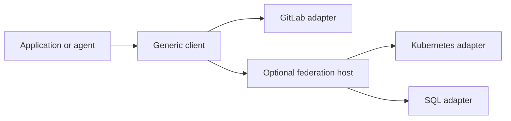

# Connectors v2

Connectors gives applications and agents a consistent way to discover and use
integrations. Independent adapter services expose typed operations through shared,
versioned contracts. An application can call an adapter directly or reach several
adapters through an optional federation host.

The aim is to make an integration useful on its own and predictable when combined
with others. Provider behavior stays with its adapter; shared contracts define
what callers can expect from access, results and failures.



For example, Kubernetes can report a database endpoint, while the SQL adapter
provides bounded reads from an explicitly configured database. Discovering the
endpoint supplies information; selecting its connection and granting access are
separate steps.

## Where the project stands

The local CLI implements setup, configured adapter management, protected
connect/repair, saved-credential revalidation, connection inspection/revoke, cached operation discovery and
supervised GitLab reads through its generated parser. A local owner manages exact
child processes; SQLite records metadata and a qualified Secret Service keyring
stores credentials. See the [GitLab CLI guide](docs/local-gitlab-cli.md) and
[runtime binding](docs/local-runtime-foundation.md).

Disposable GitLab HTTPS and keyring fixtures prove saved-credential reuse after
CLI, owner and keyring restarts. Explicit revalidation renews the 60-second
validation evidence without credential re-entry. Dedicated GitLab sandbox
acceptance remains open. Kubernetes and
PostgreSQL still need this local lifecycle binding; MCP and the remaining providers
follow them. The explicit network commands below remain compatible.

This repository contains a working local data/discovery slice and a broader,
reviewed specification baseline. The local **v0.1.0 milestone is a specification
milestone**: it stabilizes the selected Kubernetes, GitLab and SQL contracts and
models. Its newer auth, governance and persistence semantics still require runtime
implementation. See the [changelog](CHANGELOG.md) for that boundary.

The current services provide:

| Adapter | Implemented operations | Binding |
|---|---|---|
| GitLab | `project.get`, `issues.list`, `file.get`, `pipelines.list`, `pipeline.get`, `pipeline.jobs`, `job.get`, `job.trace`, `merge_request.get`, `merge_requests.list` | GitLab API v4, with a configured project allowlist; exact-commit CI, bounded traces and MR update-window observations |
| Kubernetes | `resources.list`, `endpoints.discover`, optionally `hosts.discover` | Kubernetes API, with namespace and resource-kind restrictions |
| SQL | `schema.list`, `query.read` | PostgreSQL, with read-only transactions and execution deadlines |

They can run as separate Rust services, with a generic CLI and one-hop federation.
This slice does not advertise writes, managed OAuth acquisition, durable events,
process execution or media sessions. Other adapters have designs and, in some
cases, authored native models; their presence does not mean they can run.

The local CLI is specified under [CLI contracts](contracts/cli/v1alpha1/semantics.md):
`setup`, `adapters`, `connections` and `operations`, with per-adapter TOML startup
configuration and protected credential entry into local keyring custody. Its ESS
binding and generated parser supply the production management handlers above.
[Qualified keyring storage](docs/local-secret-service.md) and the
[connection registry](docs/local-connection-registry.md) have disposable runtime
tests. Writes, MCP binding and complete multi-provider acceptance remain
implementation work; the executable also provides `describe`, `invoke` and `serve`.

There is no public release distribution or configured deployment. Historical
[runtime verification](docs/verification.md) and the
[specification checkpoint](docs/evidence/core-model-closure-20260909/checkpoint.md)
describe what was checked and its limits.

## Get started

Build from the repository root with Rust 1.88.0 or later:

```sh
cargo build --workspace --locked
```

Ordinary builds use checked-in generated Rust. They do not require ESS or refresh
vendor specifications; Cargo may need to download dependencies on the first build.

Choose an adapter configuration from [examples](examples/), set its permitted
resources and private credential references, then follow
[Run adapter services](docs/running-services.md). For an end-to-end local exercise
with disposable Kubernetes and PostgreSQL services, use the
[live acceptance recipe](docs/live-e2e.md).

The [development guide](docs/development.md) covers the full gate, pinned
generation tools and embedding adapter libraries. GitLab's
[generation and packaging guide](docs/gitlab-generation.md) explains how its
specification becomes a local service artifact.

## Explore the design

- [Vision](VISION.md): who this serves, the intended system and how we will judge success.
- [Contracts](contracts/README.md): shared guarantees, versions and support status.
- [Adapters](adapters/README.md): native contracts, provider ownership and extraction boundaries.
- [Architecture and design](docs/design.md): decisions, rationale and implementation boundaries.
- [Documentation website](website/README.md): authored guides, generated contract/model views
  and executable examples; [design and boundaries](docs/website-design.md).

Run the local website with `npm ci --allow-git=root` and `npm start` from `website/` after its
[toolchain setup](website/README.md#start-the-preview). The preview is served at
http://127.0.0.1:3100/; public hosting remains deferred. Follow a practical GitLab
request walkthrough or inspect the advanced contract exercises. Both use fictional
Rust/WASM behavior, separately from the adapter runtime; specified user authorization
is labeled separately from configured federation available today.

Agents making repository changes should start with [AGENTS.md](AGENTS.md).
