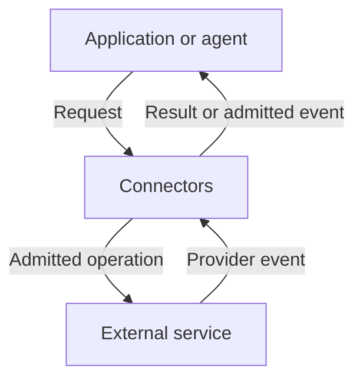

# Connectors

Connectors gives applications and agents a common way to discover external operations, connect
accounts, invoke permitted actions, and receive provider events. It keeps provider credentials
inside the service and checks each request against the caller's authority and selected Connection.

**Current status: pre-v1.** Personal-local and bounded hosted deployments are implemented. Available
operations depend on the deployment, provider adapter, Connection, and Grant. Full SaaS and
satellite federation remain outside the current support claim.

## See the system

The catalog describes what can be called. A deployment enables an Integration; authorization
creates a Connection. Receiver policy and Grants bound what a caller can do through it. Hosted
writes require a Grant and any demanded approval. Connectors binds credentials at the execution
boundary and records the result.
Hosted identity comes from [Identity](https://beyond10x.github.io/docs/identity/).

## Understand the architecture

Start with the [system overview](docs/architecture/README.md#follow-one-slack-mention) to follow
one hosted Slack mention through receipt, an authorized consumer, and an approved reply attempt.
The same example connects all six chapters.

1. [System overview](docs/architecture/README.md) — locate the boundaries and the subsystem owners.
2. [Connections and authority](docs/architecture/authority.md) — separate account access, Grants,
   and approval for one action.
3. [Commands and interfaces](docs/architecture/interfaces.md) — trace a request from description
   to dispatch, including refusals.
4. [Events and durable state](docs/architecture/events.md) — understand what is persisted,
   acknowledged, replayed, and still uncertain.
5. [Deployment and runtime](docs/architecture/deployment.md) — compare local and hosted
   prerequisites and responsibilities.
6. [Specification status](docs/architecture/specification.md) — distinguish shipped behavior,
   ESS declarations, generated artifacts, and coverage gaps.

## Connect a provider

The provider guides explain the supported connection paths and their credential requirements.

| Provider | Guide |
|---|---|
| Slack | [Socket Mode, hosted organization access, and personal connections](docs/guides/connect-slack.md) |
| GitLab | [Personal and automation access](docs/guides/connect-gitlab.md) |
| Jira | [Cloud gateway access and hosted delegated OAuth](docs/guides/connect-jira.md) |
| Confluence | [Cloud gateway reads](docs/guides/connect-confluence.md) |
| Kubernetes | [Connect clusters and discover resources](docs/guides/connect-kubernetes.md) |
| Grafana | [Connect a configured Grafana instance](docs/guides/connect-grafana.md) |

For hosted operation, continue with [Integration administration](docs/guides/administer-hosted-integrations.md).
For installation, configuration, and prerequisites, see [Deployment and runtime](docs/architecture/deployment.md).

## Contracts and implementation

A hosted deployment serves its API reference at `{base_path}/docs` and its OpenAPI document at
`{base_path}/openapi.json`. The usual base path is `/api/connectors/v1`. These describe the deployed
binary; use them when implementing an HTTP client.

The handbook describes current behavior and links to its implementation. The
[domain design](docs/design/01-domain-model.md), [architecture design](docs/design/02-architecture.md),
and [outbound MCP design](docs/design/18-governed-outbound-mcp-services.md) retain detailed engineering
decisions and dated amendments. Contributors should read [AGENTS.md](AGENTS.md).

<!-- b10x-docs:start -->
## Documentation

[Connectors documentation](https://beyond10x.github.io/docs/connectors/) · [Start](https://beyond10x.github.io/) · [Ecosystem](https://beyond10x.github.io/ecosystem/) · [Impact](https://beyond10x.github.io/changes/) · [Releases](https://beyond10x.github.io/releases/)
<!-- b10x-docs:end -->
