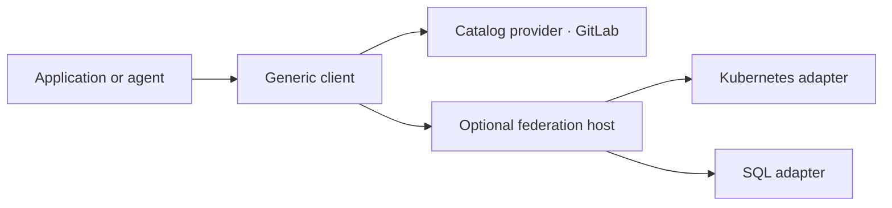

# Connectors v2

Connectors gives applications and agents a consistent way to discover and use
integrations. Independent adapter services expose typed operations through shared,
versioned contracts. An application can call an adapter directly or reach several
adapters through an optional federation host.

The aim is to make an integration useful on its own and predictable when combined
with others. Provider behavior stays with its adapter; shared contracts define
what callers can expect from access, results and failures.



For example, Kubernetes can report a database endpoint, while the SQL adapter
provides bounded reads from an explicitly configured database. Discovering the
endpoint supplies information; selecting its connection and granting access are
separate steps.

## Where the project stands

Source release **v0.11.0** serves GitLab from its pinned OpenAPI source through
the catalog provider and retires the native GitLab adapter. The
[changelog](CHANGELOG.md) records its scope and remaining work.

The local CLI implements setup, configured adapter management, protected
connect/repair, saved-credential revalidation, connection inspection/revoke, cached operation discovery and
supervised GitLab and Kubernetes reads. A local owner manages exact
child processes; SQLite records metadata and a qualified Secret Service keyring
stores credentials. See the [catalog provider guide](docs/local-catalog-provider.md),
the [Kubernetes CLI guide](docs/local-kubernetes-cli.md) and the
[runtime binding](docs/local-runtime-foundation.md).

Ordinary HTTP endpoints need no adapter code. The
[catalog provider](docs/local-catalog-provider.md) loads a bundle compiled from a
pinned OpenAPI document — the GitLab bundle carries all 1,847 operations of the
pinned source — and exposes a configured selection of them through the same local
CLI, approval and audit path. A reviewed selection set shipped with the repository
exposes every operation the native GitLab adapter carried before it was retired;
all of its reads, merge-request create, update and a guarded merge have run
against a live GitLab through it, the preconditions declared as data. Explicit
revalidation renews the 60-second validation evidence without credential
re-entry; see [the sandbox evidence](docs/evidence/gitlab-sandbox-20260913/README.md).

This catalog is a second implementation, not a migration of the first: the
registered `connectors` component ships the predecessor it re-implements at
`crates/catalog`, both exist today, and — as [AGENTS.md](AGENTS.md) states — this
repository does not replace the registered component. Consumers pin the registered
component and not this one: six repositories in the organization depend on
`beyond10x/connectors`, at seven distinct revisions, and none depends on this
repository.

Kubernetes now has the same local lifecycle binding: a saved bearer token, an
identity validated by one SelfSubjectReview probe, and its three reads through the
local owner. Disposable TLS cluster and keyring fixtures prove reuse after CLI,
owner and keyring restarts. Per-operation SelfSubjectAccessReview permission
checks are not implemented and no result claims authorization coverage; dedicated
Kubernetes sandbox acceptance remains open.

PostgreSQL now has it too, as the third execution family: it speaks its own wire
protocol rather than HTTP, so the session itself is the credential check and the
saved identity is the role and database. Its two reads run inside a read-only
transaction with fixed statement and lock timeouts. A loopback wire fixture
proves the journey; dedicated sandbox acceptance remains open. See the
[PostgreSQL CLI guide](docs/local-postgres-cli.md). MCP and the remaining
providers follow. The explicit network commands below remain compatible.

Three decisions are open and are what MCP and the recorded Helm workflows wait on.
`aep plan artifact list --kind decision-blocker --store .engineering/planning`
prints their current status:

- `decision-blocker:helm-execution-family` — nobody has decided whether Connectors
  runs external provider binaries; it withholds the test result of
  `initiative:complete-local-connectors`, the only active initiative.
- `decision-blocker:mcp-caller-connection-assignment` — nobody has decided which
  provider connection an inbound MCP caller may use; it withholds review of
  `epic:mcp-contracts`.
- `decision-blocker:mcp-outbound-stdio-process-ownership` — nobody has decided
  whether Connectors spawns an MCP server as a child process; it withholds review
  of `epic:mcp-contracts`.

This repository contains a working local data/discovery slice and a broader,
reviewed specification baseline. The local **v0.1.0 milestone is a specification
milestone**: it stabilizes the selected Kubernetes, GitLab and SQL contracts and
models. Its newer auth, governance and persistence semantics still require runtime
implementation. See the [changelog](CHANGELOG.md) for that boundary.

The current services provide:

| Adapter | Implemented operations | Binding |
|---|---|---|
| GitLab (catalog provider) | `project.get`, `issues.list`, `file.get`, `branch.get`, `pipelines.list`, `pipeline.get`, `pipeline.jobs`, `job.get`, `job.trace`, `merge_request.get`, `merge_requests.list`, `merge_request.create`, `merge_request.update`, `merge_request.merge` | GitLab API v4 from the pinned OpenAPI source; one bound request per operation, the provider's body unchanged; merge guarded by five declared checks; the host's permitted operation ids are the scope |
| Kubernetes | `resources.list`, `endpoints.discover`, optionally `hosts.discover`, and optionally the `helm_releases.*` release reads | Kubernetes API, with namespace and resource-kind restrictions; saved bearer token through the local CLI. Helm release values and manifests are disclosed only as redacted projections |
| SQL | `schema.list`, `query.read` | PostgreSQL, with read-only transactions and execution deadlines; saved password through the local CLI |

They can run as separate Rust services, with a generic CLI and one-hop federation.
This slice does not advertise writes, managed OAuth acquisition, durable events,
process execution or media sessions. Other adapters have designs and, in some
cases, authored native models; their presence does not mean they can run.

The local CLI is specified under [CLI contracts](contracts/cli/v1alpha1/semantics.md):
`setup`, `adapters`, `connections` and `operations`, with per-adapter TOML startup
configuration and protected credential entry into local keyring custody. Its ESS
binding and generated parser supply the production management handlers above.
[Qualified keyring storage](docs/local-secret-service.md) and the
[connection registry](docs/local-connection-registry.md) have disposable runtime
tests. [Approval-signing key management](docs/local-approval-keys.md) supplies
protected key initialization, rotation, recovery, revocation and retirement.
The [clock check](docs/local-clock.md) verifies an explicitly configured time
source under declared source and local timer assumptions.
On current `main`, [local approval commands](docs/local-approvals.md) manage policy,
prepare exact subjects and issue protected proofs for explicitly selected private-protocol-two
write adapters. The development checkout also joins a local-only
[guarded GitLab merge](docs/local-gitlab-merge.md) through private protocol two,
including approval, audit and same-key result observation. A live GitLab merge
request has been merged through it, and a replayed business key after an owner crash
issued no second merge. The wider write failure matrix remains open. MCP binding and complete multi-provider
acceptance remain implementation work. The executable
also provides `describe`, `invoke` and `serve`.

Build this source release locally; binary/package distribution and deployment
are not configured. Historical
[runtime verification](docs/verification.md) and the
[specification checkpoint](docs/evidence/core-model-closure-20260909/checkpoint.md)
describe what was checked and its limits.

## Get started

Build from the repository root with Rust 1.88.0 or later:

```sh
cargo build --workspace --locked
```

Ordinary builds use checked-in generated Rust. They do not require ESS or refresh
vendor specifications; Cargo may need to download dependencies on the first build.

Choose an adapter configuration from [examples](examples/), set its permitted
resources and private credential references, then follow
[Run adapter services](docs/running-services.md). For an end-to-end local exercise
with disposable Kubernetes and PostgreSQL services, use the
[live acceptance recipe](docs/live-e2e.md).

The [development guide](docs/development.md) covers the full gate, pinned
generation tools and embedding adapter libraries.

## Explore the design

- [Vision](VISION.md): who this serves, the intended system and how we will judge success.
- [Contracts](contracts/README.md): shared guarantees, versions and support status.
- [Adapters](adapters/README.md): native contracts, provider ownership and extraction boundaries.
- [Architecture and design](docs/design.md): decisions, rationale and implementation boundaries.
- [Documentation website](website/README.md): authored guides, generated contract/model views
  and executable examples; [design and boundaries](docs/website-design.md).

Run the local website with `npm ci --allow-git=root` and `npm start` from `website/` after its
[toolchain setup](website/README.md#start-the-preview). The preview is served at
http://127.0.0.1:3100/; public hosting remains deferred. Follow a practical GitLab
request walkthrough or inspect the advanced contract exercises. Both use fictional
Rust/WASM behavior, separately from the adapter runtime; specified user authorization
is labeled separately from configured federation available today.

Agents making repository changes should start with [AGENTS.md](AGENTS.md).
