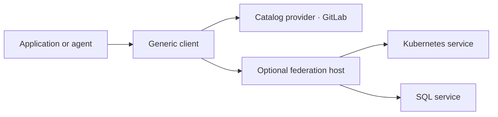

# Connectors v2

Connectors gives applications and agents a consistent way to discover and use
integrations. Each connector exposes the typed operations of one provider's API through
shared, versioned contracts; you configure an instance of it, connect it once and invoke
its operations. An application can call a connector's service directly or reach several
through an optional federation host. The words are defined once, under
[Vocabulary](#vocabulary).

**Documentation: <https://beyond10x.github.io/connectors/>**, starting at
[Getting started](https://beyond10x.github.io/connectors/docs/getting-started). The site's
source is [website/](website/README.md): concepts, guides, the CLI, crate, contract and model
reference, and the status of every capability, each held by a test.

The aim is to make an integration useful on its own and predictable when combined
with others. Provider behavior stays with its connector's implementation; shared
contracts define what callers can expect from access, results and failures.


```mermaid
flowchart LR
    app[Application or agent] --> client[Generic client]
    client --> catalog[Catalog provider · GitLab]
    client --> host[Optional federation host]
    host --> kube[Kubernetes service]
    host --> sql[SQL service]
```

For example, Kubernetes can report a database endpoint, while the SQL connector
provides bounded reads from an explicitly configured database. Discovering the
endpoint supplies information; selecting its connection and granting access are
separate steps.

## Vocabulary

The CLI, the configuration and the library use these words, and every page of the
documentation links here for them:

| Term | Meaning | Google | GitLab |
|---|---|---|---|
| provider | The company or technology behind one or more connectors. | Google | GitLab |
| connector | One service or app of a provider, enabled in configuration. It points at one API. | Gmail, Drive, Calendar, Slides | GitLab |
| auth profile | One way to authenticate that a connector declares. | `google.oauth` | `gitlab.pat` |
| instance | Your name for one configured connector: its endpoint, an optional description, and at most one connection. Names are free (`private`, `work`). An instance belongs to one connector and is never shared across connectors. | `gmail/private` | `gitlab/work` at a self-hosted host |
| connection | The stored credential of one instance, obtained through one auth profile. | the consent behind `gmail/private` | the token behind `gitlab/work` |
| operation | One callable tool of a connector. | `users.drafts.send` | `merge_request.merge` |

Two instances of one connector exist when you connect twice, for example with two
accounts or two hosts; the instance name addresses the right one. Every operation of
an enabled connector is available on its instances. Configuration does not group
operations or hide a subset; a library that wants a narrower surface projects one over
it. A write that requires approval still needs a proof issued for its exact input.

"Adapter" is not one of these words. It is the internal name of an implementation (the
catalog engine, a credential binary) and of the process that serves an instance.

The typed model of providers, connectors and their instances, with its cardinalities, is
the generated
[declarations model](https://beyond10x.github.io/connectors/docs/reference/contracts/model/domains/connectors-declarations);
connections and their states are in the
[auth bindings model](https://beyond10x.github.io/connectors/docs/reference/contracts/model/domains/connectors-auth_bindings).

### Configure instances

A `connectors-local/5` configuration enables connectors by name and names their instances.
`setup init` creates the file and the metadata store; it still writes the older
`connectors-local/2` format with an empty legacy `[adapters]` table, so replace that file's
content with yours, keeping `owner_uid` (your user id):

```toml
format = "connectors-local/5"
owner_uid = 1000
default_instance = "gitlab/work"

[connectors.gmail]
enabled = true

[connectors.gmail.instances.private]
description = "personal mailbox"

[connectors.gitlab]
enabled = true

[connectors.gitlab.instances.work]
endpoint = "https://gitlab.example.com"
```

An instance without `endpoint` uses its connector's default (`https://gmail.googleapis.com` for
Gmail); a GitLab endpoint is the host. An instance names only what is yours: its endpoint, an
optional description and, where its connector declares more than one auth profile (Zendesk),
`profile`. Everything else comes from the connector shipped with the `connectors-catalog-provider`
installed beside `connectors`: the executable and its SHA-256, the configuration revision and
every operation. `default_instance` selects an instance for a command that names none.

```sh
connectors --config "$PWD/cli/config.toml" --state-dir "$PWD/cli/state" instances list
```

```json
{"adapters":[{"adapter":"gitlab.work","adapter_id":"catalog","connector":"gitlab","instance":"work","instance_id":"gitlab.work","restart":"never","startup":"on-demand"},{"adapter":"gmail.private","adapter_id":"catalog","connector":"gmail","instance":"private","instance_id":"gmail.private","restart":"never","startup":"on-demand"}],"source":"configuration"}
```

Results keep the legacy `adapter` alias and the internal `adapter_id` beside `connector` and
`instance` for the deprecation window.

### Select an instance

A command that acts on one instance takes `--connector` and `--instance`; an instance name is
unique within its connector only:

```sh
connectors --config "$PWD/cli/config.toml" --state-dir "$PWD/cli/state" \
  connections list --connector gitlab --instance work
```

```json
{"connections":[],"observed_at_ms":1792181808006,"source":"authority","stale":false,"valid_until_ms":1792182108006}
```

The deprecated `--adapter <alias>` still selects the same instance (`--adapter gitlab.work`) and
says so once, on standard error, or as a `deprecations` member of the JSON envelope:

```text
deprecated: --adapter; select with --connector <connector> --instance <instance>
```

`instances list`, `describe`, `status` and `stop` replace the deprecated `adapters` group, and
`connections reconnect` replaces the deprecated `connections repair`; each old name runs the same
command and says it is deprecated the same way. The
[CLI reference](https://beyond10x.github.io/connectors/docs/reference/cli) lists every command.

### Connections: Live, Stale, Revoked

An instance holds at most one connection. `connections connect` on an instance that already
holds a Live or Stale connection is refused before it asks for a credential, naming what helps
instead; connect a second account as a second instance.

| From | To | When |
|---|---|---|
| Live | Stale | the provider refused the stored credential: an expired or revoked refresh token, a changed password, a revoked token |
| Stale | Live | `connections reconnect` published a new credential for the same instance and connection |
| Live, Stale | Revoked | `connections revoke` ended local use |

Refreshing an OAuth access token is not a state change; only a refused refresh token makes a
connection Stale, and no retry can renew it. An invoke on a Stale connection answers with the
next action `repair_connection`, which names `connections reconnect`.
`connections describe`, `reconnect`, `revalidate`, `launch` and `revoke` take the instance's
one connection when `--connection` is left out.

### Move a legacy configuration

A legacy `[adapters.<alias>]` entry keeps working: it is selected as connector `adapter_id`,
instance `<alias>`, until it is moved. `setup migrate` moves each catalog entry whose provider
ships a connector to `[connectors.<connector>.instances.<alias>]`, keeping its instance id,
configuration revision, executable and custody item names byte for byte, so its connections and
approval policy stay valid with no new consent. Other entries stay where they are, each with its
reason. `--dry-run` writes nothing; on a file with one legacy GitLab entry `forge`:

```sh
connectors --config "$PWD/config.toml" --state-dir "$PWD/state" --output json \
  setup migrate --dry-run \
  | jq -c '.result | {disposition, format_before, format_after}, (.entries[] | {connector, instance, disposition})'
```

```json
{"disposition":"planned","format_before":"connectors-local/2","format_after":"connectors-local/5"}
{"connector":"gitlab","instance":"forge","disposition":"migrated"}
```

`--apply` keeps the file it read beside the new one:

```sh
connectors --config "$PWD/config.toml" --state-dir "$PWD/state" --output json \
  setup migrate --apply | jq -r '.result.disposition, (.result.backup_path | split("/") | last)'
```

```text
applied
config.toml.before-migrate-20261016T201716Z
```

The moved instance is then selected as `--connector gitlab --instance forge`. Rolling back is
restoring the backup. The [CLI contract on legacy entries](contracts/cli/v1alpha1/semantics.md#migrating-adapter-entries)
lists every reason an entry is kept.

## Where the project stands

Source release **v0.54.0** keeps connection metadata in Entity Runtime over an
Eventlog SQLite store, specified at ESS source format `ess/15`, with GitLab, Jira Cloud, Confluence Cloud, HubSpot CRM and Zendesk Support served from their pinned OpenAPI sources, and Google Drive, Slides, Calendar and Gmail from pinned Discovery documents projected to OpenAPI, through
the catalog provider. A hand-written `connectors-definition/1` file runs with no configured
instance through `connectors operations invoke --definition <file> --operation <key>`, which
lowers it, asks once whether to connect (offering a stored credential of the same connector
when one fits) and invokes through the same owner, admission, approval and audit
([guide](https://beyond10x.github.io/connectors/docs/guides/invoke-a-definition-file)). The
[changelog](CHANGELOG.md) records its scope and remaining work.

The local CLI implements setup, configured instance management, protected
connect/reconnect, saved-credential revalidation, connection inspection/revoke, cached operation discovery and
supervised GitLab and Kubernetes reads. A local owner manages exact
child processes; SQLite records metadata and a qualified Secret Service keyring
stores credentials. Credential custody has one binding per platform, fixed when the binary is
built and reported by `setup check` as `custody_backend`: the Secret Service on Linux, the
login keychain on macOS and the Credential Manager on Windows
([custody semantics §5.1](contracts/auth/custody/v1alpha1/semantics.md#51-platform-bindings-of-the-local-host)).
The macOS and Windows bindings have a CI job that runs the custody contract suite against their
real stores. The CLI and its local host also build and run on macOS: a CI job runs their lint and
test suites on `macos-latest`, and the guarantees macOS holds only in a weaker form are listed in
the [CLI semantics](contracts/cli/v1alpha1/semantics.md#macos-platform-guarantees). Since 0.49.0
they also build and run on Windows, where a CI job runs them on `windows-latest`
([Windows platform guarantees](contracts/cli/v1alpha1/semantics.md#windows-platform-guarantees));
there is no Windows release binary, so build it from the release tag's source. A release page
carries Linux and macOS binaries besides the source archives ([install a release binary](#install-a-release-binary)). See the [catalog provider guide](docs/local-catalog-provider.md),
the [Kubernetes CLI guide](docs/local-kubernetes-cli.md) and the
[runtime binding](docs/local-runtime-foundation.md).

Ordinary HTTP endpoints need no code of their own. The
[catalog provider](docs/local-catalog-provider.md) loads a bundle compiled from a
pinned OpenAPI document — the GitLab bundle carries all 1,847 operations of the
pinned source — and exposes a configured selection of them through the same local
CLI, approval and audit path. A reviewed selection set shipped with the repository
exposes every operation the native GitLab implementation carried before it was retired;
all of its reads, merge-request create, update and a guarded merge have run
against a live GitLab through it, the preconditions declared as data. Explicit
revalidation renews the 60-second validation evidence without credential
re-entry; see [the sandbox evidence](https://github.com/beyond10x/connectors/blob/history/evidence-2026-10/docs/evidence/gitlab-sandbox-20260913/README.md).
The [2026-10-02 read replay](https://github.com/beyond10x/connectors/blob/history/evidence-2026-10/docs/evidence/gitlab-current-20261002/README.md)
covers all eighteen current reads and saved-credential reuse after an owner
restart. It retains one unexplained initial revalidation refusal and identifies
the three empty-list results; historical live mutation evidence remains separate.

This catalog is a second implementation, not a migration of the first: the
predecessor it re-implements ships at `crates/catalog` in the v1 component, and both
exist today. The org-state review of 2026-09-15 decided which is which — Atlas ADR
*Connectors lineage*, 2026-09-15: the name `beyond10x/connectors` denotes this
lineage, which owns that repository's `main` default branch, its `v0.8.0`-and-later
tags and its Latest release; v1, whose releases end at `v0.7.2`, is the predecessor.
Consumers are still on the predecessor and not on this code: six repositories in the
organization depend on `beyond10x/connectors` at seven distinct revisions (devcenter
at rev `e80b7ae1`, `=0.7.0`), and none builds from this tree. Moving a consumer is
its own requested scope.

Kubernetes now has the same local lifecycle binding: a saved bearer token, an
identity validated by one SelfSubjectReview probe, and its three reads through the
local owner. Disposable TLS cluster and keyring fixtures prove reuse after CLI,
owner and keyring restarts. Per-operation SelfSubjectAccessReview permission
checks are not implemented and no result claims complete authorization coverage.
[Real k3s acceptance](https://github.com/beyond10x/connectors/blob/history/evidence-2026-10/docs/evidence/kubernetes-acceptance-20261002/README.md)
now covers selected reads, RBAC refusal, continuation binding and local lifecycle
controls. Additional Kubernetes and Helm workflows remain open.

PostgreSQL now has it too, as the third execution family: it speaks its own wire
protocol rather than HTTP, so the session itself is the credential check and the
saved identity is the role and database. Its two reads run inside a read-only
transaction with fixed statement and lock timeouts.
[Six real PostgreSQL cases](https://github.com/beyond10x/connectors/blob/history/evidence-2026-10/docs/evidence/postgres-acceptance-20261002/README.md)
cover restart, incident reads, read-only refusals, native drop cancellation and
local lifecycle controls. The plaintext fixture does not establish TLS. See the
[PostgreSQL CLI guide](docs/local-postgres-cli.md). The same SQL connector serves MySQL,
verified so far against a scripted wire fixture only; see the
[MySQL CLI guide](docs/local-mysql-cli.md). MCP and the remaining
providers follow. The explicit network commands below remain compatible.

Three decisions are open and are what MCP and the recorded Helm workflows wait on.
`aep plan artifact list --kind decision-blocker --store .engineering/planning`
prints their current status:

- `decision-blocker:helm-execution-family` — nobody has decided whether Connectors
  runs external provider binaries; it withholds the test result of
  `initiative:complete-local-connectors`, the only active initiative.
- `decision-blocker:mcp-caller-connection-assignment` — nobody has decided which
  provider connection an inbound MCP caller may use; it withholds review of
  `epic:mcp-contracts`.
- `decision-blocker:mcp-outbound-stdio-process-ownership` — nobody has decided
  whether Connectors spawns an MCP server as a child process; it withholds review
  of `epic:mcp-contracts`.

This repository contains a working local data/discovery slice and a broader,
reviewed specification baseline. The local **v0.1.0 milestone is a specification
milestone**: it stabilizes the selected Kubernetes, GitLab and SQL contracts and
models. Its newer auth, governance and persistence semantics still require runtime
implementation. See the [changelog](CHANGELOG.md) for that boundary.

The current services provide:

| Connector | Implemented operations | Binding |
|---|---|---|
| [GitLab](https://beyond10x.github.io/connectors/docs/connectors/gitlab/) (catalog provider) | `projects.list`, `project.get`, `project.events`, `issues.list`, `file.get`, `file.raw`, `project.languages`, `branch.get`, `tags.list`, `releases.list`, `commits.list`, `commit.get`, `commit.diff`, `repository.compare`, `repository.tree`, `branches.list`, `deployments.list`, `pipelines.list`, `pipeline.get`, `pipeline.jobs`, `job.get`, `job.trace`, `merge_request.get`, `merge_requests.list`, `merge_request.diffs`, `merge_request.discussions`, `search.blobs`, `tag.get`, `release.get`, `release.links`, `environments.list`, `issue.create`, `merge_request.create`, `merge_request.update`, `merge_request.merge`, `merge_request.auto_merge`, `merge_request.reopen`, `merge_request.discussion.get`, `merge_request.note.create`, `merge_request.discussion.reply`, `merge_request.discussion.resolve`, `tag.create`, `tag.delete`, `release.create`, `release.update`, `pipeline.retry`, `pipeline.cancel`, `pipeline.create`, `commit.create`, `file.update`, `branch.create`, `branch.delete`, `project.create` | GitLab API v4 from the pinned OpenAPI source; one bound request per operation, the provider's body unchanged; merge guarded by five declared checks, auto-merge and reopen by the pinned head with their fixed body value, discussion resolve by the requested, resolvable discussion and the answered id and state, tag and release writes by the caller's commit, tag delete proven by a 404 after, pipeline, commit, file and branch writes by the caller's commit (commit and file writes onto an existing branch only), branch delete proven by a 404 after, project create by the namespace path and id; commit, file and project bodies sent as JSON through a cited media-type correction; code search with `scope` held to `blobs`; issue creation, notes and replies unguarded; the host's permitted operation ids are the scope |
| [Gmail](https://beyond10x.github.io/connectors/docs/connectors/gmail/) (catalog provider) | `users.getProfile`, `users.messages.list`, `users.messages.get`, `users.messages.attachments.get`, `users.threads.list`, `users.threads.get`, `users.history.list`, `users.labels.list`, `users.drafts.create`, `users.drafts.send` | Gmail API v1 from the pinned Discovery document projected to OpenAPI; profile `google.oauth` (`oauth2_refresh`), one instance per Google account consenting to `gmail.readonly` and `gmail.compose`; mail leaves only as a draft: `users.drafts.send` guarded by a preflight `users.drafts.get` whose `message.id` must equal the input's `messageId`, `users.drafts.create` unguarded, `users.messages.send` not selected; verified against a local fixture only, see [the Gmail guide](docs/catalog-google-gmail.md) |
| [Google Drive](https://beyond10x.github.io/connectors/docs/connectors/drive/) (catalog provider) | `about.get`, `files.list`, `files.get`, `files.export`, `changes.getStartPageToken`, `changes.list`, `files.create`, `files.update`, `files.copy` | Drive API v3 from the pinned Discovery document projected to OpenAPI; profile `google.oauth`, one instance per Google account consenting to `drive.readonly` and `drive.file`; metadata writes only, no upload: `files.update` guarded by a preflight `files.get` whose `version` must equal the input's, `files.create` and `files.copy` unguarded; verified against a local fixture only, see [the Drive guide](docs/catalog-google-drive.md) |
| [Google Calendar](https://beyond10x.github.io/connectors/docs/connectors/calendar/) (catalog provider) | `calendarList.list`, `events.list`, `events.get`, `events.insert`, `events.patch`, `events.delete` | Calendar API v3 from the pinned Discovery document projected to OpenAPI; profile `google.oauth`, one instance per Google account consenting to `calendar.readonly` and `calendar.events`; `events.patch` and `events.delete` guarded by a preflight `events.get` (status `confirmed`, `etag` equal to the input's), `events.insert` unguarded; every write names `sendUpdates`; verified against a local fixture only, see [the Calendar guide](docs/catalog-google-calendar.md) |
| [Google Slides](https://beyond10x.github.io/connectors/docs/connectors/slides/) (catalog provider) | `presentations.get`, `presentations.pages.get`, `presentations.pages.getThumbnail`, `presentations.create`, `presentations.batchUpdate` | Slides API v1 from the pinned Discovery document projected to OpenAPI; profile `google.oauth`, one instance per Google account consenting to `presentations` and `presentations.readonly`; `presentations.batchUpdate` guarded by a preflight `presentations.get` whose `revisionId` must equal the body's `writeControl.requiredRevisionId`, `presentations.create` unguarded; verified against a local fixture only, see [the Slides guide](docs/catalog-google-slides.md) |
| [Jira](https://beyond10x.github.io/connectors/docs/connectors/jira/) (catalog provider) | `issues.search`, `issue.get`, `issue.comments`, `issue.changelog`, `issue.transitions`, `issue.create_meta`, `issue.create_meta.fields`, `users.search`, `attachment.content`, `issue.transition.run`, `issue.create`, `issue.comment.add`, `issue.edit`, `issue.link.add`, `issue.delete` | Jira Cloud platform REST v3 from the pinned OpenAPI document; profile `atlassian.basic` (account email and API token as HTTP basic), shared with Confluence; `issue.transition.run` guarded by the issue's current status and the open transition's target before the POST, and the target status after it; `issue.create`, `issue.comment.add` and `issue.link.add` read the project or issues first; `issue.edit` and `issue.delete` are refused as `conflict` unless the issue's `fields.updated` is the caller's stamp, and read again after; rich text is Atlassian Document Format sent as given; the writes are verified against fixtures only; live, only the API gateway form with a service-account token has run (`issues.search`, 2026-09-30); see [the Jira guide](docs/catalog-jira.md) |
| [Confluence](https://beyond10x.github.io/connectors/docs/connectors/confluence/) (catalog provider) | `pages.changed`, `space.pages`, `page.get`, `page.comments` under `confluence` (REST v2); `spaces.list`, `space.get`, `space.pages`, `pages.changed`, `page.get`, `page.comments`, `content.search` under `confluence-v1` (REST v1) | Confluence Cloud REST v2 from the pinned OpenAPI document, and REST v1 from a document this repository writes from Atlassian's reference pages; profile `atlassian.basic`, shared with Jira; reads only, one page per call; verified against local fixtures only, see [the Confluence guide](docs/catalog-confluence.md) |
| [Zendesk](https://beyond10x.github.io/connectors/docs/connectors/zendesk/) (catalog provider) | `tickets.incremental`, `ticket.show`, `ticket.comments`, `users.incremental`, `user.show`, `organizations.incremental`, `organization.show` | Zendesk Support API from the pinned OpenAPI document; two profiles, `zendesk.oauth` (OAuth client credentials) and `zendesk.basic` (API token), chosen per instance by `profile`; reads only, the incremental exports from a `start_time`; verified against a local fixture only, see [the Zendesk guide](docs/catalog-zendesk.md) |
| [HubSpot](https://beyond10x.github.io/connectors/docs/connectors/hubspot/) (catalog provider) | `objects.list`, `object.get` | HubSpot CRM Objects `2026-09` from the pinned OpenAPI document; private-app token as `Authorization: Bearer` from keyring custody, profile `hubspot.private-app`; reads only, any object type, no time filter; verified against a local fixture only, see [the HubSpot guide](docs/catalog-hubspot.md) |
| [Slack](https://beyond10x.github.io/connectors/docs/connectors/slack/) (catalog provider) | `conversations.list`, `conversations.history`, `conversations.replies`; `users.list`, `users.info`, `users.lookupByEmail`, `team.info`, `emoji.list`, `auth.test`; `files.list`, `files.info`, `file.download`; the writes `chat.postMessage`, `conversations.open`, `chat.update`, `chat.delete`, `files.delete`; and `search.messages`, `conversations.list`, `conversations.history`, `conversations.replies` and `users.list` on a second instance with a user token | Slack Web API from the pinned Swagger 2.0 document projected to OpenAPI; two pinned instances, since no Slack connector declaration ships: a bot token as `Authorization: Bearer` from keyring custody, and a user token under `slack.user` for search; the document's `token` parameter is never sent; each write is a required-approval mutation guarded by an `auth.test` preflight and an answer that must both carry `"ok": true`, and `files.delete` also reads the file with `files.info` first; one page per call; `file.download` reads a file's `url_private` as base64 with its media type, length and SHA-256, at most 2 MiB, only on a connection whose `hosts` admits `https://files.slack.com` with the credential; a Slack error is returned as `200` with `"ok": false`; verified against a local fixture only, see [the Slack guide](docs/catalog-slack.md) |
| [Opsgenie](https://beyond10x.github.io/connectors/docs/connectors/opsgenie/) (catalog provider) | `alerts.list`, `alert.get`, `incidents.list`, `incident.get`, `incident.alert_ids` | Opsgenie REST API from the pinned Swagger 2.0 document projected to OpenAPI, with the incident-to-alert link added by a cited amendment; API integration key as `Authorization: GenieKey <key>` (`auth.prefix`) from keyring custody, proved with `GET /v2/alerts`; reads only, one page per call over a `createdAt` window the caller advances; verified against a local fixture only, see [the Opsgenie guide](docs/catalog-opsgenie.md) |
| [Runpod](https://beyond10x.github.io/connectors/docs/connectors/runpod/) (catalog provider) | `pod.create`, `pods.list`, `billing.pods`, `pod.terminate` | Runpod REST API v1 from the pinned OpenAPI source; API key as `Authorization: Bearer` from keyring custody; both writes are unguarded required-approval mutations, a create refused for lack of capacity is refused with code `capacity`, a create without a definite answer is `unknown`; verified against a local fixture only, see [the Runpod guide](docs/catalog-runpod.md) |
| [OpenRouter](https://beyond10x.github.io/connectors/docs/connectors/openrouter/) (catalog provider) | `key.get`, `workspaces.list`, `keys.list`, `key.create` | OpenRouter API from the pinned OpenAPI document; management key as `Authorization: Bearer` from keyring custody, profile `openrouter.api-key`; two pinned instances, since no OpenRouter connector declaration ships; `key.create` is an unguarded required-approval write whose created key is held in custody as a new connection of a second instance and never returned; one page per call; verified against a local fixture only, see [the OpenRouter guide](docs/catalog-openrouter.md) |
| [Kubernetes](https://beyond10x.github.io/connectors/docs/connectors/kubernetes/) | `resources.list`, `resources.get`, `namespaces.list`, `deployments.history`, `endpoints.discover`, optionally `hosts.discover`, `pods.logs`, `contexts.list`, `nodes.list`, `custom_resources.list` and the `helm_releases.*` release reads, and optionally the write `pods.exec` | Kubernetes API, with namespace and resource-kind restrictions (`pods`, `services`, `deployments`, `endpointslices`, `replicasets`, `statefulsets`, `events`); namespaces are the configured ones, never the cluster list; saved bearer token through the local CLI. Helm release values and manifests are disclosed only as redacted projections. `pods.logs` (flag `pod_logs`) reads a bounded tail of one container's log; `contexts.list` lists the contexts of the one kubeconfig the local configuration names (`kubeconfig`), never credentials; `nodes.list` (flag `node_reads`) and `custom_resources.list` (the configured `custom_resources` collections) read one bounded page at a time; `pods.exec` (flag `pod_exec`) runs an argument vector in a named container, local CLI only, on private protocol two under approval, bounded in time and output, an unknown outcome never resent; verified against recorded answers and streams, see [the Kubernetes guide](docs/local-kubernetes-cli.md) |
| SQL ([PostgreSQL](https://beyond10x.github.io/connectors/docs/connectors/postgres/), [MySQL](https://beyond10x.github.io/connectors/docs/connectors/mysql/)) | `schema.list`, `query.read`, `database.list`, `table.list`, `table.describe`, `index.list`, `profile.read` | PostgreSQL or MySQL, chosen per connection by `engine` (PostgreSQL by default), with read-only transactions or sessions and execution deadlines; `profile.read` runs a read profile the native file names; saved password through the local CLI; see [the PostgreSQL guide](docs/local-postgres-cli.md) and [the MySQL guide](docs/local-mysql-cli.md) |
| [Tavily](https://beyond10x.github.io/connectors/docs/connectors/tavily/) | `websearch.search`, `websearch.fetch`, `websearch.crawl` | Tavily API from the pinned OpenAPI source, profile `tavily/2026-10`; API key from keyring custody, checked with `GET /usage`; every operation is a read Tavily serves as a POST; see [the Tavily guide](docs/local-tavily.md) |
| [Loki](https://beyond10x.github.io/connectors/docs/connectors/loki/) | `logs.query_range`, `logs.query_metric`, `logs.labels`, `logs.profile_lines`, `logs.call_trace` | Loki HTTP API, one GET each; bearer token from keyring custody, proved with `GET /loki/api/v1/labels`; `logs.profile_lines` and `logs.call_trace` run line and trace profiles the native file names; no tenant header is sent; see [the Loki guide](adapters/loki/README.md) |
| [Grafana](https://beyond10x.github.io/connectors/docs/connectors/grafana/) | `datasources.list`; and `irm.alert_groups.list`, `irm.alert_group.get`, `irm.incidents.list`, `irm.incident.get` on a second instance | Grafana HTTP API, one `GET /api/datasources`; service-account token from keyring custody, proved with that same GET; records carry uid, name, type, access and default flag only. The IRM reads run under `grafana.irm_service_account` on a stack whose `irm_api_url` is configured, read only. A Loki or Prometheus data source is read through Grafana as a Loki or Prometheus connection on its proxy path; see [the Grafana guide](adapters/grafana/README.md) |
| [Prometheus](https://beyond10x.github.io/connectors/docs/connectors/prometheus/) | `series.query`, `series.query_range`, `rules.list` | Prometheus HTTP API, one GET each; bearer token from keyring custody under `prometheus.bearer`, proved with `GET api/v1/status/buildinfo`; a range spans at most seven days and 2,000 points per series; no tenant header is sent; directly or through Grafana's data-source proxy; see [the Prometheus guide](adapters/prometheus/README.md) |

Kubernetes and SQL also run as separate Rust services, with a generic CLI and one-hop
federation; those services advertise no writes. Writes run only through the local CLI under
approval. Apart from the catalog provider's Google consent, no connector runs an OAuth consent
flow, and none offers durable events or media sessions; the only process execution is Kubernetes
`pods.exec`, one approved command in a pod through the local CLI. Other connectors have
designs and, in some cases, authored native models; their presence does not mean they can run.

The local CLI is specified under [CLI contracts](contracts/cli/v1alpha1/semantics.md):
`setup`, `instances`, `connections`, `operations` and `approvals`, with per-instance TOML
configuration and protected credential entry into local keyring custody. Its ESS
binding and generated parser supply the production management handlers above.
[Qualified keyring storage](docs/local-secret-service.md) and the
[connection registry](docs/local-connection-registry.md) have disposable runtime
tests. [Approval-signing key management](docs/local-approval-keys.md) supplies
protected key initialization, rotation, recovery, revocation and retirement.
The [clock check](docs/local-clock.md) verifies an explicitly configured time
source under declared source and local timer assumptions.
On current `main`, [local approval commands](docs/local-approvals.md) manage policy,
prepare exact subjects and issue protected proofs for explicitly selected private-protocol-two
write instances. The development checkout also joins a local-only
[guarded GitLab merge](docs/local-gitlab-merge.md) through private protocol two,
including approval, audit and same-key result observation. A live GitLab merge
request has been merged through it, and a replayed business key after an owner crash
issued no second merge. The wider write failure matrix remains open. MCP binding and complete multi-provider
acceptance remain implementation work. The executable
also provides `describe`, `invoke` and `serve`.

Install the `connectors` binary from a release page or build this source
locally; package distribution and deployment are not configured. Historical
[runtime verification](docs/verification.md) and the
[specification checkpoint](https://github.com/beyond10x/connectors/blob/history/evidence-2026-10/docs/evidence/core-model-closure-20260909/checkpoint.md)
describe what was checked and its limits.

## Install a release binary

Each release page carries `connectors-<version>-<target>.tar.gz` for
`x86_64-unknown-linux-gnu`, `aarch64-unknown-linux-gnu`, `x86_64-apple-darwin` and
`aarch64-apple-darwin`, and a `SHA256SUMS` file; releases cut before
[`release-binaries.yml`](.github/workflows/release-binaries.yml) existed carry source archives
only. There is no Windows binary. Each archive holds a directory with two binaries,
`connectors` and `connectors-catalog-provider` (the executable the
[catalog provider guide](docs/local-catalog-provider.md) binds to the CLI), and `README.md` and
`CHANGELOG.md`; archives of 0.50.0 and earlier hold `connectors` alone. The executables of the
other connectors (Kubernetes, SQL, Tavily and the rest) are built from source, as their guides
show. A catalog instance that pins nothing is served by the `connectors-catalog-provider` next
to `connectors`, so keep the two binaries in one directory. The Linux
binaries are built on Ubuntu 24.04 and need its glibc or a newer one.

On Linux, with the version and target you want:

```sh
version=X.Y.Z
target=x86_64-unknown-linux-gnu
base="https://github.com/beyond10x/connectors/releases/download/v$version"
curl -fsSLO "$base/connectors-$version-$target.tar.gz"
curl -fsSLO "$base/SHA256SUMS"
grep " connectors-$version-$target.tar.gz\$" SHA256SUMS | sha256sum -c -
tar -xzf "connectors-$version-$target.tar.gz"
mkdir -p ~/.local/bin
install -m 0755 "connectors-$version-$target/connectors" ~/.local/bin/connectors
install -m 0755 "connectors-$version-$target/connectors-catalog-provider" ~/.local/bin/connectors-catalog-provider
connectors --version
connectors-catalog-provider --version
```

On macOS, use `target=aarch64-apple-darwin` (Apple silicon) or `x86_64-apple-darwin` (Intel),
and check the archive with `shasum -a 256 -c -` in place of `sha256sum -c -`; the other commands
are the same. The macOS binaries are not signed yet. A binary downloaded with `curl` runs as is;
one downloaded through a browser carries Gatekeeper's quarantine attribute and is refused until
you remove it, from the extracted directory:

```sh
xattr -d com.apple.quarantine connectors connectors-catalog-provider
```

An unsigned binary also cannot read login keychain items that an earlier build of `connectors`
wrote, so credentials are stored again after an upgrade.

## Get started

Build the workspace from the repository root with Rust 1.91.0 or later. The
independent libraries are also checked on Rust 1.88.0:

```sh
cargo build --workspace --locked
```

Ordinary builds use checked-in generated Rust. They do not require ESS or refresh
vendor specifications; Cargo may need to download dependencies on the first build.

To use the local CLI, configure an instance as [Vocabulary](#vocabulary) shows and follow the
[Getting started](https://beyond10x.github.io/connectors/docs/getting-started) page and the
guide of its connector. To run a connector as a standalone service instead, choose a service
configuration from [examples](examples/), set its permitted resources and private credential
references, then follow [Run connector services](docs/running-services.md). For an end-to-end local
exercise with disposable Kubernetes and PostgreSQL services, use the
[live acceptance recipe](docs/live-e2e.md).

The [development guide](docs/development.md) covers the full gate, pinned
generation tools and embedding the internal adapter libraries.

## Explore the design

- [Vision](VISION.md): who this serves, the intended system and how we will judge success.
- [Contracts](contracts/README.md): shared guarantees, versions and support status.
- [Implementations](adapters/README.md): native contracts, provider ownership and extraction boundaries.
- [Connector vocabulary](docs/design/connector-vocabulary.md): why the terms above replaced the
  old ones, and what changed with them.
- [Architecture and design](docs/design.md): decisions, rationale and implementation boundaries.
- [Documentation website](website/README.md): concepts, guides, generated CLI, crate, contract and
  model reference, status and executable examples; [design and boundaries](docs/website-design.md).

Run the local website with `npm ci --allow-git=root` and `npm start` from `website/` after its
[toolchain setup](website/README.md#start-the-preview). The preview is served at
http://127.0.0.1:3100/connectors/. The `Documentation validation` workflow builds the site on
every pull request and push, and `Documentation site` deploys a build of `main` to
<https://beyond10x.github.io/connectors/>. Follow a practical GitLab
request walkthrough or inspect the advanced contract exercises. Both use fictional
Rust/WASM behavior, separately from the connector runtime; specified user authorization
is labeled separately from configured federation available today.

Agents making repository changes should start with [AGENTS.md](AGENTS.md).

## Licence

MIT OR Apache-2.0, as `Cargo.toml` declares.
