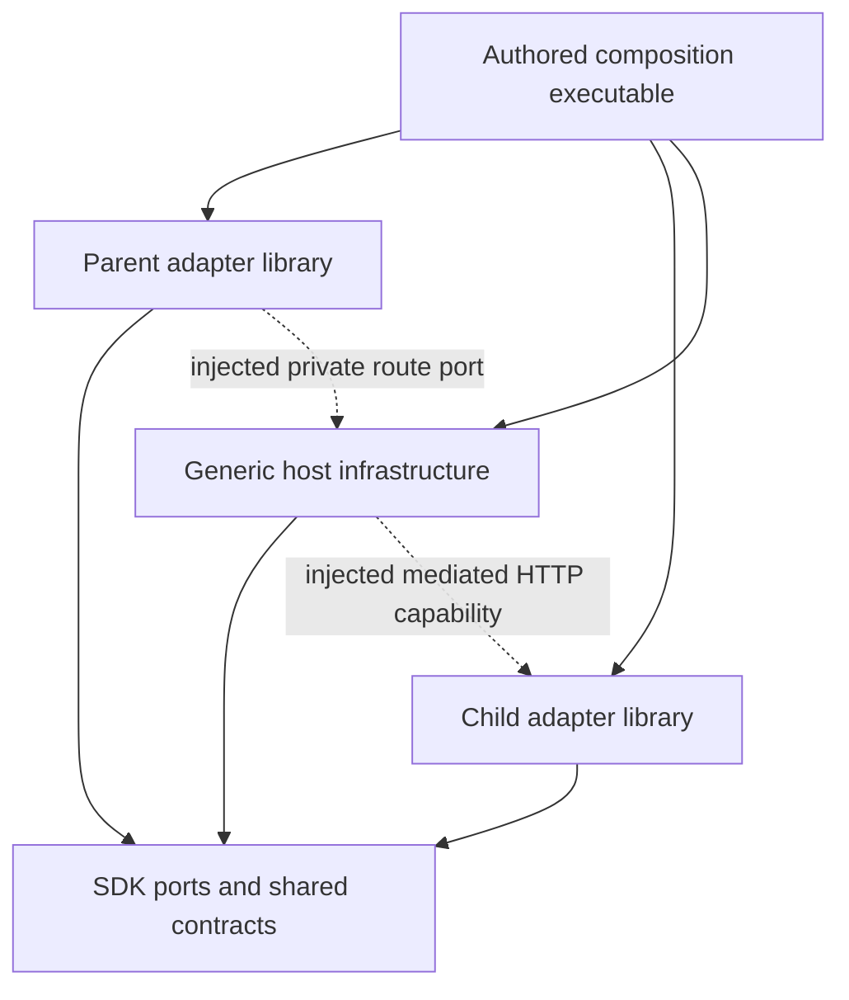

# Ownership of mediated adapter composition

**Proposed, not implemented.** This is the composition boundary for [mediated HTTP routes](mediated_route/v1alpha1/semantics.md), not a new service contract or generic provider-traffic proxy. E03 belongs to story:contracts-host-composition. [Design §4.1](../../docs/design.md#41-package-responsibilities) forbids generic host dependencies on concrete adapters; [§17.1](../../docs/design.md#171-one-protocol-boundary-across-placements) permits ordinary injected ports without a dynamic plugin ABI.

An explicitly authored **composition executable/entrypoint** owns the concrete links and construction order. It depends on the chosen parent and child adapter libraries and generic host/SDK infrastructure, constructs them, and injects the reviewed private parent route port into host routing and the resulting mediated HTTP capability into the child. The executable is selected and installed through explicit deployment configuration; it is not synthesized or downloaded from a discovery candidate. No executable is created by this specification change.

Solid arrows are compile-time dependencies; dotted arrows are injected runtime capabilities. Neither adapter library imports its sibling. Generic host/server code imports no concrete adapter, provider registry or universal driver enum. The current server accepts an already constructed `Arc<dyn Adapter>` (`crates/connectors-host/src/server.rs:31-47`); this is the preserved dependency direction, not an existing multi-adapter registry or mediated implementation.

| Owner | Responsibility |
|---|---|
| Composition executable | Select exact installed implementations, construct independent logical adapter instances, inject live ports and generic infrastructure, supervise their shared process, enforce deployment placement and aggregate resource limits |
| Parent adapter | Provider enumeration/normalization, closed target interpretation, private binding comparison and exact provider proxy request construction; it does not instantiate child libraries or decide child host grants |
| Child adapter | Its own datasource/business semantics through the injected bounded HTTP capability; it has no parent credential or generic proxy/destination selector |
| Generic host | Current independent parent/child admission, connection materialization/readiness, generation/route/observation fences, metadata publication, credential placement and limits through provider-neutral ports |
| SDK/shared contracts | Narrow provider-neutral interfaces and typed family shapes, with explicit supported profile/transport requirements |

The first mediated profiles require **one operating-system process with live injected private ports**, in one admitted trust boundary. A deployment composition of independent processes, a shared machine/pod/network, or a common configuration file does not satisfy this placement. A missing port, different process, incompatible parent/child profile, uninstalled target implementation or nested parent is refused before a usable child is published or provider traffic is dispatched. Same-process linking is not a sandbox for mutually untrusted implementation code.

Each logical adapter instance retains distinct identity, descriptor, selected configuration and current host admission. Any outward service surface uses its own explicitly configured routing and service authorization; names must not collide. This note does not add an aggregate invoke namespace, endpoint multiplexer or registry to the current host. The composition may use separately configured ordinary service endpoints within its process. Direct standalone adapters remain usable as their own executable/library with a direct capability and without the sibling or this composition.

Materialization resolves an admitted candidate to an exact installed implementation and supported route profile supplied by the composition's closed configuration. It separately checks current source observation, immutable parent/target, child ownership, placement, capability registration and independent grants. Host metadata creation cannot promise readiness until all required interfaces and evidence exist. Configuration failure or lost ports leaves the child unavailable; it never falls back to direct HTTP, dynamically loads a library, launches downloaded code, invents a parent operation or changes the fixed target. Starting an installed configured process belongs to explicit deployment/supervision admission, not resource listing. New target/parent/mode/owner requires a new admitted connection under auth.profile §4.2.

A remote client/gateway may invoke the ordinary child service through the separately selected service/federation binding. The owning composition performs its provider traffic locally through the private parent port. This exports neither `forward` nor a parent credential/locator, and does not license cross-process provider-traffic mediation. Remote discovery metadata alone proves neither reachability nor installed support.

Loss of the composition process or required port removes callable readiness; restart must recover verifiable metadata/private bindings and obtain fresh admission, otherwise old handles refuse. Parent and child concurrency/deadlines remain independently bounded and the composition applies aggregate limits; nested work cannot reset a budget. Host policy and route revalidation stay necessary after successful startup.

Required future verification includes separate adapter library/standalone builds without sibling dependencies, static dependency inspection of the generic host, one composed process using fake injected ports, missing/incompatible/cross-process/nested-route refusals, metadata-only remote discovery, and ordinary direct/federated child calls under the same business contract. Current read-only dependency evidence proves only today's boundary; it does not implement or execute those future scenarios.

The first model selects an immutable `CompositionDeclaration` value in admitted
deployment configuration. It contains the exact declaration revision, participating
instance/configuration references, installed implementation/binding revisions and
aggregate scope/row/provider-work limits used for admission. Instance coordinates
resolve to the existing ServiceConfiguration.instance_id (String); no second
Instance entity, Composition database entity or deletion ownership is introduced.
Each participant must resolve to the declared configuration revision, with no
duplicate/conflicting instance identities. Configuration replacement is a new
reviewed value and invalidates incompatible placement/route admission; it is not
a Created/Running/Stopped persistence lifecycle.

The value supplies finite limits, not permission to exceed the existing 256-scope,
500-row-per-scope, four-concurrent-provider-request and selected deadline/byte
ceilings. A composition may narrow them. Installed binding references fix exactly
which reviewed route/implementation revision may be injected; names alone do not
establish a live port, installed bytes or compatible behavior. Source/Connection
admission remains separate and no discovered provider installs itself.

[Discovery ESS values](../../ess/domains/discovery.yaml) type that immutable
configuration and selected scope/publication/route/placement facts. ESS does not
declare relations on value fields: resolving each typed instance coordinate to
the existing ServiceConfiguration and comparing revisions remains an explicit
binding check. This is not an unresolved ownership/lifecycle choice or a reason
to invent duplicate participant entities. Live port installation, physical
process identity, current authority and startup ordering remain UNMAPPED
implementation predicates and advertisement gates.
