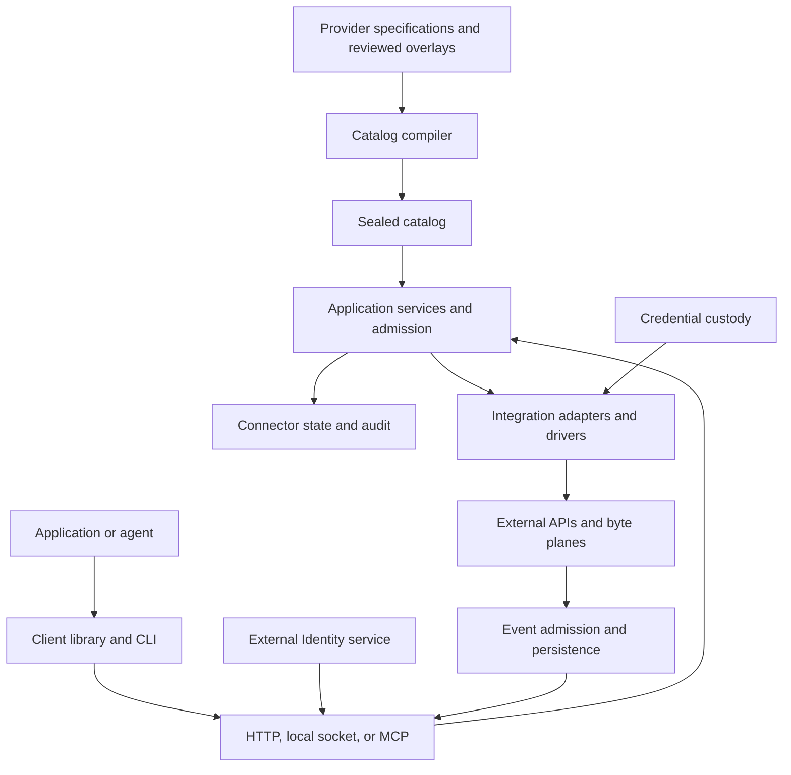

# System overview

Connectors sits between a caller and an external service. It turns a reviewed operation and a
permitted Connection into an execution, while keeping provider credentials in its own custody.
It also admits and stores provider events for consumers.

This handbook describes the 0.6.3 implementation. Its diagrams group responsibilities for readers;
the [ESS specification](specification.md) currently declares a smaller set of components and does
not generate this system map.

## The boundaries

The catalog compiler produces data consumed by the runtime. Transports adapt requests into shared
application contracts. Admission binds a request to its caller, operation, Connection, and current
permissions before an adapter performs an effect. Event intake has its own admission and
persistence path. These responsibilities need not run as separate processes.

## Subsystem ownership

| Subsystem | Owns | Implementation entry |
|---|---|---|
| Catalog | Provider declarations, selected operations, traits, provenance, deterministic artifacts | [catalog-build](../../crates/catalog-build/src/lib.rs), [connector-spec](../../crates/connector-spec/README.md) |
| Clients and transports | Argument parsing, requests, HTTP/local adaptation, MCP messages | [CLI](../../crates/connectors-cli/src/lib.rs), [client](../../crates/connectors-client/src/lib.rs), [server](../../crates/server/src/lib.rs) |
| Application and authority | Use cases, admission, grants, approval redemption, inert execution plans | [service](../../crates/service/src/lib.rs), [domain](../../crates/domain/src/lib.rs) |
| Credentials and state | Credential custody, bounded state operations, provider-specific persistence | [SecretStore](../../crates/connector-secrets/src/lib.rs), [StateStore](../../crates/connector-state/src/lib.rs) |
| Adapters and drivers | Provider semantics, credential placement, admitted network/device effects | [service factory](../../crates/service/src/factory.rs), [dispatch](../../crates/service/src/dispatch.rs) |
| Runtime composition | Configuration, adapter selection, storage bindings, listeners, supervisors | [composition](../../crates/connectors-runtime/src/composition.rs) |

Integration adapters implement the reusable backend port. Runtime composition selects their
concrete implementations; the thin CLI does not own a second implementation of provider behavior.
The maintenance `catalog` command compiles declarations. The user-facing `connectors` command
runs and accesses deployments.

## The nouns across the boundaries

| Noun | Meaning |
|---|---|
| **Provider** | Reviewed capabilities and credential requirements of an external provider. |
| **Integration** | A provider enabled and configured by a deployment. |
| **Connection** | An authorized instance through which an external account or target can be used. |
| **Grant** | Connector-owned permission to use a Connection for bounded operations or events. |
| **Invocation** | One execution attempt of one operation through one Connection. |
| **Channel** | A configured path by which provider events enter Connectors. |
| **Event** | A normalized provider fact, with attribution and provenance. |

A catalog entry alone grants no access. Authentication does not permit use of every Connection.
Credential custody alone does not make a provider callable: a custody-only provider can hold a
credential while exposing no request surface.

## What stays outside Connectors

Identity owns hosted login, principals, and general identity authority. Products own their user
experience and catalog browsing. External providers own their APIs and upstream account policy.
Connectors owns receiver-side admission and the permissions, credentials, execution, and event
state needed to reach those providers.

The [deployment chapter](deployment.md) shows how these responsibilities are assembled. The
[specification chapter](specification.md) explains which parts also have an executable model.

[Overview](../../README.md) · **Next:** [Connections and authority](authority.md)
