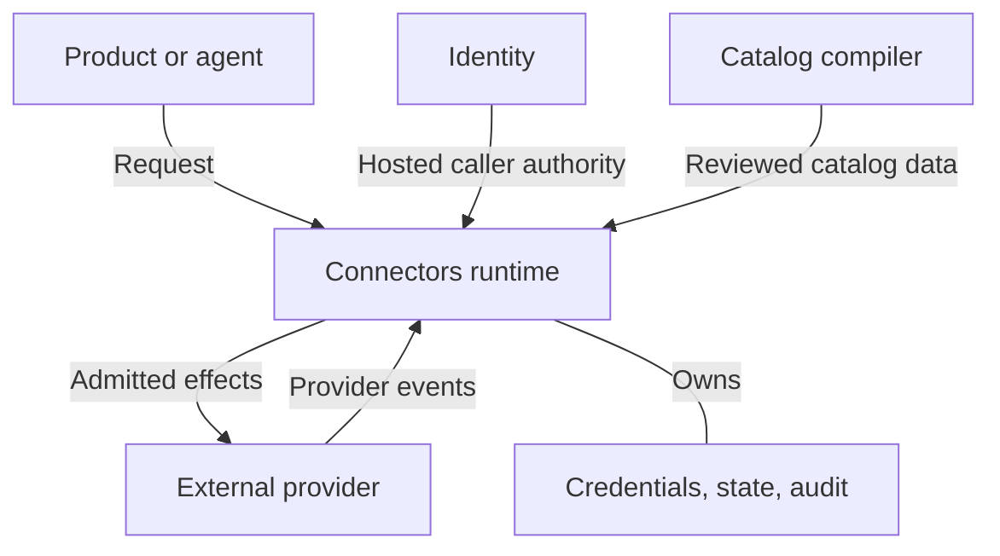

# System overview

Connectors sits between a caller and an external service. It turns a reviewed operation and a
permitted Connection into an execution, while keeping provider credentials in its own custody.
It also admits and stores provider events for consumers.

This handbook describes the 0.6.3 implementation. Its diagrams group responsibilities for readers;
the [ESS specification](specification.md) currently declares a smaller set of components and does
not generate this system map.

## The boundaries

The arrows distinguish requests, provider events, and configuration data; the unarrowed line
marks storage ownership. Identity authenticates hosted callers. Connectors owns receiver-side
admission and provider execution. Products own the conversation and approval experience.

Within the runtime, transports adapt shared application contracts, admission forms the required
proofs, and adapters execute provider behavior. Event intake has its own admission and persistence
path. The [invocation flow](interfaces.md#follow-an-invocation) and
[event sequence](events.md#follow-an-incoming-event) show those paths separately. These
responsibilities need not run as separate processes.

## Follow one Slack mention

A person has added a **hosted companion bot**. Someone mentions it in a Slack channel, and the
person's application proposes a reply in that thread. This is an architecture example, with an
already configured deployment; the [Slack guide](../guides/connect-slack.md) covers setup.

We call the companion Connection **C1**, the admitted mention **E1**, the operation description
**D1**, and an issued approval **A1**. These are explanatory labels, not request values.

1. [Establish C1](authority.md#the-example-establish-c1). The person's Connect Session places
   credentials in Connector custody. It does not issue permission for arbitrary writes.
2. [Receive E1](events.md#the-example-receive-e1). The Socket Mode supervisor normalizes and
   persists the mention before acknowledging Slack. Only an admitted consumer receives it.
3. [Describe the proposed reply](interfaces.md#the-example-describe-and-invoke-the-reply).
   Discovery returns D1 for `slack-chat-post-message`; the reply selects C1 and its exact input.
4. [Approve the action](authority.md#the-example-approve-one-reply). Verified human authority
   issues A1 for that operation, Connection, subject, and input. E1 itself is not hosted approval.
5. [Attempt the reply](interfaces.md#when-the-reply-cannot-proceed). Hosted admission checks
   the Grant and current description, redeems A1 once, and dispatches. A missing outcome remains
   uncertain; it does not justify blindly retrying a write.

The example depends on the [hosted runtime prerequisites](deployment.md#the-example-hosted-prerequisites).
The [specification comparison](specification.md#the-example-across-the-four-layers) shows which
parts of this path are also declared in ESS.

## Subsystem ownership

- **Catalog** owns provider declarations, selection, traits, provenance, and deterministic artifacts.
  Start in [catalog-build](../../crates/catalog-build/src/lib.rs) and
  [connector-spec](../../crates/connector-spec/README.md).
- **Clients and transports** own argument parsing and wire adaptation.
  The [CLI](../../crates/connectors-cli/src/lib.rs), [client](../../crates/connectors-client/src/lib.rs),
  and [server](../../crates/server/src/lib.rs) expose shared contracts.
- **Application and authority** own use cases, admission, Grants, approvals, and inert execution
  plans. See [service](../../crates/service/src/lib.rs) and [domain](../../crates/domain/src/lib.rs).
- **Credentials and state** own bounded storage operations and custody. Runtime bindings implement
  the [SecretStore](../../crates/connector-secrets/src/lib.rs) and
  [StateStore](../../crates/connector-state/src/lib.rs) ports.
- **Adapters and drivers** own provider semantics and admitted effects. The
  [factory](../../crates/service/src/factory.rs) selects them; [dispatch](../../crates/service/src/dispatch.rs)
  passes requests across the effect boundary.
- **Runtime composition** owns configuration, listeners, storage bindings, and supervisors.
  See [composition](../../crates/connectors-runtime/src/composition.rs).

Integration adapters implement the reusable backend port. Runtime composition selects their
concrete implementations; the thin CLI does not own a second implementation of provider behavior.
The maintenance `catalog` command compiles declarations. The user-facing `connectors` command
runs and accesses deployments.

## The nouns across the boundaries

| Noun | Meaning |
|---|---|
| **Provider** | Reviewed capabilities and credential requirements of an external provider. |
| **Integration** | A provider enabled and configured by a deployment. |
| **Connection** | An authorized instance through which an external account or target can be used. |
| **Grant** | Connector-owned permission to use a Connection for bounded operations or events. |
| **Invocation** | One execution attempt of one operation through one Connection. |
| **Channel** | A configured path by which provider events enter Connectors. |
| **Event** | A normalized provider fact, with attribution and provenance. |

A catalog entry alone grants no access. Authentication does not permit use of every Connection.
Credential custody alone does not make a provider callable: a custody-only provider can hold a
credential while exposing no request surface.

## What stays outside Connectors

Identity owns hosted login, principals, and general identity authority. Products own their user
experience and catalog browsing. External providers own their APIs and upstream account policy.
Connectors owns receiver-side admission and the permissions, credentials, execution, and event
state needed to reach those providers.

The [deployment chapter](deployment.md) shows how these responsibilities are assembled. The
[specification chapter](specification.md) explains which parts also have an executable model.

[Overview](../../README.md) · **Next:** [Connections and authority](authority.md)
