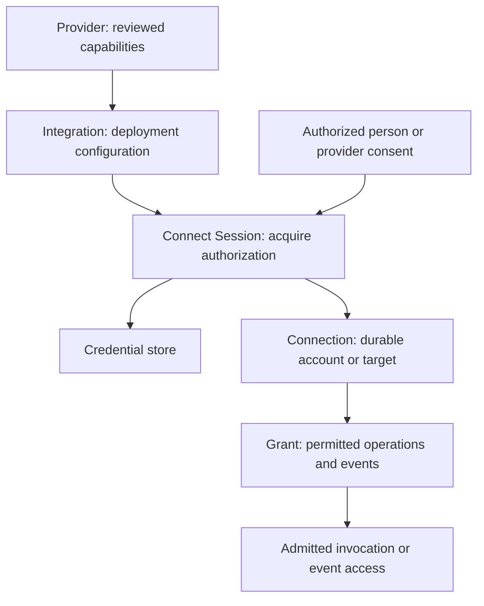

# Connections and authority

Connecting an account and permitting an action are separate decisions. A Connection identifies
the authorized external account or target. A Grant determines which operations or events may use
that Connection. Provider credentials stay in Connectors' credential store.

## From a provider to a usable Connection

The deployment enables an Integration and supplies its non-secret policy. Where acquisition is
required, the person completes a Connect Session through protected input or provider consent.
Credentials enter Connector custody; the caller observes the resulting Connection and its status.
Requests must still pass the authority checks that apply to their operation.

Not every Connection uses this acquisition flow. Local Kubernetes can use existing owner-controlled
cluster configuration; hosted OAuth and direct operator entry have different prerequisites.
The [provider guides](../../README.md#connect-a-provider) explain those differences.

## Two kinds of session

| Session | Owner and purpose | Result |
|---|---|---|
| Identity login session | Identity; lets a hosted client obtain short-lived access authority | Client login continuity, stored in the OS keyring |
| Connect Session | Connectors; a bounded attempt to establish or repair provider authorization | Connection status and reference, with credentials retained by Connectors |

The [Connect Session lifecycle](../../crates/service/src/connect_session.rs) starts at `pending`
and terminates at `completed`, `expired`, or `failed`. Terminal results cannot be completed again.
A terminal response does not confer general authority on its caller.

## The checks on an invocation

Hosted requests present short-lived Identity authority for the exact Connector audience and route
scope. Connectors validates it and derives the tenant and principal from that authority. Request
fields do not choose an independent tenant. Receiver-side policy further narrows admission.

The [Grant evaluator](../../crates/domain/src/evaluator.rs) checks the selected Connection and the
operation's reviewed facts. A [Grant](../../crates/domain/src/grant.rs) binds one Connection and
can express a risk ceiling, admitted effects and idempotency classes, explicit operation allow/deny
sets, and a closed inbound event set. An explicit denial takes precedence.

For operations requiring approval, the [approval gate](../../crates/domain/src/approval.rs)
verifies issuer, subject, operation, Connection, canonical input digest, and expiry. It redeems an
approval once and records the attempt before dispatch. Recovery distinguishes an aborted attempt
from an indeterminate one whose effect may already have happened.

| A caller has… | What still has to hold |
|---|---|
| A valid hosted login | A current access token with the correct audience and scope |
| A callable Connection | A Grant admitting this operation or event |
| A Grant | Current description/authority checks and any required approval |
| An approval reference | Exact request binding, validity, and successful one-time redemption |

## Where credentials live

The [SecretStore port](../../crates/connector-secrets/src/lib.rs) separates custody from provider
behavior. Local owner-bound storage and hosted Vault-backed storage implement different deployment
arrangements. Connectors resolves and places provider credentials inside the admitted execution
path; they are not operation input supplied by an agent.

Hosted administration separates non-secret configuration from credential entry. See
[Administer hosted Integrations](../guides/administer-hosted-integrations.md) for the operator
workflow and [Deployment and runtime](deployment.md) for storage arrangements.

[Previous: System overview](README.md) · **Next:** [Commands and interfaces](interfaces.md)
