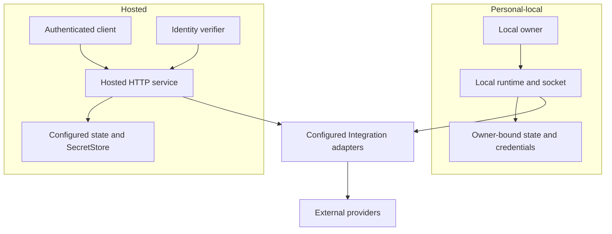

# Deployment and runtime

Runtime composition selects integrations, storage adapters, listeners, and background tasks.
Personal-local and hosted deployments share contracts and libraries; their authentication,
credential storage, and supported provider paths differ.

## Deployment postures



The shared adapter box represents reusable implementations, not shared credentials or state between
deployments. Each runtime supplies its own configuration and storage bindings.

| Concern | Personal-local | Hosted |
|---|---|---|
| Authority | Local-owner boundary and owner-controlled access | Validated Identity authority, exact scope, receiver policy |
| Configuration | Personal TOML and owner-only state root | Hosted TOML describing identity, integrations, storage, and listeners |
| Credentials | Connector-managed owner-bound custody | Configured SecretStore; hosted Slack requires Vault-backed custody |
| Access | CLI and local client through the owner-only daemon socket | HTTP contracts, hosted MCP, authenticated client |
| Background work | Enabled local channel/session supervisors | Hosted listeners and enabled Integration supervisors |

The project is pre-v1. A catalogued provider or local driver does not imply an equivalent hosted
Integration is enabled. Full SaaS and satellite federation are not current deployment guarantees.

## The example: hosted prerequisites

The C1/E1/D1/A1 [Slack example](README.md#follow-one-slack-mention) assumes an enabled hosted Slack
Integration, the configured workspace, C1's credentials in Vault-backed custody, and its running
Socket Mode supervisor. The product must hold the person's admitted event authority to read E1.

To attempt a reply, the deployment also needs a bound Grant/approval state store, a trusted approval
issuer, and a Grant admitting the write through C1. Human approval issuance and the later invocation
use their respective Identity scopes. Missing authority storage is an outage, not permission to
skip a check.

The [Slack guide](../guides/connect-slack.md) distinguishes organization bots, delegated users,
and companion Connections. A local setup command does not provision this hosted arrangement.
The local event-reference claim journal and the hosted approval gate are different runtime bindings.

## Install and inspect

Published binaries target Linux and macOS on x86_64 and aarch64. Choose the matching archive from
[Connectors releases](https://github.com/beyond10x/connectors/releases) and verify it against that
release's `SHA256SUMS`. A source build requires Rust 1.88 or later:

```bash
cargo install --path crates/connectors-cli --locked
connectors --version
connectors setup init --help
connectors inspect doctor
```

Run the install command from a Connectors checkout. Inspection reports configuration and readiness
problems; it does not authorize a provider. Follow the [provider guides](../../README.md#connect-a-provider)
to establish the Connection you need.

### Update a running local daemon

Installing a new executable does not replace an already-running daemon. From the reviewed source
checkout containing the fix, run the source install above, then check which executable your shell
selects:

```bash
command -v connectors
connectors --version
```

Run `connectors daemon stop --state-root /absolute/path/private-state`, then start the newly
installed executable with the same configuration and state-root paths shown under
[Run a service](#run-a-service). `connectors daemon status` reports the process, version, and served
configuration. Repeat operation search and description using those same paths. When an existing
supervisor owns the process, restart through that supervisor and check its executable path too.

This restarts background channels and sessions owned by that daemon. Do not delete its state or
socket to force a second process into the same root; the owner lock deliberately refuses that.
`connectors --version` identifies the client executable; `daemon status` identifies the server.
Source installation is supported independently of the release archive schedule; use the reviewed
source revision when a fix has not yet reached a published archive.

## Select the deployment

A hosted client can record its deployment through login:

```bash
connectors session login https://connectors.example.test/api/connectors/v1
connectors operation --target hosted search
connectors connection --target hosted list
connectors session logout
```

Use the actual deployment URL. The client discovers the Identity origin and audience, stores login
continuity in the OS keyring, and obtains short-lived access tokens. Non-secret deployment
selection is stored separately.

Connection, Endpoint, Event, and Operation commands default to `--target local`, including when a hosted
login is stored. Select `--target hosted` explicitly to use that deployment. The flag works before
or after the group's leaf command. Local `--config` and `--state-root` options select local paths;
combining either with `--target hosted` is refused before input is read or a transport is contacted.
Responses and command errors identify the selected target.

## Run a service

```bash
connectors daemon start --config /absolute/path/personal.toml --state-root /absolute/path/private-state
connectors daemon status --state-root /absolute/path/private-state
```

The state root must satisfy ownership and permission checks and be outside the checkout. All local
provider access uses this daemon. Setup can create and start it on first use. Help and the installed
provider catalog remain available offline. Use `serve local` with the same paths for a foreground
process or an existing supervisor.

```bash
connectors serve hosted --config /absolute/path/hosted.toml
```

Hosted TOML refuses unknown fields and inconsistent enablement. Use the
[configuration types](../../crates/connectors-config/src/hosted.rs) and
[development example](../../crates/connectors-config/examples/hosted-dev.example.toml) as a
starting reference, then supply deployment-specific authority and policy. The example does not
provision Identity, credentials, grants, or a production deployment.

| Area | Operator responsibility |
|---|---|
| Identity and authority | Trusted origin, Connector audience/scopes, admitted operator policy, tenant binding |
| Storage | Configured backend and state root, credential-store availability, ownership and access policy |
| Integrations | Enable configured adapters; supply provider routes, namespaces, registrations, and non-secret policy |
| Credentials | Use [hosted administration](../guides/administer-hosted-integrations.md); keep secret values out of TOML and operation input |
| Module access | Allowed module tenant projections and signing configuration where used |

`/livez` reports process liveness. `/readyz` and the compatibility `/healthz` route include a bounded
Identity readiness check and return `503` when that authority cannot be resolved.

## Personal OAuth and authentication recovery

The initial personal OAuth implementation supports explicitly configured GitLab public PKCE and
device authorization. Its dedicated `development_file` credential store is durable but unsealed
at rest and requires `registration_use = "development_only"`. It is not production credential
custody or a replacement for existing keyring-backed credentials. Slack and Jira do not gain a
personal OAuth flow from this implementation.

Configure the existing GitLab catalog entry and its admitted grant before starting authentication.
Its `credential` and `[catalog.oauth].auth_profile` must name the same declared credential purpose.
The [registration type](../../crates/connectors-config/src/personal_oauth.rs) owns the accepted
fields: a deployment-supplied client ID, public client authentication, selected flow, browser
placement, allowed scopes and session lifetime. Client secrets are not accepted by these public
flows. Registration values stay in deployment configuration, outside the provider catalog.

For `authorization_code_pkce`, the browser runs on the daemon's machine. Register exactly the
configured `http://127.0.0.1:<fixed-port>/<callback-path>` redirect URI, with a nonzero explicit
port and a non-root callback path. A port conflict is refused; there is no random-port fallback.
For `device_authorization`, omit the redirect URI and select the actual browser placement; the
human can complete the provider's device flow on another machine. Sessions default to 300 seconds,
with configured lifetimes from 30 to 600 seconds, bounded further by provider expiry. Inspection
reports the configured callback URI and actual unsealed custody status.

Start a persistent local daemon with the configuration and state root selected above. With exactly
one matching configured GitLab OAuth binding, the trusted terminal flow is:

```bash
connectors setup connect gitlab --auth-profile gitlab.oauth_token \
  --config /absolute/path/personal.toml --state-root /absolute/path/private-state
```

The configured profile selects the flow; Connectors does not try one and fall back to another.
The session verifies the provider's token evidence before publishing credentials. Refresh uses the
same credential owner and does not create a session or retry an operation. The configured
Connection reference remains stable when its credentials are renewed.

When an admitted operation reports `authentication_required`, repair that exact existing binding
with the intended input. Replace the two reference placeholders with the selected operation and
Connection; do not add a provider or credential override to this form:

```bash
connectors setup connect --operation OPERATION_REF --connection CONNECTION_REF \
  --input-file /absolute/path/request.json \
  --config /absolute/path/personal.toml --state-root /absolute/path/private-state
```

Both flows require the persistent daemon. Instructions are written to the controlling terminal,
separately from public output. For a human handoff without that terminal, add `--instruction-file`
with a new file path in a private, owner-only directory. The command reserves the destination before
starting the session and clears its instruction contents when the flow ends. Treat these transient
instructions as private; they are not model or MCP output.

Bound recovery polls completion, acknowledges once, then checks fresh matching descriptions and
the intended input. Success reports readiness and `next_action: explicit_invoke`; it does not
execute the operation. Describe again to obtain the current description reference and submit a
separate invocation under its ordinary grant and approval requirements. Hosted acquisition is not
implemented by this personal-local command.

## MCP, voice, and Git bytes

`connectors serve mcp` exposes MCP over stdio and reserves stdout for protocol messages. Hosted
`/mcp` is a separate HTTP entry point. Both adapt governed Connector capabilities.

Voice uses configured SIP routes and an authenticated RTVBP application channel. Dialing selects
an admitted alias; the caller does not choose arbitrary destinations or supply SIP credentials.
Session ownership and termination remain with the process holding the call.

The hosted Git-fetch broker creates bounded read-only sessions for an admitted GitLab project,
its provider-selected default branch, an exact commit, and a bounded depth. A dedicated native TLS
listener serves the internal smart-Git byte plane. Its source authority is separate from Identity
authority and provider credentials. This interface is absent from public OpenAPI, the operation
catalog, and MCP. The [Git-fetch design](../design/19-read-only-git-fetch-sessions.md) gives its
request, lifetime, and byte bounds; [runtime composition](../../crates/connectors-runtime/src/composition.rs)
binds its listeners and storage.

[Previous: Events and durable state](events.md) · **Next:** [Specification status](specification.md)
