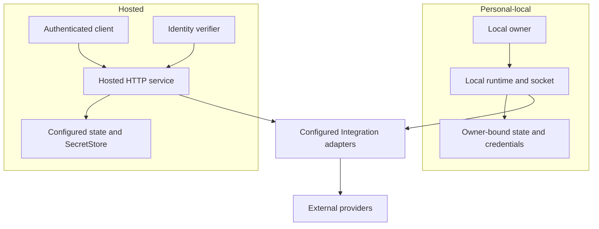

# Deployment and runtime

Runtime composition selects integrations, storage adapters, listeners, and background tasks.
Personal-local and hosted deployments share contracts and libraries; their authentication,
credential storage, and supported provider paths differ.

## Deployment postures



The shared adapter box represents reusable implementations, not shared credentials or state between
deployments. Each runtime supplies its own configuration and storage bindings.

| Concern | Personal-local | Hosted |
|---|---|---|
| Authority | Local-owner boundary and owner-controlled access | Validated Identity authority, exact scope, receiver policy |
| Configuration | Personal TOML and owner-only state root | Hosted TOML describing identity, integrations, storage, and listeners |
| Credentials | Connector-managed owner-bound custody | Configured SecretStore; hosted Slack requires Vault-backed custody |
| Access | CLI, local client/socket, selected one-shot operations | HTTP contracts, hosted MCP, authenticated client |
| Background work | Enabled local channel/session supervisors | Hosted listeners and enabled Integration supervisors |

The project is pre-v1. A catalogued provider or local driver does not imply an equivalent hosted
Integration is enabled. Full SaaS and satellite federation are not current deployment guarantees.

## Install and inspect

Published binaries target Linux and macOS on x86_64 and aarch64. Choose the matching archive from
[Connectors releases](https://github.com/beyond10x/connectors/releases) and verify it against that
release's `SHA256SUMS`. A source build requires Rust 1.88 or later:

```bash
cargo install --path crates/connectors-cli --locked
connectors --version
connectors setup init --help
connectors inspect doctor
```

Run the install command from a Connectors checkout. Inspection reports configuration and readiness
problems; it does not authorize a provider. Follow the [provider guides](../../README.md#connect-a-provider)
to establish the Connection you need.

## Select the deployment

A hosted client can record its deployment through login:

```bash
connectors session login https://connectors.example.test/api/connectors/v1
connectors operation search
connectors connection list
connectors session logout
```

Use the actual deployment URL. The client discovers the Identity origin and audience, stores login
continuity in the OS keyring, and obtains short-lived access tokens. Non-secret deployment
selection is stored separately.

Explicit local `--config` or `--state-root` options select the personal-local path on commands that
declare them. Connection, Event, and Operation commands do not yet share a uniform `--target` flag.
Check each command's help and login selection before choosing where a request runs.

## Run a service

```bash
connectors serve local --config /absolute/path/personal.toml --state-root /absolute/path/private-state
```

The state root must satisfy ownership and permission checks and be outside the checkout. Selected
one-shot operations can construct a local runtime without a standing daemon; ongoing channels and
sessions require their owning process to remain available.

```bash
connectors serve hosted --config /absolute/path/hosted.toml
```

Hosted TOML refuses unknown fields and inconsistent enablement. Use the
[configuration types](../../crates/connectors-config/src/hosted.rs) and
[development example](../../crates/connectors-config/examples/hosted-dev.example.toml) as a
starting reference, then supply deployment-specific authority and policy. The example does not
provision Identity, credentials, grants, or a production deployment.

| Area | Operator responsibility |
|---|---|
| Identity and authority | Trusted origin, Connector audience/scopes, admitted operator policy, tenant binding |
| Storage | Configured backend and state root, credential-store availability, ownership and access policy |
| Integrations | Enable configured adapters; supply provider routes, namespaces, registrations, and non-secret policy |
| Credentials | Use [hosted administration](../guides/administer-hosted-integrations.md); keep secret values out of TOML and operation input |
| Module access | Allowed module tenant projections and signing configuration where used |

`/livez` reports process liveness. `/readyz` and the compatibility `/healthz` route include a bounded
Identity readiness check and return `503` when that authority cannot be resolved.

## MCP, voice, and Git bytes

`connectors serve mcp` exposes MCP over stdio and reserves stdout for protocol messages. Hosted
`/mcp` is a separate HTTP entry point. Both adapt governed Connector capabilities.

Voice uses configured SIP routes and an authenticated RTVBP application channel. Dialing selects
an admitted alias; the caller does not choose arbitrary destinations or supply SIP credentials.
Session ownership and termination remain with the process holding the call.

The hosted Git-fetch broker creates bounded read-only sessions for an admitted GitLab project,
its provider-selected default branch, an exact commit, and a bounded depth. A dedicated native TLS
listener serves the internal smart-Git byte plane. Its source authority is separate from Identity
authority and provider credentials. This interface is absent from public OpenAPI, the operation
catalog, and MCP. The [Git-fetch design](../design/19-read-only-git-fetch-sessions.md) gives its
request, lifetime, and byte bounds; [runtime composition](../../crates/connectors-runtime/src/composition.rs)
binds its listeners and storage.

[Previous: Events and durable state](events.md) · **Next:** [Specification status](specification.md)
