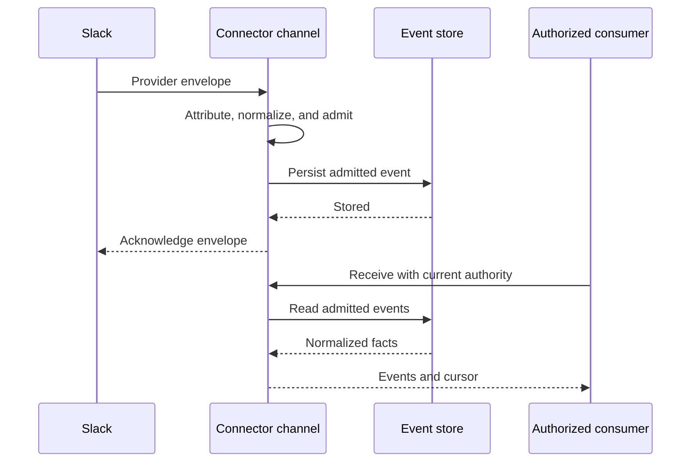

# Events and durable state

An event is a normalized fact from an external provider, attributed to a Channel, Connection, and
Integration. Event access is governed: a provider event is not visible to every caller merely
because Connectors has received it.

## Follow an incoming event

The Slack Socket Mode path illustrates the implemented intake boundary:

Persisting before acknowledgement lets Slack redeliver when the event cannot be stored. Provider
envelopes, Socket Mode tickets, and app tokens do not become consumer payloads. Loop guards discard
message classes excluded by the channel policy. The [Slack guide](../guides/connect-slack.md)
explains the supported local and hosted profiles.

This sequence describes Socket Mode. Webhook verification, attribution, and polling depend on
their declared binding and implementation. Provider-originated events carry `native` provenance;
synthesized polling events carry `polled` provenance.

## What a consumer receives

The [DataEvent contract](../../crates/protocol/src/event.rs) carries:

| Field | Purpose |
|---|---|
| `event_ref` | Stable reference for the admitted event |
| `channel_ref`, `connection_ref`, `integration_ref` | Attribution to intake path and authorized account |
| `event_type` | Provider event name |
| `provenance` | Native delivery or polling |
| `received_at_unix_ms` | Connector receipt time |
| `payload` | Normalized provider data |

Search discovers event descriptions. Receive reads events using the protocol's cursor; replay
addresses retained events by reference. Admission still applies when reading or replaying a fact.
Method inputs and results appear in the deployed [API reference](interfaces.md#the-deployed-http-reference).

## The example: receive E1

The hosted supervisor receives a Slack `app_mention` for C1. It attributes and normalizes that
provider message into E1, retaining the selected payload fields needed by the consumer. The
[Slack event store](../../crates/integration-slack/src/backend.rs) persists admitted events before
acknowledgement. If storage fails, that intake does not acknowledge successful persistence.

An application acting with the person's admitted event authority receives E1 and a cursor. The
event reference addresses the stored fact; the cursor advances a read. Neither reference is an
issued approval for `slack-chat-post-message`.

The application can use E1's channel and thread information to propose a reply. Its subsequent
write follows [description, human approval, and invocation](interfaces.md#the-example-describe-and-invoke-the-reply).
Reading or replaying E1 never resets the redemption state of A1.

## Durability has a boundary

The personal-local event store is bounded at 10,000 events and 64 MiB. When it cannot admit another
event, Socket Mode intake stops acknowledgement rather than claiming delivery. Retention and
compaction are not a completed general capability across all deployments.

Delivery is not a universal exactly-once claim. Provider redelivery, consumer retries, and replay
are separate from operation idempotency. Hosted approval A1 is redeemable once and has its own
expiry; that guarantee applies to admission, not to exactly-once arbitrary external effects.

The local runtime has a separate [event-reference claim journal](../../crates/connectors-runtime/src/claims.rs),
tested for concurrent presentations and restart persistence. That local mechanism does not issue
hosted approval records, impose a general ten-minute lifetime, or prove thread/input binding.

## State and audit are separate concerns

| Concern | Current mechanism |
|---|---|
| Connector-owned state | Bounded keyed cells through [StateStore](../../crates/connector-state/src/lib.rs), bound to concrete storage by the runtime |
| Provider event history | Normalized events and cursors, with provider/deployment-specific intake and retention limits |
| Approval redemption | One-time claim plus audit/recovery semantics in the [approval gate](../../crates/domain/src/approval.rs) |
| Execution audit | Attempt and outcome records owned by the admitted execution path |

The state port supplies bounded atomic operations; it does not promise arbitrary transactions
across keys. Using it does not mean entities execute through Entity Runtime or that every store
shares one event-sourcing model.

For the example, three durable facts answer different questions: E1 says what arrived; A1's
redemption says whether that approval was spent; execution audit says what was attempted and what
outcome was recorded. None of them can substitute for a missing fact in another store.

## Operational events are not a shipped general stream

ESS declares lifecycle facts such as Connection authorization and session termination. The generic
event protocol explicitly carries provider data events and excludes that operational family.
Those declarations do not establish that subscribers can receive a complete operational stream.

Delivery and Subscription also have partial ESS definitions. Retry policy, subscription lifecycle,
relationships, and read consistency are not comprehensively modeled there. See
[Specification status](specification.md) for the distinction between a declaration and an
implemented transport or decision rule.

[Previous: Commands and interfaces](interfaces.md) · **Next:** [Deployment and runtime](deployment.md)
