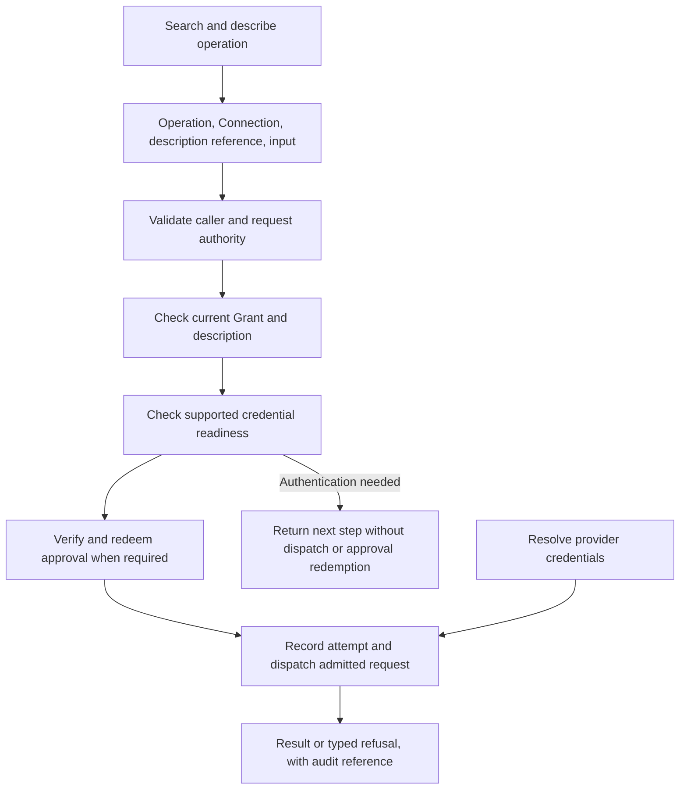

# Commands and interfaces

Callers discover operations, inspect their requirements, and request an invocation through a
particular Connection. Connectors returns a typed result or refusal. Transports expose these
capabilities in forms suitable for a terminal, application, or agent.

## Follow an invocation



This is the common authority path, not a promise that every transport supports every method.
Discovery is scoped to what the caller may see. `describe` supplies the input contract, available
Connections, effect and approval posture, and a description reference. The actual
[invocation request](../../crates/protocol/src/operation.rs) carries `operation_ref`,
`connection_ref`, `description_ref`, `input`, and optional `approval_evidence_ref`.

A description reference binds the call to previously described facts; stale catalog or authority
information can cause refusal. The [hosted enforcement path](../../crates/server/src/hosted/enforcement.rs)
and backend admission checks produce proof-bearing values before provider effects become reachable.
Credential lookup and network execution follow the relevant admission decisions.

## The example: describe and invoke the reply

For the [companion example](README.md#follow-one-slack-mention), the application discovers and
describes `slack-chat-post-message`. The description D1 includes its input schema, eligible
Connections, mutating effect, and required approval.

The application selects C1 and prepares the Slack channel, thread, and message input from its
intended reply to E1. After [human approval](authority.md#the-example-approve-one-reply), invocation
uses these five fields:

- `operation_ref`: `slack-chat-post-message`.
- `connection_ref`: the actual reference represented here by C1.
- `description_ref`: the current reference represented by D1.
- `input`: the exact approved reply input.
- `approval_evidence_ref`: the issued approval represented by A1.

E1 is the reason for the proposed action; it is not substituted for A1. Hosted admission checks
current authority and redeems the approval before the
[Slack adapter](../../crates/integration-slack/src/backend/api_runtime.rs) resolves C1's bot
credential and calls Slack. An adapter receives admission proof rather than deciding whether a
caller-supplied approval string looks sufficient.

## When the reply cannot proceed

| Condition | What the caller can conclude |
|---|---|
| D1 no longer matches the current description | Describe again and review the resulting request before seeking approval. |
| Authority, Grant, approval binding, expiry, or one-time redemption refuses | The hosted write is not admitted. Missing, mismatched, expired, and replayed approvals do not become distinct public authorization disclosures. |
| The authority store is unavailable | Admission cannot answer. The effect must not proceed through that failed admission. |
| An admitted request needs initial authentication or reauthorization | No operation was attempted. Complete the bound authentication flow, inspect fresh descriptions, then explicitly invoke again. |
| The provider returns a definite HTTP 429 | The request was refused for rate limiting. A trusted retry delay may be supplied; it does not authorize another invocation. |
| The provider may have accepted the write, but no terminal outcome is durable | The outcome is uncertain. Inspect the recorded result and provider state before deciding on another action. |

The [hosted enforcement implementation](../../crates/server/src/hosted/enforcement.rs) distinguishes
policy refusal from unavailable authority. The [approval recovery tests](../../crates/domain/src/approval.rs)
cover spent approvals whose final outcome is absent.

An operation can finish in one request or establish a session. Session methods inspect, terminate,
reconcile, or signal an existing execution. A daemon restart can leave an old execution's outcome
unknown; a missing in-memory record does not prove that no effect occurred.

## Operation versions and rate advice

Local and hosted operation boundaries accept `b10x.connector-operation.v0alpha1`,
`b10x.connector-operation.v0alpha2` and `b10x.connector-operation.v0alpha3`. The CLI defaults to
v3; use `connectors operation --protocol-version v2 ...` for an explicitly selected v2 peer.
Upgrade a local CLI and daemon together. Each supported version uses the same admission and
backend path, with its defined response projection. Original request bytes and the declared
identity are validated before dispatch; unknown versions are refused. Replies retain the requested
supported identity. There is no negotiation or automatic resend when a peer rejects that version.

In v2 and v3, a definite provider HTTP 429 produces an error with `code: rate_limited` and
`retriable: true`. An optional `retry_after_seconds` gives an unsigned delay in seconds, including
zero. Connectors trusts only one admitted numeric Retry-After header, with surrounding ASCII spaces
or tabs removed. Missing, duplicate, malformed, overflowing or HTTP-date values leave the delay
absent. The provider's raw headers and error body are not exposed as the error message. A received
429 remains a definite refusal even if its error body is oversized or incomplete; uncertainty
about an attempted write remains `outcome_unknown`.

CLI JSON/YAML errors and MCP structured errors retain the code, retriable flag and optional delay;
the CLI still exits nonzero. A delay is advice for the caller's next decision. Neither the delay,
the retriable flag, a protocol mismatch nor an uncertain result triggers an automatic invocation
resend or a fallback to another protocol version. A fresh invocation must pass normal Connection,
Grant, description and approval checks.

V2 descriptions may include `rate_advice`, carrying fixed limits and conditional alternatives.
Each alternative preserves its applicability, source URL and any published numeric rate. A
`minimum_allowance` is a minimum tier allowance; a `ceiling` is a maximum. If the source establishes
no numeric rate, none is invented. Numeric alternatives include suggested spacing in milliseconds,
computed as `ceil(per_seconds * 1000 / requests)`. All alternatives remain visible so the caller
can assess its application category; Connectors does not infer that category from credentials or
pace requests from the metadata.

V1 continues to receive its existing error shape: throttling becomes `unavailable`, preserving
the message and retriable flag while omitting retry delay and description rate advice. Its frozen
bundle bytes remain unchanged. Existing deployed-v1 `purpose` and `session_signal` extensions are
tracked separately from that older schema. The [operation contract](../../contracts/connector-operation/v0alpha2/README.md)
documents the complete v2 shape and exact compatibility loss.

Catalog schema 4 introduces a separate compatibility requirement and retains schema 3's explicit request-semantics
profiles preserve supported vendor constraints, whole JSON bodies and omission versus null for
migrated operations. Legacy operations keep their declared legacy profile. Publish a matching
producer, schema, documents/pack, reader and resolver together; an external pack consumer must
upgrade its reader/resolver before loading schema 4. Schema 4 adds personal OAuth declarations;
the schema 2 and 3 artifacts remain frozen. An older executable may retain its matching
older pack. Changing the catalog version alone does not establish source fidelity for every
provider. The [domain amendment](../design/01-domain-model.md#2026-09-06-amendment-source-request-semantics)
describes the distinction.

## Authentication as a next step

Operation v3 can return `authentication_required` after the exact operation and Connection pass
grant admission and the supported credential owner reports missing or degraded credentials.
Hosted HTTP carries this pre-dispatch result as 409. It states `not_attempted`, distinguishes
initial authorization from reauthorization, and identifies the admitted binding and trusted next
action. It creates no session, redeems no approval and dispatches no operation. Unknown or
unadmitted requests retain an opaque refusal; an unavailable authority store remains an outage.
The retained v1/v2 projections do not acquire v3 authentication authority.

The trusted personal-local setup flow uses Connection v2 to start a session for the exact configured
Connection, intended operation and input. A configured Created Connection can be authenticated
without advertising it as callable. Current authority, grant, integration and credential purpose
are checked through start, completion and one-use acknowledgement. Expiry, changed policy or a
mismatched binding cannot authorize a retry. Connection v1 remains available for its existing
methods; bound v2 requests have an explicit refusal when projected to v1.

Human instructions go to a controlling terminal or a new owner-only file. Public CLI and MCP
authentication output excludes session capabilities, private URLs and arbitrary daemon messages.
After acknowledgement, the client requires fresh matching Connection and Operation descriptions,
validates the intended input against the fresh schema, and stops ready for a separate explicit
invocation. It does not retain an operation for replay. An authentication-required 409 does not
renew Identity or resend the request; the existing Identity 401 renewal path remains separate.

Acquisition is currently implemented for the configured personal-local path described in
[Deployment and runtime](deployment.md#personal-oauth-and-authentication-recovery). Hosted
Connection v2 still enforces operation and management admission, then reports Unsupported where
there is no acquisition adapter. A hosted transport is not itself an implemented acquisition flow.
The [Operation v3 contract](../../contracts/connector-operation/v0alpha3/README.md) and
[Connection v2 contract](../../contracts/connector-connection/v0alpha2/README.md) define the wire boundaries.

## The CLI at a glance

The [shipped parser](../../crates/connectors-cli/src/lib.rs) defines eight top-level groups:

| Group | Responsibility | Example |
|---|---|---|
| `setup` | Create configuration, connect a provider, install completions | `connectors setup connect slack` |
| `inspect` | Report configuration, provider, and credential readiness | `connectors inspect doctor` |
| `session` | Log in to or out of a hosted deployment | `connectors session logout` |
| `serve` | Run local, hosted, or MCP service entry points | `connectors serve local` |
| `connection` | List, discover, activate, and materialize Connections | `connectors connection list` |
| `event` | Search, receive, and replay events | `connectors event search` |
| `operation` | Search, describe, invoke, and signal operations | `connectors operation search` |
| `admin` | Inspect hosted Integrations and supply administrative credentials | `connectors admin integrations status` |

Run a command with `--help` for its arguments. Use the global `-o json` option for machine-readable
output. Shell completions come from the same parser:

```bash
connectors setup completions fish
```

Version 0.6.0 introduced this grouping. Bare `connectors serve` displays the group; running a local
service requires `connectors serve local`. Use the current paths in scripts. The
[specification status](specification.md) explains why the ESS outline is not the parser's implementation.

## Choose an interface

| Interface | Access | Boundary |
|---|---|---|
| Local CLI/client | Explicit local configuration and runtime, including socket access | Owner-bound deployment; selected one-shot operations work without a standing daemon |
| Hosted HTTP | Configured base, usually `/api/connectors/v1` | Identity-authenticated contracts with route-specific admission |
| Inbound MCP | Hosted `/mcp` or `connectors serve mcp` over stdio | Adapts admitted capabilities; discovery does not bypass grants or approval |
| Outbound MCP | Reviewed remote-tool snapshot mapped to local operations | Provider adapter with deployment policy, Connection-bound egress, grants, and custody |
| Direct byte planes | Dedicated admitted session paths | Voice/media or bounded Git bytes after control-plane admission |

HTTP exposes Operation, Connection, Catalog, Event, Datasource, Approval, and administrative contracts.
The hosted `{base_path}/approvals` endpoint issues approval for an exact human-decided request.
For hosted clients, `connectors session login` records deployment selection and login continuity.
Explicit local `--config` or `--state-root` options select local operation where supported. The
shared `--target` surface remains incomplete; see [deployment selection](deployment.md#select-the-deployment).

## The deployed HTTP reference

A hosted deployment exposes `{base_path}/docs` and `{base_path}/openapi.json` without login. They
contain its API version, authentication requirements, examples, and refusal codes. The served
document combines a committed route skeleton with schemas generated from Rust protocol types;
the HTML reference renders that document.

The [contract implementation](../../crates/server/src/hosted/docs.rs) and
[route/example tests](../../crates/server/src/hosted/tests/docs.rs) connect those surfaces.
Check the deployed document's coverage: an implemented route does not automatically appear in
its committed route skeleton. The [approval protocol](../../crates/protocol/src/approval.rs)
and [handler](../../crates/server/src/hosted/approval.rs) are the source references for approval
issuance. Internal Git-fetch routes deliberately remain outside public OpenAPI and MCP.

[Previous: Connections and authority](authority.md) · **Next:** [Events and durable state](events.md)
