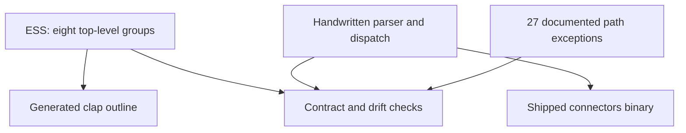

# Specification and implementation status

Connectors has a working Rust implementation and a partial
[Executable System Specification](https://beyond10x.github.io/docs/ess/). ESS validates selected
domain declarations and generates a checked CLI outline. It is not yet a complete executable
definition of Connectors' behavior.

This page describes the 0.6.3 source. The website's source-and-revision link identifies the exact
documentation snapshot; the hosted API reference identifies the deployed binary's contract.

## Four kinds of evidence

| Layer | Current evidence | What it establishes |
|---|---|---|
| Implementation | Rust domain types, service contracts, runtime composition, tests | Actual admission, state operations, and effects |
| Specification | [Core ESS documents](../../ess/system/system.yaml) | A valid, partial description of typed nouns, lifecycles, commands, and events |
| Generation | [Committed clap tree](../../ess/generated/clap/crates/connectors-cli/src/tree.rs) | The CLI groups and summaries can be reproduced from ESS |
| Verification | [ESS claim checks](../../crates/catalog-build/tests/main/ess_claim_fence.rs), [CLI checks](../../crates/connectors-cli/tests/cli_surface.rs), repository gate | Specific implementation claims and generated bytes agree with their sources |

Validation proves that declarations satisfy ESS rules. It does not establish that every capability
has been declared or that the runtime executes those definitions.

## The example across the four layers

The [Slack mention-to-reply example](README.md#follow-one-slack-mention) crosses more boundaries
than a generated CLI outline can establish.

| Capability | Implemented authority | ESS and generation limit |
|---|---|---|
| Establish C1 | Connect Session lifecycle, Slack setup, and credential custody | Selected Connection lifecycles are declared; a complete typed authority/custody relationship model is absent. |
| Persist and receive E1 | Slack intake/store and the provider data-event protocol | Core event declarations do not model the entire intake, read, replay, or delivery policy. |
| Describe D1 and invoke | Rust protocol, routing, backend admission, and adapter dispatch | ESS has selected commands, but no core search/describe views and no complete invocation request contract. |
| Issue and redeem A1 | Hosted human approval issuance and the domain approval gate | Declaring an invocation does not generate approval issuance, exact-input binding, or one-time redemption. |
| Enforce relationships and invariants | Rust checks, state operations, and targeted tests | Core typed relations and entity invariants remain absent; these checks are not a complete model-derived conformance suite. |
| Reach a CLI command | Shipped clap parser and Rust dispatch | ESS generates the checked group outline; leaf behavior remains handwritten. |

The public walkthrough does not add those missing definitions to ESS. It makes the implemented
path and its model coverage independently inspectable.

## What the model covers

The core specification has six domains: catalog, connection, deployment, event, runtime, and target.
It declares three components: the catalog compiler, the Connector service, and the CLI. That scope
contains 20 entities, 16 commands, and 20 events.

| Area | Current coverage and limit |
|---|---|
| Nouns and lifecycles | Several Connection/channel/session lifecycles are modeled. Grant, Audit, Delivery, Subscription, and Webhook remain thin declarations. |
| Relationships and rules | No typed entity relationships, entity invariants, or actors in the core model. Rust implements substantially more authority and state semantics. |
| Commands | Selected lifecycle actions. ESS `InvokeOperation` takes an execution reference and models session establishment; the real request also carries operation, Connection, description, input, and approval information. |
| Reads | No core views or read consistency contracts for search, describe, receive, or replay. |
| Events | Operational facts are declared, but their general transport is absent. The provider data-event protocol is a separate implemented surface. |

Unresolved information is marked with `UNMAPPED` comments. They disclose gaps; they are not
executable rules. Some gaps can already be resolved from code: the Rust Grant binds one Connection
while the ESS relation remains undeclared.

## The Git specification is separate

The [Git-fetch domain](../../ess/domains/git.yaml) adds a session entity, four commands, four events,
a view, and an actor. Its [system entry](../../ess/system.yaml) is separate from the six-domain
core entry and declares the same `connectors v1` identity. Each specification validates on its
own; loading the entire `ess/` tree encounters duplicate system declarations. They are not yet one
composed model.

The [repository gate](../../scripts/gate.sh) validates `ess/system/` and regenerates its clap
artifacts. That step does not cover the separate Git system entry.

## How much of the CLI is generated?

The parser is checked against declared groups and 27 named paths the current ESS CLI construct
cannot fully express. They include forwarded commands, reads, guided flows, and process/credential
steps. Their enumeration is in specification comments, checked by Connectors' own tests.

Generated groups contain no executable leaf commands, and the generated handler trait is empty.
Replacing a real parser group with its generated counterpart would remove its commands. The CLI
forwards service commands; ESS currently places them on the component that owns and handles them.
The [CLI design](../design/19-the-cli-surface.md) records that distinction and its generation limit.

The 0.6.0 refactor established checked grouping and compatibility behavior. Command input, dispatch,
and operational behavior still come from handwritten Rust.

## What enforces decisions?

Connectors does not currently execute its entities through
[Entity Runtime](https://beyond10x.github.io/docs/entity-runtime/). Rust authority types, the Grant
evaluator, approval gate, backend admission, and storage implementations enforce the shipped rules.
Their tests provide enforcement evidence, but not a complete model-derived conformance suite.

The provider catalog has its own deterministic generation from reviewed specifications and
overlays. Catalog generation, runtime OpenAPI schema projection, and the ESS CLI outline have
distinct source authorities. Calling one generated does not make the entire system model-derived.

[Previous: Deployment and runtime](deployment.md) · [Return to overview](../../README.md)
