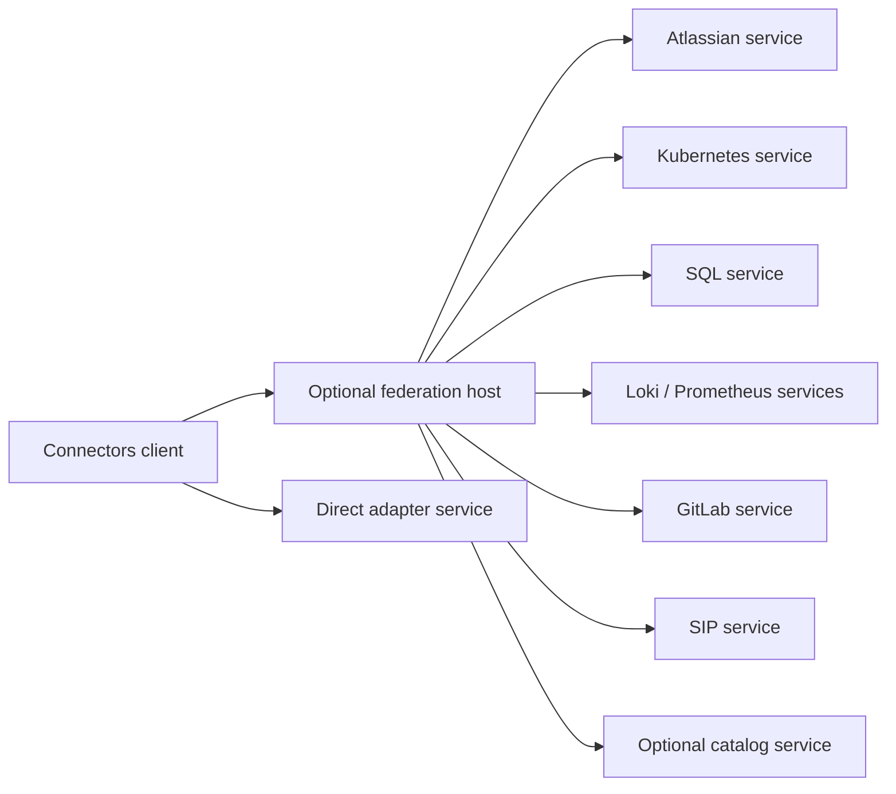
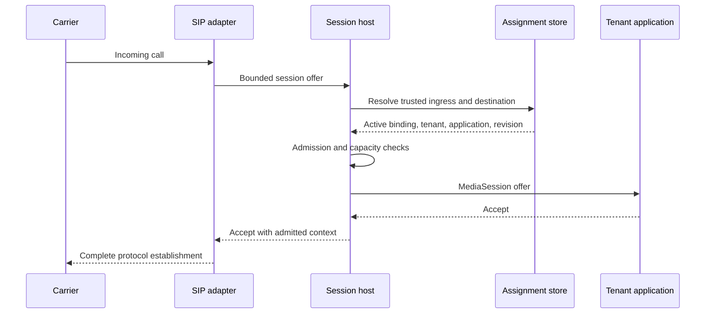
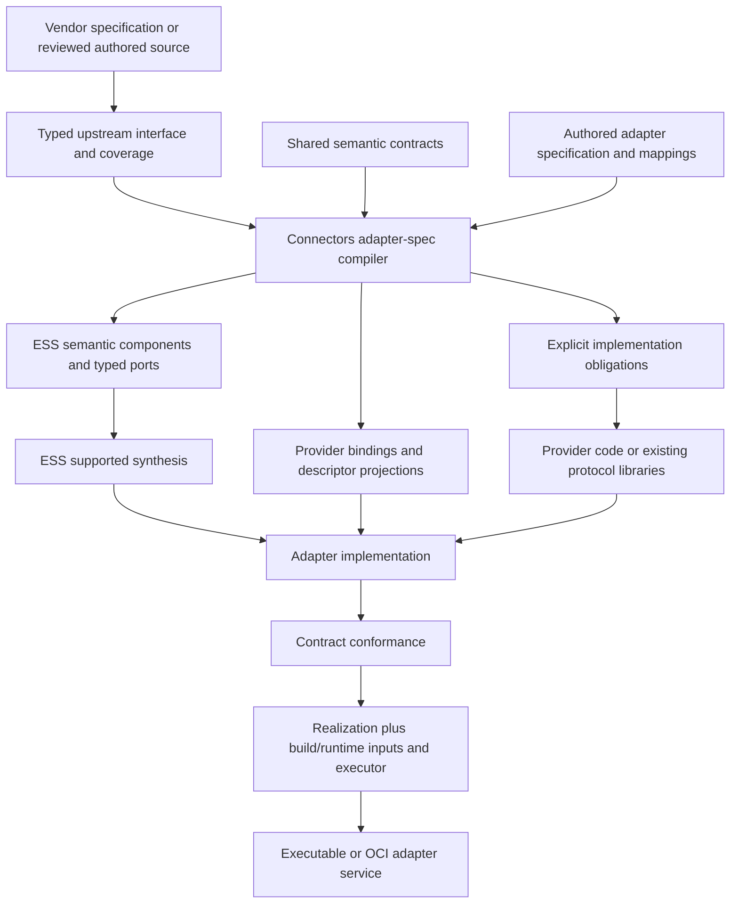

# Connectors v2: independent adapter services built from contracts

- **Status:** local three-adapter implementation and wire contract verified; GitLab specification generation implemented, with review remediation and proposed contract documents recorded in sections 27–30. No release or rollout is configured.
- **Recorded:** 2026-09-08.
- **Working name:** `connectors_v2`; this is a local design repository, not a published project.
- **Scope of this deliverable:** preserve the design decisions, their evidence, and the locally implemented slices and remaining boundaries.

Navigation: [intent and evidence](#1-purpose-and-how-to-read-this-document), [repository layout](#4-monorepo-layout-and-dependencies), [contracts and operations](#5-shared-contract-ownership-and-evolution), [sessions](#8-bidirectional-sessions), [data and discovery](#9-datasources-and-execution-profiles), [configuration](#11-configuration-and-caching), [auth](#12-authentication-and-secret-store-independence), [resources and SaaS](#13-resource-management-and-saas-ownership), [media and SIP](#14-sip-rtvbp-webrtc-and-mediasession), [webhooks](#15-webhooks-and-durable-events), [federation](#16-federation), [local distribution](#17-local-execution-service-distribution-and-composition), [ESS adapter kind](#18-the-connectors-owned-ess-adapter-specification-kind), [provider scope](#19-provider-scope-and-extraction-priorities), [conformance](#21-conformance-and-validation-strategy), [implementation order](#22-implementation-order-and-completion-criteria), [migration](#23-specification-extraction-and-migration-records), [open decisions](#24-open-decisions-and-recommended-defaults), [workspace handoff](#25-local-workspace-and-implementation-handoff), [sources](#26-evidence-map-and-references).

## 1. Purpose and how to read this document

The operator considers the existing `../connectors` implementation heavily over-engineered. The request began as a specification-first clean-room rewrite and developed into a more specific architecture: independently deployable adapter services, a small set of shared semantic contracts, a generic client, and an optional host that can supervise local adapters or federate remote ones.

This document is self-contained. Reading the old code is useful for extraction, but should not be necessary to understand the intended system. Existing code is evidence of behavior, not automatically the authority for the replacement. A desired behavior may deliberately differ from observed behavior; record that decision before turning either into a compatibility test.

There are three levels of certainty in this document:

- **Direction:** decisions explicitly requested or clarified by the operator. They govern the rewrite.
- **Recommended design:** concrete proposals developed in the conversation. They provide a starting point and may be revised with evidence.
- **Open decision:** a detail not settled by the conversation or available evidence. Do not silently treat an example, field name, numeric limit, or sketch as a frozen contract.

Contract and CLI names below are proposed names unless explicitly identified as existing. YAML and interface snippets are explanatory sketches, not validated input accepted by an installed tool. Before implementation, give actual entities and relations a typed home, validate the chosen specification, and version the resulting contracts.

“Clean-room” here means implementing from a curated behavioral specification and independent conformance examples, rather than copying the old implementation structure. The author of this handoff has inspected the old source. This is not a claim of legal clean-room separation. Reuse of vendor specifications, fixtures, or source data still requires provenance and license review.

### 1.1 Operator decisions to preserve

1. Extract specifications before rewriting; preserve useful semantics and remove unnecessary implementation constraints.
2. Core defines abstract operations, events, and bidirectional sessions. Higher-level contracts include media sessions, authentication, datasources, execution, and discovery.
3. SIP/RTP, WebRTC, and RTVBP should expose the same supported media semantics through independent implementations or bindings. Their protocol code must not depend on one another.
4. Adapters should be slim in responsibility. They own provider/protocol behavior and transient protocol state; the host supplies persistence, credential custody, instrumentation wiring, and other infrastructure through contracts.
5. SaaS configuration and tenant ownership must be modeled explicitly. A live session contract cannot describe all manageable external resources.
6. Resource-management contracts tell the cloud what an adapter can manage. External resources, their SaaS assignments, and runtime sessions are different things.
7. Authentication must be decoupled from provider operations and from the secret-store implementation.
8. Focus on Jira, Confluence, Kubernetes including endpoint discovery, Loki, Prometheus, GitLab, SIP, and SQL. Slack supplied detailed auth/configuration/webhook examples and remains an adapter candidate. RTVBP is part of proving the media boundary; WebRTC is an interoperability target.
9. Adapters may run on another host or service. A client discovers or is statically configured with endpoints, then asks which contracts they support.
10. A client can run a serving mode that exposes federated access to downstream services through the same outward contracts.
11. Local adapters may be downloaded and built with Cargo, then run locally. They need not be linked into the client or host.
12. The current catalog becomes an optional ordinary provider/service. It is not a mandatory compiler or runtime dependency of every adapter.
13. An adapter is described by a **custom ESS specification kind owned by Connectors**. Its schema, semantic rules, compiler, and provider generation belong in Connectors, not in ESS's built-in domain vocabulary.
14. Use a single repository for shared machinery and adapters, with independent adapter service artifacts.
15. Current authorization is a local design handoff, with the operator subsequently invoking managed-worktree and AEP planning workflows. No implementation, remote creation, publication, deployment, consumer repin, or old-repository modification was requested by this task.
16. The operator explicitly deferred Atlas integration. Keep this repository standalone: no Atlas catalog registration, roadmap/lineage changes, documentation delivery wiring, or consumer dependency integration. Reading verified Atlas authority and using its existing commit wrapper are tooling use only.

### 1.2 What simplification means

The target is less coupling and one owner for each behavior. It is not a target crate count or deletion of essential correctness rules. Keep credential isolation, explicit authority, bounded resource use, truthful partial/unknown outcomes, provider provenance, and reproducible specifications. Reconsider historical restrictions such as an intrinsically closed driver enum, mandatory custom catalog packs, dependency-free hash implementations, and per-provider copies of common service behavior.

Do not turn the rewrite into a new universal workflow engine, arbitrary handshake language, plugin ABI, generic entity database, or service mesh. Start with the named use cases and add abstractions when multiple implementations demonstrate the same semantics.

## 2. Existing-system evidence and baseline caveats

### 2.1 Revisions observed

The initial orientation was against the working tree at `/home/timo/beyond10x/connectors`, with additional inspection of newer contract documents in cached `origin/main`.

| Item | Observed value | Interpretation |
|---|---|---|
| Existing Connectors HEAD | `81459ac42ddd518d3942f4b079841e9e0ed6efc8` | Local main, dated 2026-09-06, declares workspace version 0.6.5 |
| Cached Connectors origin/main | `eb0b45140b9658135577a7f1ee9a21facc54ec29` | Declares 0.7.2; cached ref, not a freshly verified remote advertisement |
| Installed connectors CLI | `0.7.0` | A different baseline from local source |
| Existing ESS HEAD | `bbbe0de65e01ad7dc22fd329bb5f73d70e648d1d` | Local source used to inspect implementation boundaries |
| Cached ESS origin/main | `a0cf3ca8681ce06f6fbdbc988d457b23f2136c04` | Local ESS main was 14 commits behind this cached ref |
| Installed ESS CLI | `0.9.2` | Command layout differs from local documentation and installed skills |

Local Connectors main was 9 commits ahead and 93 behind the cached remote ref. No current remote advertisement was verified for this design. Re-establish the exact implementation and consumer baseline before extraction or cutover. Do not reset or merge the old checkout merely to make its history look simpler.

The initial checkout was clean. During this handoff a separately created, untracked `docs/design/21-clean-room-rewrite.md` was observed and left untouched. That draft suggests a mandatory catalog, relocating voice, dropping SQL, and preserving old package names. Those suggestions conflict with later operator direction recorded in section 1.1 and do not govern this design.

### 2.2 Size and concrete coupling

Orientation counted 44 crate manifests under `crates/`, 12 workspaces in the gate, approximately 186,000 physical Rust lines including tests and comments, 65 provider declarations, and 1,017 operations in canonical catalog documents. These are scope indicators, not proof that every operation is callable or that all of that code must migrate. The old instructions estimate approximately 41 GB of separate build outputs; that estimate was not independently measured here.

The stronger findings were:

- GitLab, Jira, Slack, and monitoring each implement parts of discovery, descriptions, description references, connection management, and invocation. Common semantics are distributed among provider backends.
- The common `ConnectorBackend` interface spans operations, connection control, events, datasources, OAuth completion, readiness, and shutdown. An implementation must understand a broad shared service shape even if it only supports a small subset.
- Local event-triggered replies use a separate one-time `event:` claim journal. Hosted writes use grant evaluation and externally issued approval records. Those are distinct policies, not interchangeable credentials.
- The catalog reader vendors SHA-256 to satisfy a zero-non-optional-dependencies constraint. A custom offset-indexed pack is an implementation choice distinct from integrity and reproducibility.
- Workspace separation partly prevents an RTVBP dependency's `serde_json/preserve_order` feature from changing canonical artifact bytes. The new implementation should define canonical serialization explicitly.
- Core ESS declarations are partial. The model does not fully specify authority relationships, invocation inputs, reads, or event-delivery semantics. Generated CLI groups do not implement leaf behavior.
- Existing voice code already has a useful protocol-neutral `TelephonySession` and a voice-session contract. However, the SIP driver consumes a service-layer `AdmittedSipPlan`, so its dependency boundary is broader than the proposed independent media contract.

### 2.3 Useful existing behaviors

Extract and test these before deciding how they are implemented:

- Bounded search, describe, invoke, and session control; explicit local versus hosted selection.
- Provider credentials stay out of public requests, descriptions, ordinary results, and diagnostics.
- An authenticated principal carries its admitted tenant; request fields cannot substitute another tenant.
- Connections remain stable across reauthorization. Multiple accounts/identities per provider matter.
- Operation identity, exact input, connection, current authority, and required approval are checked at execution.
- One-time approval redemption is durable before a permitted external effect. An uncertain external write remains uncertain after a timeout or crash.
- Provider events have provenance and attribution. Durable intake acknowledgement is separate from consumer processing.
- Datasource reads preserve pagination, projection, completeness, binding, and cursor semantics.
- Private endpoint discovery and mediated access are explicit; an observed address is not a credential or permission grant.
- Generated artifacts are reproducible from reviewed inputs, with truthful vendor-versus-repository authorship.

Do not blindly preserve every old restriction. In particular, the old hosted read path can proceed through receiver policy when grant evaluation refuses or is unavailable. Decide and test the new read policy explicitly; do not claim the old implementation universally requires an explicit stored grant for every read.

### 2.4 Existing consumer coupling

These are observed examples, not a complete consumer inventory:

| Consumer | Existing dependency/pin | Migration implication |
|---|---|---|
| Zwirn | `connectors-cli`, revision `1e0eb9f` | An embedding API, not only an HTTP protocol |
| DevCenter | `connectors-client` and `protocol`, revision `e80b7ae1b2151d13aa9786cf67ea05e66717ee35`, version 0.7.0 | Client and typed protocol compatibility |
| DevCenter connector composition | `connectors-runtime` and `service`, revision `097b1c581e4031538b1590bf85d3d35cba6beabf` | Direct runtime embedding; disabling SIP alone does not remove all coupling |
| Agent Platform | `connectors-client`, tag `v0.3.1` | Older API generation |
| Workspace | `connectors-client`, revision `b4f6d655f9e3d7a906d2ba45d4160f2dc03a734b` | Another independent pin |

The newer cached branch includes Operation v0alpha2/v0alpha3 and Connection v0alpha2 contracts. V2 adds structured rate metadata and rate-limit errors. V3 adds safe authentication-remediation information. Older-version projections deliberately lose some information. DTO availability does not itself prove runtime wiring or consumer adoption. Freeze consumer-facing behavior from the actual versions used before replacing it.

## 3. System shape and vocabulary

Connectors v2 consists of a shared contract kernel, higher-level contract families, an adapter SDK, a client, a host, a Connectors-owned specification compiler, and independent adapter services.



### 3.1 Terms

| Term | Meaning |
|---|---|
| Contract | Versioned types plus interaction/lifecycle rules and executable conformance examples |
| Profile | A named supported subset or specialization with explicit guarantees, such as duplex audio or relational reads |
| Adapter | Provider/protocol implementation of one or more contracts |
| Binding | A mapping that carries a contract across a transport/protocol boundary; it can proxy or serve a capability |
| Adapter service | A running, independently addressable instance of an adapter and its infrastructure bindings |
| Host | A runtime that binds infrastructure, serves local capabilities, supervises local processes, and/or federates downstream services |
| Client | A consumer of service contracts; provider-independent at its transport/discovery layer |
| Connection | A stable binding to authorized external access; lifetime is not the lifetime of an HTTP connection or socket |
| Resource | A manageable or observable provider object, such as a number, repository, database endpoint, or cluster |
| Assignment | SaaS-owned association of a resource/connection with a tenant, principal, application, and policy |
| Session | Shared interaction lifetime permitting bidirectional requests and events, optionally with data streams |
| Catalog service | Optional discovery/distribution provider; direct services are usable without it |
| Adapter specification | Instance of the custom Connectors-owned ESS specification kind |
| Realization | Binding of a semantic specification to concrete implementation artifacts and entrypoints |

“Provider” and “integration” describe useful concepts but are not reasons to require the old catalog → integration → connection class hierarchy in every service. Retain distinctions that affect configuration, identity, or behavior. Public names need an explicit migration decision before changing existing clients.

### 3.2 Architectural invariants

- `connectors-core` is a library of generic contracts/primitives, not a central server process.
- Core and shared contracts do not import provider implementations, database clients, SIP stacks, or deployment machinery.
- A provider library depends on SDK contracts, not on sibling providers or a universal driver enum.
- A host does not import every concrete adapter. It can operate through service contracts and launch separate executables.
- Common orchestration and infrastructure are reusable. Provider-specific verification, mapping, parsing, and protocol state stay with the provider.
- The same outward contract works locally, remotely, or through federation, subject to explicitly advertised transport/profile support.
- Discovery, readiness, authentication, authorization, and execution are separate facts.
- A remote actor never gains authority from an unverified descriptor, configuration field, event, or discovered resource.
- Every imported source, authored model, projection, implementation, and runtime descriptor has a clear owner. Avoid two editable representations of the same fact.
- Independent contracts do not require independent microservices for every internal port. Run the initial system with ordinary processes and injected interfaces.

## 4. Monorepo layout and dependencies

Use one Cargo workspace and lockfile by default. Build each adapter as its own executable/container. Root workspace membership does not mean linking every provider into each binary. Introduce an additional workspace only for a demonstrated dependency incompatibility, not as the normal modularity mechanism. Make canonical generation independent of incidental JSON-map feature choices.

```text
connectors/
├── Cargo.toml
├── Cargo.lock
├── contracts/                         # Versioned semantic sources and vectors
│   ├── service/                       # Introspection, identity, readiness
│   ├── operations/
│   ├── sessions/
│   ├── events/
│   ├── auth/
│   ├── configuration/
│   ├── resources/
│   ├── datasources/
│   ├── discovery/
│   ├── execution/
│   ├── media/
│   └── catalog/
├── spec-kinds/
│   └── adapter/v1/
│       ├── schema.json                # Custom Connectors specification kind
│       ├── semantics.md
│       └── examples/
├── crates/
│   ├── connectors-core/
│   ├── connectors-contracts/
│   ├── connectors-sdk/
│   ├── connectors-client/
│   ├── connectors-host/
│   ├── connectors-spec/
│   └── connectors-conformance/
├── apps/
│   └── connectors/                    # User-facing CLI
├── adapters/
│   ├── atlassian/                     # Jira and Confluence modules
│   ├── gitlab/
│   ├── kubernetes/
│   ├── loki/
│   ├── prometheus/
│   ├── sql/
│   ├── sip/
│   ├── rtvbp/
│   ├── slack/                         # Auth/events example and later provider
│   └── catalog/
├── compositions/
│   ├── local-development/
│   ├── engineering/
│   └── voice/
├── tests/
│   ├── federation/
│   ├── compatibility/
│   └── scenarios/
└── docs/
    ├── design.md
    ├── authoring-adapters/
    └── operating-services/
```

This is a target layout, not a request to scaffold every empty crate immediately. The current deliverable creates the design, local repository guidance, and its AEP handoff record. Add WebRTC as an adapter when the media contract and an implementation justify it; it remains a stated interoperability target.

### 4.1 Package responsibilities

| Package | Responsibility | Excluded responsibility |
|---|---|---|
| `connectors-core` | Operation/event/session primitives, correlation, generic lifecycle/error types | Provider names, OAuth details, storage, media codecs, tenant database |
| `connectors-contracts` | Rust bindings for the versioned higher-level contract families | Provider execution or a second independently edited definition of contract semantics |
| `connectors-sdk` | Reusable service surface, registration, bounded runtime helpers, config handling, common auth mechanics, instrumentation, host dependency interfaces | Product tenant ownership or per-provider implementation branches |
| `connectors-client` | Bootstrap, contract negotiation, calls, event/session clients, transport bindings | Provider credential custody, implementation selection inferred from names |
| `connectors-host` | Infrastructure bindings, local supervision, federation, policy integration, lifecycle/recovery | An intrinsic list of every provider or a customer-specific domain model |
| `connectors-spec` | Parser/validator for adapter kind, upstream import orchestration, semantic mapping, ESS lowering, generation | Runtime provider invocation or a new general ESS compiler |
| `connectors-conformance` | Contract scenarios, provider test doubles, transport adapters for black-box testing | Assertions that merely preserve old file layout or trait structure |
| CLI | User-facing client/serve/lifecycle entrypoints | Reimplementation of service semantics |

Start common OAuth helpers, config validation, caches, and storage backends as modules. Extract a new crate when dependency or release boundaries require it. Concrete state/secret bindings can initially be host modules. Product-specific ownership and provisioning workflows are composition extensions that use host ports, not branches baked into the generic host.

```text
adapter library   -> SDK -> contracts -> core
client            -> contracts
host              -> client + SDK
CLI               -> client + host
adapter executable -> its own adapter library + host wiring
spec compiler     -> adapter-kind definition + ESS libraries/tools
```

There is no dependency from runtime crates to `connectors-spec`. There is no host-to-concrete-adapter dependency. Thin adapter entrypoints can use shared host wiring without making their libraries depend on customer state or peer providers. A separately authored composition executable may link selected parent/child libraries and inject their narrow ports into the generic host; [mediated composition ownership](../contracts/discovery/composition.md) defines this one-process case without a concrete loader in the host.

### 4.2 Adapter layout

```text
adapters/atlassian/
├── Cargo.toml                        # Library and standalone binary
├── spec/
│   ├── adapter.yaml                  # Instance of custom adapter kind
│   ├── configuration.yaml
│   ├── authentication.yaml
│   └── bindings/
│       ├── jira.yaml
│       └── confluence.yaml
├── upstream/
│   ├── jira.openapi.json
│   ├── confluence.openapi.json
│   └── sources.toml                  # Origin, exact source/digest, coverage
├── src/
│   ├── lib.rs
│   ├── main.rs
│   ├── auth.rs                       # Provider-specific auth behavior
│   ├── jira/
│   └── confluence/
├── generated/
│   ├── bindings.rs
│   ├── descriptor.json
│   ├── configuration.schema.json
│   └── ess/
├── realizations/
│   ├── local.yaml
│   └── container.yaml
└── tests/
    ├── conformance.rs
    └── fixtures/
```

The authored adapter kind owns config and mapping semantics. Provider code implements remaining obligations. Generated upstream DTOs and bindings reuse shared contract types instead of creating independent copies of them. Generation must expose unresolved obligations by name.

Commit the generated Rust required for an ordinary Cargo source build. CI regenerates in a temporary directory and checks for drift. Do not perform networked source refresh or require an unpinned ESS invocation from `build.rs`. Only the generator edits generated files. Source pin updates and generated behavior changes are reviewed together.

Realizations describe supported entrypoints and infrastructure bindings. Their exact ESS artifact format is selected against a pinned ESS version; these filenames do not assert that an end-to-end generator already exists.

## 5. Shared contract ownership and evolution

A Rust trait alone is not a distributed contract. Each shared contract release contains:

1. A stable identity, version, and bounded capability/profile vocabulary.
2. Typed requests, responses, events, and errors with wire bindings.
3. Preconditions, authorization boundary, lifecycle, concurrency, and failure rules.
4. Ordering, delivery, cancellation, retry, and resource-limit semantics where relevant.
5. Positive and adversarial conformance scenarios, including original-wire-byte cases where needed.
6. Compatibility and projection rules for supported older versions.

`contracts/` is the semantic source and fixture home. `connectors-contracts` is its Rust binding. Generated schemas and DTOs do not become an independent authority. ESS may express some semantic rules; independent tests carry the obligations it cannot yet express. A syntax-valid schema does not prove behavioral completeness.

Separate versions for the adapter specification kind, shared contract, provider API source, adapter implementation, configuration schema, and realization/build inputs. Installing a new adapter must not require a new core driver enum. A new contract family is introduced explicitly, not as an untyped extension bag hidden inside an old version.

Compatible implementation upgrades can preserve service/resource identities. Advertised capabilities must match installed handlers and the selected realization. A descriptor generated from a spec with an unresolved implementation stub cannot advertise that stub as a working capability.

Contract negotiation selects an explicit mutually supported version and profile. No silent protocol fallback, hidden field dropping, weakening of guarantees, or automatic request resend. A version adapter is a tested binding with declared information loss and refusal cases.

## 6. Service bootstrap and discovery

### 6.1 Three different discoveries

| Discovery | Question | Typical result |
|---|---|---|
| Service discovery | Where can I contact adapter services? | Configured endpoint or directory entry |
| Contract discovery | What does this service implement and offer to this caller? | Versioned descriptor and capability/readiness information |
| Resource discovery | What hosts, endpoints, services, or data resources does it observe? | Attributed resource observations with scope and freshness |

A configured HTTP endpoint must be usable without a catalog. Standardize one minimal bootstrap binding so the client can discover exact contract and transport versions. The exact HTTP path and wire envelope are open; choose and test them early. Catalogs, registries, or later network discovery mechanisms can supply endpoints but do not determine whether the client trusts them.

### 6.2 Descriptor semantics

An adapter's specification produces the static part of its descriptor. Runtime composition supplies instance identity, enabled implementations, dependency readiness, and caller-visible scope. A descriptor conceptually contains:

```yaml
# Illustrative, not a released schema.
service: connectors.atlassian
instance: engineering-atlassian
specification_digest: <exact-semantic-digest>
provides:
  - contract: datasource.records
    versions: [v1]
    profiles: [bounded-read]
  - contract: auth.oauth2
    versions: [v1]
transports:
  - binding: http
management:
  configuration_schema: <versioned-schema-reference>
```

Management-only descriptions may additionally declare dependencies such as credential custody, state, or authenticated egress. `provides` is not `requires`: requiring a secret store does not export arbitrary secret reads to remote clients. Public bootstrap should reveal only what a caller needs to authenticate/negotiate; configuration, resources, and internal dependency details require the appropriate admission.

Keep four questions separately answerable: implemented by this artifact; enabled in this instance; ready with its bound dependencies; authorized for this caller. A disabled provider cannot become callable because its implementation appears in a package manifest. Conversely, an authentication flow can be discoverable specifically because a connection is not ready.

Instance identity remains stable across restart and compatible upgrade. Operation/resource references include source identity or carry equivalent opaque owner information. A host must distinguish two GitLab instances even when both expose identical operation names.

Descriptions include schema/profile digests and enough revision information to detect a changed contract or authority. The protocol for stale descriptions must lead to a fresh description and deliberate resubmission. A description is neither a reservation nor execution authority.

## 7. Operations and authority

An operation is a typed request with a correlated terminal outcome. It can execute independently or establish a session. Its contract declares input/output/error schemas, effects, idempotency guarantees, relevant limits, and required capability/profile. Metadata helps admission and client UX; it does not authorize execution.

The request boundary needs correlation identity, selected operation, selected connection/binding when relevant, input, and the contract/description revision used. A trusted transport or verifier supplies admitted principal context. Existing wire owner context is not itself trusted authority; compatibility readers must preserve that distinction.

Recommended execution sequence:

1. Validate framing, version, bounds, input shape, and authenticated caller context.
2. Resolve the exact operation and connection under receiver-owned configuration.
3. Check current policy, grants where required, external identity/profile, and description freshness.
4. Bind any required approval to caller, operation, connection, and canonical input. Validate before spending it.
5. Establish required dependency readiness and prepare the permitted request without executing the business effect.
6. Durably record required attempt/approval-redemption information before dispatch.
7. Resolve/apply the selected credential at the trusted execution boundary and dispatch within admitted destination and resource limits.
8. Record the known outcome; otherwise expose an explicitly uncertain outcome.

Credential preflight can require provider authentication I/O, including refresh. Its permitted effects are separate from the business operation. The final contract must specify how preflight, approval redemption, and dispatch coordinate so a refused preflight does not misleadingly claim that business work occurred.

Preserve the important semantic distinction between not attempted, known refusal, known success, and effect possibly attempted with unknown outcome. An HTTP timeout, lost response, or missing in-memory session does not prove that no effect occurred. A request ID is correlation, not automatic deduplication. If a profile supports idempotency, define its key scope, retention window, result replay, and conflicting-input behavior.

Cancellation requests stopping work. A cancellation acknowledgement must state whether it means request received or termination observed. Neither automatically rolls back an external effect. Automatic retries must be restricted to explicitly safe outcomes and the declared idempotency policy; advisory rate-limit metadata or successful token refresh does not authorize resending a mutation.

Errors should have safe stable classifications such as invalid input, unsupported contract/profile, authentication required, not admitted, dependency unavailable, capacity, stale description, rate limited, and outcome unknown. Exact names and public disclosure detail are open. Preserve internal diagnostic distinctions without exposing secrets or sensitive policy facts in public error text.

Tenant authority is structural in admitted context. SaaS authentication and authorization to use a Slack/GitLab/Jira credential are different from the provider's own credential validity and scopes. Both must hold. Adapters can perform provider-specific scope and resource checks; the host must not reinterpret provider credentials as blanket application authority.

For the Beyond10x service binding, preserve the organization rule that verified authentication supplies tenant, optional realm, current authority, and executor before application decoding. No independent caller-set header, query, or body can choose those coordinates. An absent realm is different from a realm named `default`; do not normalize between them in credentials, namespaces, cache/idempotency keys, logs, or dispatch. Ordinary project/workspace/resource selectors remain typed domain inputs. These are host/binding concerns, not provider names or a tenant database embedded in the core library.

## 8. Bidirectional sessions

### 8.1 Interaction model

A session is a shared lifetime with at least two participants. Either participant may issue a request and receive its correlated response; either may publish events. An event reports a fact and does not implicitly request an action. A request's direction does not determine its authority.

Model the following independently:

- Requests and terminal responses, correlated without collisions between both directions.
- Events and their declared delivery/ordering semantics.
- Optional continuous data streams, such as audio or process output.
- Lifecycle/control messages: offers, acceptance, cancellation, termination, lease expiry, and loss of continuity.

Do not make a physical WebSocket, TCP connection, or HTTP stream the semantic session identity. A transport may reconnect without continuity, or a semantic session may require explicit recovery. Neither is inferred from the other.

### 8.2 Establishment and lifecycle

An incoming interaction creates a bounded **offer**, not an automatically accepted application session. The host checks routing, tenant assignment, policy, capacity, and supported profiles, then presents it to the selected consumer. Offers have deadlines and can be rejected or cancelled while admission is in progress.

Use explicit logical states and transitions; a candidate sequence is offered → establishing → ready → closing → closed. Keep offer state separate where that makes acceptance races easier to specify. `OutcomeUnknown`/lost continuity must be observable rather than forcing a fabricated closed-success state.

The contract must settle:

| Concern | Required decision |
|---|---|
| Accept versus cancel/expiry race | One serialized decision determines whether establishment can proceed |
| Concurrent requests | Bound in-flight count; match each response to its initiating peer and request |
| Ordering | State whether order is per stream, direction, or session; no assumed global event order |
| Half-close | State whether one direction can end while the other remains usable |
| Terminal race | One accepted terminal fact wins; later observations cannot silently replace its reason |
| Backpressure | Bound queues; choose refuse, block with deadline, drop-with-loss, or terminate per stream |
| Restart | Reattach only with proof of ownership/continuity; otherwise report lost or unknown outcome |
| Lease/revocation | Host can revoke or expire admitted access; implementation must stop within a declared bound |
| Shutdown | Join or explicitly account for tasks; do not orphan credential-bearing sessions |

A durable event subscription is not automatically the same as a session's transient event channel. A session replay/resume profile must specify its own retention and acknowledgement guarantees.

### 8.3 Transport bindings

HTTP can carry bootstrap, management, and ordinary operations. A declared streaming/duplex binding carries bidirectional sessions. WebSocket is a reasonable initial candidate, not a finalized requirement. Specify size limits and decoder behavior independently of the network library.

Media or other continuous bytes use an explicitly supported data binding. Control traffic must remain responsive under data load. A generic client may understand session establishment while requiring a profile-specific client for audio, process I/O, or another data stream.

Do not claim that HTTP introspection support implies media transport support. In local placement the same semantic ports can use bounded in-process channels or local sockets. Conformance must compare the observable semantics of each binding.

## 9. Datasources and execution profiles

### 9.1 Shared datasource semantics

Use shared contracts for schema discovery, bindings, bounded reads, provenance, completeness, freshness, and cursors. Keep typed profiles for record/document reads, logs, time series, and relational data. Avoid pretending every provider has one universal query language or one normalized business-object schema.

Every read description should make the following explicit:

- Key and result schema, representation/projection version, and supported read/query verbs.
- Exact connection/resource binding and caller-visible scope.
- Ordering, time-window boundaries, and snapshot/live consistency.
- Limits on records, bytes, time, and source work where enforceable.
- Continuation semantics, empty-page behavior, expiry, and invalidation conditions.
- Whether the result is complete, partial, truncated, filtered, cached, or from an unavailable source.
- Provenance and freshness of the underlying observation.

Cursor identity must bind the relevant source, connection/scope, query/filter/order, projection/contract revision, and authorization context. Validate those facts on each read. A cursor is not an authorization grant. Do not infer completion from an empty page if the provider contract still supplies continuation.

List and detail projections can differ intentionally. Declare that difference instead of returning an unconstrained object schema for all results. Provider-native data can remain provider-native with explicit schemas and selected projections.

### 9.2 Provider profiles

- **Jira/Confluence:** record and document reads with scoped sites/projects/spaces. Preserve provider paging and query semantics; do not silently equate a Jira issue with a Confluence document. Auth and some infrastructure can be shared in the Atlassian adapter.
- **GitLab:** repositories, projects, issues, merge requests, files, branches, and bounded incremental reads as selected by the specification. CI jobs/pipelines are provider resources; launching one is not automatically equivalent to a generic host process.
- **Loki:** log labels, timestamps, streams, ordering, native query, result/time/byte limits, and truncation. Preserve the exact query language/profile instead of calling it SQL.
- **Prometheus:** instant/range time-series semantics, timestamps, step/resolution, label sets, native query, and partial/error behavior. A series is not a log record.
- **SQL:** schemas/tables and relational query results, typed/null values, query/time/row limits, optional cancellation and transactions. Read-only access requires appropriate database authorization and execution policy; a string prefix check is not a sufficient read-only guarantee. Distinguish write/DDL operations from reads, and do not imply cross-database transaction portability.

For all providers, contract selection and operation inventory are still extraction work. This list is product scope, not a claim that each operation is already implemented or available from a particular deployment.

### 9.3 Process and job execution

An execution profile may expose start, status, cancel/terminate, exit outcome, and bounded stdout/stderr or equivalent event streams. Define attachment, input handling, resize/signals where supported, retention, restart continuity, and admission of command/target/environment.

Kubernetes process execution must target an admitted workload/container. It does not confer arbitrary cluster administration or a generic shell on the connector's own host. A GitLab job profile can share common lifecycle primitives while retaining provider-specific triggers and resource semantics. An adapter advertises only the profile it can honestly implement.

## 10. Host, resource, and endpoint discovery

Discovery emits observations, not executable connections. A useful endpoint observation includes stable source identity, observed resource reference, endpoint type/profile, owner scope, address or opaque locator, reachability context, observation time/revision, and known authentication requirements without credential values.

Kubernetes can discover workloads, services, nodes, or potential database/monitoring endpoints. Do not infer a database credential or tenant ownership solely from labels, port numbers, or a URI. Guessed classifications are marked as candidates with evidence/confidence, not silently upgraded to authorized bindings.

The host controls materialization:

```text
Kubernetes observation
    → authorized selection/configuration
    → compatible SQL/Loki/Prometheus adapter placement
    → explicit credential and route binding
    → readiness validation
    → callable datasource
```

An endpoint inside a cluster may be unreachable from a laptop. Use an adapter placed in the reachable network or a separately admitted tunnel/mediated-route capability. Federation of discovery results does not make private addresses reachable. An observation never causes an automatic credential probe, arbitrary outbound dial, or downloaded-code execution.

Define withdrawal, re-observation, stable identity across changes, and stale-binding behavior. A moved service or changed provider object must not silently redirect an existing authorized connection to an unrelated target. Bound resources and long-lived sessions retain their admitted identity/revision according to explicit update/revocation policy.

Before modeling these relationships in ESS, establish cardinality and ownership from the chosen design and evidence. In particular, a resource can have multiple observations; a discovered endpoint can have multiple authorized connections; a tenant assignment is not necessarily ownership of the external object. Unsettled relationships require `UNMAPPED` markers, not guessed `owns` edges.

## 11. Configuration and caching

An adapter specification publishes a typed configuration schema, constraints, defaults, secret-reference requirements, and update semantics. The adapter implements provider-specific validation. A host can generate basic forms and use a versioned configuration-management contract without importing the adapter implementation.

Example scopes:

| Adapter | Configuration examples |
|---|---|
| Atlassian | Allowed sites/projects/spaces, auth profiles, selected operations, query/read limits, cache policy |
| GitLab | Instances, project/group scope, auth identity, enabled reads/writes, pagination limits |
| Kubernetes | Cluster bindings, namespaces/resource kinds, discovery rules, process-execution policy |
| Loki/Prometheus | Server binding, allowed query scope, tenant/header binding where applicable, query/time/result limits |
| SQL | Database references, schemas, role/access policy, query budgets, transaction support |
| SIP | Listener/trunk binding, admitted ingress, routing hooks, media profiles, concurrency/time limits |
| Slack | Workspace/installations, allowed channels, enabled event/operation types, auth profiles, cache policy |

Separate deployment configuration from user-manageable tenant configuration and per-request parameters. A tenant should not acquire the ability to change a shared listener, remote secret backend, or trusted issuer merely because a generic form can render that field. The configuration contract carries management authority requirements.

Config changes use a revision: validate a candidate, determine required dependency changes, activate it explicitly, and return the active revision or a typed failure. Specify which changes are live, require a drain/reconnect, or require restart. A rejected update leaves the old active configuration intact. Existing sessions follow explicit continuation/revocation rules. Unknown fields and unsupported combinations must not be silently ignored.

Local files and remote management requests feed the same semantic validation. Schema validation alone does not establish provider reachability or valid credentials; readiness reports those separately. Schema/default projection and the active runtime configuration must agree.

Caching has both a common mechanism and provider-specific meaning:

- The provider defines what is cacheable, cache keys/invalidation inputs, and safe freshness limits.
- Shared infrastructure supplies bounded storage, eviction, concurrency, and instrumentation.
- Partition by source/connection, relevant external identity and scope, canonical query, result projection, and applicable policy/config revisions. Re-evaluate current admission before serving cached data.
- Declare TTL, maximum staleness, refresh behavior, and whether stale-on-error is permitted. An outage must not silently turn a live read into an unmarked cached response.
- Preserve freshness and source metadata through federation. A gateway can narrow reuse but cannot extend the source's declared freshness guarantee.
- Do not cache mutations or replay their results without an explicit idempotency contract. Do not put secret material into ordinary caches or logs.

## 12. Authentication and secret-store independence

### 12.1 Four responsibilities

| Responsibility | Owner |
|---|---|
| Describe required authentication | Provider auth profile, referenced by operations/configuration |
| Establish, refresh, revoke, or repair authorization | Shared coordinator plus provider auth implementation |
| Persist sensitive material | Injected secret-store binding |
| Authenticate a permitted provider request | Connection-bound authentication capability at the execution boundary |

The runtime adapter declares the capability it needs. It does not construct storage paths, open a Vault client, own the OAuth callback service, or duplicate generic token-refresh coordination.

Keep inbound SaaS caller identity, permission to use a connection, provider credential validity, and provider-granted scopes separate. A user's login is not a provider token. A valid provider token is not an application grant. Remote federation authentication is another explicit boundary, not a reason to forward vendor credentials between all hosts.

### 12.2 Profiles and the connection flow

Profiles declare credential purpose, external identity type, acquisition flow, required app registration, granted-scope rules, credential placement or use, and refresh/revocation behavior. Profiles are provider-owned declarations with shared flow implementations where possible.

Slack was the concrete example: bot, user, and app-level tokens have different purposes. App-level credentials must not be treated as ordinary per-tenant installation tokens. Incoming request verification also has its own credential purpose. Atlassian and GitLab need their own reviewed profiles. Do not infer their endpoint URLs, auth method, PKCE support, or token-response shape from Slack's profile.

The shared coordinator owns a bounded connection/authorization flow:

1. Host admits a connect or repair request against the SaaS principal, tenant, target connection, requested profile, and configured registration.
2. Coordinator creates expiring, one-purpose state correlated to that request and the allowed callback/continuation.
3. A trusted user interface presents consent or protected credential entry. Ordinary model results do not contain secret material or reusable completion authority.
4. Callback correlation, expiry, and one-time use are validated. Provider implementation performs the exchange and validates returned account identity, token kind, and granted scopes.
5. On repair, the returned external identity must match the intended binding unless an explicitly authorized reassignment flow says otherwise.
6. Credentials are durably stored; safe metadata and the active credential reference are published consistently.
7. The application receives a connection reference, safe status, and required next action. Completion does not automatically execute a previously failed business operation.

The coordinator owns common lifecycle, state, expiry, concurrency, and recovery. A provider auth implementation owns exchange/refresh/revocation request construction and response interpretation. Shared OAuth code supplies standard mechanics; it must allow explicitly modeled provider differences without one giant speculative OAuth workflow language. The selected [host management boundary](../contracts/auth/management.md) keeps safe control operations separately admitted and completion authority on a trusted UI/ingress channel. The [connection reduction](../contracts/auth/connection/v1alpha1/semantics.md#41-connection-viability-and-operation-eligibility) separates global viability from per-operation eligibility; these proposed bindings remain unimplemented.

Conceptual private interface:

```text
begin(registration, requested_access) -> AuthorizationAction
exchange(validated_callback_evidence) -> CredentialUpdate
refresh(current_credential_set)      -> CredentialUpdate
revoke(current_credential_set)       -> RevocationOutcome
```

`CredentialUpdate` separates safe metadata (external identity, scopes, expiry, kind) from sensitive material. The private auth/custody interfaces may necessarily handle secrets. They must not share public result serializers or printable diagnostic types that disclose those values.

### 12.3 Secret-store contract

Recommended minimum required surface:

```text
write_new(sensitive_material) -> SecretVersionRef
read(SecretVersionRef)        -> SensitiveMaterial
delete(SecretVersionRef)      -> Deleted | Missing
```

Specify immutable-version semantics, durability, scoped access, bounded values, idempotency where applicable, and distinctions between missing, unavailable, and denied. The host grants an appropriately scoped store capability. Public invocations never select a store driver or arbitrary path. The storage implementation maps opaque references to its own layout.

The store knows nothing about provider identity, OAuth, expiry, or refresh. Versioned credential sets can hold a related access/refresh pair together. Write a new set durably before publishing its reference as active. A host metadata store owns that reference, revision, and connection relationship. Later cleanup reclaims superseded versions once no valid use requires them.

Do not require all backends to implement the existing prepared multi-key transaction protocol by default. Determine the minimum atomicity actually required. An immutable secret blob plus a compare-and-swap active reference may be enough for a selected profile; unsupported guarantees must be explicit. An in-memory test binding does not claim production durability.

### 12.4 Authenticated runtime capabilities

For HTTP-based providers, a runtime adapter can receive:

```text
AuthenticatedHttp.execute(admitted_request) -> ProviderResponse
```

It is bound to the selected connection, external identity/profile, allowed destination, and execution limits. The provider adapter constructs and interprets the business request. The authentication capability obtains usable credentials and places them immediately before permitted dispatch.

Destination and redirect checks prevent a request from forwarding credentials to an arbitrary target. The connector's request builder cannot override the selected credential or turn an opaque auth handle into universal network access. Required SaaS admission happens before this interface.

Other protocols can receive a narrowly scoped signing capability, inbound verifier, or credential lease. Storage independence does not mean every third-party protocol library can avoid seeing credential bytes. The requirement is a defined trusted boundary, no general secret-store access from business operations, and no leakage through public interfaces.

### 12.5 Refresh, replicas, and failures

Refresh must coordinate per credential set across replicas, not just under one process mutex. New credentials and the active reference need a consistent publication protocol. Scope and identity checks apply to refresh results as well as initial exchange. Rotation does not silently widen the application's permission to act.

Slack's rotating refresh tokens illustrate why this matters: a successful refresh replaces credentials, and a used refresh token is subsequently revoked. An external exchange and local persistence cannot be one atomic transaction. If the response is lost after rotation, the honest recovery may require reauthorization. Do not emulate certainty by blindly refreshing again or reporting “not configured.”

Expose safe distinctions among reauthorization required, insufficient scope, invalid/revoked credential, custody outage, and uncertain refresh. Refresh success never automatically retries a business write whose effect may already have occurred.

## 13. Resource management and SaaS ownership

A session contract does not describe every resource an integration can manage. Add explicit resource-management contracts composed of typed queries, commands, events, and resource descriptions. They use the same operation/event primitives.

The management descriptor names resource kinds, identity/configuration/status schemas, supported actions, action effects, and required permissions. It may also expose discovery/options queries for configuration UIs. The host can render basic lists/forms. Rich domain UX depends on a shared domain contract, not only JSON Schema.

Do not invent universal CRUD semantics. Allocation, release, verification, reassignment, and observation can have different effects, preconditions, and asynchronous outcomes. A schema cannot establish that releasing a telephone number disconnects it or that allocating one incurs an external cost.

Separate three layers:

| Layer | Telephone example | Owner |
|---|---|---|
| External resource | Carrier number/trunk with provider-side identity | External system; accessed through its management implementation |
| SaaS assignment | Number belongs to tenant A and reaches assistant B | Product/control plane using host persistence and admission |
| Runtime session | One call arriving through that number | Protocol adapter plus session host/application |

A resource can be shared or referenced by multiple authorized bindings. Its external account/ownership and SaaS tenancy are not automatically the same. Before an ESS model encodes relations, settle cardinality, uniqueness, reassignment, deletion, and orphan/recovery behavior.

The generic host supplies storage and management infrastructure. A telephony control-plane module owns number assignment and provisioning semantics. Do not move all provider/product behavior into a host full of `if provider == ...` branches.

## 14. SIP, RTVBP, WebRTC, and MediaSession

### 14.1 Contract structure

Core knows operations/events/sessions. The media contract is a higher-level family. Initial implementation can live as a module of `connectors-contracts`; a separate `connectors-media` crate is an optional packaging decision if dependency or release boundaries later justify it.

`MediaSession` adds:

- Negotiated media/track descriptions: encoding, sample format/rate, channels, timing, and bounds.
- Duplex media streams with sequence/timestamp semantics.
- Explicit readiness, interruption, loss, overload, and termination behavior.
- Capability/profile negotiation, including supported control extensions.

Telephony controls such as DTMF are an explicit capability profile. A media endpoint without that capability must not accept a keypress and discard it. Call-specific features such as hold/transfer are separate profile decisions, not automatically promised by generic media support.

Use bounded data paths separate from lifecycle/control scheduling. A saturated audio stream must not prevent hangup or revocation. A bridge checks compatible profiles before forwarding. Required transcoding is a separately selected implementation with explicit limits, not something inferred from two codec names.

The old neutral voice profile is a useful first test vector: PCM signed 16-bit little-endian, 8 kHz mono, 20 ms/320-byte frames, a monotonic ready/closing/closed lifecycle, bounded loss, and explicit terminal reasons. These are old-profile facts, not universal MediaSession requirements. Extract a named narrow profile first, then extend by evidence.

### 14.2 Independent implementations and bindings

```text
connectors-sip   -> MediaSession contract <- connectors-rtvbp
connectors-webrtc -> MediaSession contract

SIP/RTP endpoint <-> MediaSession <-> bridge <-> MediaSession <-> RTVBP endpoint
```

- SIP owns SIP dialog/signaling, SDP interpretation/negotiation, RTP/media processing, protocol timers, and conversion to the selected media profile. It necessarily holds transient call state.
- RTVBP owns its envelope/handshake/framing and maps the media contract across its transport. It can expose a remote endpoint as a local interface or serve a local interface remotely.
- WebRTC would own its own signaling/establishment and media mapping. The common contract does not claim those protocol handshakes are identical.
- A bridge owns forwarding of compatible semantic media and controls plus an explicit joint termination policy. It imports neither SIP nor RTVBP protocol types.
- Composition chooses implementations and infrastructure bindings. No SIP crate imports RTVBP, and no RTVBP crate imports SIP.

### 14.3 Incoming calls in cloud/SaaS

An adapter listens on configured SIP ingress, interprets the protocol, and submits an offer toward the host. It does not open an application session under a tenant inferred from an untrusted caller header.

Conceptual receiver port:

```text
InboundSessionAcceptor.offer(
    verified_ingress_ref,
    interpreted_destination,
    media_offer,
    session_endpoint
) -> Accepted(admitted_session_context) | Rejected
```

The host resolves receiver-owned routing using trusted ingress plus the destination interpreted according to that ingress contract. It checks an active resource assignment, tenant/application policy, supported media, and capacity. Caller identity information can remain untrusted participant context even when the carrier ingress is admitted.



Rejection, cancellation, and expiry races must be specified. Do not allow media to reach the wrong tenant while routing is undecided. A session retains the identity/revision under which it was admitted. Number reassignment affects new offers; continuation or revocation of existing calls is explicit policy. Start with an authoritative host lookup; introduce cached routing only with version/invalidation/staleness semantics that preserve assignment isolation.

### 14.4 Numbers, trunks, and provisioning

Purchasing or allocating telephone numbers generally uses a carrier management API, not the SIP call protocol. A separate carrier implementation may provide `PhoneNumberManagement`; SIP consumes configured delivery. These can share a distribution if convenient while remaining independent contracts.

Candidate management surface: find available numbers, allocate, inspect/list, configure delivery, release, and corresponding observed status/events. Exact carrier semantics must be sourced and tested.

Illustrative control-plane records:

```text
ExternalResource:
    id = number-42
    provider_account = carrier-account-3
    provider_resource_ref = external-number-789

InboundBinding:
    id = binding-17
    resource = number-42
    tenant = tenant-a
    application = assistant-b
    enabled = true
    revision = 8
```

Provisioning records the request durably, calls the management operation, records the provider reference/outcome, creates the tenant assignment, configures external delivery where necessary, and activates the binding only when prerequisites are ready. Recovery must distinguish unknown external allocation from a definitely failed request; blindly repeating allocation may create another billable resource.

The SIP adapter owns dialog/media state and emits instrumentation. The host/product owns persistent assignments, operational history, credential custody, routing/admission, and telemetry retention. Slim means narrow responsibility, not an incorrect stateless SIP implementation.

## 15. Webhooks and durable events

### 15.1 Notification webhooks

A notification webhook is an HTTP binding of event ingestion. Each HTTP exchange delivers a notification; consumer subscriptions have a separate lifetime. No persistent duplex session is required just to receive a notification.

A provider binding supplies signature/request verification over the original bytes, registration challenges, attribution, normalization, upstream event identity when available, and acknowledgement/error formatting. A shared webhook receiver supplies bounded HTTP reception, deadlines, and lifecycle wiring. The event store supplies declared durable acceptance and delivery.

```text
provider HTTP notification
    -> verify original bytes and configured ingress
    -> attribute and normalize
    -> EventIngress.accept(event)
    -> durable acceptance or known duplicate
    -> provider-specific acknowledgement

consumer -> subscription -> admitted retained event
```

Conceptual ingress result:

```text
Accepted(event_ref) | AlreadyAccepted(event_ref) | Refused(reason)
```

For a durable ingress profile, accepted means persisted under its declared retention policy. It does not mean a consumer processed it. If persistence fails, the binding returns the provider-defined failure response. Whether and how the provider retries remains provider-specific.

A common event envelope includes event reference/type/schema version, source connection, optional upstream event identity, optional occurrence time, receipt time, provenance, and typed payload. Verification credentials, raw transport secrets, or app tokens do not become payload fields. Provider payloads can contain sensitive user data even when they contain no credentials; authorization and retention still apply.

### 15.2 Delivery semantics

Define deduplication scope/window, ordering scope, cursor expiry, replay authorization, retention, backpressure, and consumer acknowledgement. A durable subscription may provide at-least-once delivery within retention. Without a reliable upstream event identity, expose possible duplicates; do not claim exactly-once processing.

A Slack webhook adapter and Socket Mode adapter can publish the same typed event contract if their normalization and attribution agree. The existing Socket Mode persist-before-ack behavior is a useful reference. Do not generalize the old local event store's 10,000-event/64 MiB limits to all new deployments without a configuration/profile decision.

Event receipt is not approval for a subsequent mutation. A product may define an explicitly admitted event-to-action policy; it must not accidentally turn every event reference into universal approval. Preserve the distinction between the old local `event:` claim mechanism and hosted exact-input approval records.

### 15.3 Synchronous and outbound webhooks

A callback requiring an immediate application decision is an operation request/response binding with a deadline and provider-specific failure response. Acknowledging and queuing an event would change its contract.

Outbound webhooks bind a subscription to HTTP delivery with declared authentication, acknowledgement, retry, and retention/dead-letter policy. They use configured destinations and scoped credentials. Their retries follow delivery semantics; they do not authorize retrying unrelated business operations.

## 16. Federation

The host exposes the same outward service/bootstrap and capability contracts as an adapter. It connects to configured or discovered-and-admitted downstream services, imports their descriptions under source-qualified identities, and forwards requests through supported bindings. An application can talk to a provider directly or through the host.

Federation is an explicitly implemented capability, not a property obtained by concatenating JSON descriptors. Its contract includes:

1. **Identity and namespace:** preserve origin instance and resource/operation ownership across hops. Aliases are presentation; they cannot collide or repoint existing handles silently.
2. **Version/profile compatibility:** advertise the intersection the gateway can actually serve. Explicitly declared adapters can translate versions; information loss and refusal cases are tested.
3. **Authentication/delegation:** authenticate the client, bind the selected downstream connection, and use an explicit trusted delegation or service-authentication arrangement. A downstream receiver validates the authority it consumes. Never substitute a broad gateway identity for every caller without the corresponding receiver-owned narrowing policy.
4. **Admission:** effective access is bounded by both gateway and downstream policy. A leaf adapter continues enforcing provider-specific resource/configuration restrictions even if reached directly.
5. **Origins and freshness:** preserve provenance, completeness, cursor ownership, cache status, and source revision. A stale directory entry is not proof that a capability is currently available.
6. **Partial failure:** unavailable sources appear explicitly. An empty merged list must not falsely mean “no matching resources” when one source failed. Aggregate pagination/order/continuation rules need a separate contract if the host combines result sets.
7. **Cancellation/retry:** preserve operation identity and deadlines. Lost responses remain uncertain; a gateway must not automatically replay a mutation because it can select another route.
8. **Topology:** bound forwarding depth and detect cycles using stable service identities. Route identifiers are receiver-owned configuration, not caller-supplied arbitrary destinations.
9. **Sessions/events:** relay only supported profiles and preserve their ordering, backpressure, acknowledgement, and termination semantics.

Start the proof with one federation hop and explicit downstream configuration. The topology can later be recursive because hosts speak the same contract, but multi-hop delegation, cursor routing, and failure behavior require conformance before being advertised.

### 16.1 Credential locality

The executing adapter service owns provider credential custody through its configured auth/store bindings. Federation does not centralize all vendor secrets. Gateway credentials authenticate its permitted relationship with downstream services; those are distinct from vendor credentials.

When provider OAuth must be completed remotely, route the control flow to the owning adapter/coordinator through an admitted management contract. Do not expose its private callback capabilities or provider registration secrets as ordinary operation discovery data.

### 16.2 Session and data reachability

A gateway that forwards HTTP operations may have no media relay implementation. It must advertise either a supported relay binding or a supported direct-session arrangement with scoped, short-lived endpoint authority and reachable placement. Do not return an inaccessible private endpoint and claim the session is usable.

A relayed session needs a defined owner and termination policy when one hop fails. A direct session retains control-plane admission, expiry, and revocation while bytes follow the negotiated data path. Deployment/protocol-specific route and codec details remain outside generic core types.

## 17. Local execution, service distribution, and composition

### 17.1 One protocol boundary across placements

A local configuration can identify either a remote service endpoint or an adapter artifact to launch. The host supplies local infrastructure bindings and starts the service as a separate executable. Clients perform the same bootstrap and contract checks as for a remote service.

Separate executable processes are the initial recommendation. No Rust dynamic-library ABI or arbitrary in-process plugin loader is required. Logical adapter independence does not require a network hop for every internal host dependency; use ordinary injected ports inside a service.

Potential delivery modes:

- Exact prebuilt executable for a platform.
- Exact source revision plus lockfile/toolchain inputs, built with Cargo.
- OCI container image identified by digest.
- Already running service reached through admitted endpoint configuration.

Source build authorization comes from explicit installation/configuration, not discovery. Cargo builds may execute build scripts; downloaded source is executable trust, not just passive catalog data. Pin source and dependencies, record the produced artifact identity, build outside active service/config/credential directories, and supply secrets only at runtime.

The launcher caches artifacts by the actual source/build inputs, not a moving branch name. It separates source acquisition, build, launch, and service discovery. A build failure is a build result; it does not create a ready service entry. Reuse the same local service process for long-lived event/session work and report owned processes clearly.

### 17.2 Host lifecycle

The host handles configuration validation, dependency binding, startup, readiness, graceful shutdown, restart policy, and process accounting. Adapter libraries receive scoped capabilities. Adapters handle provider protocol cleanup and expose reliable readiness/termination information.

Startup must refuse missing required bindings without silently falling back to an insecure or semantically different implementation. Restart does not prove continuation of sessions or delivery positions. Stop/drain semantics account for active sessions before an old artifact/configuration is retired.

The selected OS/architecture support matrix is open. The old system deliberately supports Unix-only product binaries and uses owner-bound sockets/keyrings; do not promise cross-platform support solely because the replacement uses Cargo.

### 17.3 CLI target

The proposed CLI supports client operations, connection/config management, service discovery, local adapter lifecycle, and a serving/federating mode. `connectors serve` in the conversation names that future mode; the installed 0.7.0 CLI currently requires a subgroup such as `serve local`. Exact new command syntax is to be specified, not assumed from this document.

Principles:

- Explicit target/service selection; a saved hosted login never silently redirects a local command.
- Structured output has a stable error envelope and nonzero failure exit status.
- Human output explains missing prerequisites and next steps without printing secrets.
- Installation/building is a distinct authorized action from listing/discovery.
- Generic clients use typed contracts; any compatibility CLI or SDK retains only explicitly promised old behavior.

### 17.4 Compositions and releases

Compositions select service artifacts/endpoints, contract requirements, routes, infrastructure bindings, and policy. Private tenant values and secret references are environment-owned; public examples contain no credentials. The same engineering composition could use remote Atlassian/GitLab, in-cluster Kubernetes/SQL, and a local catalog.

Each adapter produces an independent artifact with its specification/contract compatibility, implementation revision, and build inputs. A new Jira implementation should not require releasing SIP or the client. A shared contract change requires testing affected providers/clients, not blindly bumping and regenerating every unrelated artifact.

## 18. The Connectors-owned ESS adapter specification kind

### 18.1 Ownership correction

This was an explicit operator clarification: **adapter specifications are a custom specification kind inside Connectors.** Do not add Jira, Slack, cache policy, MediaSession bindings, or provider-specific mapping semantics to ESS's intrinsic domain model merely to support this rewrite.

Connectors owns the kind's schema, parser, semantic validation, provider/source mappings, code-generation integration, and descriptor projection. ESS supplies its supported typed modeling, synthesis, conformance, realization, build, runtime, and deployment machinery.

Initial implementation should be a Connectors frontend that lowers to supported ESS documents/IR and implementation bindings. This does not assume the installed ESS has a plugin API for arbitrary custom specification kinds. If such an extension mechanism is later used, prove its compatibility and keep the domain ownership unchanged.

### 18.2 What an adapter specification declares

| Area | Declaration |
|---|---|
| Identity | Adapter identity, kind version, source provenance, referenced shared contract versions |
| Provided surface | Contracts, profiles, operations, events, resources, management and configuration capabilities |
| Required dependencies | Typed credential/auth, state, cache, clock, telemetry, network or device capabilities to bind |
| Configuration | Schema, defaults, constraints, management authority, activation/restart effects |
| Authentication | Profile purpose, supported acquisition/refresh/verification behavior, registration requirements |
| Provider bindings | Upstream request/response mapping, error mapping, schema and normalization rules |
| Runtime behavior | Pagination, completeness, caching/freshness, lifecycle and bounded resource guarantees |
| Implementation | Generated bindings and explicit handwritten implementation ports/obligations |
| Evidence | Conformance scenarios and supported source-import coverage |

The exact syntax is open. Do not introduce a loosely typed `extensions` map to hide semantics that the compiler cannot check. Add concrete mapping constructs only for actual provider requirements. Imperative provider handshakes can remain explicit implementation obligations instead of becoming a general interpreter embedded in configuration.

The custom kind, shared contracts, and provider code have different authority:

```text
contracts/media defines MediaSession behavior
spec-kinds/adapter defines how an adapter declares an implementation of a contract
adapters/sip/spec binds that contract to SIP implementation/configuration
adapters/sip/src implements the remaining protocol behavior
```

### 18.3 Compilation and implementation pipeline



The compiler produces an inspectable coverage report: generated, requires implementation, or refused/unresolved, each tied to its source and contract. A successful parser or generated server is not evidence that provider effects work. The descriptor's enabled capabilities must be backed by implementations and the selected realization.

Authored realization declarations identify entrypoints and bindings. Build/runtime descriptions identify artifacts, process/container roles, and deployment topology. A build executor produces the executable/image. A deployment executor changes a running environment. These are separate operations; “ESS realization” is not synonymous with “a container was built and deployed.”

### 18.4 OpenAPI import boundary

OpenAPI can supply operation names, paths/methods, parameter/request/response types, and some security declarations within the importer's supported subset. It does not automatically supply:

- Which operations belong in the product or are visible to a model.
- A guarantee that a GET is side-effect-free or a POST can safely be retried.
- How an endpoint implements `datasource.logs`, `endpoint_discovery`, or another semantic contract.
- True pagination/completeness semantics, provider query normalization, or cache invalidation.
- Tenant routing/ownership, secret-store policy, approval policy, or provider OAuth lifecycle.
- A SIP/RTP, SQL, WebRTC, or RTVBP implementation.

Those belong in explicit Connectors mappings, curated declarations, or implementation obligations. A repository-authored source must say it is authored and cite exact vendor references. Refresh imported bytes as a deliberate reviewable action; preserve both source provenance and mapping changes. Import coverage gaps remain visible and must block claims that require the missing semantics.

Do not require every existing canonical provider declaration or custom pack byte sequence to survive. Reuse reviewed input facts where useful. Preserve public identities and observable behavior only where selected in the migration contract.

### 18.5 What was actually observed in ESS

The installed ESS 0.9.2 reports `validate`, `compile`, `import openapi`, `synthesize`, `compose`, `realization`, `build`, `runtime`, `deployment`, and `conform` command families. It reports Rust/Go/web synthesis targets. Local source/docs use some different command prefixes and contain later features; the local ESS source is itself behind a cached remote ref.

The inspected source has typed OpenAPI interface import with explicit coverage/accounting. Its service-interface/import representation is distinct from native semantic `EssIr`. Do not assume an imported vendor API can be passed unchanged to native ESS synthesis.

The inspected Rust HTTP emitter derives routes from the same HTTP contract projection and creates typed serving surfaces. It explicitly emits behavior obligations and basic sequential HTTP handling; an unmet implementation can respond with a named 501 refusal. It is not a completed production concurrent/streaming adapter runtime. Integrating generated ports with the selected SDK service realization remains implementation work.

The old Connectors core specification did not validate with the installed tool:

```text
ess/system was refused:
  - components.yaml: unknown variant `command_line`, expected `in_process` or `network`
```

The skill's older `ess specify validate` spelling was also rejected by installed ESS 0.9.2. A separate attempt to validate only the Git system header lacked its domain input and was refused; that is not proof that the complete Git model is invalid. Pin the tool version, document the correct input bundle, and validate a small proof before committing to a generator pipeline. Never fix tool/spec skew by silently changing the semantics of an imported model.

## 19. Provider scope and extraction priorities

The following table is a starting scope for extraction and staged implementation. It is not a promise to copy every current catalog operation, and absence from the first slice does not remove an operator-requested provider from the architecture.

| Provider/family | First useful slice | Important additional semantics to extract |
|---|---|---|
| Jira | Authenticated, scoped, bounded issue/project reads | Native query, pagination, description/schema fidelity, mutations and approval if selected |
| Confluence | Scoped page/document reads | Content representation, versions, space restrictions, attachment/body limits |
| GitLab | Project/repository/issue reads with paging and credential repair | Files, branches, merge requests, bounded incremental reads; jobs and Git-fetch compatibility are explicit later decisions |
| Kubernetes | Resource inventory and endpoint discovery | Watches/gaps, namespaces, cluster identity, admitted process sessions, mediation/tunnels |
| Loki | Bounded log query | Stream/label/timestamp identity, query language, range and limit behavior, partial results |
| Prometheus | Instant/range series query | Step, series schema, time bounds, query/rate limits and partial/error behavior |
| SQL | One bounded read profile, then another database implementation | Native types/nulls, schema scope, credentials, cancellation, connection/session ownership, optional transactions/writes |
| SIP | Inbound offer → admission → duplex media → termination | Outbound dial, supported signaling/media profiles, DTMF, ingress/routing policy, failure races |
| RTVBP | Carry the agreed MediaSession profile over its binding | Backpressure, control responsiveness, loss, authenticated establishment, terminal propagation |
| Catalog | Optional service advertising/querying reviewed definitions | Artifact provenance, distribution and source refresh; direct adapters operate without it |
| Slack | Reference auth flow and normalized event → admitted action | Bot/user/app credential separation, channel config, Socket Mode/webhook equivalence, durable acceptance |
| WebRTC | Compatibility target for MediaSession | Its independent establishment/media realization; do not claim support before implemented |

Grafana-mediated access, generic outbound MCP, subscription credential custody, native audio devices, browser automation, and a console UI exist or are discussed in the old system. They are not automatically part of the first implementation. Inventory actual consumers before deciding whether to migrate, retain a compatibility path, or explicitly defer them. MCP can be a client-facing binding and/or an adapter when needed, but it is not the universal internal contract by default.

SIP and SQL are explicitly in the desired scope. A scope proposal that drops them or moves all voice work to a separate mandatory repository contradicts this conversation. Independent artifacts in a monorepo are the requested arrangement.

## 20. Observability, persistence, and bounded execution

Provider libraries emit structured logs, metrics, and typed lifecycle observations. The host configures collection/export, retention, and access. Use normal Rust instrumentation facilities and injected context rather than building a logging backend in every adapter.

Attach correlation across operation/session, adapter instance, admitted connection/resource binding, and relevant config/contract revision. Keep external request IDs where safe. Separate audit records of authority/effects from diagnostic logs and from provider event history. A provider event cannot substitute for an approval record, and a log line cannot substitute for durable operation state.

Persistent product state lives behind host-owned ports. Examples include connection metadata, active credential references, assignments, config revisions, subscription cursors, approval redemption, and required execution audit. Transient protocol state remains in adapters, including SIP dialogs, SQL connections, WebSocket state, timers, and in-flight provider requests.

Do not automatically recreate the old generic keyed-byte-cell store for every domain. Choose narrow operations with the atomicity the consumer needs, then implement backend conformance. For example, immutable secret writes, compare-and-swap active references, atomic approval spending, and cursor checkpoints have different requirements. Do not promise cross-key or cross-service transactions that a chosen backend cannot deliver.

Bound resources at the appropriate layers: frames, request/input/result bytes, concurrent requests and sessions, buffered events/media, query work and duration, connection establishment, retained state, and retry attempts. Define exact defaults as part of the first profiles. Report capacity rather than silently truncating protocol objects. A truncated datasource result is valid only when the contract explicitly reports truncation/completeness and continuation behavior.

For hosted adapters, health/readiness has layers: process alive, infrastructure ready, provider access valid, selected resource callable, and active session healthy. Readiness checks must not have undeclared external effects or widen credentials. Credentials should not be resolved merely to list static implementation metadata.

In-process capabilities constrain well-behaved trusted code; they are not a sandbox against malicious Rust code. A separate process is also not automatically a restricted sandbox. If untrusted third-party adapters become a supported product feature, define the containment and distribution trust model explicitly. Initial built/reviewed adapters and configured artifact sources are the bounded starting assumption.

## 21. Conformance and validation strategy

### 21.1 Test the contracts independently of the old code

Each contract needs an implementation-independent harness that can drive a local implementation or the selected wire binding. Tests assert observable outcomes, attempted external effects, state transitions, and guarantees under controlled time/failure/concurrency. The old implementation is one characterization target, not the oracle for all future behavior.

A captured behavior becomes a normative expected result only after its disposition is recorded. Maintain separate characterization fixtures for observed old behavior and conformance fixtures for the desired contract. This prevents old bugs or accidental policy exceptions from being preserved by golden tests.

Shared suites should be reusable by every provider implementation and backend. Some examples:

| Contract | Required evidence |
|---|---|
| Bootstrap | Honest supported versions/profiles; required versus provided separation; scoped disclosure; advertised handlers exist |
| Operations | Invalid/stale/unauthorized requests cause no business dispatch; approval binds exact input/connection; unknown outcomes remain unknown |
| Sessions | Bidirectional correlation, bounded concurrency, offer cancellation/acceptance races, terminal consistency, overload, shutdown, loss of continuity |
| Media | Readiness gating, negotiated frames, data/control isolation, interruption/loss, supported signals, bridge compatibility, terminal propagation |
| Auth | Callback correlation, identity/scope validation, one-time completion, independent profiles, refresh coordination, repair without connection identity drift |
| Secret store | Scoped access, immutable version visibility/durability, safe deletion, missing versus outage, bounded values, no secret-bearing diagnostics |
| Configuration | Validation parity for file/API input, atomic revision activation, rejected updates preserve active config, explicit session/restart effects |
| Datasources | Boundary/empty/partial pages, cursor binding and expiry, schema fidelity, native query/profile semantics, authorized cache reuse |
| Discovery | Observation provenance/withdrawal, no automatic activation, reachable placement selection, stale target/identity refusal |
| Events/webhooks | Verification before ingestion, durable acceptance before ack, duplicate policy, retention/cursor gaps, independent consumer ack |
| Federation | Same allowed outcomes direct/proxied, namespace preservation, policy narrowing, partial source failure, version/profile refusal, loop detection |
| Compiler | Deterministic output, source accounting, explicit unmapped semantics, no callable advertisement for unresolved obligations |

Original-byte decoder cases matter: duplicate JSON keys, unknown fields, oversized serialized UTF-8, malformed framing, invalid enum combinations, and reference consistency. JSON Schema may not express all byte budgets or cross-field equality/arithmetic. State those reader-only obligations and test both schema and runtime validation independently.

### 21.2 End-to-end proving scenarios

**Engineering discovery chain:** a Kubernetes service inside a controlled test network discovers a database endpoint; the host exposes the observation; an authorized action binds it to a reachable SQL service and credential reference; the client describes and queries the resulting datasource directly and through one gateway. Verify that discovery alone did not dial, authenticate, or grant access.

**Atlassian/GitLab authentication chain:** connect an external identity, perform a bounded scoped read, exhaust/expire credentials in a fixture, refresh or request repair, preserve connection identity, then repeat with a different injected secret store. Provider operation code should not change.

**SIP/RTVBP media chain:** create two fake/conforming media endpoints before using a real protocol stack; test establishment, duplex traffic, DTMF capability, interruption, overload, cancellation and terminal races. Then connect SIP and RTVBP implementations through a contract-only bridge. A live carrier/PBX test is separately authorized, bounded, and not part of default offline tests.

**Webhook/event chain:** verified notification is persisted before provider ack; a consumer receives it and proposes a write; current operation admission and exact approval govern the write. Replay the event and approval separately; neither creates an unaccounted second dispatch.

**Catalog independence:** configure a concrete service endpoint with no catalog process or catalog pack. Discover its contracts and invoke a fixture capability. Then discover the same service via a catalog and show that execution authority is unchanged.

### 21.3 Tests that demonstrate decoupling

- Build the CLI/client without SIP/RTP/RTVBP/SQL driver dependencies.
- Build each adapter without sibling provider implementations.
- Run Slack/Atlassian business-operation tests with fake authenticated transport and no OAuth server or real secret backend.
- Run auth coordinator tests with fake provider exchange, clock, and metadata/custody ports.
- Swap the credential store without modifying provider code.
- Replace one media implementation without changing the bridge or tenant-assignment module.
- Add another datasource implementation without editing core or adding a provider enum.
- Run generated-source builds with Cargo from committed inputs without networked source refresh.

Use a small number of dependency checks to protect these concrete boundaries. Do not rebuild the old fence regime simply to preserve a preferred directory tree. Run focused checks during development and the required repository gate before declaring implementation green. Benchmark actual startup, steady-state memory, queue behavior, build time/artifact size, and marginal provider implementation cost; define performance budgets from those measurements rather than inventing numbers here.

## 22. Implementation order and completion criteria

These are proposed work stages, not already-created implementation stories and not claims that implementation was authorized by this document-writing task. AEP records this design handoff as `specification:contract-driven-connectors-design`; it does not mark these stages agreed or complete. Before source implementation, create the repository's governed work records through AEP and model the required domains/relations through the chosen ESS flow. Draft only the slice that can be specified and verified; do not hand-copy the entire old backlog.

### Stage 0: lock the evidence and extract the behavior matrix

Pin exact old source, installed/deployed artifacts, consumers, and ESS toolchain. Enumerate public wire methods, CLI paths, provider operations, event families, configuration inputs, and persisted state touched by selected consumers. Classify every relevant surface as preserve, simplify/change, defer, or remove, with source/test/consumer evidence and rationale.

**Exit:** no unclassified surface in the chosen first slice; newer branch/consumer contracts are accounted for; contradictory legacy proposals are resolved in favor of the current direction.

### Stage 1: specify and prove the contract kernel

Define minimal service bootstrap, operation, session, error, identity/admission integration, and configuration contracts. Implement reference/fake services and client bindings. Fix first wire paths, version negotiation, limits, and lifecycle decisions. Keep higher-level families small and independently versioned.

**Exit:** the same tests pass in-process where supported, directly over the chosen wire binding, and through a one-hop fake federator. No provider-specific dependency is required.

### Stage 2: implement the adapter specification frontend

Define the custom kind in Connectors. Use one supported OpenAPI input, one shared contract profile, one explicit mapping, and one deliberately unsupported/unmapped case. Lower to a pinned ESS input and generate bindings, configuration schema, descriptor, and named implementation obligations.

**Exit:** reproducible outputs; coverage/refusal behavior is inspectable; no stub advertises a working operation; committed generated Rust builds through Cargo alone. Show an executable realization using the SDK rather than claiming a generic scaffold is production complete.

### Stage 3: prove authenticated data access

Implement a bounded Atlassian or GitLab read, auth flow, configuration restrictions, and paging. Bind two secret-store implementations through the same ports. Add a Loki or Prometheus profile to challenge the assumption that all datasources are record lists.

**Exit:** provider code contains only provider behavior; auth/custody/runtime tests are independent; scopes/config and cache isolation are enforced; unknown/partial outcomes stay explicit.

### Stage 4: prove discovery, SQL, and federation

Implement Kubernetes inventory/endpoint discovery, explicit materialization, and one SQL implementation in reachable placement. Test direct and federated access, source namespace collisions, unavailable downstream services, and configuration changes.

**Exit:** the engineering discovery chain in section 21.2 passes without automatic authority expansion. A host can start a local service and use a remote service through the same contract.

### Stage 5: prove media and inbound SaaS routing

Specify the first MediaSession and telephony-control profiles; implement SIP and RTVBP independently; create a contract-only bridge and a product assignment resolver. Test offers before acceptance, stable tenant binding, reassignment, revocation, and protocol failure/loss.

**Exit:** the media bridge and application remain unchanged when endpoints are substituted. SIP contains no customer database or RTVBP protocol dependency. Include both inbound architecture and selected outbound compatibility; do not claim an outbound-only proof validates inbound routing.

### Stage 6: complete selected adapters and packaging

Extend Jira/Confluence, GitLab, Loki/Prometheus, SQL implementations, event intake, and catalog service according to the behavior matrix. Add process/job profiles only when their semantics have been settled. Produce local and OCI artifacts with checked runtime descriptors and exact build provenance.

**Exit:** independent adapter builds/releases, observable readiness, source-build installation, shutdown/restart, and configured federation all pass their profiles. Additional adapters can be added without core/host provider branches.

### Stage 7: migrate selected consumers

Introduce the needed compatibility bindings, migrate persisted state under explicit rules, test consumer versions, and move traffic in bounded groups. Retire old behavior only after its replacement or explicit removal is verified.

**Exit:** each migrated consumer is independently green; no duplicated real mutations or hidden state loss; rollback conditions have been exercised. A source release is distinct from documentation delivery and downstream rollout.

## 23. Specification extraction and migration records

### 23.1 Extract observable rules, not the old module graph

For each selected surface, create a short behavior record containing:

| Field | Required content |
|---|---|
| Identity | Stable extraction ID and public surface being considered |
| Evidence | Exact source revision/path/symbol, existing test, contract version, and known consumer |
| Trigger | Caller, request, preceding state, configuration, and admitted context |
| Observable behavior | Output, events, state transitions, attempted external effects, and relevant timing/ordering |
| Failure cases | Invalid, unavailable, stale, concurrent, cancelled, crashed, partial, and unknown cases that apply |
| Disposition | Preserve, simplify/change, defer, or remove; explicit rationale |
| Proposed owner | Shared contract, transport binding, SDK mechanism, provider mapping, host policy, or product composition |
| Verification | Independent conformance scenario and migration/compatibility test where required |

Examples of useful dispositions are:

- Preserve stale-description refusal and deliberate resubmission; reconsider the old description-cache implementation.
- Preserve exact approval binding and durable one-time spending; express local event claims and hosted grants as separate admission profiles rather than one hard-coded policy.
- Preserve the existing narrow telephony frame profile where compatibility needs it; move it under MediaSession instead of defining all media as 8 kHz PCM.
- Preserve reviewed provider-operation identities selected for compatibility; replace mandatory catalog-pack coupling with service discovery and versioned descriptors.
- Preserve secret isolation and connection identity through reauthorization; replace a universal multi-key custody transaction framework when narrower state operations meet the requirement.

Read public contracts, consumer usage, CLI/wire surfaces, and their behavioral tests before following internal dependency chains. Trace implementation only far enough to resolve observed semantics and failure behavior. Record disagreements between prose, tests, and execution explicitly. Where the old implementation contradicts the selected new rule, test the new rule and keep the old behavior only in characterization evidence.

Do not import all 1,017 operation declarations as implementation obligations. Separate declared catalog coverage, implemented provider dispatch, admitted runtime behavior, and actual consumer use. Select a bounded first slice, retain an inventory of the rest, and avoid presenting deferred operations as available capabilities.

### 23.2 Compatibility belongs at explicit boundaries

The replacement may need a legacy wire facade, Rust client facade, CLI compatibility layer, configuration translator, or state migrator. Each is an adapter with a declared supported subset. Do not make the new kernel understand every historical spelling or serialized structure.

Preserve public identifiers when a selected consumer depends on them, or provide an explicit mapping and migration. An operation rename and a resource-ID rewrite are different changes. Freeze exact legacy error/partial-result behavior only where required; refuse an older projection when it would hide information needed for safe execution.

Consumers embedding old service/runtime crates require source changes or a deliberately maintained facade. A network-compatible service alone does not make an old Rust API compatible. Evaluate Zwirn, DevCenter, Agent Platform, and Workspace independently against their actual pins.

Configuration migration needs schema-version validation and an inspectable resulting effective configuration. Old implicit defaults become explicit choices. A converted file does not prove that external credentials, allowed resources, scopes, or endpoint placement are valid.

### 23.3 Persistent state and live traffic

Inventory connection IDs, credential references, external identities, resource assignments, config revisions, grants, approval-redemption records, operation attempts, event cursors, and any durable session metadata. Specify which are imported, retained in the old authority, re-established, or intentionally abandoned. State migration must preserve the distinction between absent and unknown.

Avoid copying raw secrets into an ad hoc migration document or command line. Prefer a scoped custody migration or an explicit reauthorization flow. If a credential set is moved, verify the destination reference and reader ownership before switching metadata; do not delete the old version until rollback and retention rules permit it.

There must be one active owner of a provider event intake/acknowledgement stream, a one-time approval ledger, and a mutating execution route during a cutover, unless the selected profile explicitly supports coordinated replicas. Two independently running systems must not both redeem the same authority or acknowledge events they do not retain. Read-only shadow comparison can help when admitted and within provider limits; never shadow a real mutation by dispatching it twice.

Drain live media/process sessions when their contract cannot transfer continuity. Route new offers to the selected owner while existing sessions finish under their original assignment. Restarting a service or moving a telephone-number assignment is not session migration.

Define rollback before moving traffic: which old binary/config can be restored, whether state was transformed reversibly, whether credential rotation invalidated old access, who owns event cursors, and which effects remain uncertain. Do not retire old storage or compatibility routes merely because the new service starts successfully.

## 24. Open decisions and recommended defaults

These details need a recorded decision when their first implementation slice begins. They do not reopen the operator's architectural direction.

| Decision | Recommended starting point | Evidence needed before freezing it |
|---|---|---|
| Bootstrap and operation wire format | One small versioned HTTP binding with explicit JSON framing and limits | Direct and federated clients negotiate/refuse versions consistently |
| Session transport | One supported duplex binding; WebSocket is a candidate | Bidirectional correlation, cancellation, overload, data/control separation, and disconnect tests |
| Contract source representation | Versioned semantic models plus executable fixtures; generate redundant schemas/bindings | A single fact has one editable owner; ESS coverage gaps remain explicit |
| ESS integration mechanism | Connectors frontend lowering into a pinned supported ESS interface | A tiny real import → mapping → realization proof with one refused obligation |
| Runtime implementation of generated HTTP surfaces | SDK realization with bounded concurrency and lifecycle | Generated scaffold obligations are implemented and runtime advertisements are truthful |
| Connection and assignment cardinality | Explicit relations among provider identity, connection, resource, tenant, and application | Shared SaaS app registration and multiple external accounts work without accidental cross-tenant access |
| Hosted read admission | Receiver-owned policy with an explicit rule for grants and policy-store outage | Distinguish local policy, hosted policy, refused access, and unavailable evidence; do not inherit a fallback accidentally |
| First secret/state bindings | Simple durable local binding plus a second distinct implementation | Required atomicity, refresh coordination, and failure behavior pass the same port tests |
| First SQL backend | Choose one engine/profile, then a second to test commonality | Native types, paging, cancellation, read restrictions, and connection ownership remain truthful |
| Initial media profile | Start from the existing narrow telephony profile where useful; negotiate explicit alternatives | SIP and RTVBP satisfy the same lifecycle/data semantics; no hidden universal transcoder |
| Media data placement | Direct media when authorized and reachable, with explicit relay composition where needed | NAT/reachability, credentials, loss, bounded buffers, and terminal propagation |
| Event durability and subscription storage | One selected durable acceptance/checkpoint model | Crash after persistence/before ack and replay/retention-gap scenarios |
| Artifact discovery/distribution | Configured reviewed sources and immutable artifact/source identities | A descriptor cannot cause an unapproved build or execution; source provenance survives packaging |
| Package/release versioning | One workspace/lockfile initially; independent adapter artifacts and capability versions | Consumers can select one adapter without rebuilding/releasing unrelated runtime services |
| Supported platforms | Declare an initial platform set; Linux is the first cloud/container target | Local credential custody and process supervision are implemented on every claimed target |

Exact numeric limits, lease durations, retry windows, cache defaults, supported provider operations, codec sets, and secret retention periods are intentionally not invented here. They must be selected, encoded, and tested for each first profile. The lack of a number in this handoff does not permit an unbounded implementation.

Likewise, fleet scheduling, general-purpose orchestration, untrusted plugin containment, live session migration, universal distributed transactions, and cross-provider query planning are not prerequisites for the requested architecture. Add them only for an identified product requirement.

## 25. Local workspace and implementation handoff

This task began as a fresh local `connectors_v2/` design directory. After the operator explicitly invoked the worktree and planning skills, it was initialized as a local Git repository with an empty bootstrap commit so subsequent authoring could use a managed worktree. No remote was created and no source implementation was scaffolded. The workspace root itself is not a Git repository. The existing Connectors checkout and its separately created untracked design were left untouched.

The design was finalized in managed tree `connectors-v2-design`, on branch `docs/connectors-v2-design`, at `/home/timo/.local/state/worktree/trees/b10x/connectors_v2/connectors-v2-design`. Local `main` in `/home/timo/beyond10x/connectors_v2` receives the verified design commit by fast-forward. The managed tree is retained because the operator requested local-only work and the worktree cleanup contract requires published recovery evidence. Resume that tree for further changes; release only the current session's own lease at handoff. A future owner may publish if authorized and then use `worktree finish` plus reviewed exact-ID garbage collection.

AEP was adopted through `aep plan reverse init`, using `development.standard`, `adp/1`, and the existing Connectors protocol pin `git+https://github.com/beyond10x/aep.git#5ad39e759aecac4208886cf553d7b67704d9122c`. The installed `aep` reports `protocol 0.54.0`. The reverse scan found no packages, tests, CI jobs, or published API surfaces; Git history contained only the local bootstrap. This is a new design handoff, with no legacy backlog to migrate. The single draft specification links to this document as the design source. No stage is promoted to an implementation story; there is no multi-item decomposition requiring the planning critic panel.

For future repository work under this workspace:

- Read the target repository's own `AGENTS.md`. Use the managed `worktree` CLI for isolated repository changes and keep primary checkouts clean. Do not manually delete managed trees.
- Use `connectors` for engineering integrations. Do not invoke `fluxplane-plugin`; report a missing Connectors capability before using an alternative integration client.
- When organization authority is needed, compare a clean Atlas HEAD with the actual remote main. Use a managed checkout at the exact remote commit if the primary is dirty/stale. For this local handoff, Atlas authority was verified at remote main `b40fcb0a065a95b0b427dff9cccae52c1b71ea94` and read through managed tree `connectors-v2-atlas-authority`; the dirty primary was left untouched.
- Organization direct commits and pushes use `b10x-bot[bot]` through Atlas's private `scripts/as-bot.sh` wrapper. Verify author and committer before publishing; do not copy credential machinery into this project or bypass hooks.
- Use the installed AEP/ESS skills and tools when creating governed implementation records or specifications. Pin/check actual tool versions because the local documentation and installed ESS commands were already inconsistent.
- Rust is the proposed executable implementation language and matches the existing ecosystem. Do not inherit the old repository's entire crate-fence, catalog, release, or workspace machinery by copying its files wholesale.
- A future ordinary source release ends at the verified source tag/checks/release artifacts. Documentation delivery and consumer migration are separate unless explicitly included in that task.

These are operational context, not new permission gates. The current user request authorized the design artifact and local worktree/planning setup; later implementation or publishing instructions determine the scope of later work. This was an interactive session with an available operator; no non-interactive bypass records or invented approvals were used.

The first implementer should begin with stage 0's evidence/behavior matrix and one small fake-service contract proof. Read sections 1–8 for the invariant boundary, 11–16 for auth/resources/media/events and federation, and 18 before writing generator code. Do not start by creating every directory in the target tree or translating the existing backend trait verbatim.

## 26. Evidence map and references

These references explain where observations came from. They are not additional design authority that silently overrides section 1. Relative links assume this directory remains a sibling of the inspected repositories. The revision table in section 2 fixes the observed baseline; working-tree links can change later. Preserve exact commit/path references in extraction records.

### 26.1 Existing Connectors

| Subject | Source to inspect |
|---|---|
| Existing rules, authority order, workspace/release constraints | [Connectors AGENTS.md](../../connectors/AGENTS.md) and [workspace manifest](../../connectors/Cargo.toml) |
| Old domain and architecture | [Domain model](../../connectors/docs/design/01-domain-model.md), [architecture](../../connectors/docs/design/02-architecture.md), and [historical vision](../../connectors/docs/VISION.md) |
| Old operation contract | [Operation v0alpha1](../../connectors/contracts/connector-operation/v0alpha1/README.md), schemas and vectors alongside it |
| Old connection contract | [Connection v0alpha1](../../connectors/contracts/connector-connection/v0alpha1/README.md), schemas and vectors alongside it |
| Shared backend breadth | [Service runtime](../../connectors/crates/service/src/runtime.rs), especially `ConnectorBackend` |
| Repeated provider behavior | [GitLab backend](../../connectors/crates/integration-gitlab/src/backend.rs), [Jira operations](../../connectors/crates/integration-jira/src/backend/operations.rs), [Slack runtime](../../connectors/crates/integration-slack/src/backend/api_runtime.rs) |
| Local versus hosted authority | [Local event claims](../../connectors/crates/connectors-runtime/src/claims.rs), [hosted enforcement](../../connectors/crates/server/src/hosted/enforcement.rs), [approval domain](../../connectors/crates/domain/src/approval.rs), [grant domain](../../connectors/crates/domain/src/grant.rs) |
| Datasource and event semantics | [Datasource protocol](../../connectors/crates/protocol/src/datasource.rs), [event protocol](../../connectors/crates/protocol/src/event.rs) |
| Existing media abstraction | [Voice-session contract](../../connectors/contracts/voice-session/v0alpha1/README.md), [voice domain](../../connectors/crates/domain/src/voice.rs) |
| Concrete media boundary | [SIP driver](../../connectors/crates/driver-sip/README.md), [voice runtime](../../connectors/crates/voice-runtime/README.md), [RTVBP endpoint](../../connectors/crates/rtvbp-voice-endpoint/README.md) |
| Catalog-reader implementation constraint | [Catalog reader](../../connectors/crates/catalog-reader/src/lib.rs) |

For the newer contract observations, inspect paths `contracts/connector-operation/v0alpha2/README.md`, `contracts/connector-operation/v0alpha3/README.md`, and `contracts/connector-connection/v0alpha2/README.md` at cached Connectors commit `eb0b45140b9658135577a7f1ee9a21facc54ec29`. Those paths need not exist in the inspected local HEAD. Use the recorded commit with `git show`; do not pretend a mutable `origin/main` name is a permanent citation.

The old untracked `docs/design/21-clean-room-rewrite.md` is recorded only to explain the conflicting proposal encountered during handoff. It is neither a pinned source nor a governing specification for this rewrite.

### 26.2 ESS boundary

- [ESS README](../../ess/README.md): distinction among import, specification, realization, build, and execution.
- [OpenAPI import implementation](../../ess/crates/generate/ess-openapi/src/lib.rs): typed interface import, supported semantics, and source accounting.
- [Rust HTTP emitter](../../ess/crates/generate/ess-synth/src/rust/http.rs): generated serving surface and explicit implementation obligations; inspect the pinned revision before relying on a later tool release.
- [Component delivery](../../ess/website/docs/concepts/component-delivery.md): independent component and deployment concerns.

The custom Connectors adapter kind described here is a proposal to implement in this repository. These references do not claim that ESS currently supplies that domain model or a ready-made adapter-kind plugin API.

### 26.3 Provider-specific auth example

Slack was used to make authentication separation concrete. Its official [token documentation](https://docs.slack.dev/authentication/tokens/) distinguishes token roles; [OAuth installation documentation](https://docs.slack.dev/authentication/installing-with-oauth/) describes application installation; [token rotation documentation](https://docs.slack.dev/authentication/using-token-rotation) describes refresh behavior. The [FAQ](https://docs.slack.dev/faq/) supplies supplementary platform context. These are source references for the example, not a substitute for pinning exact provider facts during adapter authoring.

Recheck current official specifications/documentation before implementing any provider endpoint, parameter, authorization exchange, webhook verification rule, or rate behavior. Store the fetched provenance with the adapter. No vendor API path or protocol implementation should be invented from an architectural sketch.

## 27. First executable slice, 2026-09-08

After this design handoff, the operator authorized the goal **three adapters implemented
end to end**, selecting **Kubernetes including discovery, GitLab, and SQL**. The
earlier design-only boundary describes the original handoff; the wider architecture
above remains the direction, with only the explicitly selected profile implemented.

The normative first-slice behavior is [configured adapter services v1alpha1](../contracts/service/v1alpha1/semantics.md).
It provides eight read/discovery operations through independent Rust services,
a generic HTTP client, and one-hop federation. Kubernetes endpoint observations
feed an explicit host-owned SQL configuration step. The SDK defines abstract
credential and HTTP capabilities; concrete stores, admission, network transport,
logging and serving belong to the host. Provider libraries can exclude host wiring
by disabling their `service` feature. There is no provider registry in core.

Connectors owns [the adapter spec kind](../spec-kinds/adapter/v1/semantics.md),
its JSON Schema, deterministic descriptor compiler, and handwritten implementation
obligations. [ESS declarations](../ess/system.yaml) give authored entities a typed
home. Automatic OpenAPI-to-ESS executable realization, OCI synthesis, OAuth
acquisition, tenant provisioning, durable events, media sessions, and other
providers remain future work; the current descriptors do not advertise them.

Start with [the README](../README.md), then [the live acceptance recipe](live-e2e.md)
and [verification evidence](verification.md). The governing implementation record
is [story:three-adapters-e2e](../.engineering/planning/story/three-adapters-e2e.md).
This extension keeps the work local and does not register or integrate it into Atlas.

## 28. GitLab specification-to-service slice, 2026-09-08

The subsequent authorized implementation is
[story:gitlab-spec-service](../.engineering/planning/story/gitlab-spec-service.md).
The operator requested a local snapshot first; commit `75f1c72` preserves the
complete earlier implementation and unfinished generator.

GitLab now uses the Connectors-owned `connectors.adapter/v2` profile. The frontend
validates pinned upstream mappings, retains source coverage and ESS import refusals,
lowers its selected local request types into the pinned ESS 0.20.0, and generates request
construction, dispatch and descriptors. ESS-generated types are consumed by the
running adapter. Handwritten bindings own admission, pagination, response checks
and provenance. Kubernetes/SQL remain on the strict v1 profile.

This extends section 27's first slice with bounded generation and local OCI
packaging; it does not implement automatic lossless vendor-API realization. ESS's
refusal of GitLab's original OpenAPI remains visible. The asynchronous host owns
the service runtime, and no external GitLab entity lifecycle is invented.

The Rust local build executor checks the complete bundle, builds through Cargo,
packages the binary and required runtime files through an ESS build graph, and
validates a physical realization against the exact local image and ESS digest.
Configuration and credentials are mounted separately. All selected reads passed
from the container directly and through federation, alongside a fresh Kubernetes/
SQL regression run. [The operating guide](gitlab-generation.md) and
[verification evidence](verification.md#gitlab-specification-to-service-completion-2026-09-08)
record commands, tool compatibility adaptations, source licensing and limitations.
Everything remains local; Atlas integration and publication remain deferred.

## 29. Full review remediation

The local review of the first slice is addressed in
[the full review response](review-response-2026-09-08.md), under
`story:full-review-remediation`. Custom CA bindings replace public roots;
federation refreshes stale leaf descriptions without replaying invocations;
shared configuration schemas derive from their Rust owners; SQL has automated
wire fixtures; and a Rust gate checks the workspace and minimum toolchain.
The response retains dispositions for all findings and distinguishes current
fixture evidence from the previous live/container proof.

## 30. Contract and adapter design documents, 2026-09-08

The operator asked which contracts a rebuild of Jira, Confluence, Kubernetes, Docker,
federated Grafana (Loki, Prometheus, Alertmanager) and media sessions (SIP via sipx,
RTVBP) would need. [contracts/README.md](../contracts/README.md) indexes every
contract: 5 implemented contract/profile rows share the section 27 service document;
16 proposed semantic documents cover the remaining contracts, profiles and the
proposed governed service binding; 4 families are deferred. The index distinguishes
document counts from its 17 proposed rows because catalog appears twice. One design
document per adapter under [docs/adapters/](adapters/) states which contracts it
needs and why, with the old surface it rebuilds cited by path and line. Nothing in
these documents is implemented; descriptors advertise none of it. Docker has no
predecessor in the old repository and is designed from the Kubernetes shape.
