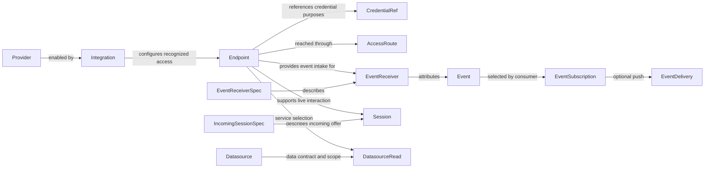

# 23 — Connectors domain language: proposal for review

**Status: analysis complete for review; proposed decisions, not approved design or implementation authority.**

The requested outcome is a vocabulary that a CLI developer can understand and that remains consistent across configured accounts, discovered services, inbound events, and live sessions. This document is the review deliverable for `story:reconcile-connectors-domain-language`. It replaces that story's initial naming table as the current proposal, including the corrections below. It does not authorize the story's implementation or the subsequent discovery story.

The central recommendation is **one Endpoint reference for selecting a provider account or service interface**. Provider defines its capabilities; Integration enables the provider; Endpoint identifies the particular access context. EventReceiver identifies event collection, and Session identifies a live interaction. A network address, credential, consumer subscription, and socket listener each have different responsibilities.

## Evidence and limits

The Connectors source baseline is commit **`62b1014551cd2b75f89df946b63e62b41a084199`**, before this session's naming edits. Source links below are pinned to that commit. This baseline already contains earlier endpoint/discovery work; it is not a claim about the released binary. Earlier uncommitted implementation, including the interrupted naming changes, is excluded as design evidence and remains preserved. No code, configuration, ESS model, contract, provider declaration, or generated output is changed by this analysis.

The source investigation accounts for all nine declared ESS domains, all 44 crate packages, the provider declaration inventory, and the named execution paths below. An inventory entry means the concept was accounted for, not that every implementation line or vendor schema was audited. **Observed** means supported by inspected source. **Proposed** means a recommendation requiring review. **Declared only** means a schema or design describes a capability whose general runtime implementation was not established. None of the scenario walkthroughs is a live acceptance test.

The predecessor Flux source was read locally at `59efd5b1d7ae69641a862f353d906ac622d64fbd`; the three inspected files were clean. Its endpoint registry combines configured and discovered references, keeps credentials as references, and resolves them separately. Its Kubernetes discovery advertises a cluster endpoint per context. These are useful precedents for the requested experience, not an instruction to adopt its plugin runtime or every naming choice. References: `crates/flux-capabilities/src/endpoint/{mod,broker}.rs` and `plugins/kubernetes/src/main.rs` in that read-only checkout.

### What a CLI developer would select

This is the proposed meaning of the inputs, not a claim that these command shapes ship today.

| Intent | Selection | Why the references are different |
| --- | --- | --- |
| Call Slack as one of two configured bots | `operation_ref` + that bot's `endpoint_ref` | What to do, and through which account |
| Query a configured or discovered database | Query operation + database interface's `endpoint_ref` | The same target-selection rule as Slack; source credentials/routes resolve behind it |
| Start Slack/ARI event collection | `endpoint_ref` + provider-qualified EventReceiverSpec name/configuration | Which account/interface, and which declared event intake; returns `event_receiver_ref` for that collector |
| Read or replay events | Receiver/consumer selection and cursor, or `event_ref` | Which retained stream/occurrence to read; no new provider account is selected |
| Read namespaced/project data | `datasource_ref` + `endpoint_ref` + typed scope | Which data contract, through which account/cluster, restricted to which data |
| Accept, inspect or end a live call | `session_ref` | A particular live interaction already attributed to an Endpoint |
| Configure or repair an account | Integration/auth profile and a SetupSession; existing `endpoint_ref` when repairing | Setup is temporary; the resulting Endpoint is the durable selection |

Choosing `--target local` or hosted selects the Connectors deployment around any of these actions. It does not select an account, cluster, receiver or call. The user never needs a backend, driver or instance reference to choose the provider target.

## 1. What is wrong with the current vocabulary

| Observed collision | Source evidence | Consequence for the proposal |
| --- | --- | --- |
| Connection and Endpoint both select an invocation target. | Operation v4 accepts either field; the CLI exposes both groups. [S01], [S02] | Unify the selection role, including configured targets. Renaming only discovered objects does not solve it. |
| Instance is both a configured account and a credential-address component. | Slack creates `connection:slack:{instance_id}`; credential references also contain an optional instance coordinate. [S03], [S04] | Remove Instance as a second public account identity. Preserve existing credential locations through an explicit mapping. |
| Endpoint currently requires Kubernetes resource details. | Namespace, UID, port, source, and Kubernetes secret references are embedded in its generic type. [S05] | The generic target cannot require those fields for Slack, local audio, or a generated service. |
| ChannelBinding includes both events and incoming sessions. | Its transport enum includes `Session`, with a separate `SessionBinding` carrying driver/capability facts. [S06] | **The initial blanket rename to EventReceiver was incorrect.** Separate event and incoming-session declarations. |
| Subscription both starts a producer and names consumer delivery. | Event v2 subscribe constructs a producer and Channel; the design separately describes consumer subscriptions. [S07], [S08], [S09] | Name the current producer action as receiver management. Reserve EventSubscription for consumer selection. |
| Binding is not always another spelling of target. | Jira binds a project and identity; Kubernetes binds a namespace; GitLab binds projects and credential generations. [S10], [S11], [S12] | **Deleting bindings without preserving data scope would lose behavior.** Separate endpoint selection from typed datasource scope. |
| Voice exposes several synthetic IDs for one live interaction. | The SIP driver mints call/session/channel together; controls use a separate execution reference. [S13], [S14] | Use Session as the neutral control identity. Keep real native protocol identifiers at their boundaries. |
| Endpoint also means a URL, callback, or serving socket. | Setup completion and voice destination fields use the word for addresses. [S15], [S16] | Use address/URL/destination when the value is an address. Do not create an Endpoint entity for every URL. |
| Comments and declarations sometimes describe more than the runtime implements. | Inbound spec comments say Connectors has no runtime, while runtime code owns sockets and durable reads; hosted routes do not expose a general provider webhook receiver. [S06], [S08], [S17] | State declared and implemented support separately. Names must not imply missing behavior is present. |

## 2. Complete domain inventory and proposed ownership

An ESS namespace groups specification ownership; it is not an additional user-facing entity. The following covers every namespace declared in the baseline [S18]. No ESS changes are part of this review.

| Existing ESS domain | Concepts it contains | Proposed disposition |
| --- | --- | --- |
| `connectors.catalog` | Provider, Operation, Catalog; services, auth and event declarations | Keep. Give source definitions and runtime instances distinct names. EventReceiverSpec and IncomingSessionSpec are catalog declarations. |
| `connectors.deployment` | Integration, Credential and deployment configuration | Keep. Integration configures provider enablement; credential custody is separate from endpoint identity. |
| `connectors.connection` | Connection, Channel, ConnectSession, candidate and observation | Merge the target portion into `connectors.endpoint`; place EventReceiver under event, SetupSession with endpoint setup, and discovery observations with inventory. Do not retain a second Connection entity. |
| `connectors.endpoint` | Discovered Endpoint and Kubernetes resolution values | Make this the shared Endpoint home. Keep source-specific observations and resolution values typed and qualified. |
| `connectors.event` | Event, Webhook, Subscription, Delivery | Keep the event domain; distinguish event receiver, webhook registration, consumer subscription and delivery. Some existing entities are declared only. |
| `connectors.runtime` | Grant, audit, invocation/session results, rate/auth facts, Proxy and SIP result | Keep runtime authority and execution. Correct the distinction between Session identity and invocation correlation. Raw proxy remains a deferred capability. |
| `connectors.inventory` | Kubernetes namespace/workload observations | Keep observations here. They are views of external resources, not Connectors-owned Kubernetes entities. |
| `connectors.target` | Local/hosted CLI Target | Qualify as DeploymentTarget. It chooses the Connectors deployment, not the external Endpoint. |
| `connectors.gitlab` | External pipeline schedule request/response values | Keep qualified provider payloads. A naming reconciliation does not rename GitLab's fields or resources. |

Datasource, audio, browser, Git fetch, credential leases and native service composition also have typed Rust/protocol homes even where ESS coverage is incomplete. Their absence from the ESS entity list does not remove them from this analysis.

### Implementation ownership inventory

All crate names below are current names, not an instruction to rename package identities. Driver, adapter, backend, factory, and store are implementation roles. Their existence does not justify extra public references.

| Current owning crates | Responsibility accounted for |
| --- | --- |
| `connector-spec`, `catalog`, `catalog-build`, `catalog-reader`, `catalog-cli` | Source declarations, compilation, provider catalog, projections and maintenance CLI |
| `connector-address`, `connector-resolve` | Public/credential addresses, request composition, event planning and credential placement |
| `connector-oauth`, `connect-session-transport`, `identity-http` | Upstream credential acquisition, setup callbacks and caller-identity boundary adapters |
| `connector-secrets`, `hosted-secrets`, `hosted-vault`, `subscription-custody` | Credential custody, external secret access and bounded credential leases |
| `connector-state`, `hosted-state`, `state-sqlite` | Durable storage ports and adapters; not target identity owners |
| `domain`, `protocol`, `service`, `server` | Domain values/authority, wire contracts, application ports, HTTP/local/MCP frontends |
| `connectors-config`, `connectors-client`, `connectors-cli`, `connectors-console`, `connectors-runtime` | Configuration, clients, presentation, daemon and composition |
| `integration-catalog`, `integration-gitlab`, `integration-jira`, `integration-slack` | Catalog-backed and specialized provider runtimes, configured identities, live reads and Slack intake |
| `integration-kubernetes`, `integration-monitoring`, `monitoring-model` | Discovery, resource reads, source-mediated access and monitoring models |
| `integration-platform`, `integration-mcp` | Built-in/generated service access and reviewed outbound MCP services |
| `integration-sip`, `driver-sip`, `voice-runtime`, `voice-local-audio`, `rtvbp-voice-endpoint` | SIP, neutral session composition, local media and RTVBP boundary |
| `driver-audio`, `driver-cdp`, `driver-speech`, `driver-sql` | Device, browser, speech and database execution |

The closed admitted driver vocabulary currently lists HTTP, SIP, audio, CDP and SQL [S19]. A speech helper crate or MCP backend does not establish an additional catalog driver token. No AMI or FastAGI driver was found in this inventory.

### Provider declaration inventory

The baseline contains 65 provider TOML files. Their file keys are listed here so that “all domains” cannot be mistaken for “only the handful of example integrations.” They contribute instances of the Provider vocabulary, not 65 additional generic domain models. Presence in this list does not establish configured readiness or live verification.

`airtable`, `alertmanager`, `algolia`, `anthropic`, `argocd`, `asana`, `asterisk`, `b10x`, `babelforce`, `bitbucket`, `box`, `calendly`, `claude-code`, `clickup`, `cloudflare`, `confluence`, `contentful`, `datadog`, `discord`, `docusign`, `dropbox`, `figma`, `fly`, `freshdesk`, `front`, `github`, `gitlab`, `google`, `grafana`, `hubspot`, `intercom`, `jira`, `klaviyo`, `launchdarkly`, `loki`, `mailchimp`, `microsoft_graph`, `miro`, `mysql`, `newrelic`, `notion`, `okta`, `openai`, `openrouter`, `pagerduty`, `postgresql`, `postmark`, `prometheus`, `resend`, `runpod`, `salesforce`, `sendgrid`, `sentry`, `shopify`, `slack`, `statuspage`, `stripe`, `supabase`, `trello`, `twilio`, `typeform`, `vercel`, `webflow`, `zendesk`, `zoom`.

Kubernetes and generated/platform services also have runtime-owned capability surfaces; provider TOML filenames alone do not enumerate all runtime backends. The crate inventory accounts for these separately.

There are five concrete intake declarations: Slack socket and Events API webhook, Twilio message-status and call-status webhooks, and Asterisk ARI socket events. The declaration grammar additionally admits polling and sessions, but no provider TOML in this baseline selects either of those two forms. A schema accepting a form does not establish a configured receiver or a working driver. [S47], [S39], [S48]

## 3. Proposed glossary

The definitions below are normative **within the proposal**, not assertions that the baseline already behaves this way. A reference selects a particular thing; a spec describes a kind of thing; an address says where traffic goes. Avoid unqualified `binding`, `target`, `scope`, `channel`, or `session` when the surrounding type cannot disambiguate them.

### Catalog and deployment

| Term | Meaning and identity | Why this name / disposition |
| --- | --- | --- |
| **Connectors** | The product and its deployment/runtime | Avoid singular Connector as another runtime entity beside Provider and Integration. |
| **Provider** / `provider_ref` | A catalog-defined capability and authentication surface with a permanent authority | Keep: applies to SaaS vendors, SQL services, devices and built-in services. Vendor would exclude the latter. [S20] |
| **ProviderDefinition** | Authored specification plus reviewed declaration/overlay, compiled into the catalog Provider | Distinguishes source from compiled form without making Connector and Provider sound like two integrations. Current `connector-spec::Connector` fills this source role. |
| **CatalogService** | A provider's named grouping/base-address and credential context | Qualify Service. It is not a Kubernetes Service or a deployed backend process. |
| **Operation** / `operation_ref` | One declared callable capability with schemas, effects and admission facts | Keep. It identifies what to do; endpoint_ref identifies through which access context. |
| **EventType** | A provider's declared kind of event, with its native payload contract | Distinguishes a declaration from an Event occurrence. Existing catalog `Event`/source `EventDecl` have this role. [S21] |
| **Catalog**, generation, provenance, source specification, overlay | The served definitions and the evidence/build inputs producing them | Keep and qualify generations. A catalog generation is not a credential generation. |
| **CatalogRole**, **CatalogTag**, **CatalogAudience** | Service/discovery metadata and curation | Qualify these source `Role`/`Tag`/`Audience` concepts; they do not confer caller roles, Grant authority, or an Identity token audience. |
| **ProviderAddress**, **CatalogServiceAddress**, **OperationAddress** | Structured catalog addresses currently named `Pid`, `Gid`, `Oip` | Expand opaque abbreviations in implementation vocabulary while preserving the permanent rendered addresses and vendor API-version semantics. They address definitions, not configured Endpoints. [S49] |
| **Integration** / `integration_ref` | Configured enablement of a Provider in a deployment/tenant, including shared registration, defaults and policy | Keep. Account is too narrow; endpoint would confuse enablement with a particular access context. [S20], [S22] |
| **AuthProfile** | Declared authentication/setup mode and credential requirements | A profile is a type of setup, not another account. Separate deployment/workspace profiles by qualification. |
| **DeploymentTarget** | The CLI's local or hosted Connectors destination | Keep existing `--target` wording qualified in help. Do not require users to confuse it with an operation target. [S02], [S18] |

### External access and discovery

| Term | Meaning and identity | Why this name / disposition |
| --- | --- | --- |
| **Endpoint** / `endpoint_ref` | One independently addressable provider access context: a service interface, account/installation identity, device, or built-in service, under a specific ownership boundary | Recommended unification of durable Connection and discovered Endpoint. It need not be a URL or currently reachable. Detailed identity rules are D1. |
| **Endpoint label** | Human-readable name and purpose | A label may change and is not authority. It cannot silently disambiguate duplicate refs. |
| **Connection** | A real transport connection, such as TCP/TLS/WebSocket or a database connection | Retain this ordinary technical meaning internally. Retire it as a second public provider-account entity. |
| **Instance** | No separate public target concept | Slack's configured instance becomes an Endpoint configuration. Legacy credential-address instance coordinates remain bounded storage compatibility, not alternate invocation selectors. |
| **AccessRoute** | Reviewed policy for reaching an Endpoint directly or through another Endpoint | It belongs to endpoint resolution, not target identity. A resolved IP, tunnel and socket are temporary execution details. [S23] |
| **EndpointResolution** | The process/result that checks identity, route and current credential references for use | An internal runtime value, never a second public target record or an exported secret-bearing description. |
| **Discovery source** | The role an Endpoint plays when it observes other resources | Use `source_endpoint_ref` where it references an Endpoint. A kubeconfig context is qualified source configuration, not a global selected-context singleton. |
| **Resource**, **Host**, **Kubernetes context** | External provenance and inventory: object, machine/location, and cluster access configuration | Keep qualified names. A Resource or Host can expose several Endpoints; discovery does not create a generic host registry. |
| **DiscoveryObservation**, **EndpointCandidate** | Internal evidence and a proposed interpretation when recognition needs review | Keep only where those responsibilities exist. Neither is another mandatory public registration identity. |
| **Endpoint configuration** | Nonsecret provider interpretation, credential references and route policy | Prefer this meaning over a generic public Binding entity. Existing EndpointBinding is configuration, not a second service selector. |
| **Endpoint readiness** | Observed recognition, credentials and reachability facts | Separate from lifecycle and current caller authorization. Unknown/unsupported discovery records remain visible where inventory access is permitted. |

### Credentials, authority and setup

| Term | Meaning and identity | Why this name / disposition |
| --- | --- | --- |
| **Credential**, **CredentialRef** | Secret material and its custody lookup address, respectively | Neither identifies the invocation target. One Endpoint can use several credential purposes; an Integration can also hold shared registration credentials. [S04], [S20] |
| **CredentialSpec**, **CredentialCapabilityEvidence** | Declaration of credential purpose/acquisition/placement/subject; observed evidence of the scopes and installation context actually granted | Catalog `Credential` is a declaration with no secret, so qualify it as CredentialSpec. Capability evidence is tied to the observed credential generation; it is not requested scopes or a Grant. [S50], [S20] |
| **SetupSession** / `setup_session_ref` | Temporary, owner-bound acquisition or repair of authentication for an Endpoint or Integration setup | Replaces ConnectSession. AuthenticationSession could be confused with caller login; ConnectionSession would preserve the original ambiguity. [S15] |
| **Setup completion address/URL** | The one-use input location for a pending SetupSession | Not a durable Endpoint. Preserve whether the location is a Unix socket or a browser URL. |
| **CredentialLease** | Bounded authority to use a selected credential purpose for an admitted attempt | Replaces ambiguous subscription lease wording. Paid-service subscription remains the upstream account entitlement. [S24] |
| **Principal**, **Actor**, **Endpoint owner**, **Credential subject**, **Tenant** | Authenticated caller; delegated actor; owner of the access context; identity the provider observes; tenancy boundary | Preserve all five distinctions. Rename `ConnectionActor` according to its documented app/user subject role rather than conflating it with caller Actor. [S25], [S26] |
| **Grant** / `grant_ref` | Permission for one Endpoint/provider and selected operations/events | Separate from credential presence, initiator policy, and Identity route-family scopes. [S27] |
| **InitiationPolicy** | Whether Connectors, the provider, or both may begin an interaction | Different from network connection direction and read/write effect. |
| **Approval**, **Redemption**, **Audit** | Per-action consent, controlled consumption of evidence/capability, and recorded security outcome | Keep distinct. An approval is not a permanent Grant; an audit receipt is not a Session. |
| **Description reference**, **authority revision**, **credential generation** | Freshness/correlation values for their named owner | Keep qualified. They may invalidate use without changing Endpoint identity. |
| **Authentication remediation** | A workflow using existing setup/credential state | No new durable Remediation entity merely to rename an authentication-required response. |

### Events and live interactions

| Term | Meaning and identity | Why this name / disposition |
| --- | --- | --- |
| **EventReceiverSpec** | Provider declaration of event intake: event set, transport, verification, normalization and optional reply composition | Event-related portion of ChannelBinding. A spec is not a running receiver. [S06], [S21] |
| **EventReceiver** / `event_receiver_ref` | Supervised event collection for one Endpoint, receiver spec and source partition/configuration | EventListener would wrongly imply a listening socket and collide with listener APIs. It covers outgoing Socket Mode connections and polling as well as webhooks. |
| **IncomingSessionSpec** | Provider declaration of an offered live session, including driver/capability requirements | Session-related portion of ChannelBinding/SessionBinding. This is a declaration, not an extra runtime entity or Handler. |
| **Listener** | Deployment-owned network acceptor with protocol, bind address and lifecycle | A socket responsibility. One listener can serve several logical receivers or session routes; no independent generic listener_ref is justified. [S28] |
| **Handler** | Code invoked to process a request, event or session | Not a configurable domain object or a public handler_ref. |
| **Webhook receiver**, **WebhookRegistrationSpec**, **WebhookRegistration** | EventReceiver using HTTP callbacks; declaration of upstream register/list/unregister operations; the actual provider-side registration where one exists | Current source `Subscription` describes setup operations and should become WebhookRegistrationSpec, not a runtime subscription record. No registration entity is needed for a per-request callback URL. [S51] |
| **Event** / `event_ref` | Retained normalized occurrence attributed to an Endpoint and source, with native or polled provenance | Its EventType is the kind; its native delivery ID is deduplication evidence, not another Connectors event identity. |
| **EventSubscription** | A consumer-owned selection and reading position for events | Consumer responsibility. Do not call starting a shared provider receiver a consumer subscription. Plain stateless receive requests need no persisted subscription object. |
| **EventDelivery**, **DeliveryAttempt**, **DeliveryDestination** | Delivery of one event to a configured consumer; a retry attempt; reviewed destination configuration | Qualifies platform delivery versus a vendor's delivery ID. Does not add a second provider Endpoint selector. Detailed lifecycle is D4. |
| **Cursor**, **Replay**, **Acknowledgement**, **Reply** | Reading/checkpoint position; reread retained occurrence; provider receipt; a separately admitted business action | None is another word for the others. An ACK must not imply a Slack message or other business reply. |
| **Session** / `session_ref` | One live interaction with independent lifetime and control, attributed to an Endpoint | Neutral control identity for voice/browser/other supported sessions. SetupSession, GitFetchSession and credential leases remain explicitly qualified responsibilities. |
| **Participant**, **Media**, **SessionSignal** | A party in a live interaction, its media, and neutral controls such as DTMF | Current neutral ChannelSignal becomes SessionSignal. Native SIP/ARI channel and call identifiers retain their protocol meaning. |
| **VoiceSessionDestination** | Reviewed local-audio or application destination configuration for carrying a Session's media | Replaces VoiceApplicationRoute. It describes where the session is handled; it does not create an Application or Handler entity. |
| **Invocation**, **Execution**, **Result** | One operation request/attempt, its runtime processing, and outcome | Do not rename every execution reference to session_ref. Only references actually controlling the live Session need that reconciliation. |

### Data and implementation roles

| Term | Meaning and identity | Why this name / disposition |
| --- | --- | --- |
| **Datasource** / `datasource_ref` | A live read contract with record/key schemas and supported verbs | What data to read. Endpoint selects through which service/account; datasource scope selects the relevant namespace/project. [S29] |
| **Datasource scope** | Typed selection within an Endpoint, such as a namespace or project | A value validated by the datasource contract, not an alternative service identity. D5 preserves existing binding semantics. |
| **DatasourceBinding** | Descriptive association of datasource, Endpoint, scope and freshness | May remain an internal/view type. Its old opaque binding_ref must not be the only way to choose a service. |
| **Record**, **Projection**, **Page**, **Completeness** | Data result and presentation semantics | Keep. A live datasource does not imply an indexing or synchronization product. |
| **Driver**, **Adapter**, **Backend** | Protocol execution; translation at a boundary; implementation of an application port | Keep. They are code roles, not user accounts or selection refs. [S19], [S30] |
| **InteractionShape**, **Transport**, **ExecutionPlacement**, **HostCapability** | Lifetime shape; byte carriage; where execution runs; required host ability | Qualify runtime Placement/Capability. They differ from CredentialPlacement and credential scope evidence. A session is not a transport; a subscription-shaped interaction does not prove a durable EventSubscription exists. [S19], [S50] |
| **ServiceManifest**, **ServiceDeployment**, **ServiceFactory**, **ServiceBundle**, **Module** | Generated service declaration, deployment policy, construction and runtime packaging | Keep qualified implementation meanings. Their invocation Endpoint uses the same target concept as other services. [S31] |
| **Daemon**, **Supervisor**, **StateStore**, **EventStore**, **Journal** | Process ownership, task supervision, durable state/events and recorded changes | Keep. Storage keys and runtime handles are not additional public domain entities. |
| **CLI**, **Console**, **Client**, **HTTP/MCP frontend** | Presentation and transport boundaries | Keep. An MCP transport session ID or HTTP route is not a provider Endpoint or voice Session identity. |
| **GitFetchSession**, **Git source**, **locator**, **SessionAuthority** | Bounded repository acquisition, configured byte source, its URL, and admission proof | Keep qualified; endpoint_ref selects the provider account while repository/ref/commit remain request data. [S32], [S33] |
| **Proxy** | A proposed raw passthrough capability, distinct from reviewed mediated access | Declared in the model but deferred; do not expose it under Endpoint as a naming side effect. [S09] |

## 4. Relationships, ownership and identity

This diagram shows conceptual references, not deletion cascades or new storage tables. The following table specifies the ownership rules separately.

| Relation | Proposed multiplicity and ownership | Basis and failure/deletion meaning |
| --- | --- | --- |
| Integration → Provider | Exactly one Provider per Integration; a Provider can have several deployments/integrations | Existing enablement role. Shared application registration is Integration configuration. [S20], [S22] |
| Recognized Endpoint → Integration/Provider | Exactly one owning integration association/provider contract for a selected access context; an Integration can have zero or many Endpoints | Existing multiple-account meaning. Discovery with no recognized provider has no fabricated integration association. Generated services can have an implicit deployment-owned association. |
| Endpoint → owner | Exactly one tenant-shared or principal-owned access boundary | Existing ConnectionScope and source principal policy. Copying the same address across ownership boundaries does not merge authority. [S25], [S34] |
| Endpoint → credential references | Zero or many, each with a declared purpose; shared registration credentials can belong to Integration | Credential storage is not lifetime-owned by one Endpoint merely because it references a secret. Removing an Endpoint does not delete shared credentials. |
| Discovered Endpoint → discovery source | One source Endpoint for each source-qualified observation identity; one source can expose many Endpoints | Existing source-qualified UID construction. Independent sources are not automatically coalesced into a global identity. [S05], [S35] |
| Endpoint → AccessRoute | One selected reviewed route policy; direct has no parent, mediated references exactly one immediate parent Endpoint | The existing enum establishes the cardinality that ESS left unspecified. Parent may serve many targets. Forbid cycles; no authority inheritance. [S23] |
| Endpoint → EventReceiver | Zero or many; each receiver references exactly one Endpoint and spec plus any source partition/configuration | Spec and partition distinguish independent streams. Credential/Grant revisions do not form receiver identity. A shared physical socket is an implementation detail. |
| EventReceiver → Event | A receiver is the recorded ingestion provenance; it can produce many Events | Retention belongs to EventStore policy. Stopping/removing a receiver does not erase retained events or change their refs. Cross-transport deduplication is D4. |
| Consumer → EventSubscription | A consumer owns zero or many selections; a selection can cover several admitted receivers/endpoints | Proposed consumer responsibility from existing design. Stopping a consumer does not stop a separately configured shared receiver. |
| EventSubscription → EventDelivery | Zero or many logical deliveries for push; each delivery refers to one retained Event and destination; retries are attempts | Planned capability, not a claim of a current generic delivery worker. Event retention and delivery retention are explicit policies, not cascading entity deletion. |
| Endpoint → Session | Zero or many Sessions; each admitted Session has exactly one endpoint attribution and controlling principal | Endpoint revocation triggers session authority handling; an event or participant cannot change its endpoint by assertion. Session history follows retention. |
| SetupSession → result | One setup purpose/owner; completion yields at most one Endpoint reference or repairs its configured authentication | Existing one-time result and lifecycle. Setup failure/expiry does not delete an existing repaired Endpoint. [S15] |
| Datasource ↔ Endpoint | Many-to-many association, further narrowed by typed scope | Current Jira/GitLab/Kubernetes bindings prove multiple scopes on one Endpoint. Do not turn every namespace/project into a new account Endpoint. |

Disabling an Integration refuses new use of its Endpoints and receiver/session activity under that policy. Removing a source makes dependent observations stale/unresolvable; it does not silently redirect them elsewhere. Historical audit/events keep their original references. Physical deletion/cascade mechanics need a later reviewed migration design; the naming proposal fixes the ownership and retention boundary rather than inventing a storage algorithm.

## 5. Resolution of the previously open questions

Each entry gives a concrete recommendation. **Resolved in analysis** means a proposed answer is now written and justified; it does not mean the operator approved it.

### D1 — What precisely is one Endpoint?

**Recommendation:** an Endpoint identifies a selected provider access context within its ownership boundary, not just a host or URL. Independently addressable external subjects or service interfaces are different Endpoints. Authentication repair, token rotation, label changes, IP changes and tunnel recreation preserve identity. Recognition/readiness and current permissions are separate facts.

For Slack, two bot installations/accounts have different refs; a personal user and a bot remain different refs even in the same workspace. The *same* bot identity using HTTP operations and an Events API or Socket Mode receiver has one Endpoint. Extra credential purposes do not create extra Endpoints. Current Slack's `operations` flag restricts operation publication to one configured instance; supporting both explicitly selected refs would be a behavioral correction, not a spelling change. [S03], [S36]

“Same” here means the same configured access context, not automatic deduplication by external account ID. Two explicitly configured records can intentionally use the same upstream account under distinct reviewed access profiles; they retain separate refs until an explicit equivalence/migration decision. Conversely, adding another Grant or another credential purpose to one record does not itself create an Endpoint. Provider, subject or ownership changes that substitute a different access context require an explicit new identity/mapping, not a credential-refresh operation.

For Kubernetes, the context-bound API access is an Endpoint; each discovered service interface has its own Endpoint. Two contexts with equal namespace/resource names remain addressable independently. The context name is a lookup convenience over source identity, not permission to replace a source behind existing refs. Service replacement with a new UID changes the discovered identity. Treat an interface's identity separately from its current connection address; no credential bytes or current Grant digest belong in the identity. [S35], [S37]

The requested `k8s/<namespace>/<crossplane-ref>` can be a lookup shorthand for an Endpoint. It is not another entity or permission boundary. It resolves only when the resource/interface choice is unambiguous across the admitted contexts; otherwise the user gets the canonical endpoint_ref choices. This analysis fixes that meaning without prescribing the second story's encoded reference grammar.

Unknown interfaces may have an endpoint_ref and provenance without a recognized Provider or executable operations. A raw host or callback URL does not automatically become an Endpoint. A custody-only connected account may have an Endpoint while exposing only custody/lease capabilities; a shared OAuth client secret is Integration configuration, not an account by itself.

**Alternative rejected:** Endpoint means URL, while Connection means identity. That would retain two necessary selectors for the user's Slack and discovered-service cases. **Limitation made explicit:** two observations of the same physical service are not automatically merged. Alias/equivalence needs evidence and an explicit mapping, not hostname equality.

### D2 — Endpoint ownership and mediated routes

**Source resolution:** `ConnectionRoute::ViaConnection` has one parent field; its constructor rejects a self-cycle. The parent is a transport reference, not a second owner or a source of inherited target grants. A parent can carry several target connections. Thus the previously unspecified immediate-parent cardinality is **zero for direct, one for mediated**. [S23]

**Recommendation:** preserve that cardinality as AccessRoute policy while resolving current addresses and credentials on use. Do not add a collection of competing route identities to solve a naming problem. A discovery source and a route parent are different roles even when the same Kubernetes Endpoint fills both. A directly reachable discovered database can retain Kubernetes provenance without forcing all traffic through Kubernetes.

Integration, tenant/principal ownership, and source provenance must remain explicit. Losing source access makes a discovered target unavailable; it does not authorize use of another account or a different context. Refresh/replacement is evidence handling, not a new target-registration ceremony.

### D3 — Channel, event receiver, listener, and incoming session

**Source resolution:** current ChannelBinding is a tagged union of event intake and incoming session declarations. Its blanket replacement by EventReceiver would be false for SIP. [S06]

**Recommendation:** EventReceiverSpec describes webhook/socket/poll event intake; IncomingSessionSpec describes provider-initiated live interaction. Runtime event collection is EventReceiver; accepted or offered live interaction is Session. A Listener is deployment configuration plus the socket owner, and a Handler is implementation code. No EventListener, SessionReceiver, Handler registry, or generic listener_ref is introduced.

This keeps direction independent from transport: Slack Socket Mode connects outward to receive events; polling initiates an operation to synthesize events; an HTTP listener accepts webhook requests; a SIP listener handles offers for session admission. A SIP status event can flow through an EventReceiver, but receiving that event does not accept or own the live call.

**Alternative rejected:** one generic Channel/InboundHandler for both. It hides the difference between acknowledging an occurrence and accepting a resource-consuming live session. **Correction to the earlier story:** Session is not a fourth event transport.

### D4 — Event subscriptions, delivery, partitions, and lifecycle

**Source resolution:** event v2 subscription currently owns an endpoint producer and its Channel, and includes owner/parameters/authority digest in the ID. The event v1 consumer reads by Channel and cursor. A generic durable consumer subscription and signed push delivery are described in the design but are not established by those methods. [S07], [S08], [S09]

**Recommendation:** starting/stopping the producer manages an EventReceiver. The receiver's logical identity is Endpoint + receiver spec + source partition/intake configuration; a stored opaque ID survives reconnect, credentials and permission revisions. Intake configuration changes that select a different source stream are explicit receiver reconfiguration/replacement, not a silent continuation of the old cursor. Shared physical transports do not merge logical ownership.

Receiver lifecycle is independently supervised: starting, running, reconnecting/degraded, stopped. Desired configuration and checkpoint survive restart where durable intake is supported; restoring them rechecks authority. Poll checkpoints advance together with retained events. Current platform polling mutates memory before persisting, so a failure-safe checkpoint claim needs implementation verification later. [S38]

Consumer EventSubscription selects admitted endpoints/receivers/event types with its own cursor. It can be active, paused or closed; closing it does not delete Events or disable another consumer's intake. Stateless receive/replay stays available without creating an artificial subscription object. A future push subscription uses reviewed DeliveryDestination configuration. Logical EventDelivery goes pending → delivered or failed/expired, with bounded retry attempts; replay remains a separate explicit action and never re-executes the originating provider action. These are proposed lifecycle meanings for existing design concepts, not claims that this worker exists.

Preserve native source partition/generation/sequence semantics. Native deduplication keys must include the endpoint and upstream namespace appropriate to the provider. A Slack native event delivered through both socket and webhook should yield one retained occurrence for the same Endpoint, with the first accepted receiver as ingestion provenance; a native event ID from another Endpoint cannot suppress it. No exactly-once claim is made. Twilio MessageSid identifies a message, not a status-callback delivery; different status changes must remain events. [S39]

Persist an admitted retained event before the provider acknowledgement when the protocol supports that guarantee. Slack's current Socket Mode path orders append before ACK. Business replies are separately granted operations using endpoint_ref and provider-native payload identifiers. Replaying an event does not implicitly send its reply. [S40]

### D5 — Datasource binding and service selection

**Source resolution:** current binding_ref combines service identity with data scope, sometimes also credential generation. In Kubernetes it can identify only the namespace and omit the connection entirely; in Jira it combines a project and user/organization access. It therefore cannot be replaced by endpoint_ref without another way to retain the scope. [S10], [S11], [S12], [S29]

**Recommendation:** a read names **datasource_ref + endpoint_ref + typed datasource scope**, plus the existing freshness evidence. The definition describes valid scope values; for workload reads it includes namespace, for project-bound reads it includes project identity. Scope-free definitions use their declared whole-endpoint scope. Do not silently interpret an omitted namespace as all namespaces. Scope is data selection, not a generic untyped metadata bag or a second service reference.

Datasource binding discovery may return descriptive associations with endpoint_ref, scope, purpose and readiness. Legacy opaque binding refs need a versioned translation preserving their exact scope; they are not alternate target selectors in the proposed current interface. Do not create a public datasource_scope_ref merely to replace one opaque ref with another.

**Alternative rejected:** one Endpoint per project/namespace. That turns data selection into duplicated accounts and grants. **Behavioral delta:** removing hidden service selection from bindings and adding typed scope requires a contract redesign, not a field rename. Live datasource reads remain live; this introduces no index.

### D6 — Voice call/session/channel and destination

**Source resolution:** the current SIP driver generates three synthetic refs from one sequence. The neutral descriptor copies them into the voice protocol, while SessionStatus is keyed by execution_ref. These are distinct bytes without distinct demonstrated neutral lifecycles. Real SIP Call-ID is a protocol concern. [S13], [S14], [S41]

**Recommendation:** the controllable live interaction has session_ref, endpoint_ref and participant context. One operation invocation may establish a Session; invocation/audit correlation remains separate. Native SIP call-leg/dialog IDs and ARI channel IDs stay native, and an RTVBP media channel stays local to that protocol binding. Audio `channels` remains a numeric media property. DTMF at the neutral layer is SessionSignal.

Separately selectable SIP trunks become Endpoints. Dialed numbers and remote party data remain invocation inputs. Current SIP aliases select routes beneath one Connection, so migration must distinguish `(old connection, trunk alias)` and refuse ambiguity; it cannot duplicate a broad Grant silently. [S42]

VoiceSessionDestination describes local audio or a configured application media destination. Its URL/audience/resource are destination configuration, not a competing public Session or provider-account ref. An application independently exposed as a catalog service may have its own Endpoint, but merely forwarding media to a URL does not create one. Configuring a destination does not select incoming answer behavior.

**Alternative rejected:** retaining synthetic Call and Channel entities without independent behavior. If later call transfer/conferencing requires independently controlled legs or media bindings, that requirement must establish them rather than inheriting duplicate IDs from this implementation.

### D7 — Incoming SIP answer policy

**Observed:** production driver code establishes outbound calls; answer-side calls occur in peer fixtures. A configured SIP bind address is not evidence of incoming-call admission. [S43]

**Recommendation for review:** incoming admission produces an **offered Session** attributed to exactly one Endpoint from trusted listener/peer configuration. An authorized application or CLI explicitly accepts or rejects it; this does not require a human click. Without acceptance before the configured offer deadline, it terminates as unanswered. Provider cancellation ends an unanswered offer; remote hangup ends an established Session. Conflicting terminal/accept decisions cannot create two sessions.

Listener enablement, endpoint attribution, inbound permission, acceptance, and media destination are separate decisions. Caller-supplied From/display values are participant data, not ownership evidence. A configured destination alone never implies acceptance.

Whether to also offer **declarative auto-answer** is a later behavioral choice for the operator; it is not necessary to settle the nouns and is not required to approve the naming model. The proposed baseline is explicit application/CLI acceptance. This records a concrete default and its alternative without representing either as already approved or implemented. Incoming SIP implementation is outside this analysis.

### D8 — Lifecycle, credentials, compatibility and retained history

**Recommendation:** retain the distinction between endpoint authorization lifecycle and discovery readiness. The existing Connection ladder is Created/Authorized/Callable/Degraded/Revoked; discovered Endpoint states include unknown provider, unsupported protocol and stale. They cannot be collapsed into one Ready flag: an unknown interface need not have credentials, and an inbound-only Endpoint need not expose a callable operation. [S05], [S25]

Use **Ready** in the proposed shared endpoint lifecycle where the old name Callable meant the configured interactions were usable, with operation/event/session capabilities reported separately. For a configured access context the proposed ladder is Created → Authorized → Ready, with Degraded/Revoked handling retained; unauthenticated interfaces do not invent a credential. An observation not yet admitted/configured reports discovery readiness, not Authorized. Current caller Grant checks always occur separately. SetupSession retains Pending/Completed/Expired/Failed and its one-time completion semantics. An event receiver has its own health; a Session has its own terminal outcome.

Credential rotation preserves endpoint_ref and receiver identity but can invalidate description/capability evidence. Do not union privileges across unrelated credentials. Integration registration credentials and endpoint credentials remain separately attributable. CredentialLease is authority over a bounded use, not a new account; paid-service subscription is qualified business vocabulary.

Versioned current interfaces would use endpoint_ref consistently for operation, datasource and Git fetch target selection. Stable provider authorities, operation IDs, vendor payloads, old contract bytes, credential paths, grants, event IDs and cursors require an explicit compatibility map. Existing SessionAuthority v1 contains signed `connection_id` and `channel_kind`; this analysis recommends **preserving those external bytes behind their named legacy boundary until a separately approved version migration**, with no consumer changes. [S04], [S32], [S33]

The analysis does not allocate new wire version numbers, prescribe a storage migration algorithm or bless the interrupted edits. Those depend on approval of the model and a separate implementation plan. A clean new vocabulary is compatible with explicitly labelled historical contracts; it is not compatible with hidden target-selection fallbacks.

## 6. Scenario walkthroughs and actual support

These are model checks, not tests executed against a new binary. “Implemented” below is bounded source evidence at the baseline. Future discovery/local CLI acceptance belongs to the second story after the design review and separately authorized implementation.

| Case | Identities and flow under the proposal | What the baseline actually establishes |
| --- | --- | --- |
| Two Slack bots, or bot plus user | One Integration, distinct Endpoints; select each by endpoint_ref. Credential subject and ownership remain separate. | Multiple configured identities exist; the `operations` flag restricts which publishes operations. Both independently callable is not established. [S36] |
| Slack HTTP + Socket Mode + Events API | Same configured account Endpoint; two receiver specs/receivers if both intake methods are enabled. Native Slack channel stays payload data. | Socket Mode and durable event reads implemented; webhook declaration exists, general webhook runtime not established. [S47], [S40] |
| Rotating Slack token/shared app credential | Endpoint remains; resolve credential purpose and recheck evidence. Shared credentials do not merge endpoints. | Credential storage and profile distinctions exist. A completed reconciled migration/rotation matrix does not. [S03], [S04] |
| Configured SQL, Loki, ARI | Endpoint selects access context; Operation selects query/action; drivers resolve reachability and credential needs. | SQL driver, monitoring and catalog HTTP execution exist; uniform configured Endpoint selection does not. [S19], [S44] |
| Kubernetes with two equal resource names in different contexts | Distinct source Endpoints and source-qualified interface Endpoints. Current-context is a convenience only; ambiguous shorthand presents choices. | Safe context listing exists; startup restores only selected_context. All-context use is a gap. [S35], [S37] |
| Kubernetes Service exposing ARI and AMI | One external resource, separate interface Endpoints; only supported provider capabilities are callable. | Multiport Service inventory exists. ARI socket path exists; no AMI/FastAGI driver found. [S35], [S48] |
| Kubernetes SQL/Crossplane, current credentials | Service interface Endpoint with typed source metadata and credential references; runtime resolves current credentials/routes for admitted use. | Existing discovery/resolution code exists. The requested finished local journey, restart/rotation and release acceptance are not proven here. [S05], [S35] |
| Grafana-mediated monitoring or Kubernetes-mediated access | Target Endpoint keeps its Provider; AccessRoute references the parent transport Endpoint; permissions are independent. | Both mediated route variants are explicit. Lazy/direct route unification still needs implementation review. [S23] |
| Namespace/project datasource reads | Select datasource_ref, endpoint_ref and typed scope. Equal namespaces on two clusters are distinct through endpoint_ref. | Live list/get and scoped bindings exist; new selection shape does not. [S10], [S11], [S12], [S29] |
| ARI receiver with two Stasis applications | Same ARI Endpoint; separate configured receiver/source partitions. Native ARI channel IDs remain provider data. | Generic socket planning and a Kubernetes-owned producer path exist; universal configured-endpoint receiver management does not. [S08], [S48] |
| Twilio webhook status changes | Verified receiver attributes Endpoint and EventType; message/call identity is payload data. ACK is not a reply or call answer. | Message and call callback declarations exist, including the warning against MessageSid deduplication. Runtime wiring not established. [S39] |
| Polling, restart, cursor, replay | Receiver persists events/checkpoint; consumer advances its own cursor; replay rereads a retained Event. | Poll declaration grammar and platform-specific event polling exist; no shipped generic poll declaration/worker path was established. [S06], [S38] |
| One shared intake, two consumers | One receiver can feed two EventSubscriptions with independent positions; stopping one consumer does not stop intake. | Current generic read API is per-channel pull; v2's subscription starts a producer. Full consumer lifecycle/push queue is declared rather than implemented. [S07], [S09] |
| SIP outbound, local audio or application media | Endpoint selects trunk; invocation establishes one Session; destination determines media composition; terminate addresses that Session. | Outbound driver and both compositions exist. Synthetic IDs and alias selection remain mixed. [S13], [S16], [S42], [S43] |
| SIP incoming offer/accept/reject/timeout/hangup | Listener attributes Endpoint; offered Session waits for authorized acceptance; destination handles accepted media. | Production incoming admission is absent; peer answer fixtures are not this feature. [S43] |
| Browser, audio, speech | Local service/device Endpoint identifies access; operation-specific browser/session/device values remain qualified inputs or results. Session refers only to independently controlled interactions. | CDP/audio/speech implementations exist; they do not justify calling every byte stream a Session or network listener. [S19], [S45] |
| Git fetch | Endpoint selects Git provider identity; repository/ref/commit select content; GitFetchSession bounds byte access through its dedicated listener. | Dedicated control/data path and TLS listener exist, still with connection_ref in the provider selector. [S28], [S32] |
| MCP ingress and egress | Ingress is a frontend exposing admitted operations; an external reviewed MCP service is an Endpoint. Protocol transport session IDs stay MCP-specific. | Hosted MCP route and reviewed outbound MCP profiles exist; current profile uses connection_ref. [S17], [S46] |
| Generated native services/platform modules | Deployment binds Provider and Endpoint identity; factory/backend remains code packaging. No extra Instance selector. | Generated-service ProviderIdentity currently includes connection_ref; platform also exposes live datasources/events. [S31], [S38] |
| Custody-only paid account | Connected account access remains attributable; a CredentialLease authorizes bounded credential use. No fabricated query operation. | Dedicated custody/lease runtime exists, with its own qualified contract; it is not an event subscription. [S24] |
| Denied access, stale source, replaced resource | Refusal/readiness facts do not silently choose another Endpoint. Historical refs/cursors remain attributable. | Existing checks and source UID construction support these distinctions; the proposed cross-provider migration has not been verified. [S27], [S35] |

## 7. Review outcome and next boundary

All four previously listed unresolved areas now have proposed answers: ownership/cardinality in D1–D2 and the relationship table; voice identities in D6; event lifecycle in D3–D4; incoming SIP policy and its scope boundary in D7. Datasource scope and lifecycle/compatibility corrections are explicit in D5 and D8. No internal discussion is represented as operator approval.

The decisions for the operator and another reviewer to assess are:

1. Does **Endpoint as an access context**, including account identity and ownership, fit the intended CLI experience?
2. Are **EventReceiverSpec/EventReceiver** and **IncomingSessionSpec/Session** the right distinction, with Listener and Handler remaining implementation responsibilities?
3. Does **datasource + Endpoint + typed scope** preserve data selection without another target selector?
4. Is **one neutral Session identity**, with native protocol IDs retained at the boundary, the intended live-interaction model?

These are review questions attached to complete recommendations, not omitted design work. Declarative SIP auto-answer is explicitly outside the naming decision; explicit application/CLI acceptance is the recommended baseline for later behavioral design.

The initial story also asks for new generic intake and native incoming SIP implementation. Those are feature changes, not consequences automatically authorized by accepting names. This document grants no permission to build them. After review, the approved decisions can become specification and implementation work with its own exact contracts and migration plan. Existing interrupted code must be assessed against the approved design; its existence is not a reason to keep it.

This analysis changed only review/planning documents. It did not run live provider operations, create a release, migrate consumers or claim that code/ESS validation proves the naming choices. The implementation worktree remains uncommitted; this document is the local review handoff, not a published design amendment.

### Analysis checks and retained limitations

The document's inventory was compared with the baseline paths: all nine ESS domains, 44 crate packages and 65 provider declarations are represented. Citation targets and line anchors were checked against that exact source tree. These checks establish coverage and navigable evidence, not agreement with the recommendations.

The AEP store validation returned `valid` (exit 0), with its existing 35 historical assertion notices and 15 review-findings notices. The repository-wide Markdown link check returns exit 1 for an earlier interrupted implementation change: `contracts/connector-connection/v0alpha2/README.md:5` still links to `crates/protocol/src/connection_v2.rs`, which that work renamed. This analysis does not repair the code or claim that the repository gate passes. The tracked implementation diff and all previously untracked implementation files were checked unchanged from the start of this analysis turn.

[S01]: https://github.com/beyond10x/connectors/blob/62b1014551cd2b75f89df946b63e62b41a084199/crates/protocol/src/operation/v4.rs#L38
[S02]: https://github.com/beyond10x/connectors/blob/62b1014551cd2b75f89df946b63e62b41a084199/crates/connectors-cli/src/lib.rs#L60
[S03]: https://github.com/beyond10x/connectors/blob/62b1014551cd2b75f89df946b63e62b41a084199/crates/integration-slack/src/backend/connection_runtime.rs#L375
[S04]: https://github.com/beyond10x/connectors/blob/62b1014551cd2b75f89df946b63e62b41a084199/crates/connector-address/src/credential.rs#L98
[S05]: https://github.com/beyond10x/connectors/blob/62b1014551cd2b75f89df946b63e62b41a084199/crates/domain/src/endpoint.rs#L10
[S06]: https://github.com/beyond10x/connectors/blob/62b1014551cd2b75f89df946b63e62b41a084199/crates/connector-spec/src/inbound.rs#L56
[S07]: https://github.com/beyond10x/connectors/blob/62b1014551cd2b75f89df946b63e62b41a084199/crates/protocol/src/event/v2.rs#L33
[S08]: https://github.com/beyond10x/connectors/blob/62b1014551cd2b75f89df946b63e62b41a084199/crates/connectors-runtime/src/kubernetes_endpoint_events.rs#L183
[S09]: https://github.com/beyond10x/connectors/blob/62b1014551cd2b75f89df946b63e62b41a084199/docs/design/01-domain-model.md#L340
[S10]: https://github.com/beyond10x/connectors/blob/62b1014551cd2b75f89df946b63e62b41a084199/crates/integration-jira/src/backend/datasource.rs#L118
[S11]: https://github.com/beyond10x/connectors/blob/62b1014551cd2b75f89df946b63e62b41a084199/crates/integration-kubernetes/src/workloads.rs#L834
[S12]: https://github.com/beyond10x/connectors/blob/62b1014551cd2b75f89df946b63e62b41a084199/crates/integration-gitlab/src/backend.rs#L1659
[S13]: https://github.com/beyond10x/connectors/blob/62b1014551cd2b75f89df946b63e62b41a084199/crates/driver-sip/src/lib.rs#L233
[S14]: https://github.com/beyond10x/connectors/blob/62b1014551cd2b75f89df946b63e62b41a084199/crates/protocol/src/operation/legacy.rs#L215
[S15]: https://github.com/beyond10x/connectors/blob/62b1014551cd2b75f89df946b63e62b41a084199/crates/protocol/src/connection.rs#L259
[S16]: https://github.com/beyond10x/connectors/blob/62b1014551cd2b75f89df946b63e62b41a084199/crates/service/src/voice.rs#L19
[S17]: https://github.com/beyond10x/connectors/blob/62b1014551cd2b75f89df946b63e62b41a084199/crates/server/src/hosted/routing.rs#L145
[S18]: https://github.com/beyond10x/connectors/blob/62b1014551cd2b75f89df946b63e62b41a084199/ess/system/system.yaml#L23
[S19]: https://github.com/beyond10x/connectors/blob/62b1014551cd2b75f89df946b63e62b41a084199/crates/domain/src/plan.rs#L5
[S20]: https://github.com/beyond10x/connectors/blob/62b1014551cd2b75f89df946b63e62b41a084199/docs/design/01-domain-model.md#L109
[S21]: https://github.com/beyond10x/connectors/blob/62b1014551cd2b75f89df946b63e62b41a084199/crates/catalog/src/lib.rs#L892
[S22]: https://github.com/beyond10x/connectors/blob/62b1014551cd2b75f89df946b63e62b41a084199/crates/service/src/admin.rs#L63
[S23]: https://github.com/beyond10x/connectors/blob/62b1014551cd2b75f89df946b63e62b41a084199/crates/domain/src/connection.rs#L26
[S24]: https://github.com/beyond10x/connectors/blob/62b1014551cd2b75f89df946b63e62b41a084199/crates/subscription-custody/src/lib.rs#L175
[S25]: https://github.com/beyond10x/connectors/blob/62b1014551cd2b75f89df946b63e62b41a084199/crates/protocol/src/connection.rs#L110
[S26]: https://github.com/beyond10x/connectors/blob/62b1014551cd2b75f89df946b63e62b41a084199/crates/service/src/runtime.rs#L18
[S27]: https://github.com/beyond10x/connectors/blob/62b1014551cd2b75f89df946b63e62b41a084199/crates/domain/src/grant.rs#L132
[S28]: https://github.com/beyond10x/connectors/blob/62b1014551cd2b75f89df946b63e62b41a084199/crates/connectors-config/src/hosted.rs#L193
[S29]: https://github.com/beyond10x/connectors/blob/62b1014551cd2b75f89df946b63e62b41a084199/crates/protocol/src/datasource.rs#L81
[S30]: https://github.com/beyond10x/connectors/blob/62b1014551cd2b75f89df946b63e62b41a084199/crates/service/src/runtime.rs
[S31]: https://github.com/beyond10x/connectors/blob/62b1014551cd2b75f89df946b63e62b41a084199/crates/service/src/factory.rs#L22
[S32]: https://github.com/beyond10x/connectors/blob/62b1014551cd2b75f89df946b63e62b41a084199/crates/protocol/src/git_fetch.rs#L30
[S33]: https://github.com/beyond10x/connectors/blob/62b1014551cd2b75f89df946b63e62b41a084199/crates/service/src/authority.rs#L50
[S34]: https://github.com/beyond10x/connectors/blob/62b1014551cd2b75f89df946b63e62b41a084199/crates/integration-kubernetes/src/endpoints/composition.rs#L20
[S35]: https://github.com/beyond10x/connectors/blob/62b1014551cd2b75f89df946b63e62b41a084199/crates/integration-kubernetes/src/endpoints.rs#L541
[S36]: https://github.com/beyond10x/connectors/blob/62b1014551cd2b75f89df946b63e62b41a084199/crates/connectors-config/src/personal.rs#L299
[S37]: https://github.com/beyond10x/connectors/blob/62b1014551cd2b75f89df946b63e62b41a084199/crates/integration-kubernetes/src/local_endpoints.rs#L59
[S38]: https://github.com/beyond10x/connectors/blob/62b1014551cd2b75f89df946b63e62b41a084199/crates/integration-platform/src/work_events.rs#L113
[S39]: https://github.com/beyond10x/connectors/blob/62b1014551cd2b75f89df946b63e62b41a084199/providers/twilio.toml#L549
[S40]: https://github.com/beyond10x/connectors/blob/62b1014551cd2b75f89df946b63e62b41a084199/crates/integration-slack/src/backend/connection_runtime.rs#L835
[S41]: https://github.com/beyond10x/connectors/blob/62b1014551cd2b75f89df946b63e62b41a084199/crates/protocol/src/voice.rs#L35
[S42]: https://github.com/beyond10x/connectors/blob/62b1014551cd2b75f89df946b63e62b41a084199/crates/connectors-config/src/personal.rs#L1103
[S43]: https://github.com/beyond10x/connectors/blob/62b1014551cd2b75f89df946b63e62b41a084199/crates/driver-sip/src/lib.rs#L78
[S44]: https://github.com/beyond10x/connectors/blob/62b1014551cd2b75f89df946b63e62b41a084199/crates/connectors-runtime/src/kubernetes_endpoints.rs
[S45]: https://github.com/beyond10x/connectors/blob/62b1014551cd2b75f89df946b63e62b41a084199/crates/domain/src/audio.rs
[S46]: https://github.com/beyond10x/connectors/blob/62b1014551cd2b75f89df946b63e62b41a084199/crates/integration-mcp/src/lib.rs#L73
[S47]: https://github.com/beyond10x/connectors/blob/62b1014551cd2b75f89df946b63e62b41a084199/providers/slack.toml#L517
[S48]: https://github.com/beyond10x/connectors/blob/62b1014551cd2b75f89df946b63e62b41a084199/providers/asterisk.toml#L709
[S49]: https://github.com/beyond10x/connectors/blob/62b1014551cd2b75f89df946b63e62b41a084199/crates/connector-address/src/address.rs#L60
[S50]: https://github.com/beyond10x/connectors/blob/62b1014551cd2b75f89df946b63e62b41a084199/crates/catalog/src/lib.rs#L850
[S51]: https://github.com/beyond10x/connectors/blob/62b1014551cd2b75f89df946b63e62b41a084199/crates/connector-spec/src/inbound.rs#L394
