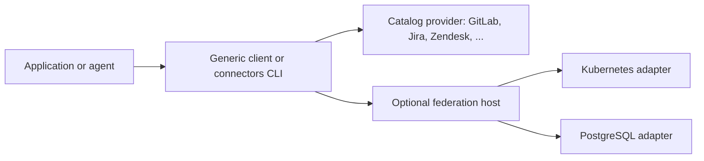

# Connectors

Connectors gives applications and agents one way to discover and use integrations. Independent
adapter services expose typed operations through shared, versioned contracts. A caller reads an
adapter's descriptor, then invokes its operations; it can call an adapter directly or reach
several through an optional federation host.

Three ideas carry the rest of this documentation:

- **Contracts describe guarantees.** Inputs and outputs are part of a contract, and so are access,
  lifecycle, partial results, retries and failures. See [Contracts and guarantees](./concepts/contracts.md).
- **Adapters own their provider.** Kubernetes selectors and PostgreSQL query rules belong to their
  adapters; shared contracts stay independent of every provider. See
  [Adapters and ownership](./concepts/adapters.md).
- **Composition connects explicit boundaries.** Discovering a database endpoint does not create a
  connection or grant access. A host binds its target, credential and authority deliberately.

## What runs today

Every release is a source release for Linux x86_64. The [status page](./status.md) lists each
capability with the test that holds it. In short:

- The **catalog provider** serves GitLab, Jira Cloud, Confluence Cloud, HubSpot CRM, Zendesk
  Support, Google Drive, Slides, Calendar and Gmail, and Runpod from their pinned API documents,
  with no Rust per endpoint ([catalog provider](./concepts/catalog-provider.md)).
- **Native adapters** run Kubernetes resource reads and discovery, PostgreSQL reads and Tavily web
  search and Loki LogQL reads; Grafana data-source records and Loki reads through Grafana are on
  `main`, not yet released ([adapters](./reference/adapters/index.md)).
- The **local `connectors` CLI** keeps connection metadata in Entity Runtime over an Eventlog SQLite
  store and credentials in the Secret Service keyring, supervises adapter processes and runs
  approved writes ([local runtime](./concepts/local-runtime.md)).
- **Standalone services** answer `describe` and `invoke` over HTTP, alone or behind one federation
  host ([getting started](./getting-started.md), [federate adapter services](./guides/federate-adapter-services.md)).

## What it is not

- Not a hosted service. Nothing here deploys anything; binary and package distribution are not
  configured.
- Not a credential vault. Custody is the local Secret Service keyring; a credential never travels
  in operation input, and the federation host never holds a provider credential.
- Not a retry layer. No host retries a provider request on its own; an uncertain write stays
  uncertain and is never sent twice.
- Not an agent runtime or an MCP server. MCP contracts are specified, and no MCP runtime exists.
- Not a list of every API it could call. A contract or a specified adapter is not an installed
  capability; the [status page](./status.md) separates the two.

## Neighbours

- [ESS](https://beyond10x.github.io/ess/) ([GitHub](https://github.com/beyond10x/ess)) specifies
  Connectors: the shared model, the native adapter models and the CLI binding the `connectors`
  parser is generated from.
- [Entity Runtime](https://beyond10x.github.io/ecosystem/entity-runtime/)
  ([GitHub](https://github.com/beyond10x/entity-runtime)) holds the local CLI's connection
  metadata, approvals and audit as recorded entity state.
- [Eventlog](https://beyond10x.github.io/ecosystem/eventlog/)
  ([GitHub](https://github.com/beyond10x/eventlog)) stores that state: Entity Runtime runs on its
  SQLite provider.

## Where to go next

| You want to | Read |
|---|---|
| Build it and see a service answer | [Getting started](./getting-started.md) |
| Understand the guarantees | [Contracts and guarantees](./concepts/contracts.md) |
| Follow one request end to end | [Follow a request to GitLab](./examples/follow-a-request.mdx) |
| Look up a command | [connectors CLI](./reference/cli.md) |
| Read a contract exactly | [Contract reference](./reference/contracts/index.md) |
