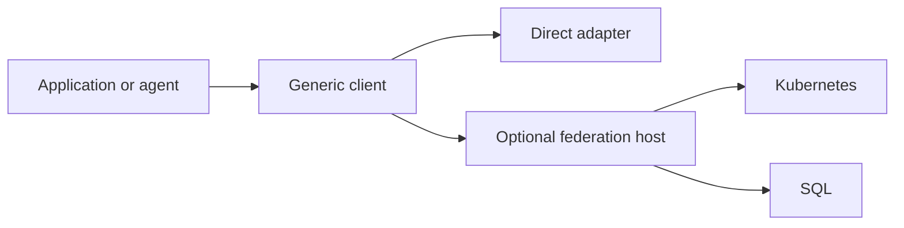

# A common boundary for independent integrations

Connectors lets applications discover and use integrations through typed, versioned contracts. Each adapter owns its provider behavior. The client learns what an adapter supports and invokes it through a common service boundary.

Start with the three implemented adapters: **GitLab**, **Kubernetes** and **SQL**. Call them directly, or place an optional federation host in front of several services.

## Three things to understand

**Contracts describe guarantees.** Inputs and outputs are part of the contract, along with access, lifecycle, partial results, retry and failure behavior.

**Adapters implement provider behavior.** Kubernetes resource selectors and SQL query semantics belong to their own adapters. Shared contracts remain independent of provider implementations.

**Composition connects explicit boundaries.** Discovering a database endpoint does not create a connection or grant access. A host must deliberately bind its target, credentials and authority.

Explore the [contracts](/contracts), choose an [adapter](/adapters), or read [what works today](/introduction/status).

## Follow a real-world request

[Follow a request to GitLab](/introduction/examples): see your laptop call a remote Connectors host, watch the adapter authenticate to GitLab, and follow the issue list back. Then explore the specified user authorization flow.
