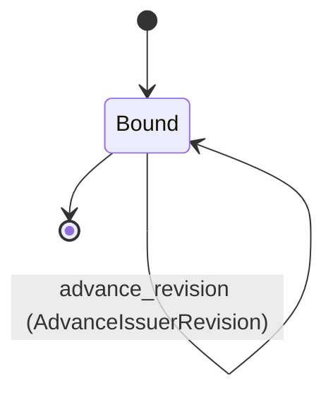
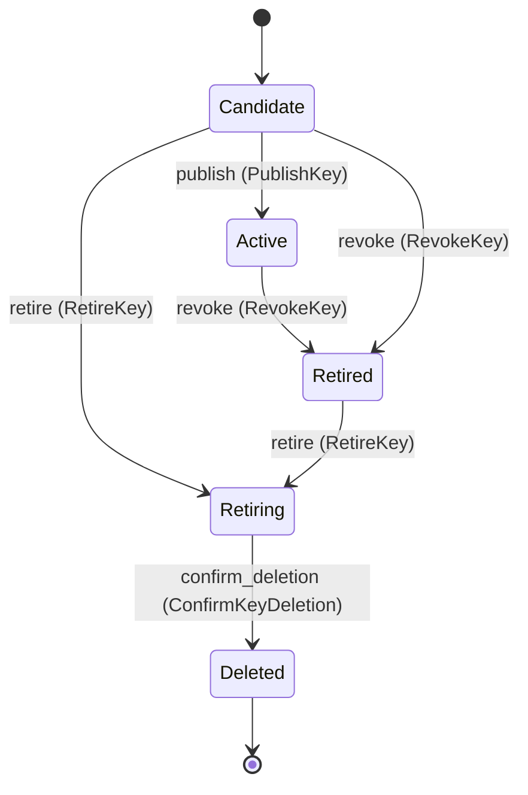

---
# generated by connectors-docs, do not edit
title: "approval_issuers"
sidebar_label: "approval_issuers"
sidebar_position: 2
description: "Local issuer identities and immutable signing-key versions with guarded publication."
custom_edit_url: null
---

# approval_issuers

:::info[Typed specification]

Generated by the pinned `ess generate --kind docs` from [`ess`](https://github.com/beyond10x/connectors/tree/main/ess). Structural validation establishes consistency; behaviour, storage and cross-record predicates remain implementation obligations.

:::

Local issuer identities and immutable signing-key versions with guarded publication.

`connectors.approval_issuers` is one of connectors's bounded contexts. [Back to the index](../index.md).

## Types

### `AudienceName`

`connectors.approval_issuers.AudienceName` wraps `String` and is not interchangeable with one: the whole value of naming it separately is the crossings the model then refuses. Every value starts with `connectors.approval/`.

### `IssuerName`

`connectors.approval_issuers.IssuerName` wraps `String` and is not interchangeable with one: the whole value of naming it separately is the crossings the model then refuses. Every value starts with `connectors.local-issuer/`.

## Entities

An entity is what this context is about: something with an identity that outlives any one request, a shape, and a lifecycle. The lifecycle is exhaustive — a move that is not drawn below is a move this specification does not permit, and that is the only way it says so. Every move is labelled with the command that takes it, because a move nothing can trigger is refused rather than drawn.

### `ApprovalIssuer`

`connectors.approval_issuers.ApprovalIssuer`.

An instance is identified by `issuer_id`, a `Uuid`. The name is part of the model and not a convention: a view projects the identity under that name, so a projection inventing its own would disagree with the view.

It holds:

- `instance_id` — `String`
- `issuer` — `connectors.approval_issuers.IssuerName`
- `audience` — `connectors.approval_issuers.AudienceName`
- `revision` — `Uuid`
- `custody_scope_ref` — `Uuid`

It references at most one [`connectors.declarations.ServiceConfiguration`](./connectors-declarations.md#serviceconfiguration), as `instance`, carried by `ApprovalIssuer.instance_id`.

No invariant is declared, so nothing here constrains an instance at rest.

Its state is a `connectors.approval_issuers.ApprovalIssuer.State`, one of `Bound`. That enum is synthesised from the lifecycle rather than declared beside it, so the states a view's filter compares and the states drawn below cannot disagree.

An instance is created in `Bound`. `Bound` is terminal, so an instance may rest there forever. That is declared rather than inferred from having no way out: an entity that cannot leave a state is either finished or stuck, and only its author knows which.

Each move is taken by a declared command outcome, and a move nothing takes is refused as `missing_causation` rather than left as a state change nobody can trigger:

- `advance_revision` — taken by `connectors.approval_issuers.AdvanceIssuerRevision` on its `advanced` outcome

An instance is brought into existence by `connectors.approval_issuers.BindIssuer` on its `bound` outcome.

It has one state, so there is no move to permit or to forbid.

One view projects it: [`ApprovalIssuers`](#approvalissuers).

### `ApprovalSigningKey`

`connectors.approval_issuers.ApprovalSigningKey`.

An instance is identified by `key_id`, a `Uuid`. The name is part of the model and not a convention: a view projects the identity under that name, so a projection inventing its own would disagree with the view.

It holds:

- `issuer_id` — `Uuid`
- `public_key` — `String`
- `not_before_unix_ms` — `Integer`
- `not_after_unix_ms` — `Integer`
- `material_version` — `Uuid`

It references at most one [`ApprovalIssuer`](#approvalissuer), as `issuer`, carried by `ApprovalSigningKey.issuer_id`.

Every instance satisfies `(not_before_unix_ms >= 0 and not_before_unix_ms <= 9007199254740991)` and `(not_after_unix_ms >= 0 and not_after_unix_ms <= 9007199254740991)` — a predicate over this entity's own fields, checked against them rather than stored as a sentence, so an invariant reading something the entity does not have is refused instead of documented.

Its state is a `connectors.approval_issuers.ApprovalSigningKey.State`, one of `Active`, `Candidate`, `Deleted`, `Retired` and `Retiring`. That enum is synthesised from the lifecycle rather than declared beside it, so the states a view's filter compares and the states drawn below cannot disagree.

An instance is created in `Candidate`. `Deleted` is terminal, so an instance may rest there forever. That is declared rather than inferred from having no way out: an entity that cannot leave a state is either finished or stuck, and only its author knows which.

Each move is taken by a declared command outcome, and a move nothing takes is refused as `missing_causation` rather than left as a state change nobody can trigger:

- `publish` — taken by `connectors.approval_issuers.PublishKey` on its `published` outcome
- `revoke` — taken by `connectors.approval_issuers.RevokeKey` on its `revoked` outcome
- `retire` — taken by `connectors.approval_issuers.RetireKey` on its `retiring` outcome
- `confirm_deletion` — taken by `connectors.approval_issuers.ConfirmKeyDeletion` on its `deleted` outcome

An instance is brought into existence by `connectors.approval_issuers.StageKey` on its `staged` outcome.

Illegal transitions are illegal by absence: no rule forbids them, there is simply no arrow, because a rule would be a second place for the same truth to live. A diagram cannot show an absence, so the pairs it does not connect are listed here, derived from the same transitions — anything named below is a move this specification does not permit.

- `Active` may not become `Candidate`
- `Active` may not become `Deleted`
- `Active` may not become `Retiring`
- `Candidate` may not become `Deleted`
- `Deleted` may not become `Active`
- `Deleted` may not become `Candidate`
- `Deleted` may not become `Retired`
- `Deleted` may not become `Retiring`
- `Retired` may not become `Active`
- `Retired` may not become `Candidate`
- `Retired` may not become `Deleted`
- `Retiring` may not become `Active`
- `Retiring` may not become `Candidate`
- `Retiring` may not become `Retired`

One view projects it: [`ApprovalSigningKeys`](#approvalsigningkeys).

## Views

A view is what the outside world is promised it can observe. Each one says which instances it contains and how soon it reflects a command that has already returned, because "you can read this" without "how soon" is the promise every flaky suite is built on.

### `ApprovalIssuers`

`connectors.approval_issuers.ApprovalIssuers`.

It reads [`ApprovalIssuer`](#approvalissuer).

It contains every instance of that entity: no filter narrows it, which is a decision somebody made and not a line somebody omitted.

It exposes:

- `issuer_id` — `Uuid`
- `instance_id` — `String`
- `issuer` — `connectors.approval_issuers.IssuerName`
- `audience` — `connectors.approval_issuers.AudienceName`
- `revision` — `Uuid`
- `custody_scope_ref` — `Uuid`
- `state` — `connectors.approval_issuers.ApprovalIssuer.State`

It declares no order, so the rows come back in whatever order the implementation has, and two reads may disagree.

**Read-your-writes**: it is current the moment the command that changed it returns. A caller that has just created an invoice and cannot see it in here has been told a lie about what it did.

A generated scenario asserts it once, immediately after the command: a view promising this and not keeping the promise has to fail the suite rather than be retried until it passes.

### `ApprovalSigningKeys`

`connectors.approval_issuers.ApprovalSigningKeys`.

It reads [`ApprovalSigningKey`](#approvalsigningkey).

It contains every instance of that entity: no filter narrows it, which is a decision somebody made and not a line somebody omitted.

It exposes:

- `key_id` — `Uuid`
- `issuer_id` — `Uuid`
- `public_key` — `String`
- `not_before_unix_ms` — `Integer`
- `not_after_unix_ms` — `Integer`
- `material_version` — `Uuid`
- `state` — `connectors.approval_issuers.ApprovalSigningKey.State`

It declares no order, so the rows come back in whatever order the implementation has, and two reads may disagree.

**Read-your-writes**: it is current the moment the command that changed it returns. A caller that has just created an invoice and cannot see it in here has been told a lie about what it did.

A generated scenario asserts it once, immediately after the command: a view promising this and not keeping the promise has to fail the suite rather than be retried until it passes.

## Commands

### `AdvanceIssuerRevision`

`connectors.approval_issuers.AdvanceIssuerRevision`.

It takes:

- `issuer_id` — `Uuid`
- `expected_revision` — `Uuid`
- `revision` — `Uuid`

It has three outcomes.

**`revision-conflict`** — Taken when the existing subject's stored fields satisfy `revision != input.expected_revision`. No entity in this specification changes. It reports `connectors.approval_issuers.IssuerRevisionConflict`, carrying `issuer_id`. It emits nothing. A test establishes and independently observes the subject enum fact before selecting this branch.

**`revision-reused`** — Taken when the existing subject's stored fields satisfy `revision == input.revision`. No entity in this specification changes. It reports `connectors.approval_issuers.IssuerRevisionReused`, carrying `issuer_id`. It emits nothing. A test establishes and independently observes the subject enum fact before selecting this branch.

**`advanced`** — The default branch, taken when no other outcome's condition matched. It moves a `connectors.approval_issuers.ApprovalIssuer` from `Bound` to `Bound`, along the declared move `advance_revision`. The instance is the one named by the input field `issuer_id`. It emits `connectors.approval_issuers.IssuerRevisionAdvanced`. It sets `revision` from `input.revision`. A test reaches it by constructing an input that satisfies no other outcome's condition.

### `BindIssuer`

`connectors.approval_issuers.BindIssuer`.

It takes:

- `issuer_id` — `Uuid`
- `instance_id` — `String`
- `issuer` — `connectors.approval_issuers.IssuerName`
- `audience` — `connectors.approval_issuers.AudienceName`
- `revision` — `Uuid`
- `custody_scope_ref` — `Uuid`

It has one outcome.

**`bound`** — The default branch, taken when no other outcome's condition matched. It creates a `connectors.approval_issuers.ApprovalIssuer`, which starts in `Bound`. The new instance's identity is published as `issuer_id` on `connectors.approval_issuers.IssuerBound`. It emits `connectors.approval_issuers.IssuerBound`. It sets `instance_id` from `input.instance_id`, `issuer` from `input.issuer`, `audience` from `input.audience`, `revision` from `input.revision` and `custody_scope_ref` from `input.custody_scope_ref`. A test reaches it by constructing an input that satisfies no other outcome's condition.

### `ConfirmKeyDeletion`

`connectors.approval_issuers.ConfirmKeyDeletion`.

It takes:

- `key_id` — `Uuid`

It has two outcomes.

**`deleted`** — The default branch, taken when no other outcome's condition matched. It moves a `connectors.approval_issuers.ApprovalSigningKey` from `Retiring` to `Deleted`, along the declared move `confirm_deletion`. The instance is the one named by the input field `key_id`. It emits `connectors.approval_issuers.KeyDeleted`. A test reaches it by constructing an input that satisfies no other outcome's condition.

**`conflict`** — Taken when the subject is resting in a state none of this command's moves start from — a `connectors.approval_issuers.ApprovalSigningKey` in `Active`, `Candidate`, `Deleted` and `Retired`, which is what is left of the lifecycle once this command's own moves are taken away. The document lists none of it. No entity in this specification changes. It reports `connectors.approval_issuers.KeyStateConflict`, carrying `state`. It emits nothing. A test reaches it by driving an instance into one of those states and then issuing the command, because no input selects this branch.

### `PublishKey`

`connectors.approval_issuers.PublishKey`.

It takes:

- `key_id` — `Uuid`

It has two outcomes.

**`published`** — The default branch, taken when no other outcome's condition matched. It moves a `connectors.approval_issuers.ApprovalSigningKey` from `Candidate` to `Active`, along the declared move `publish`. The instance is the one named by the input field `key_id`. It emits `connectors.approval_issuers.KeyPublished`. A test reaches it by constructing an input that satisfies no other outcome's condition.

**`conflict`** — Taken when the subject is resting in a state none of this command's moves start from — a `connectors.approval_issuers.ApprovalSigningKey` in `Active`, `Deleted`, `Retired` and `Retiring`, which is what is left of the lifecycle once this command's own moves are taken away. The document lists none of it. No entity in this specification changes. It reports `connectors.approval_issuers.KeyStateConflict`, carrying `state`. It emits nothing. A test reaches it by driving an instance into one of those states and then issuing the command, because no input selects this branch.

### `RetireKey`

`connectors.approval_issuers.RetireKey`.

It takes:

- `key_id` — `Uuid`

It has two outcomes.

**`retiring`** — The default branch, taken when no other outcome's condition matched. It moves a `connectors.approval_issuers.ApprovalSigningKey` from `Candidate` and `Retired` to `Retiring`, along the declared move `retire`. The instance is the one named by the input field `key_id`. It emits `connectors.approval_issuers.KeyRetiring`. A test reaches it by constructing an input that satisfies no other outcome's condition.

**`conflict`** — Taken when the subject is resting in a state none of this command's moves start from — a `connectors.approval_issuers.ApprovalSigningKey` in `Active`, `Deleted` and `Retiring`, which is what is left of the lifecycle once this command's own moves are taken away. The document lists none of it. No entity in this specification changes. It reports `connectors.approval_issuers.KeyStateConflict`, carrying `state`. It emits nothing. A test reaches it by driving an instance into one of those states and then issuing the command, because no input selects this branch.

### `RevokeKey`

`connectors.approval_issuers.RevokeKey`.

It takes:

- `key_id` — `Uuid`

It has two outcomes.

**`revoked`** — The default branch, taken when no other outcome's condition matched. It moves a `connectors.approval_issuers.ApprovalSigningKey` from `Active` and `Candidate` to `Retired`, along the declared move `revoke`. The instance is the one named by the input field `key_id`. It emits `connectors.approval_issuers.KeyRevoked`. A test reaches it by constructing an input that satisfies no other outcome's condition.

**`conflict`** — Taken when the subject is resting in a state none of this command's moves start from — a `connectors.approval_issuers.ApprovalSigningKey` in `Deleted`, `Retired` and `Retiring`, which is what is left of the lifecycle once this command's own moves are taken away. The document lists none of it. No entity in this specification changes. It reports `connectors.approval_issuers.KeyStateConflict`, carrying `state`. It emits nothing. A test reaches it by driving an instance into one of those states and then issuing the command, because no input selects this branch.

### `StageKey`

`connectors.approval_issuers.StageKey`.

It takes:

- `key_id` — `Uuid`
- `issuer_id` — `Uuid`
- `public_key` — `String`
- `not_before_unix_ms` — `Integer`
- `not_after_unix_ms` — `Integer`
- `material_version` — `Uuid`

It has one outcome.

**`staged`** — The default branch, taken when no other outcome's condition matched. It creates a `connectors.approval_issuers.ApprovalSigningKey`, which starts in `Candidate`. The new instance's identity is published as `key_id` on `connectors.approval_issuers.KeyStaged`. It emits `connectors.approval_issuers.KeyStaged`. It sets `issuer_id` from `input.issuer_id`, `public_key` from `input.public_key`, `not_before_unix_ms` from `input.not_before_unix_ms`, `not_after_unix_ms` from `input.not_after_unix_ms` and `material_version` from `input.material_version`. A test reaches it by constructing an input that satisfies no other outcome's condition.

## Events

### `IssuerBound`

`connectors.approval_issuers.IssuerBound`.

It carries:

- `issuer_id` — `Uuid`

Emitted by `connectors.approval_issuers.BindIssuer` on its `bound` outcome.

Nothing in this system reacts to it.

### `IssuerRevisionAdvanced`

`connectors.approval_issuers.IssuerRevisionAdvanced`.

It carries:

- `issuer_id` — `Uuid`
- `revision` — `Uuid`

Emitted by `connectors.approval_issuers.AdvanceIssuerRevision` on its `advanced` outcome.

Nothing in this system reacts to it.

### `KeyDeleted`

`connectors.approval_issuers.KeyDeleted`.

It carries:

- `key_id` — `Uuid`

Emitted by `connectors.approval_issuers.ConfirmKeyDeletion` on its `deleted` outcome.

Nothing in this system reacts to it.

### `KeyPublished`

`connectors.approval_issuers.KeyPublished`.

It carries:

- `key_id` — `Uuid`

Emitted by `connectors.approval_issuers.PublishKey` on its `published` outcome.

Nothing in this system reacts to it.

### `KeyRetiring`

`connectors.approval_issuers.KeyRetiring`.

It carries:

- `key_id` — `Uuid`

Emitted by `connectors.approval_issuers.RetireKey` on its `retiring` outcome.

Nothing in this system reacts to it.

### `KeyRevoked`

`connectors.approval_issuers.KeyRevoked`.

It carries:

- `key_id` — `Uuid`

Emitted by `connectors.approval_issuers.RevokeKey` on its `revoked` outcome.

Nothing in this system reacts to it.

### `KeyStaged`

`connectors.approval_issuers.KeyStaged`.

It carries:

- `key_id` — `Uuid`

Emitted by `connectors.approval_issuers.StageKey` on its `staged` outcome.

Nothing in this system reacts to it.

## Errors

### `IssuerRevisionConflict`

It carries:

- `issuer_id` — `Uuid`

Reported by `connectors.approval_issuers.AdvanceIssuerRevision` on its `revision-conflict` outcome.

### `IssuerRevisionReused`

It carries:

- `issuer_id` — `Uuid`

Reported by `connectors.approval_issuers.AdvanceIssuerRevision` on its `revision-reused` outcome.

### `KeyStateConflict`

It carries:

- `state` — `connectors.approval_issuers.ApprovalSigningKey.State`

Reported by `connectors.approval_issuers.ConfirmKeyDeletion` on its `conflict` outcome.

Reported by `connectors.approval_issuers.PublishKey` on its `conflict` outcome.

Reported by `connectors.approval_issuers.RetireKey` on its `conflict` outcome.

Reported by `connectors.approval_issuers.RevokeKey` on its `conflict` outcome.

## Actors

An actor is who may ask this context for something. Every grant below points at a command this specification declares — a grant is a resolved reference, so "may invoke" something nobody wrote is not a permission this model can express, and an authorisation that authorises nothing cannot ship quietly.

### `LocalHost`

`connectors.approval_issuers.LocalHost`.

It may invoke [`AdvanceIssuerRevision`](#advanceissuerrevision), [`BindIssuer`](#bindissuer), [`ConfirmKeyDeletion`](#confirmkeydeletion), [`PublishKey`](#publishkey), [`RetireKey`](#retirekey), [`RevokeKey`](#revokekey) and [`StageKey`](#stagekey).

---

Generated from connectors v1 · model digest `6c52aebf2b119b4755842d83b7b8b0e950d08dc800e33c6931c1d7fbfcaa594f` · contract digest `slice-sha256/2:2d45448eb4db2b12ebb11bae9dbf24ff5cbc9854dde19a7d5b92092cf207c527`. Do not edit this file; change the specification and regenerate it with `ess generate`.
