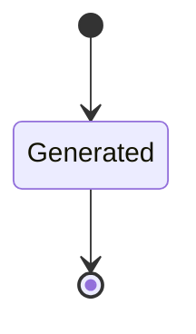
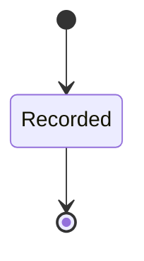

---
# generated by connectors-docs, do not edit
title: "artifact_provenance"
sidebar_label: "artifact_provenance"
sidebar_position: 3
description: "Immutable shared source and bundle declarations; optional distribution publication is separate."
custom_edit_url: null
---

# artifact_provenance

:::info[Typed specification]

Generated by the pinned `ess generate --kind docs` from [`ess`](https://github.com/beyond10x/connectors/tree/main/ess). Structural validation establishes consistency; behaviour, storage and cross-record predicates remain implementation obligations.

:::

Immutable shared source and bundle declarations; optional distribution publication is separate.

`connectors.artifact_provenance` is one of connectors's bounded contexts. [Back to the index](../index.md).

## Types

### `ArtifactFile`

`connectors.artifact_provenance.ArtifactFile` is a record of two fields:

- `path` — `String`
- `sha256` — `String`

### `Curation`

`connectors.artifact_provenance.Curation` is a record of six fields:

- `expose` — `Boolean`
- `effects` — `List<connectors.mutations.ExecutableEffect>`
- `semantic_effects` — `List<connectors.mutations.SemanticEffect>`
- `risk` — `connectors.artifact_provenance.Risk`
- `idempotency` — `connectors.mutations.IdempotencyKind`
- `realization` — `connectors.artifact_provenance.Realization`

### `LicenseEvidence`

`connectors.artifact_provenance.LicenseEvidence` is a record of two fields:

- `declared_license` — `Optional<String>`, which may be absent
- `retained_files` — `List<connectors.artifact_provenance.ArtifactFile>`

### `Realization`

`connectors.artifact_provenance.Realization` is one of `generic`, `implemented` and `unresolved`.

### `Risk`

`connectors.artifact_provenance.Risk` is one of `low`, `medium` and `high`.

### `Sha256Hex`

`connectors.artifact_provenance.Sha256Hex` wraps `String` and is not interchangeable with one: the whole value of naming it separately is the crossings the model then refuses. Its characters are drawn from `0123456789abcdefABCDEF`.

### `SourceKind`

`connectors.artifact_provenance.SourceKind` is one of `openapi`, `swagger2`, `authored` and `asyncapi`.

### `SourceOrigin`

`connectors.artifact_provenance.SourceOrigin` is one of `vendor`, `repository-authored`, `vendor-derived` and `mixed`.

### `SourceTransform`

`connectors.artifact_provenance.SourceTransform` is a record of three fields:

- `name` — `String`
- `input_sha256` — `String`
- `output_sha256` — `String`

## Entities

An entity is what this context is about: something with an identity that outlives any one request, a shape, and a lifecycle. The lifecycle is exhaustive — a move that is not drawn below is a move this specification does not permit, and that is the only way it says so. Every move is labelled with the command that takes it, because a move nothing can trigger is refused rather than drawn.

### `Bundle`

`connectors.artifact_provenance.Bundle`.

An instance is identified by `digest`, a `String`. The name is part of the model and not a convention: a view projects the identity under that name, so a projection inventing its own would disagree with the view.

It holds:

- `adapter_id` — `String`
- `format` — `String`
- `specification_sha256` — `connectors.artifact_provenance.Sha256Hex`
- `upstream_sha256` — `Optional<connectors.artifact_provenance.Sha256Hex>`, which may be absent
- `ess` — `String`
- `rustfmt` — `String`
- `files` — `List<connectors.artifact_provenance.ArtifactFile>`
- `source_refs` — `List<String>`

It references at most one [`connectors.declarations.AdapterSpecification`](./connectors-declarations.md#adapterspecification), as `realizes`, carried by `Bundle.adapter_id`. It references any number of [`Source`](#source), as `sources`, carried by `Bundle.source_refs`.

No invariant is declared, so nothing here constrains an instance at rest.

Its state is a `connectors.artifact_provenance.Bundle.State`, one of `Generated`. That enum is synthesised from the lifecycle rather than declared beside it, so the states a view's filter compares and the states drawn below cannot disagree.

An instance is created in `Generated`. `Generated` is terminal, so an instance may rest there forever. That is declared rather than inferred from having no way out: an entity that cannot leave a state is either finished or stuck, and only its author knows which.

It declares no moves, so nothing changes its state once it exists.

It has one state, so there is no move to permit or to forbid.

No view projects it, so nothing outside this context is promised a way to observe one.

### `Source`

`connectors.artifact_provenance.Source`.

An instance is identified by `source_ref`, a `String`. The name is part of the model and not a convention: a view projects the identity under that name, so a projection inventing its own would disagree with the view.

It holds:

- `url` — `String`
- `revision` — `String`
- `origin` — `connectors.artifact_provenance.SourceOrigin`
- `kind` — `connectors.artifact_provenance.SourceKind`
- `sha256` — `String`
- `license_evidence` — `Optional<connectors.artifact_provenance.LicenseEvidence>`, which may be absent
- `transforms` — `List<connectors.artifact_provenance.SourceTransform>`

It declares no relation to another entity, and no other entity names it.

No invariant is declared, so nothing here constrains an instance at rest.

Its state is a `connectors.artifact_provenance.Source.State`, one of `Recorded`. That enum is synthesised from the lifecycle rather than declared beside it, so the states a view's filter compares and the states drawn below cannot disagree.

An instance is created in `Recorded`. `Recorded` is terminal, so an instance may rest there forever. That is declared rather than inferred from having no way out: an entity that cannot leave a state is either finished or stuck, and only its author knows which.

It declares no moves, so nothing changes its state once it exists.

It has one state, so there is no move to permit or to forbid.

No view projects it, so nothing outside this context is promised a way to observe one.

---

Generated from connectors v1 · model digest `6c52aebf2b119b4755842d83b7b8b0e950d08dc800e33c6931c1d7fbfcaa594f` · contract digest `slice-sha256/2:0f554b14bb94a9231323a986d0100a8fabad54fc7e985cab0e4f232e46de56c9`. Do not edit this file; change the specification and regenerate it with `ess generate`.
