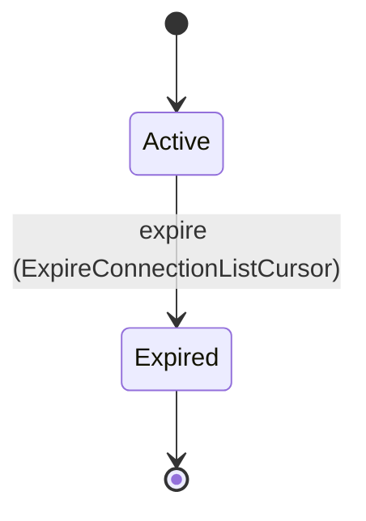
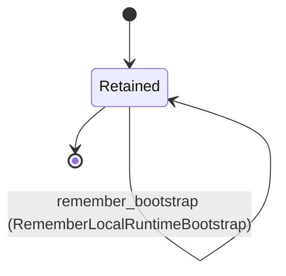

---
# generated by connectors-docs, do not edit
title: "cli"
sidebar_label: "cli"
sidebar_position: 6
description: "Selected local CLI presentation values and the existing local configuration owner's durable runtime facts."
custom_edit_url: null
---

# cli

:::info[Typed specification]

Generated by the pinned `ess generate --kind docs` from [`ess`](https://github.com/beyond10x/connectors/tree/main/ess). Structural validation establishes consistency; behaviour, storage and cross-record predicates remain implementation obligations.

:::

Selected local CLI presentation values and the existing local configuration owner's durable runtime facts.

`connectors.cli` is one of connectors's bounded contexts. [Back to the index](../index.md).

## Types

### `AcquisitionObservation`

`connectors.cli.AcquisitionObservation` is a record of eight fields:

- `instance_id` — `String`
- `acquisition` — `String`
- `state` — `connectors.cli.AcquisitionState`
- `reason` — `Optional<connectors.auth_bindings.AcquisitionFailure>`, which may be absent
- `connection` — `Optional<String>`, which may be absent
- `expires_at_ms` — `Integer`
- `observed_at_ms` — `Integer`
- `next_action` — `connectors.cli.NextAction`

### `AcquisitionState`

`connectors.cli.AcquisitionState` is one of `pending`, `completed` and `failed`.

### `AdapterConfiguration`

`connectors.cli.AdapterConfiguration` is a record of four fields:

- `summary` — `connectors.cli.AdapterSummary`
- `configuration_revision` — `String`
- `protocol` — `String`
- `executable` — `connectors.cli.ConfiguredExecutable`

### `AdapterDescribeInput`

`connectors.cli.AdapterDescribeInput` is a record of one field:

- `adapter` — `String`

### `AdapterDescribeResult`

`connectors.cli.AdapterDescribeResult` is a record of four fields:

- `configuration` — `connectors.cli.AdapterConfiguration`
- `descriptor` — `Optional<connectors.cli.ServiceDescriptor>`, which may be absent
- `source` — `connectors.cli.MetadataSource`
- `stale` — `Boolean`

### `AdapterListInput`

`connectors.cli.AdapterListInput` is a record of two fields:

- `limit` — `Optional<Integer>`, which may be absent
- `cursor` — `Optional<String>`, which may be absent

### `AdapterListResult`

`connectors.cli.AdapterListResult` is a record of three fields:

- `adapters` — `List<connectors.cli.AdapterSummary>`
- `next_cursor` — `Optional<String>`, which may be absent
- `source` — `connectors.cli.MetadataSource`

### `AdapterObservation`

`connectors.cli.AdapterObservation` is a record of seven fields:

- `adapter` — `String`
- `configuration_revision` — `String`
- `state` — `connectors.cli.LifecycleState`
- `host_incarnation` — `Optional<String>`, which may be absent
- `child_incarnation` — `Optional<String>`, which may be absent
- `observed_at_ms` — `Integer`
- `failure` — `Optional<connectors.cli.Failure>`, which may be absent

### `AdapterStatusInput`

`connectors.cli.AdapterStatusInput` is a record of one field:

- `adapter` — `String`

### `AdapterStatusResult`

`connectors.cli.AdapterStatusResult` is a record of one field:

- `observation` — `connectors.cli.AdapterObservation`

### `AdapterStopInput`

`connectors.cli.AdapterStopInput` is a record of four fields:

- `adapter` — `String`
- `expected_revision` — `String`
- `host_incarnation` — `String`
- `child_incarnation` — `String`

### `AdapterStopResult`

`connectors.cli.AdapterStopResult` is a record of one field:

- `observation` — `connectors.cli.AdapterObservation`

### `AdapterSummary`

`connectors.cli.AdapterSummary` is a record of five fields:

- `adapter` — `String`
- `instance_id` — `String`
- `adapter_id` — `String`
- `startup` — `connectors.cli.StartupMode`
- `restart` — `connectors.cli.RestartPolicy`

### `ApprovalClockCheckInput`

`connectors.cli.ApprovalClockCheckInput` is a record of one field:

- `adapter` — `String`

### `ApprovalClockCheckResult`

`connectors.cli.ApprovalClockCheckResult` is a record of two fields:

- `adapter` — `String`
- `observation` — `connectors.clock.Observation`

### `ApprovalIssueDisposition`

`connectors.cli.ApprovalIssueDisposition` is one of `published`.

### `ApprovalIssueInput`

`connectors.cli.ApprovalIssueInput` is a record of eight fields:

- `adapter` — `String`
- `connection` — `String`
- `operation` — `String`
- `schema` — `String`
- `revision` — `String`
- `input` — `String`
- `approve_subject` — `String`
- `proof_output` — `String`

### `ApprovalIssueResult`

`connectors.cli.ApprovalIssueResult` is a record of four fields:

- `adapter` — `String`
- `reference` — `String`
- `subject_sha256` — `String`
- `disposition` — `connectors.cli.ApprovalIssueDisposition`

### `ApprovalIssuerView`

`connectors.cli.ApprovalIssuerView` is a record of four fields:

- `issuer` — `String`
- `audience` — `String`
- `revision` — `String`
- `keys` — `List<connectors.cli.ApprovalKeyView>`

### `ApprovalKeyInitInput`

`connectors.cli.ApprovalKeyInitInput` is a record of two fields:

- `adapter` — `String`
- `expected_revision` — `Optional<String>`, which may be absent

### `ApprovalKeyRecoverInput`

`connectors.cli.ApprovalKeyRecoverInput` is a record of three fields:

- `adapter` — `String`
- `expected_revision` — `String`
- `candidate` — `String`

### `ApprovalKeyRetireInput`

`connectors.cli.ApprovalKeyRetireInput` is a record of three fields:

- `adapter` — `String`
- `expected_revision` — `String`
- `key` — `String`

### `ApprovalKeyRevokeInput`

`connectors.cli.ApprovalKeyRevokeInput` is a record of three fields:

- `adapter` — `String`
- `expected_revision` — `String`
- `expected_key` — `String`

### `ApprovalKeyRotateInput`

`connectors.cli.ApprovalKeyRotateInput` is a record of three fields:

- `adapter` — `String`
- `expected_revision` — `String`
- `expected_key` — `String`

### `ApprovalKeyState`

`connectors.cli.ApprovalKeyState` is one of `candidate`, `active`, `retired`, `retiring` and `deleted`.

### `ApprovalKeyStatusInput`

`connectors.cli.ApprovalKeyStatusInput` is a record of one field:

- `adapter` — `String`

### `ApprovalKeyView`

`connectors.cli.ApprovalKeyView` is a record of three fields:

- `key_id` — `String`
- `public_key` — `String`
- `state` — `connectors.cli.ApprovalKeyState`

### `ApprovalKeysResult`

`connectors.cli.ApprovalKeysResult` is a record of two fields:

- `adapter` — `String`
- `issuer` — `Optional<connectors.cli.ApprovalIssuerView>`, which may be absent

### `ApprovalPolicyResult`

`connectors.cli.ApprovalPolicyResult` is a record of two fields:

- `adapter` — `String`
- `policy` — `Optional<connectors.cli.ApprovalPolicyView>`, which may be absent

### `ApprovalPolicySetInput`

`connectors.cli.ApprovalPolicySetInput` is a record of three fields:

- `adapter` — `String`
- `expected_revision` — `Optional<Integer>`, which may be absent
- `input_file` — `String`

### `ApprovalPolicyStatusInput`

`connectors.cli.ApprovalPolicyStatusInput` is a record of one field:

- `adapter` — `String`

### `ApprovalPolicyView`

`connectors.cli.ApprovalPolicyView` is a record of seven fields:

- `policy_id` — `String`
- `instance_id` — `String`
- `issuer_id` — `String`
- `revision` — `Integer`
- `owner_uid` — `Integer`
- `selection` — `connectors.local_approval_policy.Selection`
- `operations` — `List<String>`

### `ApprovalPrepareInput`

`connectors.cli.ApprovalPrepareInput` is a record of six fields:

- `adapter` — `String`
- `connection` — `String`
- `operation` — `String`
- `schema` — `String`
- `revision` — `String`
- `input` — `String`

### `ApprovalPrepareResult`

`connectors.cli.ApprovalPrepareResult` is a record of two fields:

- `adapter` — `String`
- `preparation` — `connectors.delegation.ApprovalPreparation`

### `AttemptReference`

`connectors.cli.AttemptReference` is a record of two fields:

- `instance` — `String`
- `id` — `String`

### `BuildDigest`

`connectors.cli.BuildDigest` wraps `String` and is not interchangeable with one: the whole value of naming it separately is the crossings the model then refuses. Its characters are drawn from `0123456789abcdef`. Every value satisfies `value.count == 64`.

### `CheckpointsChange`

`connectors.cli.CheckpointsChange` is one of `one-way`.

### `CheckpointsDisposition`

`connectors.cli.CheckpointsDisposition` is one of `enabled` and `already_enabled`.

### `ConfigurationFormat`

`connectors.cli.ConfigurationFormat` is one of `connectors-local/1`, `connectors-local/2` and `connectors-local/3`.

### `ConfiguredExecutable`

`connectors.cli.ConfiguredExecutable` is a record of three fields:

- `path` — `String`
- `sha256` — `String`
- `args` — `List<String>`

### `ConnectionConnectInput`

`connectors.cli.ConnectionConnectInput` is a record of three fields:

- `adapter` — `String`
- `profile` — `String`
- `credential_document` — `String`

### `ConnectionConnectResult`

`connectors.cli.ConnectionConnectResult` is a record of two fields:

- `connection` — `connectors.cli.ConnectionDescription`
- `acquisition` — `Optional<String>`, which may be absent

### `ConnectionCreateRequest`

`connectors.cli.ConnectionCreateRequest` is a record of two fields:

- `adapter` — `String`
- `profile` — `String`

### `ConnectionDescribeInput`

`connectors.cli.ConnectionDescribeInput` is a record of two fields:

- `adapter` — `String`
- `connection` — `String`

### `ConnectionDescribeResult`

`connectors.cli.ConnectionDescribeResult` is a record of one field:

- `connection` — `connectors.cli.ConnectionDescription`

### `ConnectionDescription`

`connectors.cli.ConnectionDescription` is a record of six fields:

- `summary` — `connectors.cli.ConnectionSummary`
- `external_identity` — `Optional<connectors.credentials.ExternalIdentity>`, which may be absent
- `observed_at_ms` — `Integer`
- `valid_until_ms` — `Integer`
- `source` — `connectors.cli.MetadataSource`
- `stale` — `Boolean`

### `ConnectionLaunchInput`

`connectors.cli.ConnectionLaunchInput` is a record of four fields:

- `adapter` — `String`
- `connection` — `String`
- `consumer` — `String`
- `args` — `Optional<String>`, which may be absent

### `ConnectionLaunchResult`

`connectors.cli.ConnectionLaunchResult` is a record of two fields:

- `consumer` — `String`
- `exit_code` — `Integer`

### `ConnectionListInput`

`connectors.cli.ConnectionListInput` is a record of three fields:

- `adapter` — `String`
- `limit` — `Optional<Integer>`, which may be absent
- `cursor` — `Optional<String>`, which may be absent

### `ConnectionListResult`

`connectors.cli.ConnectionListResult` is a record of six fields:

- `connections` — `List<connectors.cli.ConnectionSummary>`
- `next_cursor` — `Optional<String>`, which may be absent
- `observed_at_ms` — `Integer`
- `valid_until_ms` — `Optional<Integer>`, which may be absent
- `source` — `connectors.cli.MetadataSource`
- `stale` — `Boolean`

### `ConnectionRepairInput`

`connectors.cli.ConnectionRepairInput` is a record of four fields:

- `adapter` — `String`
- `connection` — `String`
- `expected_revision` — `String`
- `credential_document` — `String`

### `ConnectionRepairRequest`

`connectors.cli.ConnectionRepairRequest` is a record of three fields:

- `adapter` — `String`
- `connection` — `String`
- `expected_revision` — `String`

### `ConnectionRepairResult`

`connectors.cli.ConnectionRepairResult` is a record of two fields:

- `connection` — `connectors.cli.ConnectionDescription`
- `acquisition` — `Optional<String>`, which may be absent

### `ConnectionRevalidateInput`

`connectors.cli.ConnectionRevalidateInput` is a record of three fields:

- `adapter` — `String`
- `connection` — `String`
- `expected_revision` — `String`

### `ConnectionRevalidateResult`

`connectors.cli.ConnectionRevalidateResult` is a record of one field:

- `connection` — `connectors.cli.ConnectionDescription`

### `ConnectionRevokeInput`

`connectors.cli.ConnectionRevokeInput` is a record of three fields:

- `adapter` — `String`
- `connection` — `String`
- `expected_revision` — `String`

### `ConnectionRevokeResult`

`connectors.cli.ConnectionRevokeResult` is a record of five fields:

- `adapter` — `String`
- `connection` — `String`
- `revision` — `String`
- `local_state` — `connectors.cli.RevocationState`
- `provider_outcome` — `connectors.cli.ProviderRevocationOutcome`

### `ConnectionStatusInput`

`connectors.cli.ConnectionStatusInput` is a record of three fields:

- `adapter` — `String`
- `connection` — `Optional<String>`, which may be absent
- `acquisition` — `Optional<String>`, which may be absent

### `ConnectionStatusResult`

`connectors.cli.ConnectionStatusResult` is a record of two fields:

- `connection` — `Optional<connectors.cli.ConnectionDescription>`, which may be absent
- `acquisition` — `Optional<connectors.cli.AcquisitionObservation>`, which may be absent

### `ConnectionSummary`

`connectors.cli.ConnectionSummary` is a record of six fields:

- `adapter` — `String`
- `instance_id` — `String`
- `connection` — `String`
- `profile` — `String`
- `revision` — `String`
- `state` — `connectors.connection_admission.ConnectionState`

### `Failure`

`connectors.cli.Failure` is a record of 14 fields:

- `kind` — `connectors.cli.FailureKind`
- `code` — `connectors.cli.FailureCode`
- `stage` — `connectors.cli.FailureStage`
- `next_action` — `connectors.cli.NextAction`
- `service_code` — `Optional<connectors.service_wire.ErrorCode>`, which may be absent
- `service_reason` — `Optional<String>`, which may be absent
- `retry_after_seconds` — `Optional<Integer>`, which may be absent
- `connection` — `Optional<String>`, which may be absent
- `acquisition` — `Optional<String>`, which may be absent
- `request_id` — `Optional<String>`, which may be absent
- `mutation` — `Optional<connectors.cli.MutationObservation>`, which may be absent
- `source_audit` — `Optional<connectors.service_wire.SourceAudit>`, which may be absent
- `configuration_format` — `Optional<connectors.cli.ConfigurationFormat>`, which may be absent
- `instance_id` — `Optional<String>`, which may be absent

### `FailureCode`

`connectors.cli.FailureCode` is one of `invalid_input`, `invalid_configuration`, `configuration_exists`, `protected_entry_unavailable`, `custody_unavailable`, `metadata_unavailable`, `revision_conflict`, `outcome_unknown`, `identity_mismatch`, `lifecycle_conflict`, `incarnation_mismatch`, `readiness_mismatch`, `description_unavailable`, `stale_description`, `not_found`, `revoked`, `forbidden`, `not_granted`, `unavailable`, `timeout`, `capacity`, `stale_cursor`, `unsupported`, `interrupted`, `service_failure`, `approval_required`, `approval_refused`, `approval_replayed`, `idempotency_conflict`, `owner_build_mismatch` and `confirmation_required`.

### `FailureKind`

`connectors.cli.FailureKind` is one of `usage`, `operational` and `interrupted`.

### `FailureStage`

`connectors.cli.FailureStage` is one of `arguments`, `configuration`, `protected_entry`, `admission`, `launch`, `readiness`, `custody`, `publication`, `dispatch`, `observation` and `stop`.

### `InitDisposition`

`connectors.cli.InitDisposition` is one of `created` and `state_initialized`.

### `KeyringState`

`connectors.cli.KeyringState` is one of `available`, `locked` and `unavailable`.

### `LegacyDescribeInput`

`connectors.cli.LegacyDescribeInput` is a record of three fields:

- `endpoint` — `String`
- `token_file` — `String`
- `allow_plaintext` — `Optional<Boolean>`, which may be absent

### `LegacyDescribeResult`

`connectors.cli.LegacyDescribeResult` is a record of one field:

- `descriptor` — `connectors.cli.ServiceDescriptor`

### `LegacyInvokeInput`

`connectors.cli.LegacyInvokeInput` is a record of five fields:

- `endpoint` — `String`
- `token_file` — `String`
- `allow_plaintext` — `Optional<Boolean>`, which may be absent
- `operation` — `String`
- `input` — `String`

### `LegacyInvokeResult`

`connectors.cli.LegacyInvokeResult` is a record of one field:

- `result` — `String`

### `LifecycleState`

`connectors.cli.LifecycleState` is one of `not_running`, `starting`, `ready`, `stopping`, `stopped`, `failed`, `owner_unavailable` and `suppressed`.

### `LocalCaptureAdmission`

`connectors.cli.LocalCaptureAdmission` is a record of three fields:

- `acquisition` — `String`
- `expires_at_ms` — `Timestamp`
- `profile` — `connectors.cli.PrivateStaticProfile`

### `LocalCustodyBinding`

`connectors.cli.LocalCustodyBinding` is a record of one field:

- `secret_service_socket` — `Optional<String>`, which may be absent

### `LocalOperationPolicy`

`connectors.cli.LocalOperationPolicy` is a record of two fields:

- `profiles` — `List<String>`
- `operations` — `List<String>`

### `LocalOwnerBuild`

`connectors.cli.LocalOwnerBuild` is a record of one field:

- `build` — `connectors.cli.BuildDigest`

### `LocalOwnerBuildKind`

`connectors.cli.LocalOwnerBuildKind` is one of `build`.

### `LocalOwnerBuildRequest`

`connectors.cli.LocalOwnerBuildRequest` is a record of one field:

- `kind` — `connectors.cli.LocalOwnerBuildKind`

### `LocalOwnerCached`

`connectors.cli.LocalOwnerCached` is a record of one field:

- `bootstrap` — `connectors.cli.PrivateAdapterBootstrap`

### `LocalOwnerCachedKind`

`connectors.cli.LocalOwnerCachedKind` is one of `cached`.

### `LocalOwnerCachedRequest`

`connectors.cli.LocalOwnerCachedRequest` is a record of two fields:

- `kind` — `connectors.cli.LocalOwnerCachedKind`
- `adapter` — `String`

### `LocalOwnerGreeting`

`connectors.cli.LocalOwnerGreeting` is a record of six fields:

- `kind` — `connectors.cli.LocalOwnerHelloKind`
- `version` — `String`
- `challenge` — `Uuid`
- `host_incarnation` — `Uuid`
- `authority` — `Uuid`
- `build` — `Optional<connectors.cli.BuildDigest>`, which may be absent

### `LocalOwnerHello`

`connectors.cli.LocalOwnerHello` is a record of six fields:

- `kind` — `connectors.cli.LocalOwnerHelloKind`
- `version` — `String`
- `challenge` — `Uuid`
- `configuration` — `String`
- `authority` — `Uuid`
- `build` — `Optional<connectors.cli.BuildDigest>`, which may be absent

### `LocalOwnerHelloKind`

`connectors.cli.LocalOwnerHelloKind` is one of `hello`.

### `LocalRevalidationAdmission`

`connectors.cli.LocalRevalidationAdmission` is a record of six fields:

- `connection` — `String`
- `generation` — `String`
- `custody_version` — `String`
- `publication_fence` — `String`
- `captured_at_ms` — `Timestamp`
- `expires_at_ms` — `Timestamp`

### `MetadataSource`

`connectors.cli.MetadataSource` is one of `configuration`, `cached` and `authority`.

### `MutationObservation`

`connectors.cli.MutationObservation` is a record of five fields:

- `classification` — `connectors.mutations.EffectKnowledge`
- `attempt` — `Optional<connectors.cli.AttemptReference>`, which may be absent
- `original_request_id` — `Optional<String>`, which may be absent
- `replayed` — `Boolean`
- `cause` — `Optional<connectors.service_wire.DiagnosticCause>`, which may be absent

### `NextAction`

`connectors.cli.NextAction` is one of `check_configuration`, `select_protected_source`, `unlock_keyring`, `retry_status`, `repair_connection`, `revalidate_connection`, `create_connection`, `refresh_description`, `request_permission`, `retry_explicitly`, `stop_owner` and `none`.

### `OperatingSystem`

`connectors.cli.OperatingSystem` is one of `linux`.

### `OperationDescribeInput`

`connectors.cli.OperationDescribeInput` is a record of two fields:

- `adapter` — `String`
- `operation` — `String`

### `OperationDescribeResult`

`connectors.cli.OperationDescribeResult` is a record of six fields:

- `adapter` — `String`
- `revision` — `String`
- `schema` — `String`
- `operation` — `connectors.cli.OperationDescription`
- `source` — `connectors.cli.MetadataSource`
- `stale` — `Boolean`

### `OperationDescription`

`connectors.cli.OperationDescription` is a record of six fields:

- `id` — `String`
- `description` — `String`
- `contract` — `String`
- `profile` — `String`
- `input_schema` — `Json`
- `output_schema` — `Json`

### `OperationInvokeInput`

`connectors.cli.OperationInvokeInput` is a record of eight fields:

- `adapter` — `String`
- `connection` — `Optional<String>`, which may be absent
- `operation` — `String`
- `schema` — `String`
- `revision` — `String`
- `input` — `String`
- `approval_file` — `Optional<String>`, which may be absent
- `idempotency_key` — `Optional<String>`, which may be absent

### `OperationInvokeResult`

`connectors.cli.OperationInvokeResult` is a record of seven fields:

- `adapter` — `String`
- `operation` — `String`
- `revision` — `String`
- `result` — `Json`
- `request_id` — `Optional<String>`, which may be absent
- `mutation` — `Optional<connectors.cli.MutationObservation>`, which may be absent
- `source_audit` — `Optional<connectors.service_wire.SourceAudit>`, which may be absent

### `OperationListInput`

`connectors.cli.OperationListInput` is a record of four fields:

- `adapter` — `String`
- `family` — `Optional<String>`, which may be absent
- `limit` — `Optional<Integer>`, which may be absent
- `cursor` — `Optional<String>`, which may be absent

### `OperationListResult`

`connectors.cli.OperationListResult` is a record of six fields:

- `adapter` — `String`
- `revision` — `String`
- `operations` — `List<connectors.cli.OperationSummary>`
- `next_cursor` — `Optional<String>`, which may be absent
- `source` — `connectors.cli.MetadataSource`
- `stale` — `Boolean`

### `OperationSummary`

`connectors.cli.OperationSummary` is a record of four fields:

- `id` — `String`
- `description` — `String`
- `contract` — `String`
- `profile` — `String`

### `Prerequisite`

`connectors.cli.Prerequisite` is a record of three fields:

- `name` — `String`
- `state` — `connectors.cli.PrerequisiteState`
- `next_action` — `connectors.cli.NextAction`

### `PrerequisiteState`

`connectors.cli.PrerequisiteState` is one of `ready`, `failed` and `unknown`.

### `PrivateAdapterBootstrap`

`connectors.cli.PrivateAdapterBootstrap` is a record of eight fields:

- `instance` — `String`
- `adapter` — `String`
- `protocol` — `String`
- `configuration_revision` — `String`
- `provider_authority` — `String`
- `descriptor` — `String`
- `profiles` — `List<connectors.cli.PrivateStaticProfile>`
- `requirements` — `List<connectors.cli.PrivateOperationRequirement>`

### `PrivateBaseline`

`connectors.cli.PrivateBaseline` is a record of five fields:

- `identity` — `connectors.credentials.ExternalIdentity`
- `granted_scopes` — `Optional<List<String>>`, which may be absent
- `credential_expires_at_ms` — `Optional<Timestamp>`, which may be absent
- `collected_at_ms` — `Timestamp`
- `valid_until_ms` — `Timestamp`

### `PrivateEntryField`

`connectors.cli.PrivateEntryField` is a record of three fields:

- `name` — `String`
- `label` — `String`
- `max_bytes` — `Integer`

### `PrivateOperationEffect`

`connectors.cli.PrivateOperationEffect` is one of `read`, `write` and `unknown`.

### `PrivateOperationRequirement`

`connectors.cli.PrivateOperationRequirement` is a record of four fields:

- `operation` — `String`
- `profile` — `String`
- `scopes` — `List<String>`
- `effect` — `connectors.cli.PrivateOperationEffect`

### `PrivateProfileAcquisition`

`connectors.cli.PrivateProfileAcquisition` is a record of three fields:

- `authorize_url` — `String`
- `token_url` — `String`
- `scopes` — `List<String>`

### `PrivateStaticProfile`

`connectors.cli.PrivateStaticProfile` is a record of 10 fields:

- `id` — `String`
- `revision` — `String`
- `purpose` — `connectors.auth_access.Purpose`
- `subject` — `connectors.auth_access.Subject`
- `scheme` — `connectors.auth_access.Scheme`
- `capability` — `connectors.auth_access.CapabilityName`
- `minimum_scopes` — `List<String>`
- `evidence_lifetime_ms` — `Integer`
- `fields` — `List<connectors.cli.PrivateEntryField>`
- `acquisition` — `Optional<connectors.cli.PrivateProfileAcquisition>`, which may be absent

### `ProviderRevocationOutcome`

`connectors.cli.ProviderRevocationOutcome` is one of `not_requested`.

### `RestartPolicy`

`connectors.cli.RestartPolicy` is one of `never`.

### `RevocationState`

`connectors.cli.RevocationState` is one of `revoked`.

### `ServiceDescriptor`

`connectors.cli.ServiceDescriptor` is a record of six fields:

- `version` — `String`
- `instance` — `String`
- `adapter` — `String`
- `revision` — `String`
- `operations` — `List<connectors.cli.OperationDescription>`
- `configuration_schema` — `String`

### `SetupCheckResult`

`connectors.cli.SetupCheckResult` is a record of five fields:

- `config_path` — `String`
- `state_path` — `String`
- `os` — `connectors.cli.OperatingSystem`
- `keyring` — `connectors.cli.KeyringState`
- `prerequisites` — `List<connectors.cli.Prerequisite>`

### `SetupCheckpointsEnableInput`

`connectors.cli.SetupCheckpointsEnableInput` is a record of one field:

- `confirm` — `Optional<connectors.cli.CheckpointsChange>`, which may be absent

### `SetupCheckpointsEnableResult`

`connectors.cli.SetupCheckpointsEnableResult` is a record of four fields:

- `disposition` — `connectors.cli.CheckpointsDisposition`
- `state_path` — `String`
- `change` — `connectors.cli.CheckpointsChange`
- `newest_incompatible_release` — `String`

### `SetupInitResult`

`connectors.cli.SetupInitResult` is a record of four fields:

- `disposition` — `connectors.cli.InitDisposition`
- `config_path` — `String`
- `state_path` — `String`
- `os` — `connectors.cli.OperatingSystem`

### `StartupMode`

`connectors.cli.StartupMode` is one of `on-demand` and `automatic`.

67 of the types above are reached by nothing else in this system: `connectors.cli.AdapterDescribeInput`, `connectors.cli.AdapterDescribeResult`, `connectors.cli.AdapterListInput`, `connectors.cli.AdapterListResult`, `connectors.cli.AdapterStatusInput`, `connectors.cli.AdapterStatusResult`, `connectors.cli.AdapterStopInput`, `connectors.cli.AdapterStopResult`, `connectors.cli.ApprovalClockCheckInput`, `connectors.cli.ApprovalClockCheckResult`, `connectors.cli.ApprovalIssueInput`, `connectors.cli.ApprovalIssueResult`, `connectors.cli.ApprovalKeyInitInput`, `connectors.cli.ApprovalKeyRecoverInput`, `connectors.cli.ApprovalKeyRetireInput`, `connectors.cli.ApprovalKeyRevokeInput`, `connectors.cli.ApprovalKeyRotateInput`, `connectors.cli.ApprovalKeyStatusInput`, `connectors.cli.ApprovalKeysResult`, `connectors.cli.ApprovalPolicyResult`, `connectors.cli.ApprovalPolicySetInput`, `connectors.cli.ApprovalPolicyStatusInput`, `connectors.cli.ApprovalPrepareInput`, `connectors.cli.ApprovalPrepareResult`, `connectors.cli.ConnectionConnectInput`, `connectors.cli.ConnectionConnectResult`, `connectors.cli.ConnectionCreateRequest`, `connectors.cli.ConnectionDescribeInput`, `connectors.cli.ConnectionDescribeResult`, `connectors.cli.ConnectionLaunchInput`, `connectors.cli.ConnectionLaunchResult`, `connectors.cli.ConnectionListInput`, `connectors.cli.ConnectionListResult`, `connectors.cli.ConnectionRepairInput`, `connectors.cli.ConnectionRepairRequest`, `connectors.cli.ConnectionRepairResult`, `connectors.cli.ConnectionRevalidateInput`, `connectors.cli.ConnectionRevalidateResult`, `connectors.cli.ConnectionRevokeInput`, `connectors.cli.ConnectionRevokeResult`, `connectors.cli.ConnectionStatusInput`, `connectors.cli.ConnectionStatusResult`, `connectors.cli.LegacyDescribeInput`, `connectors.cli.LegacyDescribeResult`, `connectors.cli.LegacyInvokeInput`, `connectors.cli.LegacyInvokeResult`, `connectors.cli.LocalCaptureAdmission`, `connectors.cli.LocalCustodyBinding`, `connectors.cli.LocalOperationPolicy`, `connectors.cli.LocalOwnerBuild`, `connectors.cli.LocalOwnerBuildRequest`, `connectors.cli.LocalOwnerCached`, `connectors.cli.LocalOwnerCachedRequest`, `connectors.cli.LocalOwnerGreeting`, `connectors.cli.LocalOwnerHello`, `connectors.cli.LocalRevalidationAdmission`, `connectors.cli.OperationDescribeInput`, `connectors.cli.OperationDescribeResult`, `connectors.cli.OperationInvokeInput`, `connectors.cli.OperationInvokeResult`, `connectors.cli.OperationListInput`, `connectors.cli.OperationListResult`, `connectors.cli.PrivateBaseline`, `connectors.cli.SetupCheckResult`, `connectors.cli.SetupCheckpointsEnableInput`, `connectors.cli.SetupCheckpointsEnableResult` and `connectors.cli.SetupInitResult`. No entity, view, command, event, error or crossing names them, so it is either vocabulary something outside this specification uses or a leftover — and only a person can tell which.

## Entities

An entity is what this context is about: something with an identity that outlives any one request, a shape, and a lifecycle. The lifecycle is exhaustive — a move that is not drawn below is a move this specification does not permit, and that is the only way it says so. Every move is labelled with the command that takes it, because a move nothing can trigger is refused rather than drawn.

### `ConnectionListCursor`

`connectors.cli.ConnectionListCursor`.

An instance is identified by `cursor_id`, a `Uuid`. The name is part of the model and not a convention: a view projects the identity under that name, so a projection inventing its own would disagree with the view.

It holds:

- `instance_id` — `String`
- `adapter_id` — `String`
- `configuration_revision` — `String`
- `registry_epoch` — `Integer`
- `last_connection_ref` — `String`
- `page_limit` — `Integer`
- `expires_at` — `Timestamp`

It references at most one [`connectors.declarations.ServiceConfiguration`](./connectors-declarations.md#serviceconfiguration), as `instance`, carried by `ConnectionListCursor.instance_id`.

Every instance satisfies `page_limit >= 1` and `page_limit <= 500` — a predicate over this entity's own fields, checked against them rather than stored as a sentence, so an invariant reading something the entity does not have is refused instead of documented.

Its state is a `connectors.cli.ConnectionListCursor.State`, one of `Active` and `Expired`. That enum is synthesised from the lifecycle rather than declared beside it, so the states a view's filter compares and the states drawn below cannot disagree.

An instance is created in `Active`. `Expired` is terminal, so an instance may rest there forever. That is declared rather than inferred from having no way out: an entity that cannot leave a state is either finished or stuck, and only its author knows which.

Each move is taken by a declared command outcome, and a move nothing takes is refused as `missing_causation` rather than left as a state change nobody can trigger:

- `expire` — taken by `connectors.cli.ExpireConnectionListCursor` on its `expired` outcome

An instance is brought into existence by `connectors.cli.RecordConnectionListCursor` on its `recorded` outcome.

Illegal transitions are illegal by absence: no rule forbids them, there is simply no arrow, because a rule would be a second place for the same truth to live. A diagram cannot show an absence, so the pairs it does not connect are listed here, derived from the same transitions — anything named below is a move this specification does not permit.

- `Expired` may not become `Active`

One view projects it: [`ConnectionListCursors`](#connectionlistcursors).

### `LocalRuntimeRecord`

`connectors.cli.LocalRuntimeRecord`.

An instance is identified by `instance_id`, a `String`. The name is part of the model and not a convention: a view projects the identity under that name, so a projection inventing its own would disagree with the view.

It holds:

- `suppressed` — `Boolean`
- `selection` — `Optional<String>`, which may be absent
- `bootstrap` — `Optional<connectors.cli.PrivateAdapterBootstrap>`, which may be absent
- `observed_at` — `Optional<Timestamp>`, which may be absent
- `build_version` — `Optional<String>`, which may be absent

It declares no relation to another entity, and no other entity names it.

No invariant is declared, so nothing here constrains an instance at rest.

Its state is a `connectors.cli.LocalRuntimeRecord.State`, one of `Retained`. That enum is synthesised from the lifecycle rather than declared beside it, so the states a view's filter compares and the states drawn below cannot disagree.

An instance is created in `Retained`. `Retained` is terminal, so an instance may rest there forever. That is declared rather than inferred from having no way out: an entity that cannot leave a state is either finished or stuck, and only its author knows which.

Each move is taken by a declared command outcome, and a move nothing takes is refused as `missing_causation` rather than left as a state change nobody can trigger:

- `set_suppression` — taken by `connectors.cli.SetLocalRuntimeSuppression` on its `updated` outcome
- `remember_bootstrap` — taken by `connectors.cli.RememberLocalRuntimeBootstrap` on its `remembered` outcome

An instance is brought into existence by `connectors.cli.RecordLocalRuntime` on its `recorded` outcome.

It has one state, so there is no move to permit or to forbid.

One view projects it: [`LocalRuntimeRecords`](#localruntimerecords).

## Views

A view is what the outside world is promised it can observe. Each one says which instances it contains and how soon it reflects a command that has already returned, because "you can read this" without "how soon" is the promise every flaky suite is built on.

### `ConnectionListCursors`

`connectors.cli.ConnectionListCursors`.

It reads [`ConnectionListCursor`](#connectionlistcursor).

It contains every instance of that entity: no filter narrows it, which is a decision somebody made and not a line somebody omitted.

It exposes:

- `cursor_id` — `Uuid`
- `instance_id` — `String`
- `adapter_id` — `String`
- `configuration_revision` — `String`
- `registry_epoch` — `Integer`
- `last_connection_ref` — `String`
- `page_limit` — `Integer`
- `state` — `connectors.cli.ConnectionListCursor.State`

It declares no order, so the rows come back in whatever order the implementation has, and two reads may disagree.

**Read-your-writes**: it is current the moment the command that changed it returns. A caller that has just created an invoice and cannot see it in here has been told a lie about what it did.

A generated scenario asserts it once, immediately after the command: a view promising this and not keeping the promise has to fail the suite rather than be retried until it passes.

### `LocalRuntimeRecords`

`connectors.cli.LocalRuntimeRecords`.

It reads [`LocalRuntimeRecord`](#localruntimerecord).

It contains every instance of that entity: no filter narrows it, which is a decision somebody made and not a line somebody omitted.

It exposes:

- `instance_id` — `String`
- `selection` — `Optional<String>`, which may be absent
- `state` — `connectors.cli.LocalRuntimeRecord.State`

It declares no order, so the rows come back in whatever order the implementation has, and two reads may disagree.

**Read-your-writes**: it is current the moment the command that changed it returns. A caller that has just created an invoice and cannot see it in here has been told a lie about what it did.

A generated scenario asserts it once, immediately after the command: a view promising this and not keeping the promise has to fail the suite rather than be retried until it passes.

## Commands

### `ExpireConnectionListCursor`

`connectors.cli.ExpireConnectionListCursor`.

It takes:

- `cursor_id` — `Uuid`

It has two outcomes.

**`expired`** — The default branch, taken when no other outcome's condition matched. It moves a `connectors.cli.ConnectionListCursor` from `Active` to `Expired`, along the declared move `expire`. The instance is the one named by the input field `cursor_id`. It emits `connectors.cli.ConnectionListCursorExpired`. A test reaches it by constructing an input that satisfies no other outcome's condition.

**`wrong-state`** — Taken when the subject is resting in a state none of this command's moves start from — a `connectors.cli.ConnectionListCursor` in `Expired`, which is what is left of the lifecycle once this command's own moves are taken away. The document lists none of it. No entity in this specification changes. It reports `connectors.cli.CursorStateConflict`, carrying `state`. It emits nothing. A test reaches it by driving an instance into one of those states and then issuing the command, because no input selects this branch.

### `RecordConnectionListCursor`

`connectors.cli.RecordConnectionListCursor`.

It takes:

- `cursor_id` — `Uuid`
- `instance_id` — `String`
- `adapter_id` — `String`
- `configuration_revision` — `String`
- `registry_epoch` — `Integer`
- `last_connection_ref` — `String`
- `page_limit` — `Integer`
- `expires_at` — `Timestamp`

It has one outcome.

**`recorded`** — The default branch, taken when no other outcome's condition matched. It creates a `connectors.cli.ConnectionListCursor`, which starts in `Active`. The new instance's identity is published as `cursor_id` on `connectors.cli.ConnectionListCursorRecorded`. It emits `connectors.cli.ConnectionListCursorRecorded`. It sets `instance_id` from `input.instance_id`, `adapter_id` from `input.adapter_id`, `configuration_revision` from `input.configuration_revision`, `registry_epoch` from `input.registry_epoch`, `last_connection_ref` from `input.last_connection_ref`, `page_limit` from `input.page_limit` and `expires_at` from `input.expires_at`. A test reaches it by constructing an input that satisfies no other outcome's condition.

### `RecordLocalRuntime`

`connectors.cli.RecordLocalRuntime`.

It takes:

- `instance_id` — `String`
- `suppressed` — `Boolean`
- `selection` — `Optional<String>`, which may be absent
- `bootstrap` — `Optional<connectors.cli.PrivateAdapterBootstrap>`, which may be absent
- `observed_at` — `Optional<Timestamp>`, which may be absent
- `build_version` — `Optional<String>`, which may be absent

It has one outcome.

**`recorded`** — The default branch, taken when no other outcome's condition matched. It creates a `connectors.cli.LocalRuntimeRecord`, which starts in `Retained`. The new instance's identity is published as `instance_id` on `connectors.cli.LocalRuntimeRecorded`. It emits `connectors.cli.LocalRuntimeRecorded`. It sets `suppressed` from `input.suppressed`, `selection` from `input.selection`, `bootstrap` from `input.bootstrap`, `observed_at` from `input.observed_at` and `build_version` from `input.build_version`. A test reaches it by constructing an input that satisfies no other outcome's condition.

### `RememberLocalRuntimeBootstrap`

`connectors.cli.RememberLocalRuntimeBootstrap`.

It takes:

- `instance_id` — `String`
- `selection` — `String`
- `bootstrap` — `connectors.cli.PrivateAdapterBootstrap`
- `observed_at` — `Timestamp`
- `build_version` — `String`

It has one outcome.

**`remembered`** — The default branch, taken when no other outcome's condition matched. It moves a `connectors.cli.LocalRuntimeRecord` from `Retained` to `Retained`, along the declared move `remember_bootstrap`. The instance is the one named by the input field `instance_id`. It emits `connectors.cli.LocalRuntimeBootstrapRemembered`. It sets `selection` from `input.selection`, `bootstrap` from `input.bootstrap`, `observed_at` from `input.observed_at` and `build_version` from `input.build_version`. A test reaches it by constructing an input that satisfies no other outcome's condition.

### `SetLocalRuntimeSuppression`

`connectors.cli.SetLocalRuntimeSuppression`.

It takes:

- `instance_id` — `String`
- `suppressed` — `Boolean`

It has one outcome.

**`updated`** — The default branch, taken when no other outcome's condition matched. It moves a `connectors.cli.LocalRuntimeRecord` from `Retained` to `Retained`, along the declared move `set_suppression`. The instance is the one named by the input field `instance_id`. It emits `connectors.cli.LocalRuntimeSuppressionSet`. It sets `suppressed` from `input.suppressed`. A test reaches it by constructing an input that satisfies no other outcome's condition.

## Events

### `ConnectionListCursorExpired`

`connectors.cli.ConnectionListCursorExpired`.

It carries:

- `cursor_id` — `Uuid`

Emitted by `connectors.cli.ExpireConnectionListCursor` on its `expired` outcome.

Nothing in this system reacts to it.

### `ConnectionListCursorRecorded`

`connectors.cli.ConnectionListCursorRecorded`.

It carries:

- `cursor_id` — `Uuid`

Emitted by `connectors.cli.RecordConnectionListCursor` on its `recorded` outcome.

Nothing in this system reacts to it.

### `LocalRuntimeBootstrapRemembered`

`connectors.cli.LocalRuntimeBootstrapRemembered`.

It carries:

- `instance_id` — `String`

Emitted by `connectors.cli.RememberLocalRuntimeBootstrap` on its `remembered` outcome.

Nothing in this system reacts to it.

### `LocalRuntimeRecorded`

`connectors.cli.LocalRuntimeRecorded`.

It carries:

- `instance_id` — `String`

Emitted by `connectors.cli.RecordLocalRuntime` on its `recorded` outcome.

Nothing in this system reacts to it.

### `LocalRuntimeSuppressionSet`

`connectors.cli.LocalRuntimeSuppressionSet`.

It carries:

- `instance_id` — `String`
- `suppressed` — `Boolean`

Emitted by `connectors.cli.SetLocalRuntimeSuppression` on its `updated` outcome.

Nothing in this system reacts to it.

## Errors

### `CursorStateConflict`

It carries:

- `state` — `connectors.cli.ConnectionListCursor.State`

Reported by `connectors.cli.ExpireConnectionListCursor` on its `wrong-state` outcome.

## Actors

An actor is who may ask this context for something. Every grant below points at a command this specification declares — a grant is a resolved reference, so "may invoke" something nobody wrote is not a permission this model can express, and an authorisation that authorises nothing cannot ship quietly.

### `LocalHost`

`connectors.cli.LocalHost`.

It may invoke [`ExpireConnectionListCursor`](#expireconnectionlistcursor), [`RecordConnectionListCursor`](#recordconnectionlistcursor), [`RecordLocalRuntime`](#recordlocalruntime), [`RememberLocalRuntimeBootstrap`](#rememberlocalruntimebootstrap) and [`SetLocalRuntimeSuppression`](#setlocalruntimesuppression).

---

Generated from connectors v1 · model digest `6c52aebf2b119b4755842d83b7b8b0e950d08dc800e33c6931c1d7fbfcaa594f` · contract digest `slice-sha256/2:6fd96cb81981c2abbf48319139ac2fff2dba8c4a95708a353d274f5d2a0319b9`. Do not edit this file; change the specification and regenerate it with `ess generate`.
