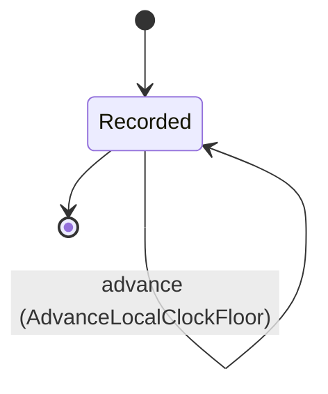

---
# generated by connectors-docs, do not edit
title: "clock"
sidebar_label: "clock"
sidebar_position: 7
description: "Explicitly trusted local clock configuration, bounded observations and owner anti-regression floors."
custom_edit_url: null
---

# clock

:::info[Typed specification]

Generated by the pinned `ess generate --kind docs` from [`ess`](https://github.com/beyond10x/connectors/tree/main/ess). Structural validation establishes consistency; behaviour, storage and cross-record predicates remain implementation obligations.

:::

Explicitly trusted local clock configuration, bounded observations and owner anti-regression floors.

`connectors.clock` is one of connectors's bounded contexts. [Back to the index](../index.md).

## Types

### `Configuration`

`connectors.clock.Configuration` is a record of four fields:

- `format` — `String`
- `address` — `String`
- `public_key` — `String`
- `max_rate_error_ppm` — `Integer`

Every value satisfies `format == "roughtime-clock/1"` and `(max_rate_error_ppm >= 1 and max_rate_error_ppm <= 10000)`.

### `Observation`

`connectors.clock.Observation` is a record of three fields:

- `configuration_sha256` — `String`
- `lower_unix_ms` — `Integer`
- `upper_unix_ms` — `Integer`

### `RegistryClockFloorFile`

`connectors.clock.RegistryClockFloorFile` is a record of one field:

- `last_seen_ms` — `Integer`

Every value satisfies `last_seen_ms >= 0`.

Two of the types above are reached by nothing else in this system: `connectors.clock.Configuration` and `connectors.clock.RegistryClockFloorFile`. No entity, view, command, event, error or crossing names them, so it is either vocabulary something outside this specification uses or a leftover — and only a person can tell which.

## Entities

An entity is what this context is about: something with an identity that outlives any one request, a shape, and a lifecycle. The lifecycle is exhaustive — a move that is not drawn below is a move this specification does not permit, and that is the only way it says so. Every move is labelled with the command that takes it, because a move nothing can trigger is refused rather than drawn.

### `LocalClockFloor`

`connectors.clock.LocalClockFloor`.

An instance is identified by `owner`, a `String`. The name is part of the model and not a convention: a view projects the identity under that name, so a projection inventing its own would disagree with the view.

It holds:

- `lower_unix_ms` — `Integer`

It declares no relation to another entity, and no other entity names it.

Every instance satisfies `lower_unix_ms >= 0` — a predicate over this entity's own fields, checked against them rather than stored as a sentence, so an invariant reading something the entity does not have is refused instead of documented.

Its state is a `connectors.clock.LocalClockFloor.State`, one of `Recorded`. That enum is synthesised from the lifecycle rather than declared beside it, so the states a view's filter compares and the states drawn below cannot disagree.

An instance is created in `Recorded`. `Recorded` is terminal, so an instance may rest there forever. That is declared rather than inferred from having no way out: an entity that cannot leave a state is either finished or stuck, and only its author knows which.

Each move is taken by a declared command outcome, and a move nothing takes is refused as `missing_causation` rather than left as a state change nobody can trigger:

- `advance` — taken by `connectors.clock.AdvanceLocalClockFloor` on its `advanced` outcome

An instance is brought into existence by `connectors.clock.RecordLocalClockFloor` on its `recorded` outcome.

It has one state, so there is no move to permit or to forbid.

One view projects it: [`LocalClockFloors`](#localclockfloors).

## Views

A view is what the outside world is promised it can observe. Each one says which instances it contains and how soon it reflects a command that has already returned, because "you can read this" without "how soon" is the promise every flaky suite is built on.

### `LocalClockFloors`

`connectors.clock.LocalClockFloors`.

It reads [`LocalClockFloor`](#localclockfloor).

It contains every instance of that entity: no filter narrows it, which is a decision somebody made and not a line somebody omitted.

It exposes:

- `owner` — `String`
- `lower_unix_ms` — `Integer`
- `state` — `connectors.clock.LocalClockFloor.State`

It declares no order, so the rows come back in whatever order the implementation has, and two reads may disagree.

**Read-your-writes**: it is current the moment the command that changed it returns. A caller that has just created an invoice and cannot see it in here has been told a lie about what it did.

A generated scenario asserts it once, immediately after the command: a view promising this and not keeping the promise has to fail the suite rather than be retried until it passes.

## Commands

### `AdvanceLocalClockFloor`

`connectors.clock.AdvanceLocalClockFloor`.

It takes:

- `owner` — `String`
- `lower_unix_ms` — `Integer`

It has two outcomes.

**`regressed`** — Taken when the existing subject's stored fields satisfy `lower_unix_ms > input.lower_unix_ms`. No entity in this specification changes. It reports `connectors.clock.ClockFloorRegressed`, carrying `owner`. It emits nothing. A test establishes and independently observes the subject enum fact before selecting this branch.

**`advanced`** — The default branch, taken when no other outcome's condition matched. It moves a `connectors.clock.LocalClockFloor` from `Recorded` to `Recorded`, along the declared move `advance`. The instance is the one named by the input field `owner`. It emits `connectors.clock.LocalClockFloorAdvanced`. It sets `lower_unix_ms` from `input.lower_unix_ms`. A test reaches it by constructing an input that satisfies no other outcome's condition.

### `RecordLocalClockFloor`

`connectors.clock.RecordLocalClockFloor`.

It takes:

- `owner` — `String`
- `lower_unix_ms` — `Integer`

It has one outcome.

**`recorded`** — The default branch, taken when no other outcome's condition matched. It creates a `connectors.clock.LocalClockFloor`, which starts in `Recorded`. The new instance's identity is published as `owner` on `connectors.clock.LocalClockFloorRecorded`. It emits `connectors.clock.LocalClockFloorRecorded`. It sets `lower_unix_ms` from `input.lower_unix_ms`. A test reaches it by constructing an input that satisfies no other outcome's condition.

## Events

### `LocalClockFloorAdvanced`

`connectors.clock.LocalClockFloorAdvanced`.

It carries:

- `owner` — `String`
- `lower_unix_ms` — `Integer`

Emitted by `connectors.clock.AdvanceLocalClockFloor` on its `advanced` outcome.

Nothing in this system reacts to it.

### `LocalClockFloorRecorded`

`connectors.clock.LocalClockFloorRecorded`.

It carries:

- `owner` — `String`

Emitted by `connectors.clock.RecordLocalClockFloor` on its `recorded` outcome.

Nothing in this system reacts to it.

## Errors

### `ClockFloorRegressed`

It carries:

- `owner` — `String`

Reported by `connectors.clock.AdvanceLocalClockFloor` on its `regressed` outcome.

## Actors

An actor is who may ask this context for something. Every grant below points at a command this specification declares — a grant is a resolved reference, so "may invoke" something nobody wrote is not a permission this model can express, and an authorisation that authorises nothing cannot ship quietly.

### `LocalHost`

`connectors.clock.LocalHost`.

It may invoke [`AdvanceLocalClockFloor`](#advancelocalclockfloor) and [`RecordLocalClockFloor`](#recordlocalclockfloor).

---

Generated from connectors v1 · model digest `4ca84ed80d29dc59e4e520985535bcef4cd918acbd4248ac04a718dadb9051a7` · contract digest `slice-sha256/2:ff338954309949763c01849777827042bde616e6f00107ee1618ed5d5b251092`. Do not edit this file; change the specification and regenerate it with `ess generate`.
