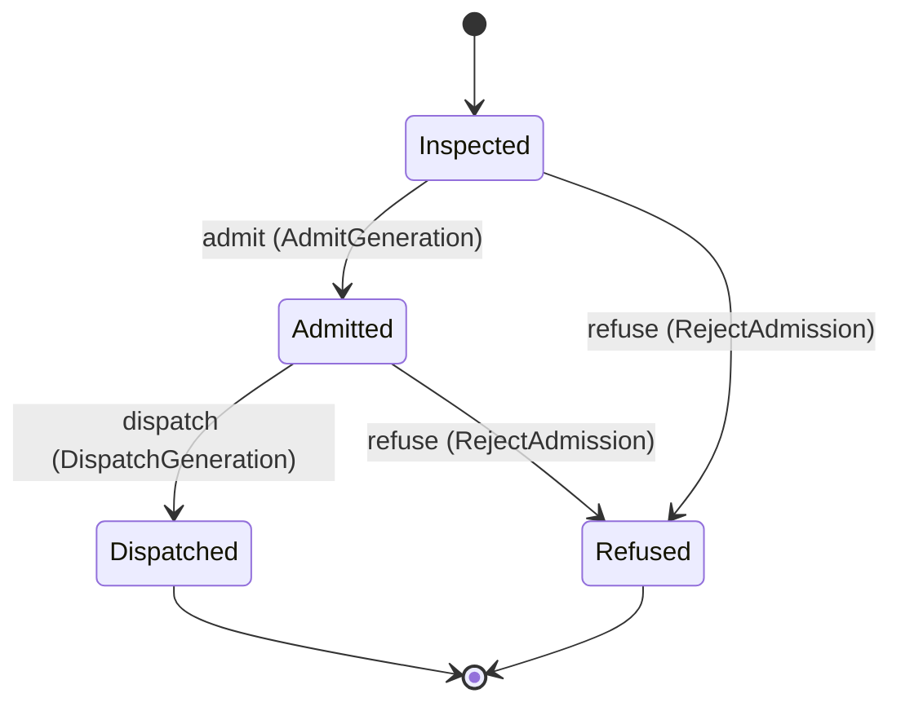
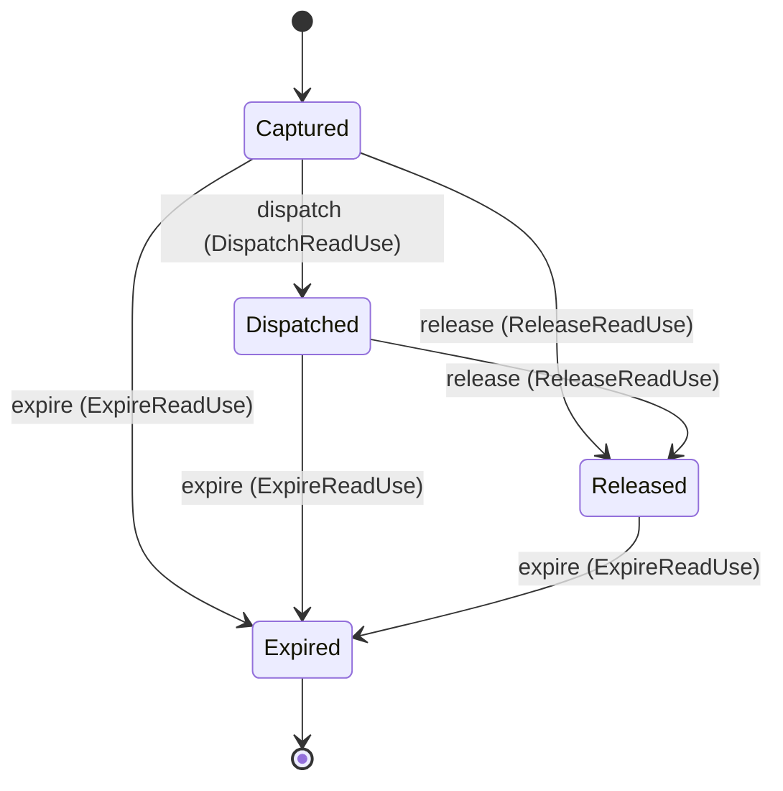

---
# generated by connectors-docs, do not edit
title: "credential_evidence"
sidebar_label: "credential_evidence"
sidebar_position: 9
description: "Proposed generation-bound evidence values and transient dispatch admission decisions."
custom_edit_url: null
---

# credential_evidence

:::info[Typed specification]

Generated by the pinned `ess generate --kind docs` from [`ess`](https://github.com/beyond10x/connectors/tree/main/ess). Structural validation establishes consistency; behaviour, storage and cross-record predicates remain implementation obligations.

:::

Proposed generation-bound evidence values and transient dispatch admission decisions.

`connectors.credential_evidence` is one of connectors's bounded contexts. [Back to the index](../index.md).

## Types

### `AdmissionId`

`connectors.credential_evidence.AdmissionId` wraps `Uuid` and is not interchangeable with one: the whole value of naming it separately is the crossings the model then refuses.

### `CheckKind`

`connectors.credential_evidence.CheckKind` is one of `custody_reachable`, `credential_present`, `credential_valid`, `identity_check`, `scope_check`, `permission_check` and `verify_operation`.

### `CheckResult`

`connectors.credential_evidence.CheckResult` is one of `ok`, `missing`, `invalid`, `insufficient`, `denied`, `unavailable`, `uncertain` and `not_run`.

### `EvidenceCheck`

`connectors.credential_evidence.EvidenceCheck` is a record of seven fields:

- `check` — `connectors.credential_evidence.CheckKind`
- `result` — `connectors.credential_evidence.CheckResult`
- `source` — `connectors.credential_evidence.EvidenceOrigin`
- `source_generation_id` — `Optional<connectors.credentials.CredentialGenerationId>`, which may be absent
- `subject_ref` — `Optional<String>`, which may be absent
- `collected_at` — `Timestamp`
- `valid_until` — `Timestamp`

### `EvidenceOrigin`

`connectors.credential_evidence.EvidenceOrigin` is one of `local_metadata`, `provider_read` and `refresh_lineage`.

### `EvidenceSnapshot`

`connectors.credential_evidence.EvidenceSnapshot` is a record of six fields:

- `generation_id` — `connectors.credentials.CredentialGenerationId`
- `binding` — `connectors.credentials.ConnectionBinding`
- `observed_external_identity` — `Optional<connectors.credentials.ExternalIdentity>`, which may be absent
- `granted_scopes` — `Optional<List<String>>`, which may be absent
- `credential_expires_at` — `Optional<Timestamp>`, which may be absent
- `checks` — `List<connectors.credential_evidence.EvidenceCheck>`

### `ReadUseId`

`connectors.credential_evidence.ReadUseId` wraps `Uuid` and is not interchangeable with one: the whole value of naming it separately is the crossings the model then refuses.

### `RefusalReason`

`connectors.credential_evidence.RefusalReason` is one of `identity_changed`, `generation_changed`, `validation_required`, `revoked`, `expired`, `stale_evidence`, `insufficient_scope`, `permission_denied`, `host_forbidden`, `binding_changed`, `snapshot_unavailable` and `refresh_uncertain`.

## Entities

An entity is what this context is about: something with an identity that outlives any one request, a shape, and a lifecycle. The lifecycle is exhaustive — a move that is not drawn below is a move this specification does not permit, and that is the only way it says so. Every move is labelled with the command that takes it, because a move nothing can trigger is refused rather than drawn.

### `DispatchAdmission`

`connectors.credential_evidence.DispatchAdmission`.

An instance is identified by `admission_id`, a `connectors.credential_evidence.AdmissionId`. The name is part of the model and not a convention: a view projects the identity under that name, so a projection inventing its own would disagree with the view.

It holds:

- `request_id` — `String`
- `operation_ref` — `String`
- `generation_id` — `connectors.credentials.CredentialGenerationId`
- `binding` — `connectors.credentials.ConnectionBinding`
- `expected_external_identity` — `connectors.credentials.ExternalIdentity`
- `evidence` — `connectors.credential_evidence.EvidenceSnapshot`

It references at most one [`connectors.credentials.CredentialGeneration`](./connectors-credentials.md#credentialgeneration), as `captured_generation`, carried by `DispatchAdmission.generation_id`.

No invariant is declared, so nothing here constrains an instance at rest.

Its state is a `connectors.credential_evidence.DispatchAdmission.State`, one of `Admitted`, `Dispatched`, `Inspected` and `Refused`. That enum is synthesised from the lifecycle rather than declared beside it, so the states a view's filter compares and the states drawn below cannot disagree.

An instance is created in `Inspected`. `Dispatched` and `Refused` are terminal, so an instance may rest there forever. That is declared rather than inferred from having no way out: an entity that cannot leave a state is either finished or stuck, and only its author knows which.

Each move is taken by a declared command outcome, and a move nothing takes is refused as `missing_causation` rather than left as a state change nobody can trigger:

- `admit` — taken by `connectors.credential_evidence.AdmitGeneration` on its `admitted` outcome
- `refuse` — taken by `connectors.credential_evidence.RejectAdmission` on its `refused` outcome
- `dispatch` — taken by `connectors.credential_evidence.DispatchGeneration` on its `dispatched` outcome

An instance is brought into existence by `connectors.credential_evidence.InspectGeneration` on its `inspected` outcome.

Illegal transitions are illegal by absence: no rule forbids them, there is simply no arrow, because a rule would be a second place for the same truth to live. A diagram cannot show an absence, so the pairs it does not connect are listed here, derived from the same transitions — anything named below is a move this specification does not permit.

- `Admitted` may not become `Inspected`
- `Dispatched` may not become `Admitted`
- `Dispatched` may not become `Inspected`
- `Dispatched` may not become `Refused`
- `Inspected` may not become `Dispatched`
- `Refused` may not become `Admitted`
- `Refused` may not become `Dispatched`
- `Refused` may not become `Inspected`

One view projects it: [`AdmissionStates`](#admissionstates).

### `ReadUse`

`connectors.credential_evidence.ReadUse`.

An instance is identified by `use_id`, a `connectors.credential_evidence.ReadUseId`. The name is part of the model and not a convention: a view projects the identity under that name, so a projection inventing its own would disagree with the view.

It holds:

- `connection_ref` — `String`
- `generation_id` — `connectors.credentials.CredentialGenerationId`
- `custody_version_ref` — `String`
- `publication_fence` — `String`
- `expires_at` — `Timestamp`
- `dispatch_opened` — `Boolean`
- `released` — `Boolean`

It references at most one [`connectors.auth_bindings.Connection`](./connectors-auth_bindings.md#connection), as `connection`, carried by `ReadUse.connection_ref`. It references at most one [`connectors.credentials.CredentialGeneration`](./connectors-credentials.md#credentialgeneration), as `captured_generation`, carried by `ReadUse.generation_id`. It references at most one [`connectors.auth_bindings.CustodyVersion`](./connectors-auth_bindings.md#custodyversion), as `custody_version`, carried by `ReadUse.custody_version_ref`.

No invariant is declared, so nothing here constrains an instance at rest.

Its state is a `connectors.credential_evidence.ReadUse.State`, one of `Captured`, `Dispatched`, `Expired` and `Released`. That enum is synthesised from the lifecycle rather than declared beside it, so the states a view's filter compares and the states drawn below cannot disagree.

An instance is created in `Captured`. `Expired` is terminal, so an instance may rest there forever. That is declared rather than inferred from having no way out: an entity that cannot leave a state is either finished or stuck, and only its author knows which.

Each move is taken by a declared command outcome, and a move nothing takes is refused as `missing_causation` rather than left as a state change nobody can trigger:

- `dispatch` — taken by `connectors.credential_evidence.DispatchReadUse` on its `dispatched` outcome
- `release` — taken by `connectors.credential_evidence.ReleaseReadUse` on its `released` outcome
- `expire` — taken by `connectors.credential_evidence.ExpireReadUse` on its `expired` outcome

An instance is brought into existence by `connectors.credential_evidence.CaptureReadUse` on its `captured` outcome.

Illegal transitions are illegal by absence: no rule forbids them, there is simply no arrow, because a rule would be a second place for the same truth to live. A diagram cannot show an absence, so the pairs it does not connect are listed here, derived from the same transitions — anything named below is a move this specification does not permit.

- `Dispatched` may not become `Captured`
- `Expired` may not become `Captured`
- `Expired` may not become `Dispatched`
- `Expired` may not become `Released`
- `Released` may not become `Captured`
- `Released` may not become `Dispatched`

One view projects it: [`ReadUseStates`](#readusestates).

## Views

A view is what the outside world is promised it can observe. Each one says which instances it contains and how soon it reflects a command that has already returned, because "you can read this" without "how soon" is the promise every flaky suite is built on.

### `AdmissionStates`

`connectors.credential_evidence.AdmissionStates`.

It reads [`DispatchAdmission`](#dispatchadmission).

It contains every instance of that entity: no filter narrows it, which is a decision somebody made and not a line somebody omitted.

It exposes:

- `admission_id` — `connectors.credential_evidence.AdmissionId`
- `request_id` — `String`
- `operation_ref` — `String`
- `generation_id` — `connectors.credentials.CredentialGenerationId`
- `binding` — `connectors.credentials.ConnectionBinding`
- `evidence` — `connectors.credential_evidence.EvidenceSnapshot`
- `state` — `connectors.credential_evidence.DispatchAdmission.State`

It declares no order, so the rows come back in whatever order the implementation has, and two reads may disagree.

**Read-your-writes**: it is current the moment the command that changed it returns. A caller that has just created an invoice and cannot see it in here has been told a lie about what it did.

A generated scenario asserts it once, immediately after the command: a view promising this and not keeping the promise has to fail the suite rather than be retried until it passes.

### `ReadUseStates`

`connectors.credential_evidence.ReadUseStates`.

It reads [`ReadUse`](#readuse).

It contains every instance of that entity: no filter narrows it, which is a decision somebody made and not a line somebody omitted.

It exposes:

- `use_id` — `connectors.credential_evidence.ReadUseId`
- `connection_ref` — `String`
- `custody_version_ref` — `String`
- `publication_fence` — `String`
- `state` — `connectors.credential_evidence.ReadUse.State`

It declares no order, so the rows come back in whatever order the implementation has, and two reads may disagree.

**Read-your-writes**: it is current the moment the command that changed it returns. A caller that has just created an invoice and cannot see it in here has been told a lie about what it did.

A generated scenario asserts it once, immediately after the command: a view promising this and not keeping the promise has to fail the suite rather than be retried until it passes.

## Commands

### `AdmitGeneration`

`connectors.credential_evidence.AdmitGeneration`.

It takes:

- `admission_id` — `connectors.credential_evidence.AdmissionId`

It has two outcomes.

**`admitted`** — The default branch, taken when no other outcome's condition matched. It moves a `connectors.credential_evidence.DispatchAdmission` from `Inspected` to `Admitted`, along the declared move `admit`. The instance is the one named by the input field `admission_id`. It emits `connectors.credential_evidence.GenerationAdmitted`. A test reaches it by constructing an input that satisfies no other outcome's condition.

**`wrong-state`** — Taken when the subject is resting in a state none of this command's moves start from — a `connectors.credential_evidence.DispatchAdmission` in `Admitted`, `Dispatched` and `Refused`, which is what is left of the lifecycle once this command's own moves are taken away. The document lists none of it. No entity in this specification changes. It reports `connectors.credential_evidence.AdmissionStateConflict`, carrying `state`. It emits nothing. A test reaches it by driving an instance into one of those states and then issuing the command, because no input selects this branch.

### `CaptureReadUse`

`connectors.credential_evidence.CaptureReadUse`.

It takes:

- `use_id` — `connectors.credential_evidence.ReadUseId`
- `connection_ref` — `String`
- `generation_id` — `connectors.credentials.CredentialGenerationId`
- `custody_version_ref` — `String`
- `publication_fence` — `String`
- `expires_at` — `Timestamp`

It has one outcome.

**`captured`** — The default branch, taken when no other outcome's condition matched. It creates a `connectors.credential_evidence.ReadUse`, which starts in `Captured`. The new instance's identity is published as `use_id` on `connectors.credential_evidence.ReadUseCaptured`. It emits `connectors.credential_evidence.ReadUseCaptured`. It sets `connection_ref` from `input.connection_ref`, `generation_id` from `input.generation_id`, `custody_version_ref` from `input.custody_version_ref`, `publication_fence` from `input.publication_fence`, `expires_at` from `input.expires_at`, `dispatch_opened` from `"false"` and `released` from `"false"`. A test reaches it by constructing an input that satisfies no other outcome's condition.

### `DispatchGeneration`

`connectors.credential_evidence.DispatchGeneration`.

It takes:

- `admission_id` — `connectors.credential_evidence.AdmissionId`
- `generation_id` — `connectors.credentials.CredentialGenerationId`

It has three outcomes.

**`generation-changed`** — Taken when the existing subject's stored fields satisfy `generation_id != input.generation_id`. No entity in this specification changes. It reports `connectors.credential_evidence.AdmissionGenerationChanged`, carrying `admission_id`. It emits nothing. A test establishes and independently observes the subject enum fact before selecting this branch.

**`dispatched`** — The default branch, taken when no other outcome's condition matched. It moves a `connectors.credential_evidence.DispatchAdmission` from `Admitted` to `Dispatched`, along the declared move `dispatch`. The instance is the one named by the input field `admission_id`. It emits `connectors.credential_evidence.GenerationDispatched`. A test reaches it by constructing an input that satisfies no other outcome's condition.

**`wrong-state`** — Taken when the subject is resting in a state none of this command's moves start from — a `connectors.credential_evidence.DispatchAdmission` in `Dispatched`, `Inspected` and `Refused`, which is what is left of the lifecycle once this command's own moves are taken away. The document lists none of it. No entity in this specification changes. It reports `connectors.credential_evidence.AdmissionStateConflict`, carrying `state`. It emits nothing. A test reaches it by driving an instance into one of those states and then issuing the command, because no input selects this branch.

### `DispatchReadUse`

`connectors.credential_evidence.DispatchReadUse`.

It takes:

- `use_id` — `connectors.credential_evidence.ReadUseId`

It has two outcomes.

**`dispatched`** — The default branch, taken when no other outcome's condition matched. It moves a `connectors.credential_evidence.ReadUse` from `Captured` to `Dispatched`, along the declared move `dispatch`. The instance is the one named by the input field `use_id`. It emits `connectors.credential_evidence.ReadUseDispatched`. It sets `dispatch_opened` from `"true"`. A test reaches it by constructing an input that satisfies no other outcome's condition.

**`wrong-state`** — Taken when the subject is resting in a state none of this command's moves start from — a `connectors.credential_evidence.ReadUse` in `Dispatched`, `Expired` and `Released`, which is what is left of the lifecycle once this command's own moves are taken away. The document lists none of it. No entity in this specification changes. It reports `connectors.credential_evidence.ReadUseStateConflict`, carrying `state`. It emits nothing. A test reaches it by driving an instance into one of those states and then issuing the command, because no input selects this branch.

### `ExpireReadUse`

`connectors.credential_evidence.ExpireReadUse`.

It takes:

- `use_id` — `connectors.credential_evidence.ReadUseId`

It has two outcomes.

**`expired`** — The default branch, taken when no other outcome's condition matched. It moves a `connectors.credential_evidence.ReadUse` from `Captured`, `Dispatched` and `Released` to `Expired`, along the declared move `expire`. The instance is the one named by the input field `use_id`. It emits `connectors.credential_evidence.ReadUseExpired`. A test reaches it by constructing an input that satisfies no other outcome's condition.

**`wrong-state`** — Taken when the subject is resting in a state none of this command's moves start from — a `connectors.credential_evidence.ReadUse` in `Expired`, which is what is left of the lifecycle once this command's own moves are taken away. The document lists none of it. No entity in this specification changes. It reports `connectors.credential_evidence.ReadUseStateConflict`, carrying `state`. It emits nothing. A test reaches it by driving an instance into one of those states and then issuing the command, because no input selects this branch.

### `InspectGeneration`

`connectors.credential_evidence.InspectGeneration`.

It takes:

- `request_id` — `String`
- `operation_ref` — `String`
- `generation_id` — `connectors.credentials.CredentialGenerationId`
- `binding` — `connectors.credentials.ConnectionBinding`
- `expected_external_identity` — `connectors.credentials.ExternalIdentity`
- `evidence` — `connectors.credential_evidence.EvidenceSnapshot`

It has one outcome.

**`inspected`** — The default branch, taken when no other outcome's condition matched. It creates a `connectors.credential_evidence.DispatchAdmission`, which starts in `Inspected`. The new instance's identity is published as `admission_id` on `connectors.credential_evidence.GenerationInspected`. It emits `connectors.credential_evidence.GenerationInspected`. It sets `request_id` from `input.request_id`, `operation_ref` from `input.operation_ref`, `generation_id` from `input.generation_id`, `binding` from `input.binding`, `expected_external_identity` from `input.expected_external_identity` and `evidence` from `input.evidence`. A test reaches it by constructing an input that satisfies no other outcome's condition.

### `RejectAdmission`

`connectors.credential_evidence.RejectAdmission`.

It takes:

- `admission_id` — `connectors.credential_evidence.AdmissionId`
- `reason` — `connectors.credential_evidence.RefusalReason`

It has two outcomes.

**`refused`** — The default branch, taken when no other outcome's condition matched. It moves a `connectors.credential_evidence.DispatchAdmission` from `Admitted` and `Inspected` to `Refused`, along the declared move `refuse`. The instance is the one named by the input field `admission_id`. It emits `connectors.credential_evidence.AdmissionRefused`. A test reaches it by constructing an input that satisfies no other outcome's condition.

**`wrong-state`** — Taken when the subject is resting in a state none of this command's moves start from — a `connectors.credential_evidence.DispatchAdmission` in `Dispatched` and `Refused`, which is what is left of the lifecycle once this command's own moves are taken away. The document lists none of it. No entity in this specification changes. It reports `connectors.credential_evidence.AdmissionStateConflict`, carrying `state`. It emits nothing. A test reaches it by driving an instance into one of those states and then issuing the command, because no input selects this branch.

### `ReleaseReadUse`

`connectors.credential_evidence.ReleaseReadUse`.

It takes:

- `use_id` — `connectors.credential_evidence.ReadUseId`

It has two outcomes.

**`released`** — The default branch, taken when no other outcome's condition matched. It moves a `connectors.credential_evidence.ReadUse` from `Captured` and `Dispatched` to `Released`, along the declared move `release`. The instance is the one named by the input field `use_id`. It emits `connectors.credential_evidence.ReadUseReleased`. It sets `released` from `"true"`. A test reaches it by constructing an input that satisfies no other outcome's condition.

**`wrong-state`** — Taken when the subject is resting in a state none of this command's moves start from — a `connectors.credential_evidence.ReadUse` in `Expired` and `Released`, which is what is left of the lifecycle once this command's own moves are taken away. The document lists none of it. No entity in this specification changes. It reports `connectors.credential_evidence.ReadUseStateConflict`, carrying `state`. It emits nothing. A test reaches it by driving an instance into one of those states and then issuing the command, because no input selects this branch.

## Events

### `AdmissionRefused`

`connectors.credential_evidence.AdmissionRefused`.

It carries:

- `admission_id` — `connectors.credential_evidence.AdmissionId`
- `reason` — `connectors.credential_evidence.RefusalReason`

Emitted by `connectors.credential_evidence.RejectAdmission` on its `refused` outcome.

Nothing in this system reacts to it.

### `GenerationAdmitted`

`connectors.credential_evidence.GenerationAdmitted`.

It carries:

- `admission_id` — `connectors.credential_evidence.AdmissionId`

Emitted by `connectors.credential_evidence.AdmitGeneration` on its `admitted` outcome.

Nothing in this system reacts to it.

### `GenerationDispatched`

`connectors.credential_evidence.GenerationDispatched`.

It carries:

- `admission_id` — `connectors.credential_evidence.AdmissionId`
- `generation_id` — `connectors.credentials.CredentialGenerationId`

Emitted by `connectors.credential_evidence.DispatchGeneration` on its `dispatched` outcome.

Nothing in this system reacts to it.

### `GenerationInspected`

`connectors.credential_evidence.GenerationInspected`.

It carries:

- `admission_id` — `connectors.credential_evidence.AdmissionId`

Emitted by `connectors.credential_evidence.InspectGeneration` on its `inspected` outcome.

Nothing in this system reacts to it.

### `ReadUseCaptured`

`connectors.credential_evidence.ReadUseCaptured`.

It carries:

- `use_id` — `connectors.credential_evidence.ReadUseId`

Emitted by `connectors.credential_evidence.CaptureReadUse` on its `captured` outcome.

Nothing in this system reacts to it.

### `ReadUseDispatched`

`connectors.credential_evidence.ReadUseDispatched`.

It carries:

- `use_id` — `connectors.credential_evidence.ReadUseId`

Emitted by `connectors.credential_evidence.DispatchReadUse` on its `dispatched` outcome.

Nothing in this system reacts to it.

### `ReadUseExpired`

`connectors.credential_evidence.ReadUseExpired`.

It carries:

- `use_id` — `connectors.credential_evidence.ReadUseId`

Emitted by `connectors.credential_evidence.ExpireReadUse` on its `expired` outcome.

Nothing in this system reacts to it.

### `ReadUseReleased`

`connectors.credential_evidence.ReadUseReleased`.

It carries:

- `use_id` — `connectors.credential_evidence.ReadUseId`

Emitted by `connectors.credential_evidence.ReleaseReadUse` on its `released` outcome.

Nothing in this system reacts to it.

## Errors

### `AdmissionGenerationChanged`

It carries:

- `admission_id` — `connectors.credential_evidence.AdmissionId`

Reported by `connectors.credential_evidence.DispatchGeneration` on its `generation-changed` outcome.

### `AdmissionStateConflict`

It carries:

- `state` — `connectors.credential_evidence.DispatchAdmission.State`

Reported by `connectors.credential_evidence.AdmitGeneration` on its `wrong-state` outcome.

Reported by `connectors.credential_evidence.DispatchGeneration` on its `wrong-state` outcome.

Reported by `connectors.credential_evidence.RejectAdmission` on its `wrong-state` outcome.

### `ReadUseStateConflict`

It carries:

- `state` — `connectors.credential_evidence.ReadUse.State`

Reported by `connectors.credential_evidence.DispatchReadUse` on its `wrong-state` outcome.

Reported by `connectors.credential_evidence.ExpireReadUse` on its `wrong-state` outcome.

Reported by `connectors.credential_evidence.ReleaseReadUse` on its `wrong-state` outcome.

## Actors

An actor is who may ask this context for something. Every grant below points at a command this specification declares — a grant is a resolved reference, so "may invoke" something nobody wrote is not a permission this model can express, and an authorisation that authorises nothing cannot ship quietly.

### `LocalHost`

`connectors.credential_evidence.LocalHost`.

It may invoke [`CaptureReadUse`](#capturereaduse), [`DispatchReadUse`](#dispatchreaduse), [`ExpireReadUse`](#expirereaduse) and [`ReleaseReadUse`](#releasereaduse).

---

Generated from connectors v1 · model digest `4ca84ed80d29dc59e4e520985535bcef4cd918acbd4248ac04a718dadb9051a7` · contract digest `slice-sha256/2:b642b966bf21b5cc72ff9117a9eb06eee8a5d8e9625d87d479d7223be32168d1`. Do not edit this file; change the specification and regenerate it with `ess generate`.
