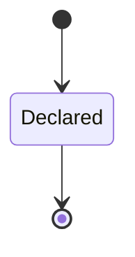
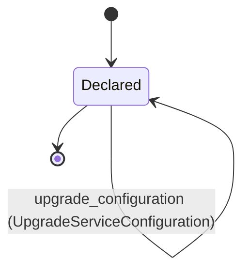

---
# generated by connectors-docs, do not edit
title: "declarations"
sidebar_label: "declarations"
sidebar_position: 12
description: "connectors.declarations is one of connectors's bounded contexts. Back to the index."
custom_edit_url: null
---

# declarations

:::info[Typed specification]

Generated by the pinned `ess generate --kind docs` from [`ess`](https://github.com/beyond10x/connectors/tree/main/ess). Structural validation establishes consistency; behaviour, storage and cross-record predicates remain implementation obligations.

:::

`connectors.declarations` is one of connectors's bounded contexts. [Back to the index](../index.md).

## Types

### `AvailabilityDecision`

`connectors.declarations.AvailabilityDecision` is a record of two fields:

- `advertised` — `Boolean`
- `lookup_error` — `Optional<connectors.service_wire.ErrorCode>`, which may be absent

### `BodyParameter`

`connectors.declarations.BodyParameter` is one of four shapes, told apart by a `kind` field — tagged, so a decoder never has to guess which branch it is reading:

- `boolean` — `connectors.declarations.BooleanBodyConstant`
- `input` — `connectors.declarations.NamedParameter`
- `integer` — `connectors.declarations.IntegerBodyConstant`
- `string` — `connectors.declarations.ConstantParameter`

### `BooleanBodyConstant`

`connectors.declarations.BooleanBodyConstant` is a record of one field:

- `value` — `Boolean`

### `ConstantParameter`

`connectors.declarations.ConstantParameter` is a record of one field:

- `value` — `String`

### `IntegerBodyConstant`

`connectors.declarations.IntegerBodyConstant` is a record of one field:

- `value` — `Integer`

### `NamedParameter`

`connectors.declarations.NamedParameter` is a record of one field:

- `name` — `String`

### `OperationAvailability`

`connectors.declarations.OperationAvailability` is a record of six fields:

- `implemented` — `Boolean`
- `binding_supported` — `Boolean`
- `enabled` — `Boolean`
- `metadata_admitted` — `Boolean`
- `lookup_admitted` — `Boolean`
- `dependency_ready` — `Boolean`

### `Parameter`

`connectors.declarations.Parameter` is one of three shapes, told apart by a `kind` field — tagged, so a decoder never has to guess which branch it is reading:

- `binding` — `connectors.declarations.NamedParameter`
- `constant` — `connectors.declarations.ConstantParameter`
- `input` — `connectors.declarations.NamedParameter`

### `RequestMapping`

`connectors.declarations.RequestMapping` is a record of eight fields:

- `operation` — `String`
- `upstream_operation` — `String`
- `path` — `String`
- `method` — `String`
- `path_parameters` — `Map<String, connectors.declarations.Parameter>`
- `query_parameters` — `Map<String, connectors.declarations.Parameter>`
- `obligations` — `List<String>`
- `response_prefix_limit` — `Optional<Integer>`, which may be absent

### `ServiceHostConfiguration`

`connectors.declarations.ServiceHostConfiguration` is a record of two fields:

- `instance` — `String`
- `state` — `Optional<String>`, which may be absent

### `UpstreamSource`

`connectors.declarations.UpstreamSource` is a record of five fields:

- `path` — `String`
- `url` — `String`
- `revision` — `String`
- `sha256` — `String`
- `base_path` — `String`

### `WriteMapping`

`connectors.declarations.WriteMapping` is a record of seven fields:

- `operation` — `String`
- `upstream_operation` — `String`
- `path` — `String`
- `method` — `String`
- `path_parameters` — `Map<String, connectors.declarations.Parameter>`
- `query_parameters` — `Map<String, connectors.declarations.Parameter>`
- `body` — `Map<String, connectors.declarations.BodyParameter>`

Three of the types above are reached by nothing else in this system: `connectors.declarations.AvailabilityDecision`, `connectors.declarations.OperationAvailability` and `connectors.declarations.ServiceHostConfiguration`. No entity, view, command, event, error or crossing names them, so it is either vocabulary something outside this specification uses or a leftover — and only a person can tell which.

## Entities

An entity is what this context is about: something with an identity that outlives any one request, a shape, and a lifecycle. The lifecycle is exhaustive — a move that is not drawn below is a move this specification does not permit, and that is the only way it says so. Every move is labelled with the command that takes it, because a move nothing can trigger is refused rather than drawn.

### `AdapterSpecification`

`connectors.declarations.AdapterSpecification`.

An instance is identified by `adapter_id`, a `String`. The name is part of the model and not a convention: a view projects the identity under that name, so a projection inventing its own would disagree with the view.

It holds:

- `kind_version` — `String`
- `implementation_version` — `String`
- `upstream` — `Optional<connectors.declarations.UpstreamSource>`, which may be absent
- `source_refs` — `List<String>`

It references any number of [`connectors.artifact_provenance.Source`](./connectors-artifact_provenance.md#source), as `sources`, carried by `AdapterSpecification.source_refs`. It owns any number of [`OperationDeclaration`](#operationdeclaration), as `operations`, carried by `OperationDeclaration.adapter_id`.

No invariant is declared, so nothing here constrains an instance at rest.

Its state is a `connectors.declarations.AdapterSpecification.State`, one of `Declared`. That enum is synthesised from the lifecycle rather than declared beside it, so the states a view's filter compares and the states drawn below cannot disagree.

An instance is created in `Declared`. `Declared` is terminal, so an instance may rest there forever. That is declared rather than inferred from having no way out: an entity that cannot leave a state is either finished or stuck, and only its author knows which.

It declares no moves, so nothing changes its state once it exists.

It has one state, so there is no move to permit or to forbid.

No view projects it, so nothing outside this context is promised a way to observe one.

### `OperationDeclaration`

`connectors.declarations.OperationDeclaration`.

An instance is identified by `operation_id`, a `String`. The name is part of the model and not a convention: a view projects the identity under that name, so a projection inventing its own would disagree with the view.

It holds:

- `adapter_id` — `String`
- `contract` — `String`
- `profile` — `String`
- `input_schema_json` — `String`
- `output_schema_json` — `String`
- `request_mapping` — `Optional<connectors.declarations.RequestMapping>`, which may be absent
- `write_mapping` — `Optional<connectors.declarations.WriteMapping>`, which may be absent
- `curation` — `Optional<connectors.artifact_provenance.Curation>`, which may be absent
- `requires_auth` — `Optional<List<connectors.auth_bindings.AuthRequirement>>`, which may be absent

Its `adapter_id` is what [`AdapterSpecification`](#adapterspecification) owns it by, as `operations`.

No invariant is declared, so nothing here constrains an instance at rest.

Its state is a `connectors.declarations.OperationDeclaration.State`, one of `Declared`. That enum is synthesised from the lifecycle rather than declared beside it, so the states a view's filter compares and the states drawn below cannot disagree.

An instance is created in `Declared`. `Declared` is terminal, so an instance may rest there forever. That is declared rather than inferred from having no way out: an entity that cannot leave a state is either finished or stuck, and only its author knows which.

It declares no moves, so nothing changes its state once it exists.

It has one state, so there is no move to permit or to forbid.

No view projects it, so nothing outside this context is promised a way to observe one.

### `ServiceConfiguration`

`connectors.declarations.ServiceConfiguration`.

An instance is identified by `instance_id`, a `String`. The name is part of the model and not a convention: a view projects the identity under that name, so a projection inventing its own would disagree with the view.

It holds:

- `adapter_id` — `String`
- `revision` — `String`
- `registry_epoch` — `Integer`

It references at most one [`AdapterSpecification`](#adapterspecification), as `adapter`, carried by `ServiceConfiguration.adapter_id`.

No invariant is declared, so nothing here constrains an instance at rest.

Its state is a `connectors.declarations.ServiceConfiguration.State`, one of `Declared`. That enum is synthesised from the lifecycle rather than declared beside it, so the states a view's filter compares and the states drawn below cannot disagree.

An instance is created in `Declared`. `Declared` is terminal, so an instance may rest there forever. That is declared rather than inferred from having no way out: an entity that cannot leave a state is either finished or stuck, and only its author knows which.

Each move is taken by a declared command outcome, and a move nothing takes is refused as `missing_causation` rather than left as a state change nobody can trigger:

- `advance_registry_epoch` — taken by `connectors.declarations.AdvanceRegistryEpoch` on its `advanced` outcome
- `upgrade_configuration` — taken by `connectors.declarations.UpgradeServiceConfiguration` on its `upgraded` outcome

An instance is brought into existence by `connectors.declarations.RecordServiceConfiguration` on its `recorded` outcome.

It has one state, so there is no move to permit or to forbid.

One view projects it: [`ServiceConfigurations`](#serviceconfigurations).

## Views

A view is what the outside world is promised it can observe. Each one says which instances it contains and how soon it reflects a command that has already returned, because "you can read this" without "how soon" is the promise every flaky suite is built on.

### `ServiceConfigurations`

`connectors.declarations.ServiceConfigurations`.

It reads [`ServiceConfiguration`](#serviceconfiguration).

It contains every instance of that entity: no filter narrows it, which is a decision somebody made and not a line somebody omitted.

It exposes:

- `instance_id` — `String`
- `adapter_id` — `String`
- `revision` — `String`
- `registry_epoch` — `Integer`
- `state` — `connectors.declarations.ServiceConfiguration.State`

It declares no order, so the rows come back in whatever order the implementation has, and two reads may disagree.

**Read-your-writes**: it is current the moment the command that changed it returns. A caller that has just created an invoice and cannot see it in here has been told a lie about what it did.

A generated scenario asserts it once, immediately after the command: a view promising this and not keeping the promise has to fail the suite rather than be retried until it passes.

## Commands

### `AdvanceRegistryEpoch`

`connectors.declarations.AdvanceRegistryEpoch`.

It takes:

- `instance_id` — `String`
- `registry_epoch` — `Integer`

It has two outcomes.

**`regressed`** — Taken when the existing subject's stored fields satisfy `registry_epoch > input.registry_epoch`. No entity in this specification changes. It reports `connectors.declarations.RegistryEpochRegressed`, carrying `instance_id`. It emits nothing. A test establishes and independently observes the subject enum fact before selecting this branch.

**`advanced`** — The default branch, taken when no other outcome's condition matched. It moves a `connectors.declarations.ServiceConfiguration` from `Declared` to `Declared`, along the declared move `advance_registry_epoch`. The instance is the one named by the input field `instance_id`. It emits `connectors.declarations.RegistryEpochAdvanced`. It sets `registry_epoch` from `input.registry_epoch`. A test reaches it by constructing an input that satisfies no other outcome's condition.

### `RecordServiceConfiguration`

`connectors.declarations.RecordServiceConfiguration`.

It takes:

- `instance_id` — `String`
- `adapter_id` — `String`
- `revision` — `String`
- `registry_epoch` — `Integer`

It has one outcome.

**`recorded`** — The default branch, taken when no other outcome's condition matched. It creates a `connectors.declarations.ServiceConfiguration`, which starts in `Declared`. The new instance's identity is published as `instance_id` on `connectors.declarations.ServiceConfigurationRecorded`. It emits `connectors.declarations.ServiceConfigurationRecorded`. It sets `adapter_id` from `input.adapter_id`, `revision` from `input.revision` and `registry_epoch` from `input.registry_epoch`. A test reaches it by constructing an input that satisfies no other outcome's condition.

### `UpgradeServiceConfiguration`

`connectors.declarations.UpgradeServiceConfiguration`.

It takes:

- `instance_id` — `String`
- `revision` — `String`
- `registry_epoch` — `Integer`

It has two outcomes.

**`regressed`** — Taken when the existing subject's stored fields satisfy `registry_epoch > input.registry_epoch`. No entity in this specification changes. It reports `connectors.declarations.RegistryEpochRegressed`, carrying `instance_id`. It emits nothing. A test establishes and independently observes the subject enum fact before selecting this branch.

**`upgraded`** — The default branch, taken when no other outcome's condition matched. It moves a `connectors.declarations.ServiceConfiguration` from `Declared` to `Declared`, along the declared move `upgrade_configuration`. The instance is the one named by the input field `instance_id`. It emits `connectors.declarations.ServiceConfigurationUpgraded`. It sets `revision` from `input.revision` and `registry_epoch` from `input.registry_epoch`. A test reaches it by constructing an input that satisfies no other outcome's condition.

## Events

### `RegistryEpochAdvanced`

`connectors.declarations.RegistryEpochAdvanced`.

It carries:

- `instance_id` — `String`
- `registry_epoch` — `Integer`

Emitted by `connectors.declarations.AdvanceRegistryEpoch` on its `advanced` outcome.

Nothing in this system reacts to it.

### `ServiceConfigurationRecorded`

`connectors.declarations.ServiceConfigurationRecorded`.

It carries:

- `instance_id` — `String`

Emitted by `connectors.declarations.RecordServiceConfiguration` on its `recorded` outcome.

Nothing in this system reacts to it.

### `ServiceConfigurationUpgraded`

`connectors.declarations.ServiceConfigurationUpgraded`.

It carries:

- `instance_id` — `String`
- `revision` — `String`
- `registry_epoch` — `Integer`

Emitted by `connectors.declarations.UpgradeServiceConfiguration` on its `upgraded` outcome.

Nothing in this system reacts to it.

## Errors

### `RegistryEpochRegressed`

It carries:

- `instance_id` — `String`

Reported by `connectors.declarations.AdvanceRegistryEpoch` on its `regressed` outcome.

Reported by `connectors.declarations.UpgradeServiceConfiguration` on its `regressed` outcome.

## Actors

An actor is who may ask this context for something. Every grant below points at a command this specification declares — a grant is a resolved reference, so "may invoke" something nobody wrote is not a permission this model can express, and an authorisation that authorises nothing cannot ship quietly.

### `LocalHost`

`connectors.declarations.LocalHost`.

It may invoke [`AdvanceRegistryEpoch`](#advanceregistryepoch), [`RecordServiceConfiguration`](#recordserviceconfiguration) and [`UpgradeServiceConfiguration`](#upgradeserviceconfiguration).

### `ServiceHost`

`connectors.declarations.ServiceHost`.

It may invoke [`RecordServiceConfiguration`](#recordserviceconfiguration) and [`UpgradeServiceConfiguration`](#upgradeserviceconfiguration).

---

Generated from connectors v1 · model digest `6c52aebf2b119b4755842d83b7b8b0e950d08dc800e33c6931c1d7fbfcaa594f` · contract digest `slice-sha256/2:a7f052840c29348087dcf47e0ddf5dacc65f4bd5bb1515807e2c41b3fb392e3d`. Do not edit this file; change the specification and regenerate it with `ess generate`.
