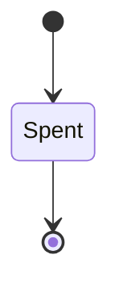
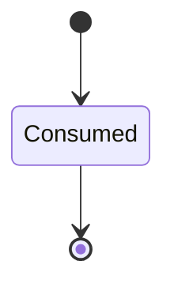

---
# generated by connectors-docs, do not edit
title: "delegation"
sidebar_label: "delegation"
sidebar_position: 13
description: "One-hop approval subjects and immutable receiver receipts; private host approval binding, no delegated ingress runtime."
custom_edit_url: null
---

# delegation

:::info[Typed specification]

Generated by the pinned `ess generate --kind docs` from [`ess`](https://github.com/beyond10x/connectors/tree/main/ess). Structural validation establishes consistency; behaviour, storage and cross-record predicates remain implementation obligations.

:::

One-hop approval subjects and immutable receiver receipts; private host approval binding, no delegated ingress runtime.

`connectors.delegation` is one of connectors's bounded contexts. [Back to the index](../index.md).

## Types

### `AdmittedAuthority`

`connectors.delegation.AdmittedAuthority` is a record of three fields:

- `scope` — `connectors.delegation.CanonicalAuthorityScope`
- `current_authority` — `connectors.delegation.NullableAuthoritySnapshot`
- `executor` — `connectors.delegation.NullableExecutorBinding`

### `ApprovalClaims`

`connectors.delegation.ApprovalClaims` is a record of seven fields:

- `iss` — `String`
- `aud` — `String`
- `reference` — `connectors.delegation.LowercaseHex64`
- `subject` — `connectors.delegation.CanonicalApprovalSubject`
- `iat` — `Integer`
- `nbf` — `Integer`
- `exp` — `Integer`

Every value satisfies `reference.count == 64`, `subject.approval_mode == required`, `subject.format == "connectors.approval-subject/v1"`, `(subject.origin.kind != direct or not (defined(subject.route.gateway_instance)))`, `(subject.origin.kind != direct or subject.origin.authority_ref == subject.target.instance)`, `(subject.origin.kind != federated or defined(subject.route.gateway_instance))`, `(subject.origin.kind != federated or subject.origin.authority_ref == subject.route.gateway_instance)`, `(iat >= 0 and iat <= 9007199254740991)`, `(nbf >= 0 and nbf <= 9007199254740991)` and `(exp >= 0 and exp <= 9007199254740991)`.

### `ApprovalPolicy`

`connectors.delegation.ApprovalPolicy` is a record of four fields:

- `mode` — `connectors.mutations.ApprovalMode`
- `issuer` — `connectors.delegation.NullableIdentifier`
- `audience` — `connectors.delegation.NullableIdentifier`
- `max_lifetime_seconds` — `connectors.delegation.NullableInteger`

### `ApprovalPreparation`

`connectors.delegation.ApprovalPreparation` is a record of four fields:

- `subject` — `connectors.delegation.CanonicalApprovalSubject`
- `subject_sha256` — `String`
- `presentation` — `connectors.delegation.Presentation`
- `approval_policy` — `connectors.delegation.ApprovalPolicy`

### `AuthoritySnapshot`

`connectors.delegation.AuthoritySnapshot` is a record of two fields:

- `id` — `String`
- `sha256` — `String`

### `CanonicalApprovalSubject`

`connectors.delegation.CanonicalApprovalSubject` is a record of eight fields:

- `format` — `String`
- `target` — `connectors.delegation.ExecutionTarget`
- `authority` — `connectors.delegation.AdmittedAuthority`
- `origin` — `connectors.idempotency.Origin`
- `route` — `connectors.delegation.NullableRouteBinding`
- `canonicalization` — `String`
- `input_sha256` — `String`
- `approval_mode` — `connectors.mutations.ApprovalMode`

### `CanonicalAuthorityScope`

`connectors.delegation.CanonicalAuthorityScope` is a record of four fields:

- `tenant` — `connectors.delegation.NullableIdentifier`
- `realm` — `connectors.delegation.NullableIdentifier`
- `caller` — `String`
- `executor` — `connectors.delegation.NullableIdentifier`

### `ConfiguredApprovalKey`

`connectors.delegation.ConfiguredApprovalKey` is a record of seven fields:

- `issuer` — `String`
- `audience` — `String`
- `kid` — `String`
- `public_key` — `String`
- `not_before_unix_ms` — `Integer`
- `not_after_unix_ms` — `Integer`
- `revoked` — `Boolean`

### `DeliveryClaims`

`connectors.delegation.DeliveryClaims` is a record of 19 fields:

- `iss` — `String`
- `aud` — `String`
- `receiver` — `String`
- `purpose` — `connectors.delegation.Purpose`
- `method` — `connectors.delegation.HttpMethod`
- `target` — `String`
- `body_sha256` — `connectors.delegation.LowercaseHex64`
- `authority` — `connectors.delegation.AdmittedAuthority`
- `route` — `connectors.idempotency.RouteBinding`
- `origin_request_id` — `Optional<String>`, which may be absent
- `request_id` — `Optional<String>`, which may be absent
- `operation` — `Optional<String>`, which may be absent
- `connection` — `Optional<String>`, which may be absent
- `descriptor_revision` — `Optional<String>`, which may be absent
- `execution_deadline_unix_ms` — `Integer`
- `iat` — `Integer`
- `nbf` — `Integer`
- `exp` — `Integer`
- `jti` — `connectors.delegation.LowercaseHex64`

Every value satisfies `(execution_deadline_unix_ms >= 0 and execution_deadline_unix_ms <= 9007199254740991)`, `(iat >= 0 and iat <= 9007199254740991)`, `(nbf >= 0 and nbf <= 9007199254740991)`, `(exp >= 0 and exp <= 9007199254740991)`, `jti.count == 64`, `body_sha256.count == 64`, `iss == route.gateway_instance`, `(purpose != describe or (method == GET and target == /v1alpha2/describe and body_sha256 == e3b0c44298fc1c149afbf4c8996fb92427ae41e4649b934ca495991b7852b855 and not (defined(origin_request_id)) and not (defined(request_id)) and not (defined(operation)) and not (defined(connection)) and not (defined(descriptor_revision))))`, `(purpose != prepare or (method == POST and target == /v1alpha2/invoke and operation == "host.approval.prepare" and defined(origin_request_id)))` and `(purpose != invoke or (method == POST and target == /v1alpha2/invoke and defined(operation) and operation != "host.approval.prepare" and defined(origin_request_id)))`.

### `ExecutionTarget`

`connectors.delegation.ExecutionTarget` is a record of eight fields:

- `instance` — `String`
- `operation` — `String`
- `connection` — `String`
- `connection_revision` — `String`
- `contract` — `String`
- `profile` — `String`
- `descriptor_revision` — `String`
- `configuration_revision` — `String`

### `ExecutorBinding`

`connectors.delegation.ExecutorBinding` is a record of three fields:

- `agent` — `String`
- `revision` — `String`
- `authority_snapshot` — `connectors.delegation.AuthoritySnapshot`

### `HttpMethod`

`connectors.delegation.HttpMethod` is one of `GET` and `POST`.

### `LowercaseHex64`

`connectors.delegation.LowercaseHex64` wraps `String` and is not interchangeable with one: the whole value of naming it separately is the crossings the model then refuses. Its characters are drawn from `0123456789abcdef`.

### `NullableAuthoritySnapshot`

`connectors.delegation.NullableAuthoritySnapshot` wraps `Optional<connectors.delegation.AuthoritySnapshot>` and is not interchangeable with one: the whole value of naming it separately is the crossings the model then refuses.

### `NullableExecutorBinding`

`connectors.delegation.NullableExecutorBinding` wraps `Optional<connectors.delegation.ExecutorBinding>` and is not interchangeable with one: the whole value of naming it separately is the crossings the model then refuses.

### `NullableIdentifier`

`connectors.delegation.NullableIdentifier` wraps `Optional<String>` and is not interchangeable with one: the whole value of naming it separately is the crossings the model then refuses.

### `NullableInteger`

`connectors.delegation.NullableInteger` wraps `Optional<Integer>` and is not interchangeable with one: the whole value of naming it separately is the crossings the model then refuses.

### `NullableRouteBinding`

`connectors.delegation.NullableRouteBinding` wraps `Optional<connectors.idempotency.RouteBinding>` and is not interchangeable with one: the whole value of naming it separately is the crossings the model then refuses.

### `Presentation`

`connectors.delegation.Presentation` is a record of four fields:

- `instance` — `String`
- `operation` — `String`
- `connection` — `connectors.delegation.NullableIdentifier`
- `descriptor_revision` — `String`

### `ProofHeader`

`connectors.delegation.ProofHeader` is a record of three fields:

- `alg` — `String`
- `kid` — `String`
- `typ` — `String`

Every value satisfies `alg == "Ed25519"` and `typ in [b10x.connectors-delegation.v1+jws, b10x.connectors-approval.v1+jws]`.

### `Purpose`

`connectors.delegation.Purpose` is one of `describe`, `prepare` and `invoke`.

### `ReceiptId`

`connectors.delegation.ReceiptId` wraps `Uuid` and is not interchangeable with one: the whole value of naming it separately is the crossings the model then refuses.

Four of the types above are reached by nothing else in this system: `connectors.delegation.ApprovalClaims`, `connectors.delegation.ConfiguredApprovalKey`, `connectors.delegation.DeliveryClaims` and `connectors.delegation.ProofHeader`. No entity, view, command, event, error or crossing names them, so it is either vocabulary something outside this specification uses or a leftover — and only a person can tell which.

## Entities

An entity is what this context is about: something with an identity that outlives any one request, a shape, and a lifecycle. The lifecycle is exhaustive — a move that is not drawn below is a move this specification does not permit, and that is the only way it says so. Every move is labelled with the command that takes it, because a move nothing can trigger is refused rather than drawn.

### `ApprovalRedemption`

`connectors.delegation.ApprovalRedemption`.

An instance is identified by `receipt_id`, a `connectors.delegation.ReceiptId`. The name is part of the model and not a convention: a view projects the identity under that name, so a projection inventing its own would disagree with the view.

It holds:

- `instance_id` — `String`
- `issuer` — `String`
- `reference` — `String`
- `subject` — `connectors.delegation.CanonicalApprovalSubject`
- `attempt_id` — `connectors.mutations.AttemptId`
- `spent_at` — `Timestamp`

It references at most one [`connectors.declarations.ServiceConfiguration`](./connectors-declarations.md#serviceconfiguration), as `receiver`, carried by `ApprovalRedemption.instance_id`. It references at most one [`connectors.mutations.AttemptRecord`](./connectors-mutations.md#attemptrecord), as `attempt`, carried by `ApprovalRedemption.attempt_id`.

Every instance satisfies `subject.format == "connectors.approval-subject/v1"`, `(subject.origin.kind != direct or not (defined(subject.route.gateway_instance)))`, `(subject.origin.kind != direct or subject.origin.authority_ref == subject.target.instance)`, `(subject.origin.kind != federated or defined(subject.route.gateway_instance))` and `(subject.origin.kind != federated or subject.origin.authority_ref == subject.route.gateway_instance)` — a predicate over this entity's own fields, checked against them rather than stored as a sentence, so an invariant reading something the entity does not have is refused instead of documented.

Its state is a `connectors.delegation.ApprovalRedemption.State`, one of `Spent`. That enum is synthesised from the lifecycle rather than declared beside it, so the states a view's filter compares and the states drawn below cannot disagree.

An instance is created in `Spent`. `Spent` is terminal, so an instance may rest there forever. That is declared rather than inferred from having no way out: an entity that cannot leave a state is either finished or stuck, and only its author knows which.

It declares no moves, so nothing changes its state once it exists.

It has one state, so there is no move to permit or to forbid.

One view projects it: [`ApprovalRedemptions`](#approvalredemptions).

### `DeliveryReceipt`

`connectors.delegation.DeliveryReceipt`.

An instance is identified by `receipt_id`, a `connectors.delegation.ReceiptId`. The name is part of the model and not a convention: a view projects the identity under that name, so a projection inventing its own would disagree with the view.

It holds:

- `instance_id` — `String`
- `issuer` — `String`
- `nonce` — `String`
- `expires_at` — `Timestamp`

It references at most one [`connectors.declarations.ServiceConfiguration`](./connectors-declarations.md#serviceconfiguration), as `receiver`, carried by `DeliveryReceipt.instance_id`.

No invariant is declared, so nothing here constrains an instance at rest.

Its state is a `connectors.delegation.DeliveryReceipt.State`, one of `Consumed`. That enum is synthesised from the lifecycle rather than declared beside it, so the states a view's filter compares and the states drawn below cannot disagree.

An instance is created in `Consumed`. `Consumed` is terminal, so an instance may rest there forever. That is declared rather than inferred from having no way out: an entity that cannot leave a state is either finished or stuck, and only its author knows which.

It declares no moves, so nothing changes its state once it exists.

It has one state, so there is no move to permit or to forbid.

No view projects it, so nothing outside this context is promised a way to observe one.

## Views

A view is what the outside world is promised it can observe. Each one says which instances it contains and how soon it reflects a command that has already returned, because "you can read this" without "how soon" is the promise every flaky suite is built on.

### `ApprovalRedemptions`

`connectors.delegation.ApprovalRedemptions`.

It reads [`ApprovalRedemption`](#approvalredemption).

It contains every instance of that entity: no filter narrows it, which is a decision somebody made and not a line somebody omitted.

It exposes:

- `receipt_id` — `connectors.delegation.ReceiptId`
- `subject` — `connectors.delegation.CanonicalApprovalSubject`
- `instance_id` — `String`
- `issuer` — `String`
- `reference` — `String`
- `state` — `connectors.delegation.ApprovalRedemption.State`

It declares no order, so the rows come back in whatever order the implementation has, and two reads may disagree.

**Read-your-writes**: it is current the moment the command that changed it returns. A caller that has just created an invoice and cannot see it in here has been told a lie about what it did.

A generated scenario asserts it once, immediately after the command: a view promising this and not keeping the promise has to fail the suite rather than be retried until it passes.

## Commands

### `RecordApprovalRedemption`

`connectors.delegation.RecordApprovalRedemption`.

It takes:

- `receipt_id` — `connectors.delegation.ReceiptId`
- `instance_id` — `String`
- `issuer` — `String`
- `reference` — `String`
- `subject` — `connectors.delegation.CanonicalApprovalSubject`
- `attempt_id` — `connectors.mutations.AttemptId`
- `spent_at` — `Timestamp`

It has one outcome.

**`recorded`** — The default branch, taken when no other outcome's condition matched. It creates a `connectors.delegation.ApprovalRedemption`, which starts in `Spent`. The new instance's identity is published as `receipt_id` on `connectors.delegation.ApprovalRedemptionRecorded`. It emits `connectors.delegation.ApprovalRedemptionRecorded`. It sets `instance_id` from `input.instance_id`, `issuer` from `input.issuer`, `reference` from `input.reference`, `subject` from `input.subject`, `attempt_id` from `input.attempt_id` and `spent_at` from `input.spent_at`. A test reaches it by constructing an input that satisfies no other outcome's condition.

## Events

### `ApprovalRedemptionRecorded`

`connectors.delegation.ApprovalRedemptionRecorded`.

It carries:

- `receipt_id` — `connectors.delegation.ReceiptId`

Emitted by `connectors.delegation.RecordApprovalRedemption` on its `recorded` outcome.

Nothing in this system reacts to it.

## Actors

An actor is who may ask this context for something. Every grant below points at a command this specification declares — a grant is a resolved reference, so "may invoke" something nobody wrote is not a permission this model can express, and an authorisation that authorises nothing cannot ship quietly.

### `LocalHost`

`connectors.delegation.LocalHost`.

It may invoke [`RecordApprovalRedemption`](#recordapprovalredemption).

---

Generated from connectors v1 · model digest `4ca84ed80d29dc59e4e520985535bcef4cd918acbd4248ac04a718dadb9051a7` · contract digest `slice-sha256/2:3be542f91098136a1bae89e351410e4813801c31be3900954a296bde3ed78a5d`. Do not edit this file; change the specification and regenerate it with `ess generate`.
