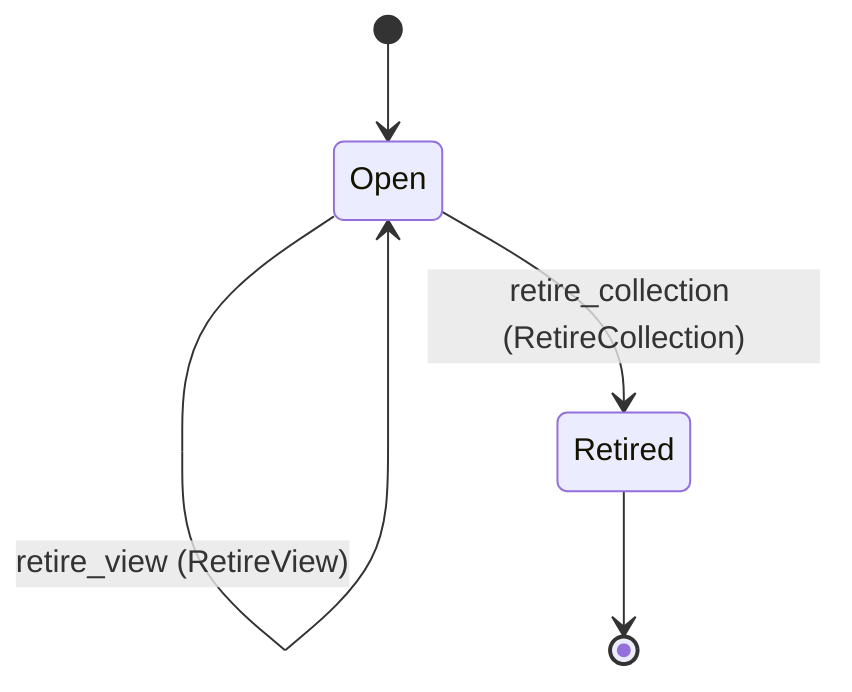
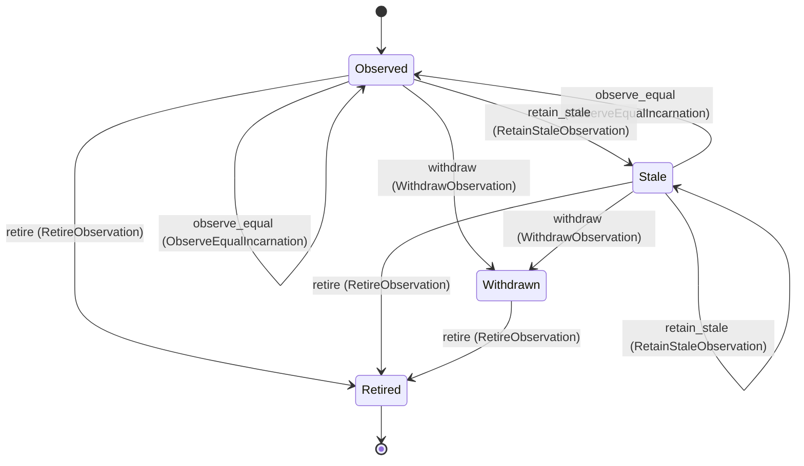

---
# generated by connectors-docs, do not edit
title: "discovery_state"
sidebar_label: "discovery_state"
sidebar_position: 15
description: "Host-owned scope epochs, bounded observation records and atomic publication selections; no provider Resource entity."
custom_edit_url: null
---

# discovery_state

:::info[Typed specification]

Generated by the pinned `ess generate --kind docs` from [`ess`](https://github.com/beyond10x/connectors/tree/main/ess). Structural validation establishes consistency; behaviour, storage and cross-record predicates remain implementation obligations.

:::

Host-owned scope epochs, bounded observation records and atomic publication selections; no provider Resource entity.

`connectors.discovery_state` is one of connectors's bounded contexts. [Back to the index](../index.md).

## Types

### `CandidateView`

`connectors.discovery_state.CandidateView` is a record of six fields:

- `rows` — `List<connectors.discovery_state.PublishedRow>`
- `private_index` — `List<connectors.discovery_state.PrivateBindingEntry>`
- `coverage` — `connectors.discovery.CollectionCoverage`
- `retention_truncated` — `Boolean`
- `observed_at` — `Timestamp`
- `retire_at` — `Timestamp`

### `CollectionDefinition`

`connectors.discovery_state.CollectionDefinition` is a record of seven fields:

- `declaration_revision` — `String`
- `profile` — `String`
- `provider_authority_ref` — `String`
- `membership_ref` — `String`
- `interpretation_revision` — `String`
- `admission_scope_ref` — `String`
- `selection_revision` — `String`

### `DecisionRefusal`

`connectors.discovery_state.DecisionRefusal` is one of `stale_predecessor`, `scope_changed`, `authority_unavailable`, `deadline_elapsed`, `capacity_unavailable`, `missing_private_bindings` and `receipt_unavailable`.

### `OwnerDecision`

`connectors.discovery_state.OwnerDecision` is one of `allow` and `refuse`.

### `PrivateBindingEntry`

`connectors.discovery_state.PrivateBindingEntry` is a record of two fields:

- `observation_ref` — `String`
- `private_binding_ref` — `String`

### `PublicationReceipt`

`connectors.discovery_state.PublicationReceipt` is a record of three fields:

- `attempt_ref` — `String`
- `predecessor_revision` — `String`
- `committed_generation` — `Integer`

### `PublishedRow`

`connectors.discovery_state.PublishedRow` is a record of three fields:

- `observation_ref` — `String`
- `public_projection_ref` — `String`
- `evidence` — `connectors.discovery.ObservationEvidence`

### `PublishedSnapshot`

`connectors.discovery_state.PublishedSnapshot` is a record of two fields:

- `generation` — `Integer`
- `view` — `connectors.discovery_state.CandidateView`

## Entities

An entity is what this context is about: something with an identity that outlives any one request, a shape, and a lifecycle. The lifecycle is exhaustive — a move that is not drawn below is a move this specification does not permit, and that is the only way it says so. Every move is labelled with the command that takes it, because a move nothing can trigger is refused rather than drawn.

### `DiscoveryCollection`

`connectors.discovery_state.DiscoveryCollection`.

An instance is identified by `collection_ref`, a `String`. The name is part of the model and not a convention: a view projects the identity under that name, so a projection inventing its own would disagree with the view.

It holds:

- `instance_id` — `String`
- `source_connection_ref` — `String`
- `operation_id` — `String`
- `scope_epoch` — `Uuid`
- `definition` — `connectors.discovery_state.CollectionDefinition`
- `last_generation` — `Integer`
- `publication_revision` — `String`
- `current_snapshot` — `Optional<connectors.discovery_state.PublishedSnapshot>`, which may be absent
- `latest_commit` — `Optional<connectors.discovery_state.PublicationReceipt>`, which may be absent
- `retired_at` — `Optional<Timestamp>`, which may be absent

It references at most one [`connectors.declarations.ServiceConfiguration`](./connectors-declarations.md#serviceconfiguration), as `instance`, carried by `DiscoveryCollection.instance_id`. It references at most one [`connectors.declarations.OperationDeclaration`](./connectors-declarations.md#operationdeclaration), as `operation`, carried by `DiscoveryCollection.operation_id`. It owns any number of [`ResourceObservation`](#resourceobservation), as `observations`, carried by `ResourceObservation.collection_ref`. It references at most one [`connectors.auth_bindings.Connection`](./connectors-auth_bindings.md#connection), as `source_connection`, carried by `DiscoveryCollection.source_connection_ref`.

No invariant is declared, so nothing here constrains an instance at rest.

Its state is a `connectors.discovery_state.DiscoveryCollection.State`, one of `Open` and `Retired`. That enum is synthesised from the lifecycle rather than declared beside it, so the states a view's filter compares and the states drawn below cannot disagree.

An instance is created in `Open`. `Retired` is terminal, so an instance may rest there forever. That is declared rather than inferred from having no way out: an entity that cannot leave a state is either finished or stuck, and only its author knows which.

Each move is taken by a declared command outcome, and a move nothing takes is refused as `missing_causation` rather than left as a state change nobody can trigger:

- `publish` — taken by `connectors.discovery_state.PublishView` on its `published` outcome
- `retire_view` — taken by `connectors.discovery_state.RetireView` on its `retired` outcome
- `retire_collection` — taken by `connectors.discovery_state.RetireCollection` on its `retired` outcome

An instance is brought into existence by `connectors.discovery_state.AllocateCollection` on its `allocated` outcome.

Illegal transitions are illegal by absence: no rule forbids them, there is simply no arrow, because a rule would be a second place for the same truth to live. A diagram cannot show an absence, so the pairs it does not connect are listed here, derived from the same transitions — anything named below is a move this specification does not permit.

- `Retired` may not become `Open`

No view projects it, so nothing outside this context is promised a way to observe one.

### `ResourceObservation`

`connectors.discovery_state.ResourceObservation`.

An instance is identified by `observation_ref`, a `String`. The name is part of the model and not a convention: a view projects the identity under that name, so a projection inventing its own would disagree with the view.

It holds:

- `collection_ref` — `String`
- `private_identity_ref` — `String`
- `private_target_ref` — `String`
- `observed_type` — `String`
- `partition_ref` — `String`
- `public_projection_ref` — `String`
- `last_seen_generation` — `Integer`
- `observed_at` — `Timestamp`
- `valid_until` — `Timestamp`
- `retire_at` — `Timestamp`

Its `collection_ref` is what [`DiscoveryCollection`](#discoverycollection) owns it by, as `observations`.

No invariant is declared, so nothing here constrains an instance at rest.

Its state is a `connectors.discovery_state.ResourceObservation.State`, one of `Observed`, `Retired`, `Stale` and `Withdrawn`. That enum is synthesised from the lifecycle rather than declared beside it, so the states a view's filter compares and the states drawn below cannot disagree.

An instance is created in `Observed`. `Retired` is terminal, so an instance may rest there forever. That is declared rather than inferred from having no way out: an entity that cannot leave a state is either finished or stuck, and only its author knows which.

Each move is taken by a declared command outcome, and a move nothing takes is refused as `missing_causation` rather than left as a state change nobody can trigger:

- `observe_equal` — taken by `connectors.discovery_state.ObserveEqualIncarnation` on its `observed` outcome
- `retain_stale` — taken by `connectors.discovery_state.RetainStaleObservation` on its `stale` outcome
- `withdraw` — taken by `connectors.discovery_state.WithdrawObservation` on its `withdrawn` outcome
- `retire` — taken by `connectors.discovery_state.RetireObservation` on its `retired` outcome

An instance is brought into existence by `connectors.discovery_state.AllocateObservation` on its `allocated` outcome.

Illegal transitions are illegal by absence: no rule forbids them, there is simply no arrow, because a rule would be a second place for the same truth to live. A diagram cannot show an absence, so the pairs it does not connect are listed here, derived from the same transitions — anything named below is a move this specification does not permit.

- `Retired` may not become `Observed`
- `Retired` may not become `Stale`
- `Retired` may not become `Withdrawn`
- `Withdrawn` may not become `Observed`
- `Withdrawn` may not become `Stale`

No view projects it, so nothing outside this context is promised a way to observe one.

## Commands

### `AllocateCollection`

`connectors.discovery_state.AllocateCollection`.

It takes:

- `decision` — `connectors.discovery_state.OwnerDecision`
- `instance_id` — `String`
- `source_connection_ref` — `String`
- `operation_id` — `String`
- `definition` — `connectors.discovery_state.CollectionDefinition`

It has two outcomes.

**`allocated`** — Taken when `decision == allow` holds of the input. It creates a `connectors.discovery_state.DiscoveryCollection`, which starts in `Open`. The new instance's identity is published as `collection_ref` on `connectors.discovery_state.CollectionAllocated`. It emits `connectors.discovery_state.CollectionAllocated`. A test reaches it by constructing an input that satisfies that condition.

**`refused`** — The default branch, taken when no other outcome's condition matched. No entity in this specification changes. It reports `connectors.discovery_state.DecisionUnavailable`, carrying `reason`. It emits nothing. A test reaches it by constructing an input that satisfies no other outcome's condition.

### `AllocateObservation`

`connectors.discovery_state.AllocateObservation`.

It takes:

- `decision` — `connectors.discovery_state.OwnerDecision`
- `collection_ref` — `String`
- `publication_attempt_ref` — `String`
- `private_identity_ref` — `String`
- `private_target_ref` — `String`
- `observed_type` — `String`
- `partition_ref` — `String`

It has two outcomes.

**`allocated`** — Taken when `decision == allow` holds of the input. It creates a `connectors.discovery_state.ResourceObservation`, which starts in `Observed`. The new instance's identity is published as `observation_ref` on `connectors.discovery_state.ObservationChanged`. It emits `connectors.discovery_state.ObservationChanged`. A test reaches it by constructing an input that satisfies that condition.

**`refused`** — The default branch, taken when no other outcome's condition matched. No entity in this specification changes. It reports `connectors.discovery_state.DecisionUnavailable`, carrying `reason`. It emits nothing. A test reaches it by constructing an input that satisfies no other outcome's condition.

### `ObserveEqualIncarnation`

`connectors.discovery_state.ObserveEqualIncarnation`.

It takes:

- `observation_ref` — `String`
- `publication_attempt_ref` — `String`

It has two outcomes.

**`observed`** — The default branch, taken when no other outcome's condition matched. It moves a `connectors.discovery_state.ResourceObservation` from `Observed` and `Stale` to `Observed`, along the declared move `observe_equal`. The instance is the one named by the input field `observation_ref`. It emits `connectors.discovery_state.ObservationChanged`. A test reaches it by constructing an input that satisfies no other outcome's condition.

**`wrong-state`** — Taken when the subject is resting in a state none of this command's moves start from — a `connectors.discovery_state.ResourceObservation` in `Retired` and `Withdrawn`, which is what is left of the lifecycle once this command's own moves are taken away. The document lists none of it. No entity in this specification changes. It reports `connectors.discovery_state.ObservationStateConflict`, carrying `state`. It emits nothing. A test reaches it by driving an instance into one of those states and then issuing the command, because no input selects this branch.

### `ObservePublication`

`connectors.discovery_state.ObservePublication`.

It takes:

- `decision` — `connectors.discovery_state.OwnerDecision`
- `collection_ref` — `String`
- `attempt_ref` — `String`

It has two outcomes.

**`current-commit-observed`** — Taken when `decision == allow` holds of the input. No entity in this specification changes. It emits `connectors.discovery_state.PublicationObserved`. A test reaches it by constructing an input that satisfies that condition.

**`unavailable`** — The default branch, taken when no other outcome's condition matched. No entity in this specification changes. It reports `connectors.discovery_state.DecisionUnavailable`, carrying `reason`. It emits nothing. A test reaches it by constructing an input that satisfies no other outcome's condition.

### `PublishView`

`connectors.discovery_state.PublishView`.

It takes:

- `decision` — `connectors.discovery.PublicationDecision`
- `collection_ref` — `String`
- `attempt_ref` — `String`
- `expected_revision` — `String`
- `expected_generation` — `Integer`
- `facts` — `connectors.discovery.PublicationFacts`
- `candidate` — `connectors.discovery_state.CandidateView`

It has four outcomes.

**`published`** — Taken when `decision == published` holds of the input. It moves a `connectors.discovery_state.DiscoveryCollection` from `Open` to `Open`, along the declared move `publish`. The instance is the one named by the input field `collection_ref`. It emits `connectors.discovery_state.ViewPublished`. It sets `last_generation` from `its previous value plus 1` and `publication_revision` from `implementation-generated`. A test reaches it by constructing an input that satisfies that condition.

**`refused`** — The default branch, taken when no other outcome's condition matched. No entity in this specification changes. It reports `connectors.discovery_state.DecisionUnavailable`, carrying `reason`. It emits nothing. A test reaches it by constructing an input that satisfies no other outcome's condition.

**`acknowledgement-unknown`** — Taken when `decision == unknown` holds of the input. No entity in this specification changes. It reports `connectors.discovery_state.DecisionUnavailable`, carrying `reason`. It emits nothing. A test reaches it by constructing an input that satisfies that condition.

**`wrong-state`** — Taken when the subject is resting in a state none of this command's moves start from — a `connectors.discovery_state.DiscoveryCollection` in `Retired`, which is what is left of the lifecycle once this command's own moves are taken away. The document lists none of it. No entity in this specification changes. It reports `connectors.discovery_state.CollectionStateConflict`, carrying `state`. It emits nothing. A test reaches it by driving an instance into one of those states and then issuing the command, because no input selects this branch.

### `RetainStaleObservation`

`connectors.discovery_state.RetainStaleObservation`.

It takes:

- `observation_ref` — `String`
- `publication_attempt_ref` — `String`

It has two outcomes.

**`stale`** — The default branch, taken when no other outcome's condition matched. It moves a `connectors.discovery_state.ResourceObservation` from `Observed` and `Stale` to `Stale`, along the declared move `retain_stale`. The instance is the one named by the input field `observation_ref`. It emits `connectors.discovery_state.ObservationChanged`. A test reaches it by constructing an input that satisfies no other outcome's condition.

**`wrong-state`** — Taken when the subject is resting in a state none of this command's moves start from — a `connectors.discovery_state.ResourceObservation` in `Retired` and `Withdrawn`, which is what is left of the lifecycle once this command's own moves are taken away. The document lists none of it. No entity in this specification changes. It reports `connectors.discovery_state.ObservationStateConflict`, carrying `state`. It emits nothing. A test reaches it by driving an instance into one of those states and then issuing the command, because no input selects this branch.

### `RetireCollection`

`connectors.discovery_state.RetireCollection`.

It takes:

- `decision` — `connectors.discovery_state.OwnerDecision`
- `collection_ref` — `String`
- `expected_revision` — `String`

It has three outcomes.

**`retired`** — Taken when `decision == allow` holds of the input. It moves a `connectors.discovery_state.DiscoveryCollection` from `Open` to `Retired`, along the declared move `retire_collection`. The instance is the one named by the input field `collection_ref`. It emits `connectors.discovery_state.CollectionRetired`. It sets `publication_revision` from `implementation-generated`. A test reaches it by constructing an input that satisfies that condition.

**`refused`** — The default branch, taken when no other outcome's condition matched. No entity in this specification changes. It reports `connectors.discovery_state.DecisionUnavailable`, carrying `reason`. It emits nothing. A test reaches it by constructing an input that satisfies no other outcome's condition.

**`wrong-state`** — Taken when the subject is resting in a state none of this command's moves start from — a `connectors.discovery_state.DiscoveryCollection` in `Retired`, which is what is left of the lifecycle once this command's own moves are taken away. The document lists none of it. No entity in this specification changes. It reports `connectors.discovery_state.CollectionStateConflict`, carrying `state`. It emits nothing. A test reaches it by driving an instance into one of those states and then issuing the command, because no input selects this branch.

### `RetireObservation`

`connectors.discovery_state.RetireObservation`.

It takes:

- `observation_ref` — `String`
- `owner_revision` — `String`

It has two outcomes.

**`retired`** — The default branch, taken when no other outcome's condition matched. It moves a `connectors.discovery_state.ResourceObservation` from `Observed`, `Stale` and `Withdrawn` to `Retired`, along the declared move `retire`. The instance is the one named by the input field `observation_ref`. It emits `connectors.discovery_state.ObservationChanged`. A test reaches it by constructing an input that satisfies no other outcome's condition.

**`wrong-state`** — Taken when the subject is resting in a state none of this command's moves start from — a `connectors.discovery_state.ResourceObservation` in `Retired`, which is what is left of the lifecycle once this command's own moves are taken away. The document lists none of it. No entity in this specification changes. It reports `connectors.discovery_state.ObservationStateConflict`, carrying `state`. It emits nothing. A test reaches it by driving an instance into one of those states and then issuing the command, because no input selects this branch.

### `RetireView`

`connectors.discovery_state.RetireView`.

It takes:

- `decision` — `connectors.discovery_state.OwnerDecision`
- `collection_ref` — `String`
- `expected_revision` — `String`

It has three outcomes.

**`retired`** — Taken when `decision == allow` holds of the input. It moves a `connectors.discovery_state.DiscoveryCollection` from `Open` to `Open`, along the declared move `retire_view`. The instance is the one named by the input field `collection_ref`. It emits `connectors.discovery_state.ViewRetired`. It sets `publication_revision` from `implementation-generated`. A test reaches it by constructing an input that satisfies that condition.

**`refused`** — The default branch, taken when no other outcome's condition matched. No entity in this specification changes. It reports `connectors.discovery_state.DecisionUnavailable`, carrying `reason`. It emits nothing. A test reaches it by constructing an input that satisfies no other outcome's condition.

**`wrong-state`** — Taken when the subject is resting in a state none of this command's moves start from — a `connectors.discovery_state.DiscoveryCollection` in `Retired`, which is what is left of the lifecycle once this command's own moves are taken away. The document lists none of it. No entity in this specification changes. It reports `connectors.discovery_state.CollectionStateConflict`, carrying `state`. It emits nothing. A test reaches it by driving an instance into one of those states and then issuing the command, because no input selects this branch.

### `WithdrawObservation`

`connectors.discovery_state.WithdrawObservation`.

It takes:

- `observation_ref` — `String`
- `publication_attempt_ref` — `String`

It has two outcomes.

**`withdrawn`** — The default branch, taken when no other outcome's condition matched. It moves a `connectors.discovery_state.ResourceObservation` from `Observed` and `Stale` to `Withdrawn`, along the declared move `withdraw`. The instance is the one named by the input field `observation_ref`. It emits `connectors.discovery_state.ObservationChanged`. A test reaches it by constructing an input that satisfies no other outcome's condition.

**`wrong-state`** — Taken when the subject is resting in a state none of this command's moves start from — a `connectors.discovery_state.ResourceObservation` in `Retired` and `Withdrawn`, which is what is left of the lifecycle once this command's own moves are taken away. The document lists none of it. No entity in this specification changes. It reports `connectors.discovery_state.ObservationStateConflict`, carrying `state`. It emits nothing. A test reaches it by driving an instance into one of those states and then issuing the command, because no input selects this branch.

## Events

### `CollectionAllocated`

`connectors.discovery_state.CollectionAllocated`.

It carries:

- `collection_ref` — `String`

Emitted by `connectors.discovery_state.AllocateCollection` on its `allocated` outcome.

Nothing in this system reacts to it.

### `CollectionRetired`

`connectors.discovery_state.CollectionRetired`.

It carries:

- `collection_ref` — `String`

Emitted by `connectors.discovery_state.RetireCollection` on its `retired` outcome.

Nothing in this system reacts to it.

### `ObservationChanged`

`connectors.discovery_state.ObservationChanged`.

It carries:

- `observation_ref` — `String`
- `state` — `connectors.discovery_state.ResourceObservation.State`

Emitted by `connectors.discovery_state.AllocateObservation` on its `allocated` outcome.

Emitted by `connectors.discovery_state.ObserveEqualIncarnation` on its `observed` outcome.

Emitted by `connectors.discovery_state.RetainStaleObservation` on its `stale` outcome.

Emitted by `connectors.discovery_state.RetireObservation` on its `retired` outcome.

Emitted by `connectors.discovery_state.WithdrawObservation` on its `withdrawn` outcome.

Nothing in this system reacts to it.

### `PublicationObserved`

`connectors.discovery_state.PublicationObserved`.

It carries:

- `collection_ref` — `String`
- `attempt_ref` — `String`
- `generation` — `Integer`

Emitted by `connectors.discovery_state.ObservePublication` on its `current-commit-observed` outcome.

Nothing in this system reacts to it.

### `ViewPublished`

`connectors.discovery_state.ViewPublished`.

It carries:

- `collection_ref` — `String`
- `attempt_ref` — `String`
- `generation` — `Integer`

Emitted by `connectors.discovery_state.PublishView` on its `published` outcome.

Nothing in this system reacts to it.

### `ViewRetired`

`connectors.discovery_state.ViewRetired`.

It carries:

- `collection_ref` — `String`

Emitted by `connectors.discovery_state.RetireView` on its `retired` outcome.

Nothing in this system reacts to it.

## Errors

### `CollectionStateConflict`

It carries:

- `state` — `connectors.discovery_state.DiscoveryCollection.State`

Reported by `connectors.discovery_state.PublishView` on its `wrong-state` outcome.

Reported by `connectors.discovery_state.RetireCollection` on its `wrong-state` outcome.

Reported by `connectors.discovery_state.RetireView` on its `wrong-state` outcome.

### `DecisionUnavailable`

It carries:

- `reason` — `connectors.discovery_state.DecisionRefusal`

Reported by `connectors.discovery_state.AllocateCollection` on its `refused` outcome.

Reported by `connectors.discovery_state.AllocateObservation` on its `refused` outcome.

Reported by `connectors.discovery_state.ObservePublication` on its `unavailable` outcome.

Reported by `connectors.discovery_state.PublishView` on its `refused` and `acknowledgement-unknown` outcomes.

Reported by `connectors.discovery_state.RetireCollection` on its `refused` outcome.

Reported by `connectors.discovery_state.RetireView` on its `refused` outcome.

### `ObservationStateConflict`

It carries:

- `state` — `connectors.discovery_state.ResourceObservation.State`

Reported by `connectors.discovery_state.ObserveEqualIncarnation` on its `wrong-state` outcome.

Reported by `connectors.discovery_state.RetainStaleObservation` on its `wrong-state` outcome.

Reported by `connectors.discovery_state.RetireObservation` on its `wrong-state` outcome.

Reported by `connectors.discovery_state.WithdrawObservation` on its `wrong-state` outcome.

---

Generated from connectors v1 · model digest `6c52aebf2b119b4755842d83b7b8b0e950d08dc800e33c6931c1d7fbfcaa594f` · contract digest `slice-sha256/2:5db942eeda64cab1dd57d28951fc2142abe97061a9db95285c697fd28ad290a3`. Do not edit this file; change the specification and regenerate it with `ess generate`.
