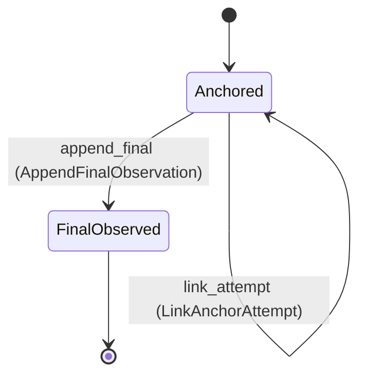

---
# generated by connectors-docs, do not edit
title: "execution_audit"
sidebar_label: "execution_audit"
sidebar_position: 16
description: "Per-hop durable execution-audit anchor and one final observation; private host port, with dispatch integration and exporter pending."
custom_edit_url: null
---

# execution_audit

:::info[Typed specification]

Generated by the pinned `ess generate --kind docs` from [`ess`](https://github.com/beyond10x/connectors/tree/main/ess). Structural validation establishes consistency; behaviour, storage and cross-record predicates remain implementation obligations.

:::

Per-hop durable execution-audit anchor and one final observation; private host port, with dispatch integration and exporter pending.

`connectors.execution_audit` is one of connectors's bounded contexts. [Back to the index](../index.md).

## Types

### `Activity`

`connectors.execution_audit.Activity` is one of `describe` and `invoke`.

### `AnchorAccess`

`connectors.execution_audit.AnchorAccess` is one of `read` and `write`.

### `AnchorDecision`

`connectors.execution_audit.AnchorDecision` is one of `allow`, `capacity` and `unavailable`.

### `AnchorKind`

`connectors.execution_audit.AnchorKind` is one of `admitted_execution` and `early_refusal`.

### `AnchorStage`

`connectors.execution_audit.AnchorStage` is one of `authentication`, `decoding` and `admission`.

### `AppendDecision`

`connectors.execution_audit.AppendDecision` is one of `allow` and `unavailable`.

### `AuditRecordRef`

`connectors.execution_audit.AuditRecordRef` wraps `String` and is not interchangeable with one: the whole value of naming it separately is the crossings the model then refuses.

### `AuditRef`

`connectors.execution_audit.AuditRef` wraps `String` and is not interchangeable with one: the whole value of naming it separately is the crossings the model then refuses.

### `FinalObservation`

`connectors.execution_audit.FinalObservation` is a record of four fields:

- `observation_id` — `connectors.execution_audit.ObservationId`
- `outcome` — `connectors.execution_audit.FinalOutcome`
- `code` — `Optional<String>`, which may be absent
- `recorded_at` — `Timestamp`

### `FinalOutcome`

`connectors.execution_audit.FinalOutcome` is one of `success`, `refused`, `error` and `unknown`.

### `HopRole`

`connectors.execution_audit.HopRole` is one of `gateway` and `execution`.

### `LinkDecision`

`connectors.execution_audit.LinkDecision` is one of `allow` and `unavailable`.

### `ObservationId`

`connectors.execution_audit.ObservationId` wraps `Uuid` and is not interchangeable with one: the whole value of naming it separately is the crossings the model then refuses.

## Entities

An entity is what this context is about: something with an identity that outlives any one request, a shape, and a lifecycle. The lifecycle is exhaustive — a move that is not drawn below is a move this specification does not permit, and that is the only way it says so. Every move is labelled with the command that takes it, because a move nothing can trigger is refused rather than drawn.

### `AuditRecord`

`connectors.execution_audit.AuditRecord`.

An instance is identified by `audit_record_ref`, a `connectors.execution_audit.AuditRecordRef`. The name is part of the model and not a convention: a view projects the identity under that name, so a projection inventing its own would disagree with the view.

It holds:

- `instance_id` — `String`
- `audit_ref` — `connectors.execution_audit.AuditRef`
- `anchor_kind` — `connectors.execution_audit.AnchorKind`
- `activity` — `Optional<connectors.execution_audit.Activity>`, which may be absent
- `access` — `Optional<connectors.execution_audit.AnchorAccess>`, which may be absent
- `hop_role` — `connectors.execution_audit.HopRole`
- `stage` — `connectors.execution_audit.AnchorStage`
- `request_id` — `Optional<String>`, which may be absent
- `principal_ref` — `Optional<String>`, which may be absent
- `operation_id` — `Optional<String>`, which may be absent
- `connection_ref` — `Optional<String>`, which may be absent
- `descriptor_revision` — `Optional<String>`, which may be absent
- `recorded_at` — `Timestamp`
- `attempt_id` — `Optional<connectors.mutations.AttemptId>`, which may be absent
- `final_observation` — `Optional<connectors.execution_audit.FinalObservation>`, which may be absent

It references at most one [`connectors.declarations.ServiceConfiguration`](./connectors-declarations.md#serviceconfiguration), as `instance`, carried by `AuditRecord.instance_id`. It references at most one [`connectors.mutations.AttemptRecord`](./connectors-mutations.md#attemptrecord), as `mutation_attempt`, carried by `AuditRecord.attempt_id`. It references at most one [`connectors.auth_bindings.Connection`](./connectors-auth_bindings.md#connection), as `selected_connection`, carried by `AuditRecord.connection_ref`.

Every instance satisfies `(not (anchor_kind == admitted_execution) or (stage == admission and defined(principal_ref) and defined(activity)))`, `(not (anchor_kind == admitted_execution) or not (activity == invoke) or defined(operation_id))`, `(not (activity == describe) or (not (defined(operation_id)) and not (defined(attempt_id))))` and `(not (activity == describe) or not (defined(access)))` — a predicate over this entity's own fields, checked against them rather than stored as a sentence, so an invariant reading something the entity does not have is refused instead of documented.

Its state is a `connectors.execution_audit.AuditRecord.State`, one of `Anchored` and `FinalObserved`. That enum is synthesised from the lifecycle rather than declared beside it, so the states a view's filter compares and the states drawn below cannot disagree.

An instance is created in `Anchored`. `FinalObserved` is terminal, so an instance may rest there forever. That is declared rather than inferred from having no way out: an entity that cannot leave a state is either finished or stuck, and only its author knows which.

Each move is taken by a declared command outcome, and a move nothing takes is refused as `missing_causation` rather than left as a state change nobody can trigger:

- `append_final` — taken by `connectors.execution_audit.AppendFinalObservation` on its `recorded` outcome
- `link_attempt` — taken by `connectors.execution_audit.LinkAnchorAttempt` on its `linked` outcome

An instance is brought into existence by `connectors.execution_audit.AcknowledgeAnchor` on its `anchored` outcome.

Illegal transitions are illegal by absence: no rule forbids them, there is simply no arrow, because a rule would be a second place for the same truth to live. A diagram cannot show an absence, so the pairs it does not connect are listed here, derived from the same transitions — anything named below is a move this specification does not permit.

- `FinalObserved` may not become `Anchored`

One view projects it: [`AuditStates`](#auditstates).

## Views

A view is what the outside world is promised it can observe. Each one says which instances it contains and how soon it reflects a command that has already returned, because "you can read this" without "how soon" is the promise every flaky suite is built on.

### `AuditStates`

`connectors.execution_audit.AuditStates`.

It reads [`AuditRecord`](#auditrecord).

It contains every instance of that entity: no filter narrows it, which is a decision somebody made and not a line somebody omitted.

It exposes:

- `audit_record_ref` — `connectors.execution_audit.AuditRecordRef`
- `instance_id` — `String`
- `audit_ref` — `connectors.execution_audit.AuditRef`
- `state` — `connectors.execution_audit.AuditRecord.State`
- `anchor_kind` — `connectors.execution_audit.AnchorKind`
- `activity` — `Optional<connectors.execution_audit.Activity>`, which may be absent
- `access` — `Optional<connectors.execution_audit.AnchorAccess>`, which may be absent
- `hop_role` — `connectors.execution_audit.HopRole`
- `stage` — `connectors.execution_audit.AnchorStage`
- `request_id` — `Optional<String>`, which may be absent
- `principal_ref` — `Optional<String>`, which may be absent
- `operation_id` — `Optional<String>`, which may be absent
- `connection_ref` — `Optional<String>`, which may be absent
- `descriptor_revision` — `Optional<String>`, which may be absent
- `recorded_at` — `Timestamp`
- `attempt_id` — `Optional<connectors.mutations.AttemptId>`, which may be absent
- `final_observation` — `Optional<connectors.execution_audit.FinalObservation>`, which may be absent

It declares no order, so the rows come back in whatever order the implementation has, and two reads may disagree.

**Read-your-writes**: it is current the moment the command that changed it returns. A caller that has just created an invoice and cannot see it in here has been told a lie about what it did.

A generated scenario asserts it once, immediately after the command: a view promising this and not keeping the promise has to fail the suite rather than be retried until it passes.

## Commands

### `AcknowledgeAnchor`

`connectors.execution_audit.AcknowledgeAnchor`.

It takes:

- `decision` — `connectors.execution_audit.AnchorDecision`
- `instance_id` — `String`
- `audit_ref` — `connectors.execution_audit.AuditRef`
- `anchor_kind` — `connectors.execution_audit.AnchorKind`
- `activity` — `Optional<connectors.execution_audit.Activity>`, which may be absent
- `access` — `Optional<connectors.execution_audit.AnchorAccess>`, which may be absent
- `hop_role` — `connectors.execution_audit.HopRole`
- `stage` — `connectors.execution_audit.AnchorStage`
- `request_id` — `Optional<String>`, which may be absent
- `principal_ref` — `Optional<String>`, which may be absent
- `operation_id` — `Optional<String>`, which may be absent
- `connection_ref` — `Optional<String>`, which may be absent
- `descriptor_revision` — `Optional<String>`, which may be absent
- `recorded_at` — `Timestamp`
- `attempt_id` — `Optional<connectors.mutations.AttemptId>`, which may be absent

It has three outcomes.

**`anchored`** — Taken when `decision == allow` holds of the input. It creates a `connectors.execution_audit.AuditRecord`, which starts in `Anchored`. The new instance's identity is published as `audit_record_ref` on `connectors.execution_audit.AuditAnchored`. It emits `connectors.execution_audit.AuditAnchored`. It sets `instance_id` from `input.instance_id`, `audit_ref` from `input.audit_ref`, `anchor_kind` from `input.anchor_kind`, `activity` from `input.activity`, `access` from `input.access`, `hop_role` from `input.hop_role`, `stage` from `input.stage`, `request_id` from `input.request_id`, `principal_ref` from `input.principal_ref`, `operation_id` from `input.operation_id`, `connection_ref` from `input.connection_ref`, `descriptor_revision` from `input.descriptor_revision`, `recorded_at` from `input.recorded_at`, `attempt_id` from `input.attempt_id` and `final_observation` cleared. A test reaches it by constructing an input that satisfies that condition.

**`unavailable`** — Taken when `decision == unavailable` holds of the input. No entity in this specification changes. It reports `connectors.execution_audit.AnchorUnavailable`, carrying `reason`. It emits nothing. A test reaches it by constructing an input that satisfies that condition.

**`capacity`** — The default branch, taken when no other outcome's condition matched. No entity in this specification changes. It reports `connectors.execution_audit.AuditCapacity`, carrying `reason`. It emits nothing. A test reaches it by constructing an input that satisfies no other outcome's condition.

### `AppendFinalObservation`

`connectors.execution_audit.AppendFinalObservation`.

It takes:

- `decision` — `connectors.execution_audit.AppendDecision`
- `audit_record_ref` — `connectors.execution_audit.AuditRecordRef`
- `observation_id` — `connectors.execution_audit.ObservationId`
- `final_observation` — `connectors.execution_audit.FinalObservation`

It has three outcomes.

**`recorded`** — Taken when `decision == allow` holds of the input. It moves a `connectors.execution_audit.AuditRecord` from `Anchored` to `FinalObserved`, along the declared move `append_final`. The instance is the one named by the input field `audit_record_ref`. It emits `connectors.execution_audit.FinalObservationRecorded`. It sets `final_observation` from `input.final_observation`. A test reaches it by constructing an input that satisfies that condition.

**`unavailable`** — The default branch, taken when no other outcome's condition matched. No entity in this specification changes. It reports `connectors.execution_audit.AppendUnavailable`, carrying `reason`. It emits nothing. A test reaches it by constructing an input that satisfies no other outcome's condition.

**`wrong-state`** — Taken when the subject is resting in a state none of this command's moves start from — a `connectors.execution_audit.AuditRecord` in `FinalObserved`, which is what is left of the lifecycle once this command's own moves are taken away. The document lists none of it. No entity in this specification changes. It reports `connectors.execution_audit.AuditStateConflict`, carrying `state`. It emits nothing. A test reaches it by driving an instance into one of those states and then issuing the command, because no input selects this branch.

### `LinkAnchorAttempt`

`connectors.execution_audit.LinkAnchorAttempt`.

It takes:

- `decision` — `connectors.execution_audit.LinkDecision`
- `audit_record_ref` — `connectors.execution_audit.AuditRecordRef`
- `attempt_id` — `connectors.mutations.AttemptId`

It has six outcomes.

**`unavailable`** — Taken when `decision == unavailable` holds of the input. No entity in this specification changes. It reports `connectors.execution_audit.AttemptLinkUnavailable`, carrying `reason`. It emits nothing. A test reaches it by constructing an input that satisfies that condition.

**`read-anchor`** — Taken when the existing subject's stored fields satisfy `(not (defined(access)) or not (access == write))`. No entity in this specification changes. It reports `connectors.execution_audit.AttemptLinkRefused`, carrying `reason`. It emits nothing. A test establishes and independently observes the subject enum fact before selecting this branch.

**`linked-elsewhere`** — Taken when the existing subject's stored fields satisfy `(defined(attempt_id) and attempt_id != input.attempt_id)`. No entity in this specification changes. It reports `connectors.execution_audit.AttemptLinkConflict`, carrying `reason`. It emits nothing. A test establishes and independently observes the subject enum fact before selecting this branch.

**`already-linked`** — Taken when the existing subject's stored fields satisfy `(defined(attempt_id) and attempt_id == input.attempt_id)`. No entity in this specification changes. It reports `connectors.execution_audit.AttemptLinkRepeated`, carrying `reason`. It emits nothing. A test establishes and independently observes the subject enum fact before selecting this branch.

**`linked`** — The default branch, taken when no other outcome's condition matched. It moves a `connectors.execution_audit.AuditRecord` from `Anchored` to `Anchored`, along the declared move `link_attempt`. The instance is the one named by the input field `audit_record_ref`. It emits `connectors.execution_audit.AttemptLinked`. It sets `attempt_id` from `input.attempt_id`. A test reaches it by constructing an input that satisfies no other outcome's condition.

**`wrong-state`** — Taken when the subject is resting in a state none of this command's moves start from — a `connectors.execution_audit.AuditRecord` in `FinalObserved`, which is what is left of the lifecycle once this command's own moves are taken away. The document lists none of it. No entity in this specification changes. It reports `connectors.execution_audit.AuditStateConflict`, carrying `state`. It emits nothing. A test reaches it by driving an instance into one of those states and then issuing the command, because no input selects this branch.

## Events

### `AttemptLinked`

`connectors.execution_audit.AttemptLinked`.

It carries:

- `audit_record_ref` — `connectors.execution_audit.AuditRecordRef`
- `attempt_id` — `connectors.mutations.AttemptId`

Emitted by `connectors.execution_audit.LinkAnchorAttempt` on its `linked` outcome.

Nothing in this system reacts to it.

### `AuditAnchored`

`connectors.execution_audit.AuditAnchored`.

It carries:

- `audit_record_ref` — `connectors.execution_audit.AuditRecordRef`
- `instance_id` — `String`
- `audit_ref` — `connectors.execution_audit.AuditRef`

Emitted by `connectors.execution_audit.AcknowledgeAnchor` on its `anchored` outcome.

Nothing in this system reacts to it.

### `FinalObservationRecorded`

`connectors.execution_audit.FinalObservationRecorded`.

It carries:

- `audit_record_ref` — `connectors.execution_audit.AuditRecordRef`
- `observation_id` — `connectors.execution_audit.ObservationId`

Emitted by `connectors.execution_audit.AppendFinalObservation` on its `recorded` outcome.

Nothing in this system reacts to it.

## Errors

### `AnchorUnavailable`

It carries:

- `reason` — `String`

Reported by `connectors.execution_audit.AcknowledgeAnchor` on its `unavailable` outcome.

### `AppendUnavailable`

It carries:

- `reason` — `String`

Reported by `connectors.execution_audit.AppendFinalObservation` on its `unavailable` outcome.

### `AttemptLinkConflict`

It carries:

- `reason` — `String`

Reported by `connectors.execution_audit.LinkAnchorAttempt` on its `linked-elsewhere` outcome.

### `AttemptLinkRefused`

It carries:

- `reason` — `String`

Reported by `connectors.execution_audit.LinkAnchorAttempt` on its `read-anchor` outcome.

### `AttemptLinkRepeated`

It carries:

- `reason` — `String`

Reported by `connectors.execution_audit.LinkAnchorAttempt` on its `already-linked` outcome.

### `AttemptLinkUnavailable`

It carries:

- `reason` — `String`

Reported by `connectors.execution_audit.LinkAnchorAttempt` on its `unavailable` outcome.

### `AuditCapacity`

It carries:

- `reason` — `String`

Reported by `connectors.execution_audit.AcknowledgeAnchor` on its `capacity` outcome.

### `AuditStateConflict`

It carries:

- `state` — `connectors.execution_audit.AuditRecord.State`

Reported by `connectors.execution_audit.AppendFinalObservation` on its `wrong-state` outcome.

Reported by `connectors.execution_audit.LinkAnchorAttempt` on its `wrong-state` outcome.

## Actors

An actor is who may ask this context for something. Every grant below points at a command this specification declares — a grant is a resolved reference, so "may invoke" something nobody wrote is not a permission this model can express, and an authorisation that authorises nothing cannot ship quietly.

### `LocalHost`

`connectors.execution_audit.LocalHost`.

It may invoke [`AcknowledgeAnchor`](#acknowledgeanchor) and [`AppendFinalObservation`](#appendfinalobservation).

### `ServiceHost`

`connectors.execution_audit.ServiceHost`.

It may invoke [`AcknowledgeAnchor`](#acknowledgeanchor), [`AppendFinalObservation`](#appendfinalobservation) and [`LinkAnchorAttempt`](#linkanchorattempt).

---

Generated from connectors v1 · model digest `4ca84ed80d29dc59e4e520985535bcef4cd918acbd4248ac04a718dadb9051a7` · contract digest `slice-sha256/2:a389fb5248b26e9fe70b427c266c373f80f4fd996d868dda224b56b7df7c2d9e`. Do not edit this file; change the specification and regenerate it with `ess generate`.
