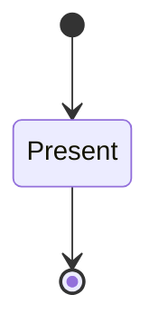
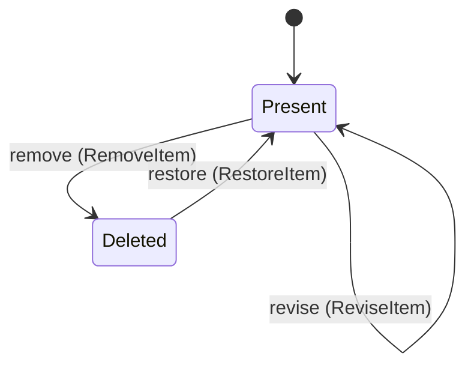

---
# generated by connectors-docs, do not edit
title: "feed"
sidebar_label: "feed"
sidebar_position: 17
description: "Proposed provider-independent incremental reads of a connection's containers and their items; no runtime or persistent provider owner."
custom_edit_url: null
---

# feed

:::info[Typed specification]

Generated by the pinned `ess generate --kind docs` from [`ess`](https://github.com/beyond10x/connectors/tree/main/ess). Structural validation establishes consistency; behaviour, storage and cross-record predicates remain implementation obligations.

:::

Proposed provider-independent incremental reads of a connection's containers and their items; no runtime or persistent provider owner.

`connectors.feed` is one of connectors's bounded contexts. [Back to the index](../index.md).

## Types

### `Author`

`connectors.feed.Author` is a record of two fields:

- `id` — `String`
- `display_name` — `Optional<String>`, which may be absent

### `Body`

`connectors.feed.Body` is a record of four fields:

- `representation` — `String`
- `bytes` — `Optional<Integer>`, which may be absent
- `truncated` — `Boolean`
- `truncation` — `List<String>`

### `Container`

`connectors.feed.Container` is a record of four fields:

- `id` — `connectors.feed.ContainerId`
- `name` — `Optional<String>`, which may be absent
- `kind` — `String`
- `visibility` — `connectors.feed.Visibility`

### `ContainerId`

`connectors.feed.ContainerId` wraps `String` and is not interchangeable with one: the whole value of naming it separately is the crossings the model then refuses.

### `ContainersInput`

`connectors.feed.ContainersInput` is a record of two fields:

- `limit` — `Optional<Integer>`, which may be absent
- `cursor` — `Optional<String>`, which may be absent

### `ContainersPage`

`connectors.feed.ContainersPage` is a record of four fields:

- `containers` — `List<connectors.feed.Container>`
- `next_cursor` — `Optional<String>`, which may be absent
- `complete` — `Boolean`
- `provenance` — `connectors.feed.Provenance`

### `DeletionCapability`

`connectors.feed.DeletionCapability` is one of `observed` and `not-observed`.

### `ErrorCode`

`connectors.feed.ErrorCode` is one of `invalid_input`, `not_found`, `stale_cursor`, `rate_limited`, `timeout` and `unavailable`.

### `Item`

`connectors.feed.Item` is a record of nine fields:

- `id` — `connectors.feed.ItemId`
- `revision` — `connectors.feed.Revision`
- `created_at` — `Timestamp`
- `updated_at` — `Timestamp`
- `author` — `Optional<connectors.feed.Author>`, which may be absent
- `body` — `Optional<connectors.feed.Body>`, which may be absent
- `url` — `Optional<String>`, which may be absent
- `parent` — `Optional<connectors.feed.ItemId>`, which may be absent
- `deleted` — `Boolean`

### `ItemId`

`connectors.feed.ItemId` wraps `String` and is not interchangeable with one: the whole value of naming it separately is the crossings the model then refuses.

### `ItemsInput`

`connectors.feed.ItemsInput` is a record of three fields:

- `container` — `connectors.feed.ContainerId`
- `watermark` — `Optional<connectors.feed.Watermark>`, which may be absent
- `limit` — `Integer`

### `ItemsPage`

`connectors.feed.ItemsPage` is a record of four fields:

- `items` — `List<connectors.feed.Item>`
- `next_watermark` — `connectors.feed.Watermark`
- `complete` — `Boolean`
- `provenance` — `connectors.feed.Provenance`

### `KindCapability`

`connectors.feed.KindCapability` is one of `provider-word` and `fixed-word`.

### `OperationBinding`

`connectors.feed.OperationBinding` is a record of three fields:

- `id` — `connectors.feed.OperationId`
- `contract` — `String`
- `profile` — `String`

### `OperationId`

`connectors.feed.OperationId` is one of `feed.containers` and `feed.items`.

### `ProfileCapabilities`

`connectors.feed.ProfileCapabilities` is a record of five fields:

- `deletions` — `connectors.feed.DeletionCapability`
- `kind` — `connectors.feed.KindCapability`
- `kind_word` — `Optional<String>`, which may be absent
- `revision` — `connectors.feed.RevisionCapability`
- `visibility` — `connectors.feed.VisibilityCapability`

### `Provenance`

`connectors.feed.Provenance` is a record of three fields:

- `instance` — `String`
- `profile` — `String`
- `received_at` — `Timestamp`

### `Revision`

`connectors.feed.Revision` wraps `String` and is not interchangeable with one: the whole value of naming it separately is the crossings the model then refuses.

### `RevisionCapability`

`connectors.feed.RevisionCapability` is one of `opaque` and `update-time`.

### `Visibility`

`connectors.feed.Visibility` is one of `public`, `private` and `direct`.

### `VisibilityCapability`

`connectors.feed.VisibilityCapability` is one of `mapped` and `all-private`.

### `Watermark`

`connectors.feed.Watermark` wraps `String` and is not interchangeable with one: the whole value of naming it separately is the crossings the model then refuses.

Seven of the types above are reached by nothing else in this system: `connectors.feed.ContainersInput`, `connectors.feed.ContainersPage`, `connectors.feed.ErrorCode`, `connectors.feed.ItemsInput`, `connectors.feed.ItemsPage`, `connectors.feed.OperationBinding` and `connectors.feed.ProfileCapabilities`. No entity, view, command, event, error or crossing names them, so it is either vocabulary something outside this specification uses or a leftover — and only a person can tell which.

## Entities

An entity is what this context is about: something with an identity that outlives any one request, a shape, and a lifecycle. The lifecycle is exhaustive — a move that is not drawn below is a move this specification does not permit, and that is the only way it says so. Every move is labelled with the command that takes it, because a move nothing can trigger is refused rather than drawn.

### `FeedContainer`

`connectors.feed.FeedContainer`.

An instance is identified by `container_id`, a `connectors.feed.ContainerId`. The name is part of the model and not a convention: a view projects the identity under that name, so a projection inventing its own would disagree with the view.

It holds:

- `connection_ref` — `String`
- `name` — `Optional<String>`, which may be absent
- `kind` — `String`
- `visibility` — `connectors.feed.Visibility`

It references at most one [`connectors.auth_bindings.Connection`](./connectors-auth_bindings.md#connection), as `connection`, carried by `FeedContainer.connection_ref`. It owns any number of [`FeedItem`](#feeditem), as `items`, carried by `FeedItem.container_id`.

No invariant is declared, so nothing here constrains an instance at rest.

Its state is a `connectors.feed.FeedContainer.State`, one of `Present`. That enum is synthesised from the lifecycle rather than declared beside it, so the states a view's filter compares and the states drawn below cannot disagree.

An instance is created in `Present`. `Present` is terminal, so an instance may rest there forever. That is declared rather than inferred from having no way out: an entity that cannot leave a state is either finished or stuck, and only its author knows which.

It declares no moves, so nothing changes its state once it exists.

It has one state, so there is no move to permit or to forbid.

Two views project it: [`ListedContainers`](#listedcontainers) and [`SourceContainers`](#sourcecontainers).

### `FeedItem`

`connectors.feed.FeedItem`.

An instance is identified by `item_id`, a `connectors.feed.ItemId`. The name is part of the model and not a convention: a view projects the identity under that name, so a projection inventing its own would disagree with the view.

It holds:

- `container_id` — `connectors.feed.ContainerId`
- `revision` — `connectors.feed.Revision`
- `created_at` — `Timestamp`
- `updated_at` — `Timestamp`
- `parent` — `Optional<connectors.feed.ItemId>`, which may be absent

It references at most one [`FeedItem`](#feeditem), as `parent`, carried by `FeedItem.parent`. Its `container_id` is what [`FeedContainer`](#feedcontainer) owns it by, as `items`.

No invariant is declared, so nothing here constrains an instance at rest.

Its state is a `connectors.feed.FeedItem.State`, one of `Deleted` and `Present`. That enum is synthesised from the lifecycle rather than declared beside it, so the states a view's filter compares and the states drawn below cannot disagree.

An instance is created in `Present`. No state is terminal: nothing in this lifecycle says an instance may stop moving.

Each move is taken by a declared command outcome, and a move nothing takes is refused as `missing_causation` rather than left as a state change nobody can trigger:

- `revise` — taken by `connectors.feed.ReviseItem` on its `revised` outcome
- `remove` — taken by `connectors.feed.RemoveItem` on its `removed` outcome
- `restore` — taken by `connectors.feed.RestoreItem` on its `restored` outcome

An instance is brought into existence by `connectors.feed.AddItem` on its `added` outcome.

Every ordered pair of these states is connected by some move, so this lifecycle forbids nothing.

Two views project it: [`ContainerItems`](#containeritems) and [`SourceItems`](#sourceitems).

## Views

A view is what the outside world is promised it can observe. Each one says which instances it contains and how soon it reflects a command that has already returned, because "you can read this" without "how soon" is the promise every flaky suite is built on.

### `ContainerItems`

`connectors.feed.ContainerItems`.

It reads [`FeedItem`](#feeditem).

It contains the instances where `container_id == param.container_id` holds, and only those — so an instance a caller cannot find in here has been filtered out rather than lost.

It exposes:

- `item_id` — `connectors.feed.ItemId`
- `container_id` — `connectors.feed.ContainerId`
- `revision` — `connectors.feed.Revision`
- `updated_at` — `Timestamp`
- `state` — `connectors.feed.FeedItem.State`

It declares no order, so the rows come back in whatever order the implementation has, and two reads may disagree.

**Read-your-writes**: it is current the moment the command that changed it returns. A caller that has just created an invoice and cannot see it in here has been told a lie about what it did.

A generated scenario asserts it once, immediately after the command: a view promising this and not keeping the promise has to fail the suite rather than be retried until it passes.

### `ListedContainers`

`connectors.feed.ListedContainers`.

It reads [`FeedContainer`](#feedcontainer).

It contains the instances where `visibility != direct` holds, and only those — so an instance a caller cannot find in here has been filtered out rather than lost.

It exposes:

- `container_id` — `connectors.feed.ContainerId`
- `name` — `Optional<String>`, which may be absent
- `kind` — `String`
- `visibility` — `connectors.feed.Visibility`

It declares no order, so the rows come back in whatever order the implementation has, and two reads may disagree.

**Read-your-writes**: it is current the moment the command that changed it returns. A caller that has just created an invoice and cannot see it in here has been told a lie about what it did.

A generated scenario asserts it once, immediately after the command: a view promising this and not keeping the promise has to fail the suite rather than be retried until it passes.

### `SourceContainers`

`connectors.feed.SourceContainers`.

It reads [`FeedContainer`](#feedcontainer).

It contains every instance of that entity: no filter narrows it, which is a decision somebody made and not a line somebody omitted.

It exposes:

- `container_id` — `connectors.feed.ContainerId`
- `connection_ref` — `String`
- `name` — `Optional<String>`, which may be absent
- `kind` — `String`
- `visibility` — `connectors.feed.Visibility`
- `state` — `connectors.feed.FeedContainer.State`

It declares no order, so the rows come back in whatever order the implementation has, and two reads may disagree.

**Read-your-writes**: it is current the moment the command that changed it returns. A caller that has just created an invoice and cannot see it in here has been told a lie about what it did.

A generated scenario asserts it once, immediately after the command: a view promising this and not keeping the promise has to fail the suite rather than be retried until it passes.

### `SourceItems`

`connectors.feed.SourceItems`.

It reads [`FeedItem`](#feeditem).

It contains every instance of that entity: no filter narrows it, which is a decision somebody made and not a line somebody omitted.

It exposes:

- `item_id` — `connectors.feed.ItemId`
- `container_id` — `connectors.feed.ContainerId`
- `revision` — `connectors.feed.Revision`
- `created_at` — `Timestamp`
- `updated_at` — `Timestamp`
- `parent` — `Optional<connectors.feed.ItemId>`, which may be absent
- `state` — `connectors.feed.FeedItem.State`

It declares no order, so the rows come back in whatever order the implementation has, and two reads may disagree.

**Read-your-writes**: it is current the moment the command that changed it returns. A caller that has just created an invoice and cannot see it in here has been told a lie about what it did.

A generated scenario asserts it once, immediately after the command: a view promising this and not keeping the promise has to fail the suite rather than be retried until it passes.

## Commands

### `AddContainer`

`connectors.feed.AddContainer`.

It takes:

- `container_id` — `connectors.feed.ContainerId`
- `name` — `Optional<String>`, which may be absent
- `connection_ref` — `String`
- `kind` — `String`
- `visibility` — `connectors.feed.Visibility`

It has one outcome.

**`added`** — The source holds a container a binding can list. The default branch, taken when no other outcome's condition matched. It creates a `connectors.feed.FeedContainer`, which starts in `Present`. The new instance's identity is published as `container_id` on `connectors.feed.ContainerAdded`. It emits `connectors.feed.ContainerAdded`. It sets `connection_ref` from `input.connection_ref`, `name` from `input.name`, `kind` from `input.kind` and `visibility` from `input.visibility`. A test reaches it by constructing an input that satisfies no other outcome's condition.

### `AddItem`

`connectors.feed.AddItem`.

It takes:

- `item_id` — `connectors.feed.ItemId`
- `container_id` — `connectors.feed.ContainerId`
- `revision` — `connectors.feed.Revision`
- `created_at` — `Timestamp`
- `parent` — `Optional<connectors.feed.ItemId>`, which may be absent

It has two outcomes.

**`no-such-container`** — The source holds no such container, so nothing was added. Taken when no `connectors.feed.FeedContainer` carries the identity `input.container_id` names. No entity in this specification changes. It reports `connectors.feed.ContainerNotFound`, carrying `container_id`. It emits nothing. A test reaches it by arranging the row of the other entity the input names, or its absence, and sending the command for it.

**`added`** — The container holds a new item under its first revision. The default branch, taken when no other outcome's condition matched. It creates a `connectors.feed.FeedItem`, which starts in `Present`. The new instance's identity is published as `item_id` on `connectors.feed.ItemAdded`. It emits `connectors.feed.ItemAdded`. It sets `container_id` from `input.container_id`, `revision` from `input.revision`, `created_at` from `input.created_at`, `updated_at` from `input.created_at` and `parent` from `input.parent`. A test reaches it by constructing an input that satisfies no other outcome's condition.

### `ListContainers`

`connectors.feed.ListContainers`, called `feed.containers` on the wire.

It takes:

- `limit` — `Optional<Integer>`, which may be absent
- `cursor` — `Optional<String>`, which may be absent

It has two outcomes.

**`bad-limit`** — Refused by name before any request. Taken when `limit <= 0` holds of the input. No entity in this specification changes. It reports `connectors.feed.InvalidLimit`, carrying `limit`. It emits nothing. A test reaches it by constructing an input that satisfies that condition.

**`listed`** — The listing is what ListedContainers holds; no direct conversation is in it. The default branch, taken when no other outcome's condition matched. No entity in this specification changes. It emits nothing. A test reaches it by constructing an input that satisfies no other outcome's condition.

### `ReadItems`

`connectors.feed.ReadItems`, called `feed.items` on the wire.

It takes:

- `container_id` — `connectors.feed.ContainerId`
- `watermark` — `Optional<connectors.feed.Watermark>`, which may be absent
- `limit` — `Integer`

It has three outcomes.

**`bad-limit`** — Refused by name before any request. Taken when `limit <= 0` holds of the input. No entity in this specification changes. It reports `connectors.feed.InvalidLimit`, carrying `limit`. It emits nothing. A test reaches it by constructing an input that satisfies that condition.

**`direct-conversation`** — Not readable through the family by default; indistinguishable from absence. Taken when the existing subject's stored fields satisfy `visibility == direct`. No entity in this specification changes. It reports `connectors.feed.ContainerNotFound`, carrying `container_id`. It emits nothing. A test establishes and independently observes the subject enum fact before selecting this branch.

**`read`** — The page is what ContainerItems holds for the container, tombstones included. The default branch, taken when no other outcome's condition matched. It preserves the existing subject, without an error or event. The instance is the one named by the input field `container_id`. It emits nothing. A test reaches it by constructing an input that satisfies no other outcome's condition.

### `RemoveItem`

`connectors.feed.RemoveItem`.

It takes:

- `item_id` — `connectors.feed.ItemId`
- `revision` — `connectors.feed.Revision`
- `removed_at` — `Timestamp`

It has four outcomes.

**`same-revision`** — A tombstone under the last content revision would be dropped as a repeat; refused. Taken when the existing subject's stored fields satisfy `revision == input.revision`. No entity in this specification changes. It reports `connectors.feed.RevisionUnchanged`, carrying `revision`. It emits nothing. A test establishes and independently observes the subject enum fact before selecting this branch.

**`removed`** — The item is a tombstone under a new revision. The default branch, taken when no other outcome's condition matched. It moves a `connectors.feed.FeedItem` from `Present` to `Deleted`, along the declared move `remove`. The instance is the one named by the input field `item_id`. It emits `connectors.feed.ItemRemoved`. It sets `revision` from `input.revision` and `updated_at` from `input.removed_at`. A test reaches it by constructing an input that satisfies no other outcome's condition.

**`wrong-state`** — The item is already removed. Taken when the subject is resting in a state none of this command's moves start from — a `connectors.feed.FeedItem` in `Deleted`, which is what is left of the lifecycle once this command's own moves are taken away. The document lists none of it. No entity in this specification changes. It reports `connectors.feed.ItemStateConflict`, carrying `state`. It emits nothing. A test reaches it by driving an instance into one of those states and then issuing the command, because no input selects this branch.

**`no-such-item`** — Taken when the identity the command names is one no record carries, before any other answer for it. No entity in this specification changes. It reports `connectors.feed.ItemNotFound`, carrying `item_id`. It emits nothing. A test reaches it by sending an identity no record carries, arranging nothing.

### `RestoreItem`

`connectors.feed.RestoreItem`.

It takes:

- `item_id` — `connectors.feed.ItemId`
- `revision` — `connectors.feed.Revision`
- `updated_at` — `Timestamp`

It has four outcomes.

**`same-revision`** — A restored item comes back under a new revision; refused otherwise. Taken when the existing subject's stored fields satisfy `revision == input.revision`. No entity in this specification changes. It reports `connectors.feed.RevisionUnchanged`, carrying `revision`. It emits nothing. A test establishes and independently observes the subject enum fact before selecting this branch.

**`restored`** — The provider reports the item present again, under a new revision. The default branch, taken when no other outcome's condition matched. It moves a `connectors.feed.FeedItem` from `Deleted` to `Present`, along the declared move `restore`. The instance is the one named by the input field `item_id`. It emits `connectors.feed.ItemRestored`. It sets `revision` from `input.revision` and `updated_at` from `input.updated_at`. A test reaches it by constructing an input that satisfies no other outcome's condition.

**`wrong-state`** — The item is not removed. Taken when the subject is resting in a state none of this command's moves start from — a `connectors.feed.FeedItem` in `Present`, which is what is left of the lifecycle once this command's own moves are taken away. The document lists none of it. No entity in this specification changes. It reports `connectors.feed.ItemStateConflict`, carrying `state`. It emits nothing. A test reaches it by driving an instance into one of those states and then issuing the command, because no input selects this branch.

**`no-such-item`** — Taken when the identity the command names is one no record carries, before any other answer for it. No entity in this specification changes. It reports `connectors.feed.ItemNotFound`, carrying `item_id`. It emits nothing. A test reaches it by sending an identity no record carries, arranging nothing.

### `ReviseItem`

`connectors.feed.ReviseItem`.

It takes:

- `item_id` — `connectors.feed.ItemId`
- `revision` — `connectors.feed.Revision`
- `updated_at` — `Timestamp`

It has four outcomes.

**`same-revision`** — The content changed under the revision it already carried; refused. Taken when the existing subject's stored fields satisfy `revision == input.revision`. No entity in this specification changes. It reports `connectors.feed.RevisionUnchanged`, carrying `revision`. It emits nothing. A test establishes and independently observes the subject enum fact before selecting this branch.

**`revised`** — The item's content changed and it carries a new revision. The default branch, taken when no other outcome's condition matched. It moves a `connectors.feed.FeedItem` from `Present` to `Present`, along the declared move `revise`. The instance is the one named by the input field `item_id`. It emits `connectors.feed.ItemRevised`. It sets `revision` from `input.revision` and `updated_at` from `input.updated_at`. A test reaches it by constructing an input that satisfies no other outcome's condition.

**`wrong-state`** — The item is removed; a removed item is restored, not revised. Taken when the subject is resting in a state none of this command's moves start from — a `connectors.feed.FeedItem` in `Deleted`, which is what is left of the lifecycle once this command's own moves are taken away. The document lists none of it. No entity in this specification changes. It reports `connectors.feed.ItemStateConflict`, carrying `state`. It emits nothing. A test reaches it by driving an instance into one of those states and then issuing the command, because no input selects this branch.

**`no-such-item`** — Taken when the identity the command names is one no record carries, before any other answer for it. No entity in this specification changes. It reports `connectors.feed.ItemNotFound`, carrying `item_id`. It emits nothing. A test reaches it by sending an identity no record carries, arranging nothing.

## Events

### `ContainerAdded`

`connectors.feed.ContainerAdded`.

It carries:

- `container_id` — `connectors.feed.ContainerId`
- `visibility` — `connectors.feed.Visibility`

Emitted by `connectors.feed.AddContainer` on its `added` outcome.

Nothing in this system reacts to it.

### `ItemAdded`

`connectors.feed.ItemAdded`.

It carries:

- `item_id` — `connectors.feed.ItemId`
- `container_id` — `connectors.feed.ContainerId`
- `revision` — `connectors.feed.Revision`

Emitted by `connectors.feed.AddItem` on its `added` outcome.

Nothing in this system reacts to it.

### `ItemRemoved`

`connectors.feed.ItemRemoved`.

It carries:

- `item_id` — `connectors.feed.ItemId`
- `revision` — `connectors.feed.Revision`

Emitted by `connectors.feed.RemoveItem` on its `removed` outcome.

Nothing in this system reacts to it.

### `ItemRestored`

`connectors.feed.ItemRestored`.

It carries:

- `item_id` — `connectors.feed.ItemId`
- `revision` — `connectors.feed.Revision`

Emitted by `connectors.feed.RestoreItem` on its `restored` outcome.

Nothing in this system reacts to it.

### `ItemRevised`

`connectors.feed.ItemRevised`.

It carries:

- `item_id` — `connectors.feed.ItemId`
- `revision` — `connectors.feed.Revision`

Emitted by `connectors.feed.ReviseItem` on its `revised` outcome.

Nothing in this system reacts to it.

## Errors

### `ContainerNotFound`

Unknown, unreadable on the connection, or an undeclared direct conversation, indistinguishably; `not_found` on the wire.

It carries:

- `container_id` — `connectors.feed.ContainerId`

Reported by `connectors.feed.AddItem` on its `no-such-container` outcome.

Reported by `connectors.feed.ReadItems` on its `direct-conversation` outcome.

### `InvalidLimit`

The limit is not at least one; `invalid_input` on the wire.

It carries:

- `limit` — `Integer`

Reported by `connectors.feed.ListContainers` on its `bad-limit` outcome.

Reported by `connectors.feed.ReadItems` on its `bad-limit` outcome.

### `ItemNotFound`

No item with this id exists in the source.

It carries:

- `item_id` — `connectors.feed.ItemId`

Reported by `connectors.feed.RemoveItem` on its `no-such-item` outcome.

Reported by `connectors.feed.RestoreItem` on its `no-such-item` outcome.

Reported by `connectors.feed.ReviseItem` on its `no-such-item` outcome.

### `ItemStateConflict`

The item is not in a state the change applies to, so nothing moved.

It carries:

- `state` — `connectors.feed.FeedItem.State`

Reported by `connectors.feed.RemoveItem` on its `wrong-state` outcome.

Reported by `connectors.feed.RestoreItem` on its `wrong-state` outcome.

Reported by `connectors.feed.ReviseItem` on its `wrong-state` outcome.

### `RevisionUnchanged`

A change reported under the revision the item already carries; a revision changes when the content changes.

It carries:

- `revision` — `connectors.feed.Revision`

Reported by `connectors.feed.RemoveItem` on its `same-revision` outcome.

Reported by `connectors.feed.RestoreItem` on its `same-revision` outcome.

Reported by `connectors.feed.ReviseItem` on its `same-revision` outcome.

## Actors

An actor is who may ask this context for something. Every grant below points at a command this specification declares — a grant is a resolved reference, so "may invoke" something nobody wrote is not a permission this model can express, and an authorisation that authorises nothing cannot ship quietly.

### `Consumer`

`connectors.feed.Consumer`.

It may invoke [`ListContainers`](#listcontainers) and [`ReadItems`](#readitems).

### `Provider`

`connectors.feed.Provider`.

It may invoke [`AddContainer`](#addcontainer), [`AddItem`](#additem), [`RemoveItem`](#removeitem), [`RestoreItem`](#restoreitem) and [`ReviseItem`](#reviseitem).

---

Generated from connectors v1 · model digest `4ca84ed80d29dc59e4e520985535bcef4cd918acbd4248ac04a718dadb9051a7` · contract digest `slice-sha256/2:7c7b6eef6b005a223baaf467b31afb6136e42a4f5ed7a4bd81339c92f72ef5db`. Do not edit this file; change the specification and regenerate it with `ess generate`.
