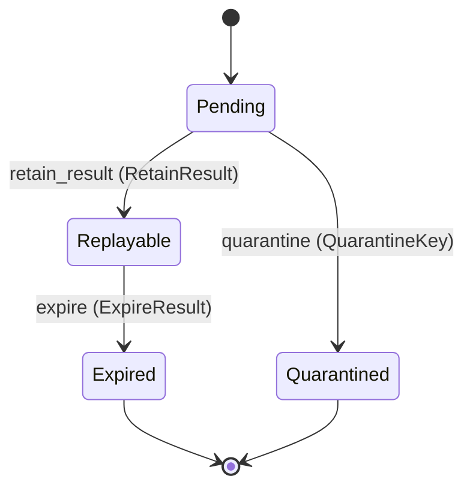

---
# generated by connectors-docs, do not edit
title: "idempotency"
sidebar_label: "idempotency"
sidebar_position: 18
description: "Proposed receiver-owned keyed mutation reservations and replay retention."
custom_edit_url: null
---

# idempotency

:::info[Typed specification]

Generated by the pinned `ess generate --kind docs` from [`ess`](https://github.com/beyond10x/connectors/tree/main/ess). Structural validation establishes consistency; behaviour, storage and cross-record predicates remain implementation obligations.

:::

Proposed receiver-owned keyed mutation reservations and replay retention.

`connectors.idempotency` is one of connectors's bounded contexts. [Back to the index](../index.md).

## Types

### `AuthorityScope`

`connectors.idempotency.AuthorityScope` is a record of four fields:

- `tenant` — `Optional<String>`, which may be absent
- `realm` — `Optional<String>`, which may be absent
- `caller` — `String`
- `executor` — `Optional<String>`, which may be absent

### `KeyNamespace`

`connectors.idempotency.KeyNamespace` is a record of three fields:

- `receiver_instance` — `String`
- `authority` — `connectors.idempotency.AuthorityScope`
- `origin` — `connectors.idempotency.Origin`

### `Origin`

`connectors.idempotency.Origin` is a record of two fields:

- `kind` — `connectors.idempotency.OriginKind`
- `authority_ref` — `String`

### `OriginKind`

`connectors.idempotency.OriginKind` is one of `direct` and `federated`.

### `RequestFingerprint`

`connectors.idempotency.RequestFingerprint` is a record of 10 fields:

- `operation_ref` — `String`
- `connection_ref` — `Optional<String>`, which may be absent
- `connection_revision` — `Optional<String>`, which may be absent
- `contract_ref` — `String`
- `profile` — `String`
- `descriptor_revision` — `String`
- `configuration_revision` — `String`
- `canonicalization_version` — `String`
- `input_digest` — `String`
- `route` — `Optional<connectors.idempotency.RouteBinding>`, which may be absent

### `ReservationId`

`connectors.idempotency.ReservationId` wraps `Uuid` and is not interchangeable with one: the whole value of naming it separately is the crossings the model then refuses.

### `RouteBinding`

`connectors.idempotency.RouteBinding` is a record of three fields:

- `gateway_instance` — `String`
- `route_id` — `String`
- `route_revision` — `String`

## Entities

An entity is what this context is about: something with an identity that outlives any one request, a shape, and a lifecycle. The lifecycle is exhaustive — a move that is not drawn below is a move this specification does not permit, and that is the only way it says so. Every move is labelled with the command that takes it, because a move nothing can trigger is refused rather than drawn.

### `KeyReservation`

`connectors.idempotency.KeyReservation`.

An instance is identified by `reservation_id`, a `connectors.idempotency.ReservationId`. The name is part of the model and not a convention: a view projects the identity under that name, so a projection inventing its own would disagree with the view.

It holds:

- `namespace` — `connectors.idempotency.KeyNamespace`
- `caller_key` — `String`
- `fingerprint` — `connectors.idempotency.RequestFingerprint`
- `attempt_id` — `connectors.mutations.AttemptId`
- `settled_at` — `Optional<Timestamp>`, which may be absent
- `replay_expires_at` — `Optional<Timestamp>`, which may be absent

It references at most one [`connectors.mutations.AttemptRecord`](./connectors-mutations.md#attemptrecord), as `attempt`, carried by `KeyReservation.attempt_id`.

Every instance satisfies `caller_key != ""`, `fingerprint.canonicalization_version == "adapter-v1-canonical-json"`, `defined(fingerprint.connection_ref)`, `defined(fingerprint.connection_revision)`, `(namespace.origin.kind != direct or namespace.origin.authority_ref == namespace.receiver_instance)`, `(namespace.origin.kind != direct or not (defined(fingerprint.route.gateway_instance)))`, `(namespace.origin.kind != federated or defined(fingerprint.route.gateway_instance))`, `(namespace.origin.kind != federated or namespace.origin.authority_ref == fingerprint.route.gateway_instance)`, `(state == Replayable or state == Expired or not (defined(settled_at)))`, `(state == Pending or state == Quarantined or defined(settled_at))`, `(state == Replayable or state == Expired or not (defined(replay_expires_at)))` and `(state == Pending or state == Quarantined or defined(replay_expires_at))` — a predicate over this entity's own fields, checked against them rather than stored as a sentence, so an invariant reading something the entity does not have is refused instead of documented.

Its state is a `connectors.idempotency.KeyReservation.State`, one of `Expired`, `Pending`, `Quarantined` and `Replayable`. That enum is synthesised from the lifecycle rather than declared beside it, so the states a view's filter compares and the states drawn below cannot disagree.

An instance is created in `Pending`. `Expired` and `Quarantined` are terminal, so an instance may rest there forever. That is declared rather than inferred from having no way out: an entity that cannot leave a state is either finished or stuck, and only its author knows which.

Each move is taken by a declared command outcome, and a move nothing takes is refused as `missing_causation` rather than left as a state change nobody can trigger:

- `retain_result` — taken by `connectors.idempotency.RetainResult` on its `retained` outcome
- `quarantine` — taken by `connectors.idempotency.QuarantineKey` on its `quarantined` outcome
- `expire` — taken by `connectors.idempotency.ExpireResult` on its `expired` outcome

An instance is brought into existence by `connectors.idempotency.ReserveKey` on its `reserved` outcome.

Illegal transitions are illegal by absence: no rule forbids them, there is simply no arrow, because a rule would be a second place for the same truth to live. A diagram cannot show an absence, so the pairs it does not connect are listed here, derived from the same transitions — anything named below is a move this specification does not permit.

- `Expired` may not become `Pending`
- `Expired` may not become `Quarantined`
- `Expired` may not become `Replayable`
- `Pending` may not become `Expired`
- `Quarantined` may not become `Expired`
- `Quarantined` may not become `Pending`
- `Quarantined` may not become `Replayable`
- `Replayable` may not become `Pending`
- `Replayable` may not become `Quarantined`

Two views project it: [`ReservationSettlements`](#reservationsettlements) and [`ReservationStates`](#reservationstates).

## Views

A view is what the outside world is promised it can observe. Each one says which instances it contains and how soon it reflects a command that has already returned, because "you can read this" without "how soon" is the promise every flaky suite is built on.

### `ReservationSettlements`

`connectors.idempotency.ReservationSettlements`.

It reads [`KeyReservation`](#keyreservation).

It contains every instance of that entity: no filter narrows it, which is a decision somebody made and not a line somebody omitted.

It exposes:

- `reservation_id` — `connectors.idempotency.ReservationId`
- `namespace` — `connectors.idempotency.KeyNamespace`
- `attempt_id` — `connectors.mutations.AttemptId`
- `fingerprint` — `connectors.idempotency.RequestFingerprint`
- `settled_at` — `Optional<Timestamp>`, which may be absent
- `replay_expires_at` — `Optional<Timestamp>`, which may be absent
- `state` — `connectors.idempotency.KeyReservation.State`

It declares no order, so the rows come back in whatever order the implementation has, and two reads may disagree.

**Read-your-writes**: it is current the moment the command that changed it returns. A caller that has just created an invoice and cannot see it in here has been told a lie about what it did.

A generated scenario asserts it once, immediately after the command: a view promising this and not keeping the promise has to fail the suite rather than be retried until it passes.

### `ReservationStates`

`connectors.idempotency.ReservationStates`.

It reads [`KeyReservation`](#keyreservation).

It contains every instance of that entity: no filter narrows it, which is a decision somebody made and not a line somebody omitted.

It exposes:

- `reservation_id` — `connectors.idempotency.ReservationId`
- `namespace` — `connectors.idempotency.KeyNamespace`
- `caller_key` — `String`
- `state` — `connectors.idempotency.KeyReservation.State`

It declares no order, so the rows come back in whatever order the implementation has, and two reads may disagree.

**Read-your-writes**: it is current the moment the command that changed it returns. A caller that has just created an invoice and cannot see it in here has been told a lie about what it did.

A generated scenario asserts it once, immediately after the command: a view promising this and not keeping the promise has to fail the suite rather than be retried until it passes.

## Commands

### `ExpireResult`

`connectors.idempotency.ExpireResult`.

It takes:

- `reservation_id` — `connectors.idempotency.ReservationId`

It has two outcomes.

**`expired`** — The default branch, taken when no other outcome's condition matched. It moves a `connectors.idempotency.KeyReservation` from `Replayable` to `Expired`, along the declared move `expire`. The instance is the one named by the input field `reservation_id`. It emits `connectors.idempotency.ResultExpired`. A test reaches it by constructing an input that satisfies no other outcome's condition.

**`wrong-state`** — Taken when the subject is resting in a state none of this command's moves start from — a `connectors.idempotency.KeyReservation` in `Expired`, `Pending` and `Quarantined`, which is what is left of the lifecycle once this command's own moves are taken away. The document lists none of it. No entity in this specification changes. It reports `connectors.idempotency.ReservationStateConflict`, carrying `state`. It emits nothing. A test reaches it by driving an instance into one of those states and then issuing the command, because no input selects this branch.

### `QuarantineKey`

`connectors.idempotency.QuarantineKey`.

It takes:

- `reservation_id` — `connectors.idempotency.ReservationId`

It has two outcomes.

**`quarantined`** — The default branch, taken when no other outcome's condition matched. It moves a `connectors.idempotency.KeyReservation` from `Pending` to `Quarantined`, along the declared move `quarantine`. The instance is the one named by the input field `reservation_id`. It emits `connectors.idempotency.KeyQuarantined`. A test reaches it by constructing an input that satisfies no other outcome's condition.

**`wrong-state`** — Taken when the subject is resting in a state none of this command's moves start from — a `connectors.idempotency.KeyReservation` in `Expired`, `Quarantined` and `Replayable`, which is what is left of the lifecycle once this command's own moves are taken away. The document lists none of it. No entity in this specification changes. It reports `connectors.idempotency.ReservationStateConflict`, carrying `state`. It emits nothing. A test reaches it by driving an instance into one of those states and then issuing the command, because no input selects this branch.

### `ReserveKey`

`connectors.idempotency.ReserveKey`.

It takes:

- `namespace` — `connectors.idempotency.KeyNamespace`
- `caller_key` — `String`
- `fingerprint` — `connectors.idempotency.RequestFingerprint`
- `attempt_id` — `connectors.mutations.AttemptId`

It has one outcome.

**`reserved`** — The default branch, taken when no other outcome's condition matched. It creates a `connectors.idempotency.KeyReservation`, which starts in `Pending`. The new instance's identity is published as `reservation_id` on `connectors.idempotency.KeyReserved`. It emits `connectors.idempotency.KeyReserved`. It sets `namespace` from `input.namespace`, `caller_key` from `input.caller_key`, `fingerprint` from `input.fingerprint` and `attempt_id` from `input.attempt_id`. A test reaches it by constructing an input that satisfies no other outcome's condition.

### `RetainResult`

`connectors.idempotency.RetainResult`.

It takes:

- `reservation_id` — `connectors.idempotency.ReservationId`
- `settled_at` — `Timestamp`
- `replay_expires_at` — `Timestamp`

It has two outcomes.

**`retained`** — The default branch, taken when no other outcome's condition matched. It moves a `connectors.idempotency.KeyReservation` from `Pending` to `Replayable`, along the declared move `retain_result`. The instance is the one named by the input field `reservation_id`. It emits `connectors.idempotency.ResultRetained`. It sets `settled_at` from `input.settled_at` and `replay_expires_at` from `input.replay_expires_at`. A test reaches it by constructing an input that satisfies no other outcome's condition.

**`wrong-state`** — Taken when the subject is resting in a state none of this command's moves start from — a `connectors.idempotency.KeyReservation` in `Expired`, `Quarantined` and `Replayable`, which is what is left of the lifecycle once this command's own moves are taken away. The document lists none of it. No entity in this specification changes. It reports `connectors.idempotency.ReservationStateConflict`, carrying `state`. It emits nothing. A test reaches it by driving an instance into one of those states and then issuing the command, because no input selects this branch.

## Events

### `KeyQuarantined`

`connectors.idempotency.KeyQuarantined`.

It carries:

- `reservation_id` — `connectors.idempotency.ReservationId`

Emitted by `connectors.idempotency.QuarantineKey` on its `quarantined` outcome.

Nothing in this system reacts to it.

### `KeyReserved`

`connectors.idempotency.KeyReserved`.

It carries:

- `reservation_id` — `connectors.idempotency.ReservationId`

Emitted by `connectors.idempotency.ReserveKey` on its `reserved` outcome.

Nothing in this system reacts to it.

### `ResultExpired`

`connectors.idempotency.ResultExpired`.

It carries:

- `reservation_id` — `connectors.idempotency.ReservationId`

Emitted by `connectors.idempotency.ExpireResult` on its `expired` outcome.

Nothing in this system reacts to it.

### `ResultRetained`

`connectors.idempotency.ResultRetained`.

It carries:

- `reservation_id` — `connectors.idempotency.ReservationId`
- `settled_at` — `Timestamp`
- `replay_expires_at` — `Timestamp`

Emitted by `connectors.idempotency.RetainResult` on its `retained` outcome.

Nothing in this system reacts to it.

## Errors

### `ReservationStateConflict`

It carries:

- `state` — `connectors.idempotency.KeyReservation.State`

Reported by `connectors.idempotency.ExpireResult` on its `wrong-state` outcome.

Reported by `connectors.idempotency.QuarantineKey` on its `wrong-state` outcome.

Reported by `connectors.idempotency.RetainResult` on its `wrong-state` outcome.

## Actors

An actor is who may ask this context for something. Every grant below points at a command this specification declares — a grant is a resolved reference, so "may invoke" something nobody wrote is not a permission this model can express, and an authorisation that authorises nothing cannot ship quietly.

### `LocalHost`

`connectors.idempotency.LocalHost`.

It may invoke [`ExpireResult`](#expireresult), [`QuarantineKey`](#quarantinekey), [`ReserveKey`](#reservekey) and [`RetainResult`](#retainresult).

---

Generated from connectors v1 · model digest `4ca84ed80d29dc59e4e520985535bcef4cd918acbd4248ac04a718dadb9051a7` · contract digest `slice-sha256/2:a6a5e60026e92afd9d07c7be34c2627d4bf0ec73f3e53a48f7b00664b9f88243`. Do not edit this file; change the specification and regenerate it with `ess generate`.
