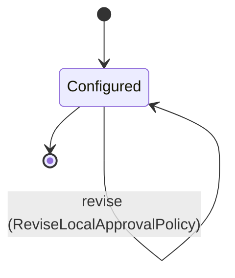

---
# generated by connectors-docs, do not edit
title: "local_approval_policy"
sidebar_label: "local_approval_policy"
sidebar_position: 19
description: "Proposed serialized local owner policy for approval issuance and write admission."
custom_edit_url: null
---

# local_approval_policy

:::info[Typed specification]

Generated by the pinned `ess generate --kind docs` from [`ess`](https://github.com/beyond10x/connectors/tree/main/ess). Structural validation establishes consistency; behaviour, storage and cross-record predicates remain implementation obligations.

:::

Proposed serialized local owner policy for approval issuance and write admission.

`connectors.local_approval_policy` is one of connectors's bounded contexts. [Back to the index](../index.md).

## Types

### `NativePreparation`

`connectors.local_approval_policy.NativePreparation` is a record of five fields:

- `preparation_id` — `Uuid`
- `request_id` — `String`
- `child_incarnation` — `Uuid`
- `input_sha256` — `String`
- `deadline_unix_ms` — `Integer`

### `Selection`

`connectors.local_approval_policy.Selection` is a record of four fields:

- `configuration_revision` — `String`
- `descriptor_revision` — `String`
- `executable_selection` — `String`
- `clock_configuration_sha256` — `String`

### `SetInput`

`connectors.local_approval_policy.SetInput` is a record of one field:

- `operations` — `List<String>`

Two of the types above are reached by nothing else in this system: `connectors.local_approval_policy.NativePreparation` and `connectors.local_approval_policy.SetInput`. No entity, view, command, event, error or crossing names them, so it is either vocabulary something outside this specification uses or a leftover — and only a person can tell which.

## Entities

An entity is what this context is about: something with an identity that outlives any one request, a shape, and a lifecycle. The lifecycle is exhaustive — a move that is not drawn below is a move this specification does not permit, and that is the only way it says so. Every move is labelled with the command that takes it, because a move nothing can trigger is refused rather than drawn.

### `LocalApprovalPolicy`

`connectors.local_approval_policy.LocalApprovalPolicy`.

An instance is identified by `policy_id`, a `Uuid`. The name is part of the model and not a convention: a view projects the identity under that name, so a projection inventing its own would disagree with the view.

It holds:

- `instance_id` — `String`
- `issuer_id` — `Uuid`
- `revision` — `Integer`
- `owner_uid` — `Integer`
- `selection` — `connectors.local_approval_policy.Selection`
- `operations` — `List<String>`

It references at most one [`connectors.declarations.ServiceConfiguration`](./connectors-declarations.md#serviceconfiguration), as `instance`, carried by `LocalApprovalPolicy.instance_id`. It references at most one [`connectors.approval_issuers.ApprovalIssuer`](./connectors-approval_issuers.md#approvalissuer), as `issuer`, carried by `LocalApprovalPolicy.issuer_id`.

Every instance satisfies `(revision >= 1 and revision <= 9007199254740991)` — a predicate over this entity's own fields, checked against them rather than stored as a sentence, so an invariant reading something the entity does not have is refused instead of documented.

Its state is a `connectors.local_approval_policy.LocalApprovalPolicy.State`, one of `Configured`. That enum is synthesised from the lifecycle rather than declared beside it, so the states a view's filter compares and the states drawn below cannot disagree.

An instance is created in `Configured`. `Configured` is terminal, so an instance may rest there forever. That is declared rather than inferred from having no way out: an entity that cannot leave a state is either finished or stuck, and only its author knows which.

Each move is taken by a declared command outcome, and a move nothing takes is refused as `missing_causation` rather than left as a state change nobody can trigger:

- `revise` — taken by `connectors.local_approval_policy.ReviseLocalApprovalPolicy` on its `revised` outcome

An instance is brought into existence by `connectors.local_approval_policy.ConfigureLocalApprovalPolicy` on its `configured` outcome.

It has one state, so there is no move to permit or to forbid.

One view projects it: [`LocalApprovalPolicies`](#localapprovalpolicies).

## Views

A view is what the outside world is promised it can observe. Each one says which instances it contains and how soon it reflects a command that has already returned, because "you can read this" without "how soon" is the promise every flaky suite is built on.

### `LocalApprovalPolicies`

`connectors.local_approval_policy.LocalApprovalPolicies`.

It reads [`LocalApprovalPolicy`](#localapprovalpolicy).

It contains every instance of that entity: no filter narrows it, which is a decision somebody made and not a line somebody omitted.

It exposes:

- `policy_id` — `Uuid`
- `revision` — `Integer`
- `issuer_id` — `Uuid`
- `owner_uid` — `Integer`
- `state` — `connectors.local_approval_policy.LocalApprovalPolicy.State`

It declares no order, so the rows come back in whatever order the implementation has, and two reads may disagree.

**Read-your-writes**: it is current the moment the command that changed it returns. A caller that has just created an invoice and cannot see it in here has been told a lie about what it did.

A generated scenario asserts it once, immediately after the command: a view promising this and not keeping the promise has to fail the suite rather than be retried until it passes.

## Commands

### `ConfigureLocalApprovalPolicy`

`connectors.local_approval_policy.ConfigureLocalApprovalPolicy`.

It takes:

- `policy_id` — `Uuid`
- `instance_id` — `String`
- `issuer_id` — `Uuid`
- `revision` — `Integer`
- `owner_uid` — `Integer`
- `selection` — `connectors.local_approval_policy.Selection`
- `operations` — `List<String>`

It has three outcomes.

**`nil-identity`** — Taken when `policy_id in [00000000-0000-0000-0000-000000000000]` holds of the input. No entity in this specification changes. It reports `connectors.local_approval_policy.NilPolicyIdentity`, carrying `policy_id`. It emits nothing. A test reaches it by constructing an input that satisfies that condition.

**`too-many-operations`** — Taken when `operations.count > 256` holds of the input. No entity in this specification changes. It reports `connectors.local_approval_policy.TooManyOperations`, carrying `policy_id`. It emits nothing. A test reaches it by constructing an input that satisfies that condition.

**`configured`** — The default branch, taken when no other outcome's condition matched. It creates a `connectors.local_approval_policy.LocalApprovalPolicy`, which starts in `Configured`. The new instance's identity is published as `policy_id` on `connectors.local_approval_policy.LocalApprovalPolicyConfigured`. It emits `connectors.local_approval_policy.LocalApprovalPolicyConfigured`. It sets `instance_id` from `input.instance_id`, `issuer_id` from `input.issuer_id`, `revision` from `input.revision`, `owner_uid` from `input.owner_uid`, `selection` from `input.selection` and `operations` from `input.operations`. A test reaches it by constructing an input that satisfies no other outcome's condition.

### `ReviseLocalApprovalPolicy`

`connectors.local_approval_policy.ReviseLocalApprovalPolicy`.

It takes:

- `policy_id` — `Uuid`
- `expected_revision` — `Integer`
- `revision` — `Integer`
- `selection` — `connectors.local_approval_policy.Selection`
- `operations` — `List<String>`

It has five outcomes.

**`revision-conflict`** — Taken when the existing subject's stored fields satisfy `revision != input.expected_revision`. No entity in this specification changes. It reports `connectors.local_approval_policy.RevisionConflict`, carrying `policy_id`. It emits nothing. A test establishes and independently observes the subject enum fact before selecting this branch.

**`exhausted`** — Taken when the existing subject's stored fields satisfy `revision >= 9007199254740991`. No entity in this specification changes. It reports `connectors.local_approval_policy.RevisionExhausted`, carrying `policy_id`. It emits nothing. A test establishes and independently observes the subject enum fact before selecting this branch.

**`too-many-operations`** — Taken when `operations.count > 256` holds of the input. No entity in this specification changes. It reports `connectors.local_approval_policy.TooManyOperations`, carrying `policy_id`. It emits nothing. A test reaches it by constructing an input that satisfies that condition.

**`stale-revision`** — Taken when the existing subject's stored fields satisfy `revision >= input.revision`. No entity in this specification changes. It reports `connectors.local_approval_policy.RevisionNotAdvanced`, carrying `policy_id`. It emits nothing. A test establishes and independently observes the subject enum fact before selecting this branch.

**`revised`** — The default branch, taken when no other outcome's condition matched. It moves a `connectors.local_approval_policy.LocalApprovalPolicy` from `Configured` to `Configured`, along the declared move `revise`. The instance is the one named by the input field `policy_id`. It emits `connectors.local_approval_policy.LocalApprovalPolicyRevised`. It sets `revision` from `input.revision`, `selection` from `input.selection` and `operations` from `input.operations`. A test reaches it by constructing an input that satisfies no other outcome's condition.

## Events

### `LocalApprovalPolicyConfigured`

`connectors.local_approval_policy.LocalApprovalPolicyConfigured`.

It carries:

- `policy_id` — `Uuid`

Emitted by `connectors.local_approval_policy.ConfigureLocalApprovalPolicy` on its `configured` outcome.

Nothing in this system reacts to it.

### `LocalApprovalPolicyRevised`

`connectors.local_approval_policy.LocalApprovalPolicyRevised`.

It carries:

- `policy_id` — `Uuid`
- `revision` — `Integer`

Emitted by `connectors.local_approval_policy.ReviseLocalApprovalPolicy` on its `revised` outcome.

Nothing in this system reacts to it.

## Errors

### `NilPolicyIdentity`

It carries:

- `policy_id` — `Uuid`

Reported by `connectors.local_approval_policy.ConfigureLocalApprovalPolicy` on its `nil-identity` outcome.

### `RevisionConflict`

It carries:

- `policy_id` — `Uuid`

Reported by `connectors.local_approval_policy.ReviseLocalApprovalPolicy` on its `revision-conflict` outcome.

### `RevisionExhausted`

It carries:

- `policy_id` — `Uuid`

Reported by `connectors.local_approval_policy.ReviseLocalApprovalPolicy` on its `exhausted` outcome.

### `RevisionNotAdvanced`

It carries:

- `policy_id` — `Uuid`

Reported by `connectors.local_approval_policy.ReviseLocalApprovalPolicy` on its `stale-revision` outcome.

### `TooManyOperations`

It carries:

- `policy_id` — `Uuid`

Reported by `connectors.local_approval_policy.ConfigureLocalApprovalPolicy` on its `too-many-operations` outcome.

Reported by `connectors.local_approval_policy.ReviseLocalApprovalPolicy` on its `too-many-operations` outcome.

## Actors

An actor is who may ask this context for something. Every grant below points at a command this specification declares — a grant is a resolved reference, so "may invoke" something nobody wrote is not a permission this model can express, and an authorisation that authorises nothing cannot ship quietly.

### `LocalHost`

`connectors.local_approval_policy.LocalHost`.

It may invoke [`ConfigureLocalApprovalPolicy`](#configurelocalapprovalpolicy) and [`ReviseLocalApprovalPolicy`](#reviselocalapprovalpolicy).

---

Generated from connectors v1 · model digest `6c52aebf2b119b4755842d83b7b8b0e950d08dc800e33c6931c1d7fbfcaa594f` · contract digest `slice-sha256/2:33e596c30fe9b8523d6f96910691cf5dfa3cbd43c5599c528064f8a7fc6e31de`. Do not edit this file; change the specification and regenerate it with `ess generate`.
