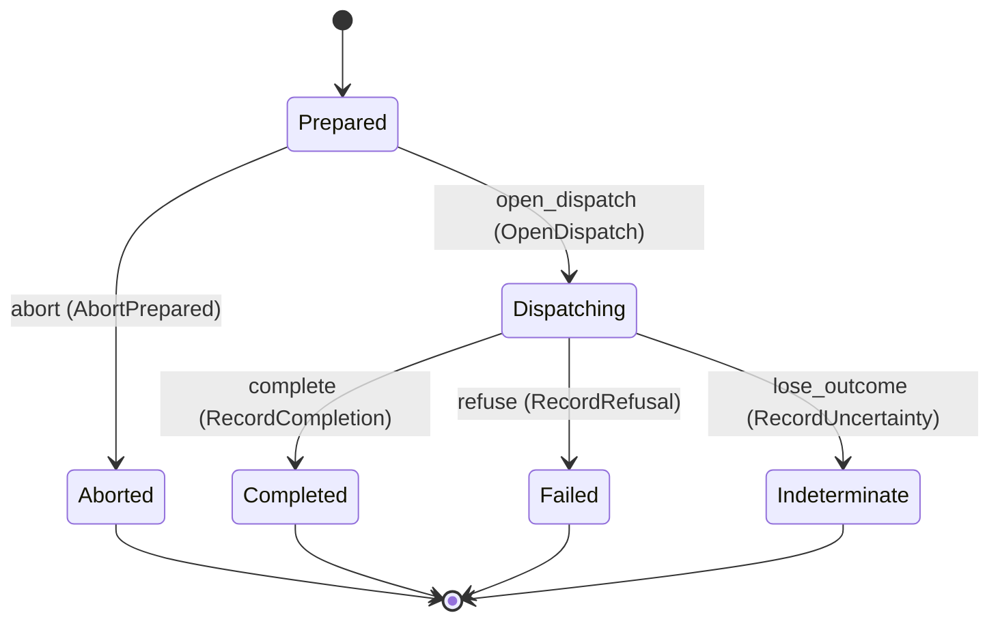

---
# generated by connectors-docs, do not edit
title: "mutations"
sidebar_label: "mutations"
sidebar_position: 20
description: "Host-owned mutation attempt ledger with a private local binding; not a public mutation API."
custom_edit_url: null
---

# mutations

:::info[Typed specification]

Generated by the pinned `ess generate --kind docs` from [`ess`](https://github.com/beyond10x/connectors/tree/main/ess). Structural validation establishes consistency; behaviour, storage and cross-record predicates remain implementation obligations.

:::

Host-owned mutation attempt ledger with a private local binding; not a public mutation API.

`connectors.mutations` is one of connectors's bounded contexts. [Back to the index](../index.md).

## Types

### `ApprovalMode`

`connectors.mutations.ApprovalMode` is one of `not_required`, `required` and `event_claim`.

### `AttemptId`

`connectors.mutations.AttemptId` wraps `Uuid` and is not interchangeable with one: the whole value of naming it separately is the crossings the model then refuses.

### `EffectDeclaration`

`connectors.mutations.EffectDeclaration` is a record of three fields:

- `profile` — `String`
- `effects` — `List<connectors.mutations.ExecutableEffect>`
- `semantic_effects` — `List<connectors.mutations.SemanticEffect>`

### `EffectKnowledge`

`connectors.mutations.EffectKnowledge` is one of `not_attempted`, `refused`, `applied` and `unknown`.

### `ExecutableEffect`

`connectors.mutations.ExecutableEffect` is one of `external_write`, `network`, `process`, `local_system`, `send_external` and `session_establishment`.

### `IdempotencyKind`

`connectors.mutations.IdempotencyKind` is one of `none`, `natural` and `keyed`.

### `Observation`

`connectors.mutations.Observation` is a record of three fields:

- `attempt_id` — `Optional<connectors.mutations.AttemptId>`, which may be absent
- `classification` — `connectors.mutations.EffectKnowledge`
- `cause` — `Optional<String>`, which may be absent

### `SemanticEffect`

`connectors.mutations.SemanticEffect` is one of `human_visible`, `billable` and `irreversible`.

### `SessionEstablishmentObservation`

`connectors.mutations.SessionEstablishmentObservation` is a record of two fields:

- `mutation` — `connectors.mutations.Observation`
- `ready_session` — `Optional<connectors.sessions.SessionId>`, which may be absent

Every value satisfies `(not (defined(ready_session)) or mutation.classification == applied)`.

### `SettlementClockInterval`

`connectors.mutations.SettlementClockInterval` is a record of two fields:

- `lower_unix_ms` — `Integer`
- `upper_unix_ms` — `Integer`

Three of the types above are reached by nothing else in this system: `connectors.mutations.EffectDeclaration`, `connectors.mutations.SessionEstablishmentObservation` and `connectors.mutations.SettlementClockInterval`. No entity, view, command, event, error or crossing names them, so it is either vocabulary something outside this specification uses or a leftover — and only a person can tell which.

## Entities

An entity is what this context is about: something with an identity that outlives any one request, a shape, and a lifecycle. The lifecycle is exhaustive — a move that is not drawn below is a move this specification does not permit, and that is the only way it says so. Every move is labelled with the command that takes it, because a move nothing can trigger is refused rather than drawn.

### `AttemptRecord`

`connectors.mutations.AttemptRecord`.

An instance is identified by `attempt_id`, a `connectors.mutations.AttemptId`. The name is part of the model and not a convention: a view projects the identity under that name, so a projection inventing its own would disagree with the view.

It holds:

- `instance_id` — `String`
- `request_id` — `String`
- `operation_id` — `String`
- `connection_ref` — `Optional<String>`, which may be absent
- `input_digest` — `String`
- `request_fingerprint` — `connectors.idempotency.RequestFingerprint`
- `approval_mode` — `connectors.mutations.ApprovalMode`
- `approval_ref` — `Optional<String>`, which may be absent
- `approval_subject` — `Optional<connectors.delegation.CanonicalApprovalSubject>`, which may be absent
- `idempotency_key` — `Optional<String>`, which may be absent
- `owner_nonce` — `Uuid`
- `publication_fence` — `String`
- `settled_at` — `Optional<Timestamp>`, which may be absent
- `terminal_result_json` — `Optional<String>`, which may be absent

It references at most one [`connectors.declarations.ServiceConfiguration`](./connectors-declarations.md#serviceconfiguration), as `instance`, carried by `AttemptRecord.instance_id`. It references at most one [`connectors.auth_bindings.Connection`](./connectors-auth_bindings.md#connection), as `connection`, carried by `AttemptRecord.connection_ref`.

Every instance satisfies `request_fingerprint.canonicalization_version == "adapter-v1-canonical-json"`, `(state == Aborted or state == Completed or state == Failed or not (defined(settled_at)))` and `(state == Prepared or state == Dispatching or state == Indeterminate or defined(settled_at))` — a predicate over this entity's own fields, checked against them rather than stored as a sentence, so an invariant reading something the entity does not have is refused instead of documented.

Its state is a `connectors.mutations.AttemptRecord.State`, one of `Aborted`, `Completed`, `Dispatching`, `Failed`, `Indeterminate` and `Prepared`. That enum is synthesised from the lifecycle rather than declared beside it, so the states a view's filter compares and the states drawn below cannot disagree.

An instance is created in `Prepared`. `Aborted`, `Completed`, `Failed` and `Indeterminate` are terminal, so an instance may rest there forever. That is declared rather than inferred from having no way out: an entity that cannot leave a state is either finished or stuck, and only its author knows which.

Each move is taken by a declared command outcome, and a move nothing takes is refused as `missing_causation` rather than left as a state change nobody can trigger:

- `open_dispatch` — taken by `connectors.mutations.OpenDispatch` on its `opened` outcome
- `abort` — taken by `connectors.mutations.AbortPrepared` on its `aborted` outcome
- `complete` — taken by `connectors.mutations.RecordCompletion` on its `completed` outcome
- `refuse` — taken by `connectors.mutations.RecordRefusal` on its `refused` outcome
- `lose_outcome` — taken by `connectors.mutations.RecordUncertainty` on its `indeterminate` outcome

An instance is brought into existence by `connectors.mutations.PrepareAttempt` on its `prepared` outcome.

Illegal transitions are illegal by absence: no rule forbids them, there is simply no arrow, because a rule would be a second place for the same truth to live. A diagram cannot show an absence, so the pairs it does not connect are listed here, derived from the same transitions — anything named below is a move this specification does not permit.

- `Aborted` may not become `Completed`
- `Aborted` may not become `Dispatching`
- `Aborted` may not become `Failed`
- `Aborted` may not become `Indeterminate`
- `Aborted` may not become `Prepared`
- `Completed` may not become `Aborted`
- `Completed` may not become `Dispatching`
- `Completed` may not become `Failed`
- `Completed` may not become `Indeterminate`
- `Completed` may not become `Prepared`
- `Dispatching` may not become `Aborted`
- `Dispatching` may not become `Prepared`
- `Failed` may not become `Aborted`
- `Failed` may not become `Completed`
- `Failed` may not become `Dispatching`
- `Failed` may not become `Indeterminate`
- `Failed` may not become `Prepared`
- `Indeterminate` may not become `Aborted`
- `Indeterminate` may not become `Completed`
- `Indeterminate` may not become `Dispatching`
- `Indeterminate` may not become `Failed`
- `Indeterminate` may not become `Prepared`
- `Prepared` may not become `Completed`
- `Prepared` may not become `Failed`
- `Prepared` may not become `Indeterminate`

Two views project it: [`AttemptSettlements`](#attemptsettlements) and [`AttemptStates`](#attemptstates).

## Views

A view is what the outside world is promised it can observe. Each one says which instances it contains and how soon it reflects a command that has already returned, because "you can read this" without "how soon" is the promise every flaky suite is built on.

### `AttemptSettlements`

`connectors.mutations.AttemptSettlements`.

It reads [`AttemptRecord`](#attemptrecord).

It contains every instance of that entity: no filter narrows it, which is a decision somebody made and not a line somebody omitted.

It exposes:

- `attempt_id` — `connectors.mutations.AttemptId`
- `request_fingerprint` — `connectors.idempotency.RequestFingerprint`
- `approval_mode` — `connectors.mutations.ApprovalMode`
- `approval_subject` — `Optional<connectors.delegation.CanonicalApprovalSubject>`, which may be absent
- `settled_at` — `Optional<Timestamp>`, which may be absent
- `state` — `connectors.mutations.AttemptRecord.State`

It declares no order, so the rows come back in whatever order the implementation has, and two reads may disagree.

**Read-your-writes**: it is current the moment the command that changed it returns. A caller that has just created an invoice and cannot see it in here has been told a lie about what it did.

A generated scenario asserts it once, immediately after the command: a view promising this and not keeping the promise has to fail the suite rather than be retried until it passes.

### `AttemptStates`

`connectors.mutations.AttemptStates`.

It reads [`AttemptRecord`](#attemptrecord).

It contains every instance of that entity: no filter narrows it, which is a decision somebody made and not a line somebody omitted.

It exposes:

- `attempt_id` — `connectors.mutations.AttemptId`
- `approval_mode` — `connectors.mutations.ApprovalMode`
- `instance_id` — `String`
- `request_id` — `String`
- `operation_id` — `String`
- `connection_ref` — `Optional<String>`, which may be absent
- `input_digest` — `String`
- `approval_ref` — `Optional<String>`, which may be absent
- `idempotency_key` — `Optional<String>`, which may be absent
- `publication_fence` — `String`
- `state` — `connectors.mutations.AttemptRecord.State`

It declares no order, so the rows come back in whatever order the implementation has, and two reads may disagree.

**Read-your-writes**: it is current the moment the command that changed it returns. A caller that has just created an invoice and cannot see it in here has been told a lie about what it did.

A generated scenario asserts it once, immediately after the command: a view promising this and not keeping the promise has to fail the suite rather than be retried until it passes.

## Commands

### `AbortPrepared`

`connectors.mutations.AbortPrepared`.

It takes:

- `attempt_id` — `connectors.mutations.AttemptId`
- `settled_at` — `Timestamp`
- `terminal_result_json` — `String`

It has two outcomes.

**`aborted`** — The default branch, taken when no other outcome's condition matched. It moves a `connectors.mutations.AttemptRecord` from `Prepared` to `Aborted`, along the declared move `abort`. The instance is the one named by the input field `attempt_id`. It emits `connectors.mutations.AttemptAborted`. It sets `settled_at` from `input.settled_at` and `terminal_result_json` from `input.terminal_result_json`. A test reaches it by constructing an input that satisfies no other outcome's condition.

**`wrong-state`** — Taken when the subject is resting in a state none of this command's moves start from — a `connectors.mutations.AttemptRecord` in `Aborted`, `Completed`, `Dispatching`, `Failed` and `Indeterminate`, which is what is left of the lifecycle once this command's own moves are taken away. The document lists none of it. No entity in this specification changes. It reports `connectors.mutations.AttemptStateConflict`, carrying `state`. It emits nothing. A test reaches it by driving an instance into one of those states and then issuing the command, because no input selects this branch.

### `OpenDispatch`

`connectors.mutations.OpenDispatch`.

It takes:

- `attempt_id` — `connectors.mutations.AttemptId`

It has three outcomes.

**`subject-missing`** — Taken when the existing subject's stored fields satisfy `(approval_mode == required and not (defined(approval_subject.format)))`. No entity in this specification changes. It reports `connectors.mutations.ApprovalSubjectMissing`, carrying `attempt_id`. It emits nothing. A test establishes and independently observes the subject enum fact before selecting this branch.

**`opened`** — The default branch, taken when no other outcome's condition matched. It moves a `connectors.mutations.AttemptRecord` from `Prepared` to `Dispatching`, along the declared move `open_dispatch`. The instance is the one named by the input field `attempt_id`. It emits `connectors.mutations.DispatchOpened`. A test reaches it by constructing an input that satisfies no other outcome's condition.

**`wrong-state`** — Taken when the subject is resting in a state none of this command's moves start from — a `connectors.mutations.AttemptRecord` in `Aborted`, `Completed`, `Dispatching`, `Failed` and `Indeterminate`, which is what is left of the lifecycle once this command's own moves are taken away. The document lists none of it. No entity in this specification changes. It reports `connectors.mutations.AttemptStateConflict`, carrying `state`. It emits nothing. A test reaches it by driving an instance into one of those states and then issuing the command, because no input selects this branch.

### `PrepareAttempt`

`connectors.mutations.PrepareAttempt`.

It takes:

- `instance_id` — `String`
- `request_id` — `String`
- `operation_id` — `String`
- `connection_ref` — `Optional<String>`, which may be absent
- `input_digest` — `String`
- `request_fingerprint` — `connectors.idempotency.RequestFingerprint`
- `approval_mode` — `connectors.mutations.ApprovalMode`
- `approval_ref` — `Optional<String>`, which may be absent
- `approval_subject` — `Optional<connectors.delegation.CanonicalApprovalSubject>`, which may be absent
- `idempotency_key` — `Optional<String>`, which may be absent
- `owner_nonce` — `Uuid`
- `publication_fence` — `String`

It has one outcome.

**`prepared`** — The default branch, taken when no other outcome's condition matched. It creates a `connectors.mutations.AttemptRecord`, which starts in `Prepared`. The new instance's identity is published as `attempt_id` on `connectors.mutations.AttemptPrepared`. It emits `connectors.mutations.AttemptPrepared`. It sets `instance_id` from `input.instance_id`, `request_id` from `input.request_id`, `operation_id` from `input.operation_id`, `connection_ref` from `input.connection_ref`, `input_digest` from `input.input_digest`, `request_fingerprint` from `input.request_fingerprint`, `approval_mode` from `input.approval_mode`, `approval_ref` from `input.approval_ref`, `approval_subject` from `input.approval_subject`, `idempotency_key` from `input.idempotency_key`, `owner_nonce` from `input.owner_nonce` and `publication_fence` from `input.publication_fence`. A test reaches it by constructing an input that satisfies no other outcome's condition.

### `RecordCompletion`

`connectors.mutations.RecordCompletion`.

It takes:

- `attempt_id` — `connectors.mutations.AttemptId`
- `settled_at` — `Timestamp`
- `terminal_result_json` — `String`

It has two outcomes.

**`completed`** — The default branch, taken when no other outcome's condition matched. It moves a `connectors.mutations.AttemptRecord` from `Dispatching` to `Completed`, along the declared move `complete`. The instance is the one named by the input field `attempt_id`. It emits `connectors.mutations.AttemptCompleted`. It sets `settled_at` from `input.settled_at` and `terminal_result_json` from `input.terminal_result_json`. A test reaches it by constructing an input that satisfies no other outcome's condition.

**`wrong-state`** — Taken when the subject is resting in a state none of this command's moves start from — a `connectors.mutations.AttemptRecord` in `Aborted`, `Completed`, `Failed`, `Indeterminate` and `Prepared`, which is what is left of the lifecycle once this command's own moves are taken away. The document lists none of it. No entity in this specification changes. It reports `connectors.mutations.AttemptStateConflict`, carrying `state`. It emits nothing. A test reaches it by driving an instance into one of those states and then issuing the command, because no input selects this branch.

### `RecordRefusal`

`connectors.mutations.RecordRefusal`.

It takes:

- `attempt_id` — `connectors.mutations.AttemptId`
- `settled_at` — `Timestamp`
- `terminal_result_json` — `String`

It has two outcomes.

**`refused`** — The default branch, taken when no other outcome's condition matched. It moves a `connectors.mutations.AttemptRecord` from `Dispatching` to `Failed`, along the declared move `refuse`. The instance is the one named by the input field `attempt_id`. It emits `connectors.mutations.AttemptRefused`. It sets `settled_at` from `input.settled_at` and `terminal_result_json` from `input.terminal_result_json`. A test reaches it by constructing an input that satisfies no other outcome's condition.

**`wrong-state`** — Taken when the subject is resting in a state none of this command's moves start from — a `connectors.mutations.AttemptRecord` in `Aborted`, `Completed`, `Failed`, `Indeterminate` and `Prepared`, which is what is left of the lifecycle once this command's own moves are taken away. The document lists none of it. No entity in this specification changes. It reports `connectors.mutations.AttemptStateConflict`, carrying `state`. It emits nothing. A test reaches it by driving an instance into one of those states and then issuing the command, because no input selects this branch.

### `RecordUncertainty`

`connectors.mutations.RecordUncertainty`.

It takes:

- `attempt_id` — `connectors.mutations.AttemptId`
- `terminal_result_json` — `String`

It has two outcomes.

**`indeterminate`** — The default branch, taken when no other outcome's condition matched. It moves a `connectors.mutations.AttemptRecord` from `Dispatching` to `Indeterminate`, along the declared move `lose_outcome`. The instance is the one named by the input field `attempt_id`. It emits `connectors.mutations.AttemptIndeterminate`. It sets `terminal_result_json` from `input.terminal_result_json`. A test reaches it by constructing an input that satisfies no other outcome's condition.

**`wrong-state`** — Taken when the subject is resting in a state none of this command's moves start from — a `connectors.mutations.AttemptRecord` in `Aborted`, `Completed`, `Failed`, `Indeterminate` and `Prepared`, which is what is left of the lifecycle once this command's own moves are taken away. The document lists none of it. No entity in this specification changes. It reports `connectors.mutations.AttemptStateConflict`, carrying `state`. It emits nothing. A test reaches it by driving an instance into one of those states and then issuing the command, because no input selects this branch.

## Events

### `AttemptAborted`

`connectors.mutations.AttemptAborted`.

It carries:

- `attempt_id` — `connectors.mutations.AttemptId`

Emitted by `connectors.mutations.AbortPrepared` on its `aborted` outcome.

Nothing in this system reacts to it.

### `AttemptCompleted`

`connectors.mutations.AttemptCompleted`.

It carries:

- `attempt_id` — `connectors.mutations.AttemptId`

Emitted by `connectors.mutations.RecordCompletion` on its `completed` outcome.

Nothing in this system reacts to it.

### `AttemptIndeterminate`

`connectors.mutations.AttemptIndeterminate`.

It carries:

- `attempt_id` — `connectors.mutations.AttemptId`

Emitted by `connectors.mutations.RecordUncertainty` on its `indeterminate` outcome.

Nothing in this system reacts to it.

### `AttemptPrepared`

`connectors.mutations.AttemptPrepared`.

It carries:

- `attempt_id` — `connectors.mutations.AttemptId`
- `approval_mode` — `connectors.mutations.ApprovalMode`

Emitted by `connectors.mutations.PrepareAttempt` on its `prepared` outcome.

Nothing in this system reacts to it.

### `AttemptRefused`

`connectors.mutations.AttemptRefused`.

It carries:

- `attempt_id` — `connectors.mutations.AttemptId`

Emitted by `connectors.mutations.RecordRefusal` on its `refused` outcome.

Nothing in this system reacts to it.

### `DispatchOpened`

`connectors.mutations.DispatchOpened`.

It carries:

- `attempt_id` — `connectors.mutations.AttemptId`

Emitted by `connectors.mutations.OpenDispatch` on its `opened` outcome.

Nothing in this system reacts to it.

## Errors

### `ApprovalSubjectMissing`

It carries:

- `attempt_id` — `connectors.mutations.AttemptId`

Reported by `connectors.mutations.OpenDispatch` on its `subject-missing` outcome.

### `AttemptStateConflict`

It carries:

- `state` — `connectors.mutations.AttemptRecord.State`

Reported by `connectors.mutations.AbortPrepared` on its `wrong-state` outcome.

Reported by `connectors.mutations.OpenDispatch` on its `wrong-state` outcome.

Reported by `connectors.mutations.RecordCompletion` on its `wrong-state` outcome.

Reported by `connectors.mutations.RecordRefusal` on its `wrong-state` outcome.

Reported by `connectors.mutations.RecordUncertainty` on its `wrong-state` outcome.

## Actors

An actor is who may ask this context for something. Every grant below points at a command this specification declares — a grant is a resolved reference, so "may invoke" something nobody wrote is not a permission this model can express, and an authorisation that authorises nothing cannot ship quietly.

### `LocalHost`

`connectors.mutations.LocalHost`.

It may invoke [`AbortPrepared`](#abortprepared), [`OpenDispatch`](#opendispatch), [`PrepareAttempt`](#prepareattempt), [`RecordCompletion`](#recordcompletion), [`RecordRefusal`](#recordrefusal) and [`RecordUncertainty`](#recorduncertainty).

### `ServiceHost`

`connectors.mutations.ServiceHost`.

It may invoke [`AbortPrepared`](#abortprepared), [`OpenDispatch`](#opendispatch), [`PrepareAttempt`](#prepareattempt), [`RecordCompletion`](#recordcompletion) and [`RecordUncertainty`](#recorduncertainty).

---

Generated from connectors v1 · model digest `4ca84ed80d29dc59e4e520985535bcef4cd918acbd4248ac04a718dadb9051a7` · contract digest `slice-sha256/2:e36f6e560d6526775966d6a5fe807b53aa49ef29df983e905ce3ced326b8a1f8`. Do not edit this file; change the specification and regenerate it with `ess generate`.
