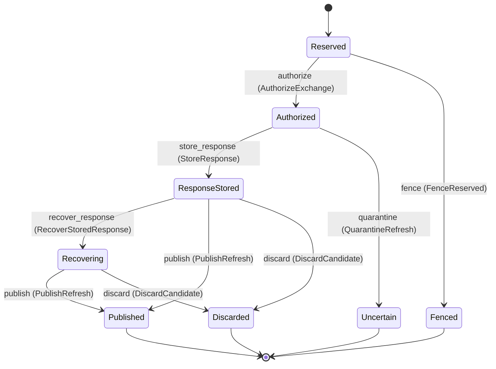

---
# generated by connectors-docs, do not edit
title: "refresh"
sidebar_label: "refresh"
sidebar_position: 21
description: "Proposed host-owned durable authorization of one rotating refresh per credential generation."
custom_edit_url: null
---

# refresh

:::info[Typed specification]

Generated by the pinned `ess generate --kind docs` from [`ess`](https://github.com/beyond10x/connectors/tree/main/ess). Structural validation establishes consistency; behaviour, storage and cross-record predicates remain implementation obligations.

:::

Proposed host-owned durable authorization of one rotating refresh per credential generation.

`connectors.refresh` is one of connectors's bounded contexts. [Back to the index](../index.md).

## Types

### `AuthorizationDecision`

`connectors.refresh.AuthorizationDecision` is one of `allow`, `ownership_conflict` and `source_unavailable`.

### `OwnershipRefusalReason`

`connectors.refresh.OwnershipRefusalReason` is one of `stale_owner`.

### `OwnershipToken`

`connectors.refresh.OwnershipToken` wraps `Uuid` and is not interchangeable with one: the whole value of naming it separately is the crossings the model then refuses.

### `PublicationDecision`

`connectors.refresh.PublicationDecision` is one of `allow`, `ownership_conflict` and `publication_refused`.

### `PublicationRefusalReason`

`connectors.refresh.PublicationRefusalReason` is one of `binding_changed`, `revoked`, `evidence_invalid` and `candidate_unavailable`.

### `RefreshAttemptId`

`connectors.refresh.RefreshAttemptId` wraps `Uuid` and is not interchangeable with one: the whole value of naming it separately is the crossings the model then refuses.

### `ReservationDecision`

`connectors.refresh.ReservationDecision` is one of `allow` and `source_unavailable`.

### `ResponseDecision`

`connectors.refresh.ResponseDecision` is one of `allow` and `ownership_conflict`.

### `SourceRefusalReason`

`connectors.refresh.SourceRefusalReason` is one of `reserved`, `exchange_already_authorized`, `binding_changed` and `revoked`.

## Entities

An entity is what this context is about: something with an identity that outlives any one request, a shape, and a lifecycle. The lifecycle is exhaustive — a move that is not drawn below is a move this specification does not permit, and that is the only way it says so. Every move is labelled with the command that takes it, because a move nothing can trigger is refused rather than drawn.

### `RefreshAttempt`

`connectors.refresh.RefreshAttempt`.

An instance is identified by `attempt_id`, a `connectors.refresh.RefreshAttemptId`. The name is part of the model and not a convention: a view projects the identity under that name, so a projection inventing its own would disagree with the view.

It holds:

- `source_generation_id` — `connectors.credentials.CredentialGenerationId`
- `initial_owner` — `String`
- `initial_ownership_token` — `connectors.refresh.OwnershipToken`
- `expected_binding_revision` — `String`
- `candidate_generation_id` — `Optional<connectors.credentials.CredentialGenerationId>`, which may be absent

It references at most one [`connectors.credentials.CredentialGeneration`](./connectors-credentials.md#credentialgeneration), as `source_generation`, carried by `RefreshAttempt.source_generation_id`. It references at most one [`connectors.credentials.CredentialGeneration`](./connectors-credentials.md#credentialgeneration), as `candidate_generation`, carried by `RefreshAttempt.candidate_generation_id`.

No invariant is declared, so nothing here constrains an instance at rest.

Its state is a `connectors.refresh.RefreshAttempt.State`, one of `Authorized`, `Discarded`, `Fenced`, `Published`, `Recovering`, `Reserved`, `ResponseStored` and `Uncertain`. That enum is synthesised from the lifecycle rather than declared beside it, so the states a view's filter compares and the states drawn below cannot disagree.

An instance is created in `Reserved`. `Discarded`, `Fenced`, `Published` and `Uncertain` are terminal, so an instance may rest there forever. That is declared rather than inferred from having no way out: an entity that cannot leave a state is either finished or stuck, and only its author knows which.

Each move is taken by a declared command outcome, and a move nothing takes is refused as `missing_causation` rather than left as a state change nobody can trigger:

- `authorize` — taken by `connectors.refresh.AuthorizeExchange` on its `authorized` outcome
- `fence` — taken by `connectors.refresh.FenceReserved` on its `fenced` outcome
- `store_response` — taken by `connectors.refresh.StoreResponse` on its `stored` outcome
- `quarantine` — taken by `connectors.refresh.QuarantineRefresh` on its `uncertain` outcome
- `recover_response` — taken by `connectors.refresh.RecoverStoredResponse` on its `recovered` outcome
- `publish` — taken by `connectors.refresh.PublishRefresh` on its `published` outcome
- `discard` — taken by `connectors.refresh.DiscardCandidate` on its `discarded` outcome

An instance is brought into existence by `connectors.refresh.ReserveRefresh` on its `reserved` outcome.

Illegal transitions are illegal by absence: no rule forbids them, there is simply no arrow, because a rule would be a second place for the same truth to live. A diagram cannot show an absence, so the pairs it does not connect are listed here, derived from the same transitions — anything named below is a move this specification does not permit.

- `Authorized` may not become `Discarded`
- `Authorized` may not become `Fenced`
- `Authorized` may not become `Published`
- `Authorized` may not become `Recovering`
- `Authorized` may not become `Reserved`
- `Discarded` may not become `Authorized`
- `Discarded` may not become `Fenced`
- `Discarded` may not become `Published`
- `Discarded` may not become `Recovering`
- `Discarded` may not become `Reserved`
- `Discarded` may not become `ResponseStored`
- `Discarded` may not become `Uncertain`
- `Fenced` may not become `Authorized`
- `Fenced` may not become `Discarded`
- `Fenced` may not become `Published`
- `Fenced` may not become `Recovering`
- `Fenced` may not become `Reserved`
- `Fenced` may not become `ResponseStored`
- `Fenced` may not become `Uncertain`
- `Published` may not become `Authorized`
- `Published` may not become `Discarded`
- `Published` may not become `Fenced`
- `Published` may not become `Recovering`
- `Published` may not become `Reserved`
- `Published` may not become `ResponseStored`
- `Published` may not become `Uncertain`
- `Recovering` may not become `Authorized`
- `Recovering` may not become `Fenced`
- `Recovering` may not become `Reserved`
- `Recovering` may not become `ResponseStored`
- `Recovering` may not become `Uncertain`
- `Reserved` may not become `Discarded`
- `Reserved` may not become `Published`
- `Reserved` may not become `Recovering`
- `Reserved` may not become `ResponseStored`
- `Reserved` may not become `Uncertain`
- `ResponseStored` may not become `Authorized`
- `ResponseStored` may not become `Fenced`
- `ResponseStored` may not become `Reserved`
- `ResponseStored` may not become `Uncertain`
- `Uncertain` may not become `Authorized`
- `Uncertain` may not become `Discarded`
- `Uncertain` may not become `Fenced`
- `Uncertain` may not become `Published`
- `Uncertain` may not become `Recovering`
- `Uncertain` may not become `Reserved`
- `Uncertain` may not become `ResponseStored`

One view projects it: [`RefreshStates`](#refreshstates).

## Views

A view is what the outside world is promised it can observe. Each one says which instances it contains and how soon it reflects a command that has already returned, because "you can read this" without "how soon" is the promise every flaky suite is built on.

### `RefreshStates`

`connectors.refresh.RefreshStates`.

It reads [`RefreshAttempt`](#refreshattempt).

It contains every instance of that entity: no filter narrows it, which is a decision somebody made and not a line somebody omitted.

It exposes:

- `attempt_id` — `connectors.refresh.RefreshAttemptId`
- `source_generation_id` — `connectors.credentials.CredentialGenerationId`
- `state` — `connectors.refresh.RefreshAttempt.State`

It declares no order, so the rows come back in whatever order the implementation has, and two reads may disagree.

**Read-your-writes**: it is current the moment the command that changed it returns. A caller that has just created an invoice and cannot see it in here has been told a lie about what it did.

A generated scenario asserts it once, immediately after the command: a view promising this and not keeping the promise has to fail the suite rather than be retried until it passes.

## Commands

### `AuthorizeExchange`

`connectors.refresh.AuthorizeExchange`.

It takes:

- `decision` — `connectors.refresh.AuthorizationDecision`
- `attempt_id` — `connectors.refresh.RefreshAttemptId`
- `owner` — `String`
- `ownership_token` — `connectors.refresh.OwnershipToken`

It has four outcomes.

**`authorized`** — Taken when `decision == allow` holds of the input. It moves a `connectors.refresh.RefreshAttempt` from `Reserved` to `Authorized`, along the declared move `authorize`. The instance is the one named by the input field `attempt_id`. It emits `connectors.refresh.ExchangeAuthorized`. A test reaches it by constructing an input that satisfies that condition.

**`ownership-conflict`** — Taken when `decision == ownership_conflict` holds of the input. No entity in this specification changes. It reports `connectors.refresh.OwnershipConflict`, carrying `reason`. It emits nothing. A test reaches it by constructing an input that satisfies that condition.

**`source-unavailable`** — The default branch, taken when no other outcome's condition matched. No entity in this specification changes. It reports `connectors.refresh.SourceUnavailable`, carrying `reason`. It emits nothing. A test reaches it by constructing an input that satisfies no other outcome's condition.

**`wrong-state`** — Taken when the subject is resting in a state none of this command's moves start from — a `connectors.refresh.RefreshAttempt` in `Authorized`, `Discarded`, `Fenced`, `Published`, `Recovering`, `ResponseStored` and `Uncertain`, which is what is left of the lifecycle once this command's own moves are taken away. The document lists none of it. No entity in this specification changes. It reports `connectors.refresh.RefreshStateConflict`, carrying `state`. It emits nothing. A test reaches it by driving an instance into one of those states and then issuing the command, because no input selects this branch.

### `DiscardCandidate`

`connectors.refresh.DiscardCandidate`.

It takes:

- `attempt_id` — `connectors.refresh.RefreshAttemptId`

It has two outcomes.

**`discarded`** — The default branch, taken when no other outcome's condition matched. It moves a `connectors.refresh.RefreshAttempt` from `Recovering` and `ResponseStored` to `Discarded`, along the declared move `discard`. The instance is the one named by the input field `attempt_id`. It emits `connectors.refresh.RefreshCandidateDiscarded`. A test reaches it by constructing an input that satisfies no other outcome's condition.

**`wrong-state`** — Taken when the subject is resting in a state none of this command's moves start from — a `connectors.refresh.RefreshAttempt` in `Authorized`, `Discarded`, `Fenced`, `Published`, `Reserved` and `Uncertain`, which is what is left of the lifecycle once this command's own moves are taken away. The document lists none of it. No entity in this specification changes. It reports `connectors.refresh.RefreshStateConflict`, carrying `state`. It emits nothing. A test reaches it by driving an instance into one of those states and then issuing the command, because no input selects this branch.

### `FenceReserved`

`connectors.refresh.FenceReserved`.

It takes:

- `attempt_id` — `connectors.refresh.RefreshAttemptId`

It has two outcomes.

**`fenced`** — The default branch, taken when no other outcome's condition matched. It moves a `connectors.refresh.RefreshAttempt` from `Reserved` to `Fenced`, along the declared move `fence`. The instance is the one named by the input field `attempt_id`. It emits `connectors.refresh.ReservedOwnerFenced`. A test reaches it by constructing an input that satisfies no other outcome's condition.

**`wrong-state`** — Taken when the subject is resting in a state none of this command's moves start from — a `connectors.refresh.RefreshAttempt` in `Authorized`, `Discarded`, `Fenced`, `Published`, `Recovering`, `ResponseStored` and `Uncertain`, which is what is left of the lifecycle once this command's own moves are taken away. The document lists none of it. No entity in this specification changes. It reports `connectors.refresh.RefreshStateConflict`, carrying `state`. It emits nothing. A test reaches it by driving an instance into one of those states and then issuing the command, because no input selects this branch.

### `PublishRefresh`

`connectors.refresh.PublishRefresh`.

It takes:

- `decision` — `connectors.refresh.PublicationDecision`
- `attempt_id` — `connectors.refresh.RefreshAttemptId`
- `owner` — `String`
- `ownership_token` — `connectors.refresh.OwnershipToken`
- `candidate_generation_id` — `connectors.credentials.CredentialGenerationId`

It has four outcomes.

**`published`** — Taken when `decision == allow` holds of the input. It moves a `connectors.refresh.RefreshAttempt` from `Recovering` and `ResponseStored` to `Published`, along the declared move `publish`. The instance is the one named by the input field `attempt_id`. It emits `connectors.refresh.RefreshPublished`. A test reaches it by constructing an input that satisfies that condition.

**`ownership-conflict`** — Taken when `decision == ownership_conflict` holds of the input. No entity in this specification changes. It reports `connectors.refresh.OwnershipConflict`, carrying `reason`. It emits nothing. A test reaches it by constructing an input that satisfies that condition.

**`publication-refused`** — The default branch, taken when no other outcome's condition matched. No entity in this specification changes. It reports `connectors.refresh.PublicationRefused`, carrying `reason`. It emits nothing. A test reaches it by constructing an input that satisfies no other outcome's condition.

**`wrong-state`** — Taken when the subject is resting in a state none of this command's moves start from — a `connectors.refresh.RefreshAttempt` in `Authorized`, `Discarded`, `Fenced`, `Published`, `Reserved` and `Uncertain`, which is what is left of the lifecycle once this command's own moves are taken away. The document lists none of it. No entity in this specification changes. It reports `connectors.refresh.RefreshStateConflict`, carrying `state`. It emits nothing. A test reaches it by driving an instance into one of those states and then issuing the command, because no input selects this branch.

### `QuarantineRefresh`

`connectors.refresh.QuarantineRefresh`.

It takes:

- `attempt_id` — `connectors.refresh.RefreshAttemptId`

It has two outcomes.

**`uncertain`** — The default branch, taken when no other outcome's condition matched. It moves a `connectors.refresh.RefreshAttempt` from `Authorized` to `Uncertain`, along the declared move `quarantine`. The instance is the one named by the input field `attempt_id`. It emits `connectors.refresh.RefreshUncertain`. A test reaches it by constructing an input that satisfies no other outcome's condition.

**`wrong-state`** — Taken when the subject is resting in a state none of this command's moves start from — a `connectors.refresh.RefreshAttempt` in `Discarded`, `Fenced`, `Published`, `Recovering`, `Reserved`, `ResponseStored` and `Uncertain`, which is what is left of the lifecycle once this command's own moves are taken away. The document lists none of it. No entity in this specification changes. It reports `connectors.refresh.RefreshStateConflict`, carrying `state`. It emits nothing. A test reaches it by driving an instance into one of those states and then issuing the command, because no input selects this branch.

### `RecoverStoredResponse`

`connectors.refresh.RecoverStoredResponse`.

It takes:

- `attempt_id` — `connectors.refresh.RefreshAttemptId`
- `new_owner` — `String`
- `new_ownership_token` — `connectors.refresh.OwnershipToken`

It has two outcomes.

**`recovered`** — The default branch, taken when no other outcome's condition matched. It moves a `connectors.refresh.RefreshAttempt` from `ResponseStored` to `Recovering`, along the declared move `recover_response`. The instance is the one named by the input field `attempt_id`. It emits `connectors.refresh.StoredResponseRecovered`. A test reaches it by constructing an input that satisfies no other outcome's condition.

**`wrong-state`** — Taken when the subject is resting in a state none of this command's moves start from — a `connectors.refresh.RefreshAttempt` in `Authorized`, `Discarded`, `Fenced`, `Published`, `Recovering`, `Reserved` and `Uncertain`, which is what is left of the lifecycle once this command's own moves are taken away. The document lists none of it. No entity in this specification changes. It reports `connectors.refresh.RefreshStateConflict`, carrying `state`. It emits nothing. A test reaches it by driving an instance into one of those states and then issuing the command, because no input selects this branch.

### `ReserveRefresh`

`connectors.refresh.ReserveRefresh`.

It takes:

- `decision` — `connectors.refresh.ReservationDecision`
- `source_generation_id` — `connectors.credentials.CredentialGenerationId`
- `owner` — `String`
- `ownership_token` — `connectors.refresh.OwnershipToken`
- `expected_binding_revision` — `String`

It has two outcomes.

**`reserved`** — Taken when `decision == allow` holds of the input. It creates a `connectors.refresh.RefreshAttempt`, which starts in `Reserved`. The new instance's identity is published as `attempt_id` on `connectors.refresh.RefreshReserved`. It emits `connectors.refresh.RefreshReserved`. A test reaches it by constructing an input that satisfies that condition.

**`source-unavailable`** — The default branch, taken when no other outcome's condition matched. No entity in this specification changes. It reports `connectors.refresh.SourceUnavailable`, carrying `reason`. It emits nothing. A test reaches it by constructing an input that satisfies no other outcome's condition.

### `StoreResponse`

`connectors.refresh.StoreResponse`.

It takes:

- `decision` — `connectors.refresh.ResponseDecision`
- `attempt_id` — `connectors.refresh.RefreshAttemptId`
- `owner` — `String`
- `ownership_token` — `connectors.refresh.OwnershipToken`
- `candidate_generation_id` — `connectors.credentials.CredentialGenerationId`

It has three outcomes.

**`stored`** — Taken when `decision == allow` holds of the input. It moves a `connectors.refresh.RefreshAttempt` from `Authorized` to `ResponseStored`, along the declared move `store_response`. The instance is the one named by the input field `attempt_id`. It emits `connectors.refresh.RefreshResponseStored`. A test reaches it by constructing an input that satisfies that condition.

**`ownership-conflict`** — The default branch, taken when no other outcome's condition matched. No entity in this specification changes. It reports `connectors.refresh.OwnershipConflict`, carrying `reason`. It emits nothing. A test reaches it by constructing an input that satisfies no other outcome's condition.

**`wrong-state`** — Taken when the subject is resting in a state none of this command's moves start from — a `connectors.refresh.RefreshAttempt` in `Discarded`, `Fenced`, `Published`, `Recovering`, `Reserved`, `ResponseStored` and `Uncertain`, which is what is left of the lifecycle once this command's own moves are taken away. The document lists none of it. No entity in this specification changes. It reports `connectors.refresh.RefreshStateConflict`, carrying `state`. It emits nothing. A test reaches it by driving an instance into one of those states and then issuing the command, because no input selects this branch.

## Events

### `ExchangeAuthorized`

`connectors.refresh.ExchangeAuthorized`.

It carries:

- `attempt_id` — `connectors.refresh.RefreshAttemptId`

Emitted by `connectors.refresh.AuthorizeExchange` on its `authorized` outcome.

Nothing in this system reacts to it.

### `RefreshCandidateDiscarded`

`connectors.refresh.RefreshCandidateDiscarded`.

It carries:

- `attempt_id` — `connectors.refresh.RefreshAttemptId`

Emitted by `connectors.refresh.DiscardCandidate` on its `discarded` outcome.

Nothing in this system reacts to it.

### `RefreshPublished`

`connectors.refresh.RefreshPublished`.

It carries:

- `attempt_id` — `connectors.refresh.RefreshAttemptId`
- `candidate_generation_id` — `connectors.credentials.CredentialGenerationId`

Emitted by `connectors.refresh.PublishRefresh` on its `published` outcome.

Nothing in this system reacts to it.

### `RefreshReserved`

`connectors.refresh.RefreshReserved`.

It carries:

- `attempt_id` — `connectors.refresh.RefreshAttemptId`

Emitted by `connectors.refresh.ReserveRefresh` on its `reserved` outcome.

Nothing in this system reacts to it.

### `RefreshResponseStored`

`connectors.refresh.RefreshResponseStored`.

It carries:

- `attempt_id` — `connectors.refresh.RefreshAttemptId`
- `candidate_generation_id` — `connectors.credentials.CredentialGenerationId`

Emitted by `connectors.refresh.StoreResponse` on its `stored` outcome.

Nothing in this system reacts to it.

### `RefreshUncertain`

`connectors.refresh.RefreshUncertain`.

It carries:

- `attempt_id` — `connectors.refresh.RefreshAttemptId`

Emitted by `connectors.refresh.QuarantineRefresh` on its `uncertain` outcome.

Nothing in this system reacts to it.

### `ReservedOwnerFenced`

`connectors.refresh.ReservedOwnerFenced`.

It carries:

- `attempt_id` — `connectors.refresh.RefreshAttemptId`

Emitted by `connectors.refresh.FenceReserved` on its `fenced` outcome.

Nothing in this system reacts to it.

### `StoredResponseRecovered`

`connectors.refresh.StoredResponseRecovered`.

It carries:

- `attempt_id` — `connectors.refresh.RefreshAttemptId`

Emitted by `connectors.refresh.RecoverStoredResponse` on its `recovered` outcome.

Nothing in this system reacts to it.

## Errors

### `OwnershipConflict`

It carries:

- `reason` — `connectors.refresh.OwnershipRefusalReason`

Reported by `connectors.refresh.AuthorizeExchange` on its `ownership-conflict` outcome.

Reported by `connectors.refresh.PublishRefresh` on its `ownership-conflict` outcome.

Reported by `connectors.refresh.StoreResponse` on its `ownership-conflict` outcome.

### `PublicationRefused`

It carries:

- `reason` — `connectors.refresh.PublicationRefusalReason`

Reported by `connectors.refresh.PublishRefresh` on its `publication-refused` outcome.

### `RefreshStateConflict`

It carries:

- `state` — `connectors.refresh.RefreshAttempt.State`

Reported by `connectors.refresh.AuthorizeExchange` on its `wrong-state` outcome.

Reported by `connectors.refresh.DiscardCandidate` on its `wrong-state` outcome.

Reported by `connectors.refresh.FenceReserved` on its `wrong-state` outcome.

Reported by `connectors.refresh.PublishRefresh` on its `wrong-state` outcome.

Reported by `connectors.refresh.QuarantineRefresh` on its `wrong-state` outcome.

Reported by `connectors.refresh.RecoverStoredResponse` on its `wrong-state` outcome.

Reported by `connectors.refresh.StoreResponse` on its `wrong-state` outcome.

### `SourceUnavailable`

It carries:

- `reason` — `connectors.refresh.SourceRefusalReason`

Reported by `connectors.refresh.AuthorizeExchange` on its `source-unavailable` outcome.

Reported by `connectors.refresh.ReserveRefresh` on its `source-unavailable` outcome.

---

Generated from connectors v1 · model digest `4ca84ed80d29dc59e4e520985535bcef4cd918acbd4248ac04a718dadb9051a7` · contract digest `slice-sha256/2:48fccea01e8501a0688f804ab3fa79202c2d2bcc22531a370bb721ee9644c90d`. Do not edit this file; change the specification and regenerate it with `ess generate`.
